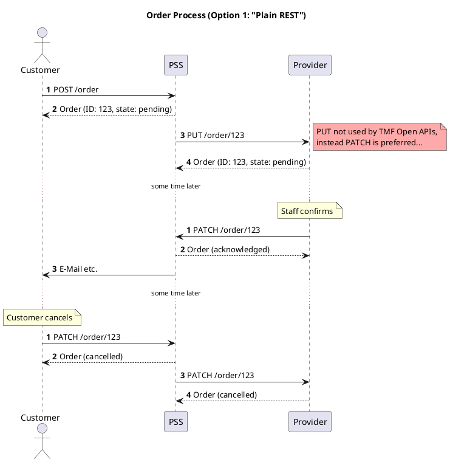
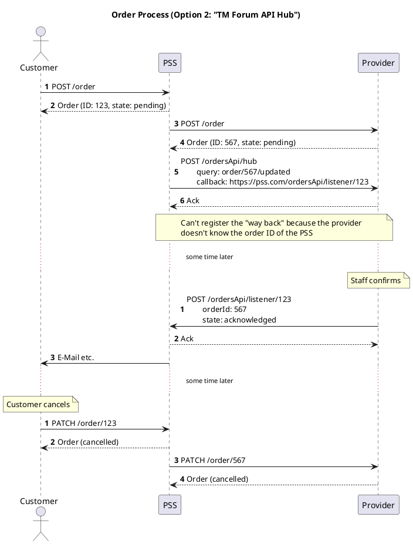
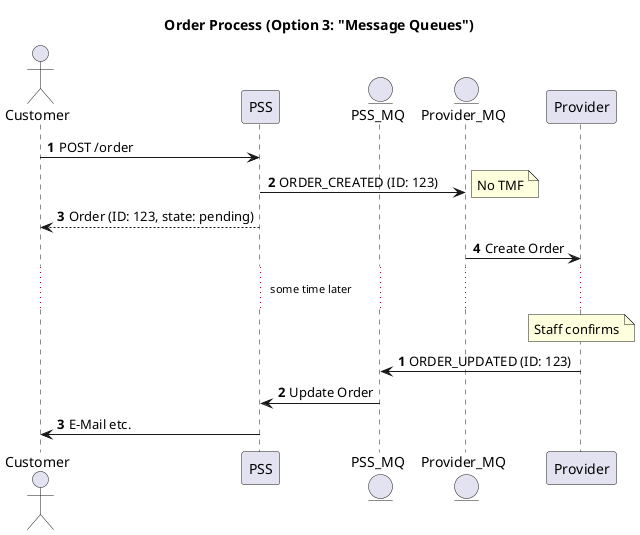
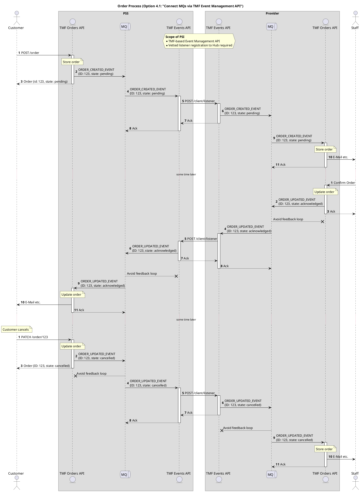
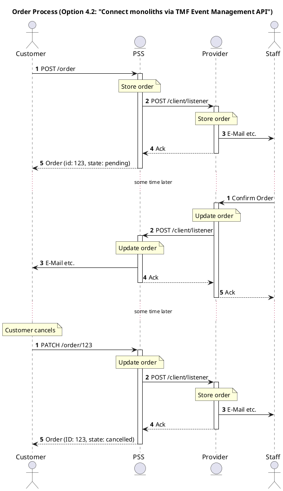
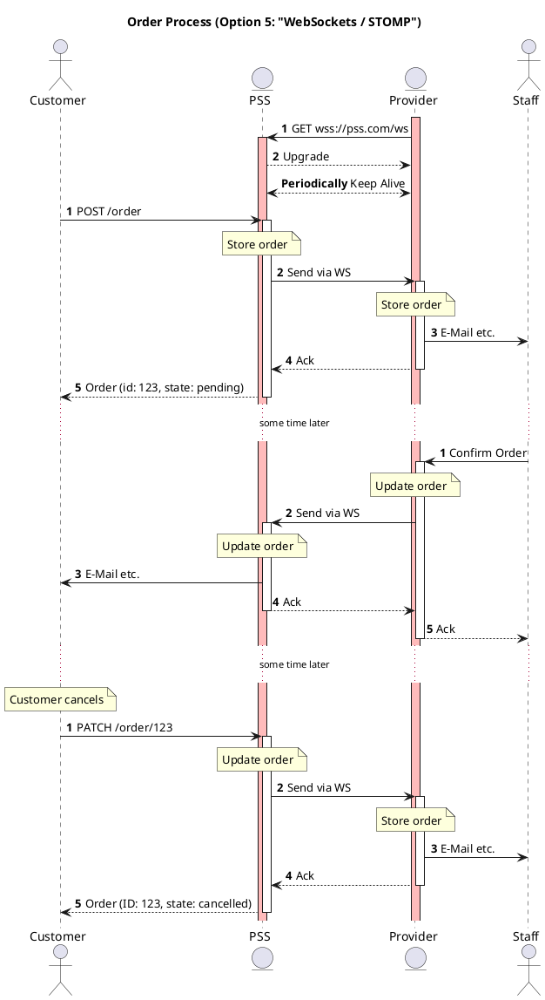

# Asynchronous Workflow Approach

* ID: ADR014
* Status: :accepted:
* Deciders: @cgr @daf @hop
* Date: 2022-10-21
* Version: 1.0
* Category: Architecture

## Context and Problem Statement

Some processes between a PSS and a provider (or PSS and PSS), such as customer inquiries and orders, can take longer time to complete.
For example, when a customer inquiry is created, the provider may require significant time to process and respond with an adequate product offering.
Or, when a product order is placed by a customer, it can take hours to days for its state to change, e.g. from 'inProgress' to 'completed'.

Additionally, while the provider processes the order, the customer may request an update to an order item, which the PSS should then propagate further to the provider.
Once the provider completes the order, they should inform the PSS of the state change, and then the PSS should send a notification to the customer.
This problem is perfect for publish-subscribe communication model addressed by message queues such as Apache Kafka, RabbitMQ, etc. (cf. chapter [*Use RabbitMQ Message Broker*](../Deprecated/2022-05-04-use-rabbitmq-message-broker_V1.0.md) in [PSI-MADR-Annex-I])

All these processes require an asynchronous and event-driven type of communication. This kind of communication categorizes as **stateful**.
The word *state* in this case refers to the condition or attributes of being at a given point in time.
The RESTful APIs instead are *stateless* and can't provide this kind of behaviour by direct means.
In the RESTful synchronous approach, a client sends an HTTP request and expects a direct (prompt) response from the server.
By being stateless, no client information is stored, and each request is separate and unconnected.
One way would be for the client to continuously send requests to the server to check the state of the delayed response.
This pattern is called *busy-waiting* or *polling*, but it is a poor solution. Besides additional network traffic, it would introduce a constant load on the server and waste of resources.
It makes also hard to protect the servers against Denial-Of-Service-attacks as high-frequency polling is hard to differentiate from malicious requests.

Therefore, the aim of this decision record is to find a better approach to handle the above-mentioned asynchronous scenarios and the propagation of state changes between PSS, providers and customers.

## Decision Drivers

* Avoids use of busy-waiting
* Ensures state changes are in sync after failover (switching to a redundant system upon the failure or abnormal termination of the previously running one)
* Supports integration of common *message queues* such as Apache Kafka and RabbitMQ
* Supports the definition of RESTful interfaces towards being compliant with the other PSI APIs
* Makes use of TM Forum Open API design guidelines as much as possible
* Simplicity
* Be independent of the session, meaning after logout and reconnecting later, the updated state (if any) can be checked
  
## Considered Options

* Plain REST
* TM Forum API Hub
* Message Queues
* TM Forum Event Management API
* WebSockets / STOMP

## Decision Outcome

Chosen option: *TM Forum Event Management API*, as it satisfies the decision drivers the most and represents the latest approach provided by TM Forum for handling asynchronous communication.

## Compliance

* Include sequence diagram in ICD
* Implement the decided approach for handling asynchronous workflows (e.g. customer inquiries and order process) as part of the PSI mock-up implementation.

## Pros and Cons of the Options

### Plain REST

The first and most straightforward option considered for handling asynchronous requests is the use of plain REST.
It means that once the HTTP request is sent by a client, the server responds immediately with some HTTP response.

In the diagram below, an order process is depicted using this approach.
The normal (solid) arrows show the HTTP requests, while the dashed arrows show the HTTP responses.

The customer places an order to the PSS with the POST method.
The PSS saves the order in its data store with a unique identifier (ID) and 'pending' state.
It directly sends a response back to the customer with the created order and issues a PUT request to the provider with that same order.
The provider also saves the new order in their data store with the ID provided by the PSS and responds back to the PSS that the order has been created with a 'pending' state.

After some time, the provider issues a PATCH request to the PSS with the new 'acknowledged' state of the order.
The PSS updates its data store record, sends a response back to the provider with the 'acknowledged' state of the order and notifies the customer.

Sometime later, the customer decides to cancel the order hence issuing a PATCH request to the PSS.
The PSS directly sends a response back with the 'cancelled' state of the order to the customer and forwards the PATCH request to the provider.
The provider responds back promptly that the state of the order has been updated.

One big downside of this option is that the states can easily go out of sync if one side of the communication is down/unreachable.
The system that was not available cannot know with certainty which messages were lost, therefore they need to request the full state from the other party in order to re-sync.
For example, they will need to implement a complex mechanism to repeat requests after re-establishing communication, restarting, failover, etc.

{#fig:plain_rest}

* Good, because a plain REST approach is used which is in line with the other PSI APIs.
* Good, because it is a very simple solution.
* Good, because it is not using busy-waiting.
* Good, because the PSS could integrate a message queue internally.
* Bad, because if a message is lost, e.g. because one side of the communication is down/unreachable, the local states of both parties are out of sync.
* Bad, because the PUT method is not defined in the Open APIs of TM Forum, meaning the APIs will have to be extended.

### TM Forum API Hub

The TM Forum's team has foreseen the need for asynchronous communication, therefore one of the approaches they offer for such requests is the publish-subscribe pattern for REST-based APIs that require eventing.

How this should be implemented is detailed in the [REST API Design Guidelines](https://www.tmforum.org/resources/specification/tmf630-rest-api-design-guidelines-4-2-0/) document.

In summary, all the Open APIs of TM Forum contain an endpoint dedicated to register/unregister callback listeners (api/hub) and a listener endpoint where the events are published.
Firstly, the listener subscribes to the /api/hub to listen to events.
Then, when the state of a product order changes, a ProductOrderStateChangeEvent is raised by the system and all registered listeners in the /api/hub are notified.
It is also possible to subscribe only to particular events if a subscription query is provided.  
Finally, the listener can unregister from the /api/hub if they should no longer receive event notifications.

The ordering process of PSI using the TM Forum's API Hub is depicted in the diagram below.

The PSS implements the listener endpoint (e.g. `https://pss.com/ordersApi/listener`), while the provider implements the API Hub (e.g. `https://provider.com/ordersApi/hub`).
The difference compared to the first diagram is that the PSS can not share the ID of the order with the provider, so the same order is saved under a different ID in the provider's data store.
Then, the PSS registers its callback listener to the provider's hub towards being notified of order updates.
As soon as the order is processed by the provider, a `ProductOrderStateChangeEvent` is sent to the registered listener of the PSS.

Note that the notification process works *one way* in this example, from provider to PSS.
It is not possible to communicate in the inverse direction, because the provider does not have visibility to the order ID in the PSS's data store, hence can't establish a notification subscription.
Therefore, the order cancellation works similar to the first option with plain REST, because there is no other way for the PSS to notify the provider.

In consequence, we differentiate between calls that are **expected** to consume time and calls that are expected to be processed instantaneously.

{#fig:TM_Forum_api_hub}

* Good, because makes use of TM Forum Open API design guidelines.
* Good, because it defines new REST endpoints which is compliant with the other PSI APIs.
* Good, because it is not using busy waiting.
* Good, because it can integrate message queues behind the listener's endpoint to handle the event notifications.
* Bad, because the events notifications don't work both ways (only provider to PSS supported).
* Bad, because in case of failover the state updates can go out of sync if not properly handled.

### Message Queues

This approach envisions that on both sides (PSS and provider) there is a message queue running, such as *Apache Kafka* or *RabbitMQ*.
These are well-known complete solutions to asynchronous message exchanges with configuration options for fault tolerance and message acknowledgement already in place.
For more details on message queues, refer to chapter *Use RabbitMQ Message Broker* in [PSI-MADR-Annex-I].

The diagram below shows an example setup for the ordering process.
What can be spotted is that the asynchronous message exchanges don't make use of REST APIs.
Only the initial POST request for the order creation from the customer to the PSS is done with help of REST endpoint and TM Forum's standard, while everything else is pure Apache Kafka/RabbitMQ message exchange.

{#fig:message_queue}

* Good, because no busy-waiting is involved.
* Good, because message queues are designed to handle asynchronous communication and have mechanisms to ensure no message is lost on failover.
* Bad, because a common message queue technology has to be defined which puts rather hard constraints to the implementation.
* Bad, because implementation and maintenance of messages queue systems is a complex task and can be a challenge for potential users of PSI.
* Bad, because the solution will not involve REST endpoints and therefore will not be compliant with the other PSI APIs.
* Bad, because it is not using TM Forum's Open API design guidelines.

### TM Forum Event Management API

The last considered option for the asynchronous workflow approach for PSI is the new TM Forum's *Event Management API* ([TMF688](https://www.tmforum.org/resources/specification/tmf688-event-management-api-user-guide-v4-0-0/#)).
Similar to how they implement the other Open APIs of TM Forum, the PSS and the provider will implement the Event Management API in addition.

That involves the definition of an endpoint for a Hub, to which callback listeners will be registered, and an endpoint of a client listener where all the events will be received.
It very much resembles the TM Forum's API Hub concepts introduced in Option 2, but with the advantage that they will not be implemented for each individual API separately.
This is possible because the Event Management API has defined a **common event model**, as the base for all events, which can be extended to more specific event types such as `Order Create Event`, `Inquiry State Update Event`, etc.
Additionally, it supports the *events streaming concept* by introducing topics to organize events coming from different domains.
That said, events can be streamed to separate topics for resources, services, products, etc.
The Event Management API has been developed specifically to work with a message queue which is hidden behind the listener endpoint.
This enables providers and PSSs to freely choose a message queue implementation (e.g. Apache Kafka, RabbitMQ, etc.) as long as its API fulfils the requirements.
In consequence, potential existing solutions may be re-used.

The following diagram depicts one such sample implementation for the ordering process.
Take note that both PSS and Provider implement the Event Management API, ensuring the state updates will be propagated in both directions: from the provider to the PSS and from the PSS to the provider.
The provider and the PSS have message queues running, hidden behind the implementation of the REST endpoints of the Event Management API.
When an order is placed by the customer, it first hits the REST endpoints of the Product Order API of the PSS, which then translates the HTTP request to an appropriate event and passes it to the underlying message queue towards being processed.
Then, the Event Management API of the PSS serves as an interface to notify the event to the registered callback listener of the provider via a dedicated REST endpoint.
The Event Management API of the provider receives the event notification and forwards it to its message queue for processing.

The main challenge, which is also a problem for the other considered options as well, is that the provider and the PSS have to implement event publishing properly.
That is, they have to ensure that the events they publish end up at the correct destination.
For example, a PSS should inform the *affected* provider about order state updates only - not all providers.

For this scenario, it is envisioned that both PSS and provider use the same ID for an order.
If for security reasons the PSS cannot share its internal order ID, it has to generate and maintain an anonymous external order ID which will be used for the message exchange with the provider.

{#fig:TM_Forum_event_management_api}

The design *enables and encourages* the use of message queues, though they are *not required* on any side.
It enables the re-use of existing message queue systems.
The following diagram shows a black box view of the PSS and provider system to demonstrate a more simplistic implementation by using monolithic applications behind the Event Management APIs.
Note that the REST endpoints are identical to the example above.

{#fig:TM_Forum_event_management_api_monoliths}

Implementing the Event Management API will not have implications on the other APIs that are developed as part of the PSI project.
The exchange of events should be considered for asynchronous communication scenarios only such as customer inquiries and orders.
Nevertheless, a best practice in what scenarios event exchange should be preferred over synchronous calls is still undefined.
This will be an area of research in the course of the project.

* Good, because it makes use of TM Forum Open API design guidelines.
* Good, because it is fully RESTful and compliant with the other PSI APIs.
* Good, because it supports integration of arbitrary message queues.
* Good, because no busy-waiting is involved.
* Good, because API Hub and listener endpoints are defined only once per system, which brings simplicity.
* Neutral, because for the message queue option, a simple mechanism should be introduced to avoid feedback loops (sender forwards the message to itself). For the monolithic approach, however, this is not the case.
* Bad, because despite the fault tolerance of the message queues, they are hidden behind REST endpoints, meaning failover scenarios should be properly handled on the Event Management API part, too.

### WebSockets / STOMP

The general message flow is identical to the Event API option described above, but instead of transmitting the events via independent HTTP calls it uses a permanent, bidirectional WebSocket connection:
The client application initiates an HTTP request to the server and marks it to be "upgraded" to a WebSocket, which is supposed to be accepted.
After that, both sides can send data at any time without additional handshakes, which enables real-time transport of huge amounts of data (compared to plain HTTP).

The server-client-model has some implications on the API and implementation:

* The connection is stateful, in contrast to the other, stateless APIs defined in this project.
* Server and client have to be defined.
  A natural choice would be to make the PSS the server and the provider system the client.
  The URL of the PSS has to be well known in any case, as it serves most of the endpoints and is the central for multiple providers.
  On the other hand, either choice is ambiguous for PSS-to-PSS communication and the provider URL must be known for other APIs anyway.
* Although one side is considered to be a client, fault tolerance must be implemented on both sides.
  First tests with the `spring-websocket` and `sockjs` libraries indicate that this is not straight forward.

Since WebSockets are designed to work exactly like arbitrary TCP/IP sockets (except for the initialisation), the data format for the exchange is not defined generally.
A reasonable implementation is to use the *Simple Text Oriented Messaging Protocol* (STOMP[^stomp]) protocol, which uses JSON to transport information between message brokers.
This allows the reuse of our existing data structure without adjustments.

[^stomp]: https://stomp.github.io/

Another solution is the MBWS subprotocol[^mbws].
The RFC drafts solutions to some problems, especially the connection recovery.
Since it was never finalized and no implementation was found, this is also considered a sign of risk for using WebSockets for this purpose.

[^mbws]: <https://datatracker.ietf.org/doc/html/draft-hapner-hybi-messagebroker-subprotocol-03>

The following diagram demonstrates the overall sequence:

{#fig:websocket_api}

* Good, because it supports integration of arbitrary message queues.
* Good, because no busy-waiting is involved.
* Neutral, because higher throughput (most likely not required).
* Bad, because deviation from other TM Forum APIs (i.e. not stateless).
* Bad, because ambiguous interface for PSS-to-PSS communication.
* Bad, because fault tolerance is much harder to achieve than with the other options.

## Security Considerations

### Plain REST (Option 1)

This option is highly prone to be a victim of the integrity issue. Same order IDs are being used in the left-hand side, i.e. between the Customer and PSS, and in the right-hand side, i.e. between PSS and the Provider, of the process flow shown in the option. If an attacker is able to obtain the correct order ID, he can leverage this information to manipulate the right-hand side of the process flow.

This option is also highly prone to be a victim of the availability issue. The reason is that order states can easily become asynchronous. To prevent this, full state requests need to be considered in the implementation and need to be handled in a special manner. So, this special consideration could also be used as a door opener and exploited by the attackers to cause DoS attacks.

### TM Forum API Hub (Option 2)

This option is lowly prone to be a victim of the integrity issue. The reason is that different order IDs are being used in both left- and right-hand side of the process flow. This means that, even if an attacker could be able to obtain the order ID from either side of the traffic flow, he cannot use that information directly owing to the fact that there is not a direct relationship between the order IDs of both sides.

However, this option is highly prone to be a victim of the availability issue because of the same reason mentioned in Plain REST option.

### Message Queues (Option 3)

This option is highly prone to be a victim of the integrity issue due to the same reason mentioned in Plain REST option.

On the other hand, this option is lowly prone to be a victim of the availability issue, thanks to the nature of the message queues, i.e. MQs. As explained above, MQs have internal mechanisms to handle the synchronisation problems. Therefore, requesting full states is not needed, preventing the root cause of the DoS problem.

### TM Forum Event Management API (Option 4)

This option is highly prone to be a victim of the integrity issue due to the same reason mentioned in Plain REST option. Nevertheless, if this option would be implemented to use different order IDs, the feasibility will be decreased to a low level. As it is found in the option description above, the use of different order IDs use could be implemented for this option.

This option is lowly prone to be a victim of the availability issue since it uses MQs. The positive effects of the MQs in terms of the availability issue is described in Message Queues option above.

### WebSockets / STOMP (Option 5)

Although this option could not be directly compared within the same integrity issue context, it is assessed that this option is prone to be a victim of a similar integrity issue at medium level. The reason is, provider URLs are understood to be unique, which increases the complexity of a possible integrity-related attack from the attacker perspective.

Although this option could not be directly compared within the same availability issue context either, it is assessed that this option is prone to be a victim of a similar availability issue at medium level. The reason is that, the implementation of the fault tolerance was not found straightforward, which could expose the mechanism to DoS attacks due to the ineffective implementation of the option.

## CIA Comparison for all Given Options

Below, a table is given summarizing the probability scores of each option regarding the CIA triad. As explained above, a three-level scale was used for scoring.

| Option # | Confidentiality | Integrity  | Availability |
|----------|-----------------|------------|--------------|
| 1        | Low             | High       | High         |
| 2        | Low             | Low        | High         |
| 3        | Low             | High       | Low          |
| 4        | Low             | High (Low) | Low          |
| 5        | Low             | Medium     | Medium       |

Table: CIA table for different asynchronous implementations. {#tbl:cia_async_table}
