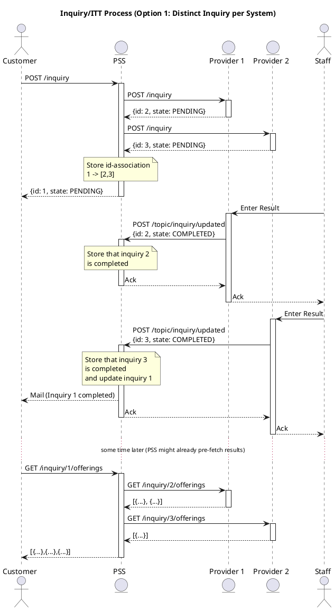
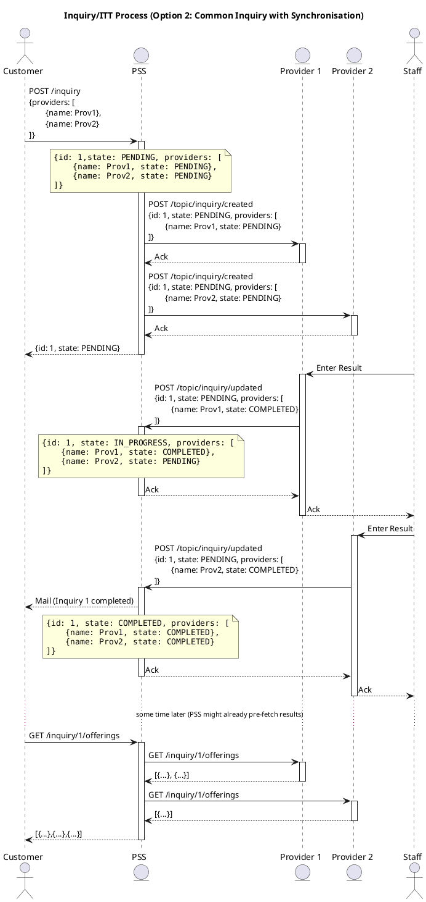

# Customer Inquiry Message Sequence

* ID: ADR015
* Status: :accepted:
* Deciders: @cgr @daf @cg
* Date: 2022-11-25
* Version: 1.0
* Category: Design

## Context and Problem Statement

In the previous decision [2022-10-21 Asynchronous Workflow Approach](2022-10-21-asynchronous-workflow-approach_V1.0.md) we decided how to handle events with focus on the order management.
The second API which requires asynchronous messages is the customer inquiry management, which was defined from scratch because of missing patterns in TM Forum.
This leads to the need of defining the message flow between PSS and provider.
Since this communication is not 1-to-1, the conditions are slightly but essentially different and require a new decision on the data exchange.

## Decision Drivers

* Use of the Event API
* Consistent state under all conditions
* API and model changes are *possible*

## Considered Options

* Distinct inquiry per system
* Common inquiry with synchronisation

## Decision Outcome

Chosen option: Common inquiry with synchronisation, because it is the more consistent option.
The additional filtering of event data is considered a minor effort.

## Compliance

Requirements are documented in PSI-REQ and PSI-TOD.
An example implementation (without filtering) will be added to the mock-up.

## Pros and Cons of the Options

### Distinct Inquiry per System

In this variant, every system creates a distinct inquiry.
The user creates an inquiry in the PSS, and the PSS creates a new inquiry (with different IDs and potentially different data) in every single provider system.
Figure {@fig:distinct-inquiry} shows the inquiries with ID 1 for the PSS and 2/3 for the providers.
The initial one is created by the user, while the others are created by the PSS, which has to keep track of this association.
When the inquiry is processed by the provider, the system sends an "updated"-event to the PSS.
After the last provider has set the state to "completed", the PSS can update its own state and inform the user.
Depending on the implementation, it can also directly fetch and aggregate the results of the provider or wait until the user wants to view it.

Note the option of storing the association as part of the actual inquiry data structure was discussed after doing that in option 2 (Common inquiry with synchronisation).
We found that this does not add much additional value to this particular setup and deliberately decided not to change this description.

{#fig:distinct-inquiry}

* Good, because explicit requests per provider
* Good, because unambiguous state handling
* Bad, because inconsistent use of events
* Bad, because additional storage of associated IDs

### Common Inquiry with Synchronisation

In the second option, all systems share a common ID and synchronize the state (see figure {@fig:common-inquiry}).
The inquiry is created by the user, possibly containing the list of providers they want to include (can be constructed by the PSS if not present).
The PSS stores this information directly in the data structure and introduces a state for each provider.
This is then propagated to the named providers using a "created"-event.
It may be necessary to filter the submitted data to not disclose the other participants.
The providers work on the inquiry and send an update of their own state upon completion, which is stored by the PSS (other changes are dismissed).
When all providers completed their part, the overall state is set to "completed" as well and the user is informed as above.
The PSS might also decide to show the intermediate results to the user and abort pending providers (which are then informed via an "update"-event as well).
To prevent long delays and limiting the response time of the providers, the governance of a PSS should be able to set a *responseTime* characteristic for inquiries in the provider's party profile.
If the provider does not respond within the agreed response time, their state will be updated to "cancelled" and their product offerings will not be part of the customer inquiry results.

{#fig:common-inquiry}

* Good, because consistent use of events
* Good, because explicit state handling as part of the data model
* Neutral, because event data has to be filtered

## Implications for the Scope

The maximum time that is allowed to answer an inquiry is defined as a parameter in this API.
