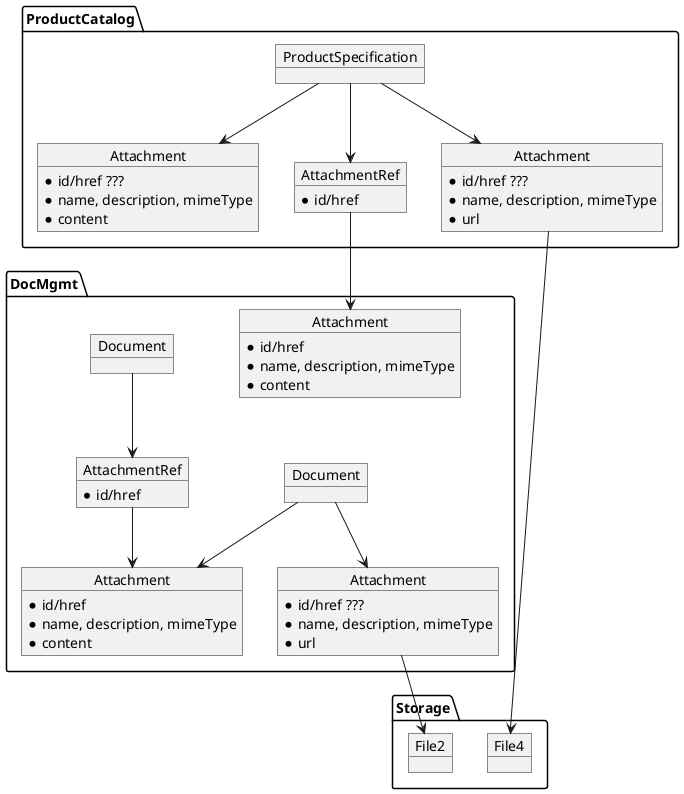

# Attachment Approach

* ID: ADR016
* Status: :accepted:
* Deciders: @cgr @daf @cg @dvs @vmr
* Date: 2022-12-13
* Version: 1.0
* Category: Design

## Context and Problem Statement

Various entities need to store attachments (PDF, DOCX, JPG etc.):

* Product, Service and Resource Specifications
* Offerings
* Orders
* Invoices

We need to define a common approach on how this binary data can be stored, shared between systems and retrieved by the related parties.

## Considered Options

* Plain TM Forum APIs
* Define Attachment Endpoints in each API
* Define Attachment API as part of Document Management

## Decision Outcome

Define Attachment API as part of Document Management, because it separates the concern of file handling correctly, and we expect a benefit from storing metadata which justifies the slight increase of complexity.

## Compliance

The interface definition of the Document Management API will be updated and complemented by a mock-up implementation along with this decision.

## Pros and Cons of the Options

### Plain TM Forum APIs

TM Forum defines an `attachment` attribute in all aforementioned entities.
This structure can contain either a reference via id/href to another API or a concrete object containing:

* Name
* Description
* Mime-Type
* Size
* A URL where to download the content **or** the content itself (base64 encoded)

This results in 4 different scenarios: local+url, local+content, ref+url, ref+content.
The examples usually combine reference and concrete object, but the hrefs point to non-existing endpoints of the TM Forum "Document Management API".
Looking at the documentation of it, the reason why these endpoints don't exist are obvious:

> Attachment is not a managed resource since the binary content is assumed to be resident in a Content Management System and not created by an API – only retrieved from or referred to.

It is not clear why there is even the option to reference attachments when they are not managed.
On the one hand, managing (and referencing) an object which in turn just provides a URL with minimal metadata is an unnecessary overhead.
On the other, storing the content in base64 is inefficient and retrieving it as part of a JSON structure is inconvenient.



{#fig:tmf-data-model-for-attachments}

* Bad, because inconsistent and confusing
* Bad, because potentially inefficient (base64)

### Define Attachment Endpoints in each API

Based on the problems described above, it is reasonable to remove the `AttachmentRef` as well as the base64 encoded content.
This means, that all system manage attachments as part of their particular entity, but use a common storage platform (which is not defined by PSID and opaque to the user) to store the binary content.
There are plenty of COTS components available, from simple local or network filesystems to cloud storage protocols like WebDAV and S3.
A PSS may choose whether to allow the usage of direct links, filter them for allowed domains (e.g. allow providers to link content of their own website), implement other security measures or just prohibit it.

```plantuml
allowmixing
actor User

package Storage {
    object File1
    object File2
    File1 -[hidden]r- File2
}

package ProductCatalog {
    object ProductSpecification
    object Attachment1 {
        * id/href
        * name, description, mimeType
        * url (pointing to "self")
    }
    object Attachment2 {
        * id/href
        * name, description, mimeType
        * url (pointing to "WWW")
    }

    ProductSpecification --> Attachment1
    ProductSpecification --> Attachment2

    Attachment1 -[hidden]r- Attachment2

    Attachment1 --> File1
}

package OrderMgmt {
    object Order
    object Attachment3 {
        * id/href
        * name, description, mimeType
        * url (pointing to "self")
    }

    Order --> Attachment3
    Attachment3 --> File2
}
User -- ProductCatalog
User -- OrderMgmt
```

{#fig:data-model-for-attachments-without-doc-mgmt}

The structure of the endpoints would be standardized by PSID, which allows the PSS to easily implement this as a cross-cutting-concern (e.g. a library).
The message sequence would be quite straight forward: After a catalog entry is created, the newly defined endpoint can be used to upload attachments to it.

```plantuml
actor Provider
box "PSS"
    entity Catalog
    database Cloud
end box

Provider -> Catalog ++ : POST /productSpecification\n<JSON content not shown>
note over Catalog : Create Product\nSpec with UID
return {"id": "d6cbda51", ...}

Provider -> Catalog ++ : POST /productSpecification/d6cbda51/attachment\n<binary content>
note over Catalog : Create Attachment\nfor Specification\nwith UID
Catalog -> Cloud ++ : PUT /c9993080\n<binary content>
return Ack
return {"id": "c9993080",\n"name": "example.pdf",\n"url": "http://localhost/productSpecification/\n\td6cbda51/attachment/c9993080"}
```

{#fig:provider-message-sequence-for-attachments-without-doc-mgmt}

The (potential) customer can now browse the catalog and retrieve the attachment through the same API:

```plantuml
actor Customer
box "PSS"
    entity Catalog
    database Cloud
end box

Customer -> Catalog ++ : GET /productSpecification
return [{..."attachment": {"url": "http://localhost/productSpecification/\n\td6cbda51/attachment/c9993080"}}]

Customer -> Catalog ++ : GET /productSpecification/\n\td6cbda51/attachment/c9993080
Catalog -> Cloud ++ : GET /c9993080
return <binary content>
return <binary content>
```

{#fig:customer-message-sequence-for-attachments-without-doc-mgmt}

Note that some storage systems like Amazon S3 allow the creation of temporary access URLs to reduce load on the actual Catalog backend.
This can be utilized by redirecting the client when they access the attachment instead of passing through all the data.

* Good, because no additional API required (only endpoints)
* Good, because data structure is a subset of TM Forum
* Good, because uses established file handling via HTTP
* Good, because storage is very flexible
* Good, because access management is closely tied to managed entities
* Bad, because multiple endpoints with basically the same functionality
* Bad, because no central attachment management

### Define Attachment API as part of Document Management

To fix the problems of the previous options, one would have to define a central API that actively manages all attachments.
Simply exposing the storage causes a lot of additional problems concerning isolation of tenants, especially with filename uniqueness.
Additionally, defining it as part of PSID would put very hard constraints on the implementation and also diverge from the other APIs, which are TM Forum compliant.

So as a first step, a simple facade would be possible (named Attachment Management):

```plantuml
actor Provider
box "PSS"
    entity AttachmentMgmt
    database Cloud
    entity Catalog
end box

Provider -> AttachmentMgmt ++ : POST /attachment\n<binary content>
note over AttachmentMgmt : Generate UID
AttachmentMgmt -> Cloud ++ : PUT /c9993080\n<binary content>
return Ack
return {"name": "example.pdf",\n"url": "http://localhost/attachment/c9993080"}

Provider -> Catalog ++ : POST /productSpecification\n{..., "attachment": [{\n\t"name": "example.pdf",\n\t"url": "http://localhost/attachment/c9993080"\n}]}
return Ack
```

{#fig:provider-message-sequence-for-attachments-with-attach-mgmt}

Since the Attachment and Catalog APIs are now separated, there is a need to look up and manage files independently.
Especially when it is uploaded but not used in any other system, there must be a way to find and potentially delete (or re-use) it.
This means the Attachment API has to store metadata and provide interfaces to browse through it.
Introducing this brings us back to the Document Management API of TM Forum, but enables us to make slight modifications in differentiating between the attachment entities that are part of a document and their counterparts in other subsystems:

```plantuml
package Storage {
    object File
}

package DocMgmt {
    object Document {
        various metadata
    }
    object Attachment {
        * id/href
        * name, description, mimeType
        * url (pointing to "self")
    }

    Document --> Attachment

    Attachment --> File
}

package ProductCatalog {
    object ProductSpecification
    object Attachment1 {
        1:1 copy of "original" Attachment
        * id/href
        * name, description, mimeType
        * url (pointing to "DocMgmt")
    }
    object Attachment2 {
        * <s>id/href</s>
        * name, description, mimeType
        * url (pointing to "WWW")
    }

    ProductSpecification --> Attachment1
    ProductSpecification --> Attachment2

    Attachment1 -[hidden]r- Attachment2

    Attachment1 . Attachment
    Attachment1 --> File
}
```

{#fig:data-model-for-attachments-with-doc-mgmt}

There are now only two distinct options how to use attachments: either uploading it as part of a Document in the Document Management of the PSS or by direct reference as part of another entity.
A PSS may choose to prohibit the usage of direct links, filter them for allowed domains (e.g. allow providers to link content of their own website) or implement other security measures.
*Not* included is the option to use external URLs as attachments to documents, standalone-attachments without documents and pure references (without direct access URL) in other entities.

```plantuml
actor Provider
box "PSS"
    entity DocMgmt
    database Cloud
    entity Catalog
end box

Provider -> DocMgmt ++ : POST /document\n<JSON content not shown>
note over DocMgmt : Create Document\nwith UID
return {"id": "d6cbda51", ...}

Provider -> DocMgmt ++ : POST /document/d6cbda51/attachment\n<binary content>
note over DocMgmt : Create Attachment\nfor Document\nwith UID
DocMgmt -> Cloud ++ : PUT /c9993080\n<binary content>
return Ack
return {"id": "c9993080",\n"name": "example.pdf",\n"url": "http://localhost/attachment/c9993080"}

Provider -> Catalog ++ : POST /productSpecification\n{..., "attachment": [{\n\t"id": "c9993080",\n\t"name": "example.pdf",\n\t"url": "http://localhost/attachment/c9993080"\n}]}
return Ack
```

{#fig:provider-message-sequence-for-attachments-with-doc-mgmt}

To create an attachment, the provider now has to first create a document containing metadata about it.
After that, they use the document ID to upload attachments to it (the Document Management can decide where to store the binary data).
The Document Management creates the URL where the attachment can be downloaded by the user (or other related parties).
All management of the attachment (name changes, deletion) is then be done as a sub-resource to the document, meaning the endpoints in `/attachment/{attachmentId}` are purely for binary access, while `/document/{documentId}/attachment/{attachmentId}` allows access to the JSON structure that is also used in other systems.

```plantuml
actor Customer
box "PSS"
    entity DocMgmt
    database Cloud
    entity Catalog
end box

Customer -> Catalog ++ : GET /productSpecification
return [{..."attachment": {"url": "http://localhost/attachment/c9993080"}}]

Customer -> DocMgmt ++ : GET /attachment/c9993080
DocMgmt -> Cloud ++ : GET /c9993080
return <binary content>
return <binary content>
```

{#fig:customer-message-sequence-for-attachments-with-doc-mgmt}

Note that some storage systems like Amazon S3 allow the creation of temporary access URLs to reduce load on the actual Document Management.
This can be utilized by redirecting the client when they access the attachment instead of passing through all the data.

* Good, because TM Forum compliant
* Good, because attachment handling is implemented exactly once
* Good, because attachments can be managed at a single point
* Good, because uses established file handling via HTTP
* Bad, because more complex than extending the existing APIs as facades
* Bad, because access management has to be distributed
