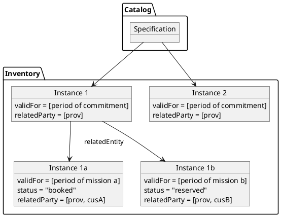
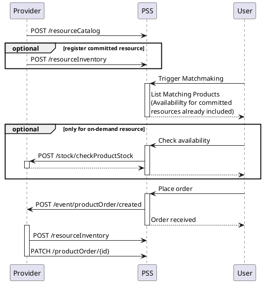
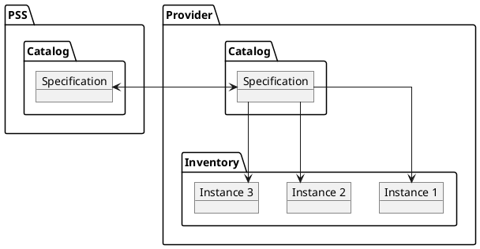
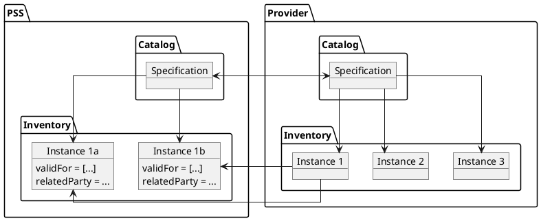
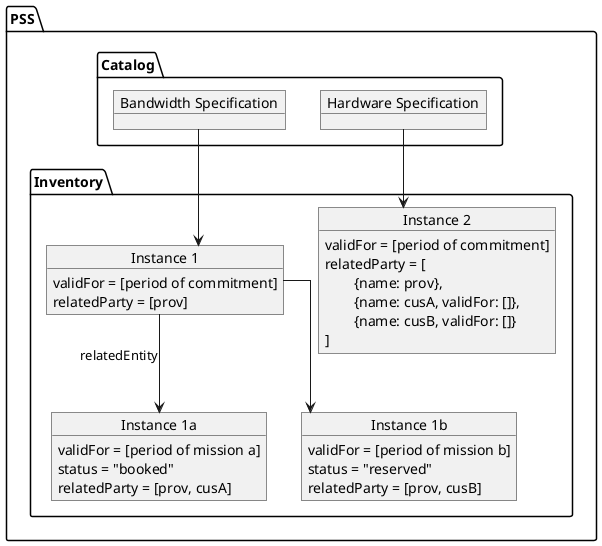
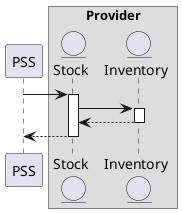

# Inventory and Stock API

* ID: ADR021
* Status: :accepted:
* Deciders: @cgr @daf @ncz
* Date: 2023-03-31
* Version: 1.0
* Category: Design

## Context and Problem Statement

As stated in the decision on [Overbooking (V2.0)](#overbooking-v20), we need to exchange information about concrete resources somewhere.
These have to contain details about the actual set of characteristics (in contrast to the variations of specifications) and the time-dependent booking state.
Additionally, we have to consider some variety:

* On-Demand resources could only "exist" for the PSS while there is an active service.
* Committed resources shall be known to the PSS beforehand.
* Bandwidth is a special resource, because it can be instantiated in different chunks over time and used in different services.

## Considered Options

* Inventory APIs
* Stock API
* Product Offering Qualification API

## Decision Outcome

Inventory and Stock API are to be used for different purposes.
Further investigation on the Product Offering Qualification API is put into the project backlog for now.

The inventory API will be used to track the state of resources.
For *all* resources there will be a master-entity, either in the provider system (for on-demand resources) or the PSS (committed resources).
Every order will create a sub-entity in the PSS (optionally also in the provider system) that is assigned to the customer for the given timespan.
Depending on the implementation, the resource can be further subdivided, e.g. if it is shared with another user or is resold by a service provider.

{#fig:inventory-data-model}

Physical resources (e.g. terminals) are bookable when there is no sub-entity in the inquired timespan.
For logical resources (e.g. bandwidth) the implementation has to sum up the assigned amount (MHz or Mbit), subtract it from the available amount and compare it with the inquired value.

The "Check Product Stock" part of the Stock API will be used to allow an automatic check of availability for on-demand resources.
The field `availabilityDate` will be extended to support time ranges.

{#fig:message-exchange-inventory-stock}

## Compliance

The description of overbooking will be added to the TAD.
The interfaces will be defined in the ICD and mock-up.

## Pros and Cons of the Options

### Inventory APIs

The Inventory APIs manage concrete instances of products, services and resources.
Each entry is derived from and linked to a specification (which is managed by the catalog).

For *on-demand* resources, the PSS would have to request the availability from the provider.
Using only this API would mean to basically open the whole inventory towards the PSS and let it look up the requested resources.

{#fig:inventory-on-demand-before-order}

When the order is accepted, the provider would also create the resource in the PSS inventory.
The resource-copy lives for the duration of the mission and is marked invalid afterwards.
This lifecycle is applicable for physical and logical resources alike.

{#fig:inventory-on-demand-after-order}

To *commit* a resource, it would be created in the PSS inventory before any order is placed.
Therefore, the availability check can be performed internally in the PSS without additional data exchange.
The order is still sent to the provider system as for all other products, which allows the assignment of an alternative resource and even rejection in exceptional cases.
It is up to the SLA defined between the governance and the provider how strict this is handled.

Since the resource now already is in the PSS inventory, we'd have to define more sophisticated lifecycles:

* Physical resources (e.g. terminals) could be stored as distinct entities.
  But since they can be leased for relatively short times (e.g. a month), the PSS would have to store the related party (i.e. the customer) with timestamps.
  The TM Forum API just supports the expression of the current state.
  It could be added to the `relatedParty` structure using the already known `ValidFor` schema.
  The availability would just be evaluated by finding a "valid" relationship in the requested timeframe.
  This list must be filtered depending on who requests the resource information, e.g. the customer can only see their own bookings.
* Logical resources (mostly bandwidth) on the other hand can be partitioned with every order.
  The potential durations can be down to a few minutes in this case.
  For example, the provider can commit 100MHz of bandwidth, where one customer orders 20MHz and another 30MHz, leaving 50MHz unused at that point in time.
  In this case it would make sense to create sub-resources, which express the actual ordered chunk of bandwidth.
  These are then assigned to the customer and invalidated after the end of the mission, making this lifecycle very similar to the one of on-demand resources.
  The availability would be calculated by summing up the used amount of a resource over the requested timeframe.
  Going one step further, it would be possible to also do this with physical resources.
  The downside is, that there will be a lot of instances after some time, which could be solved by the implementation by moving old entities to an archive.

{#fig:inventory-committed-after-order}

### Stock API

The Stock API is an additional layer above the inventory to manage a physical stock.
It is designed to allow a standardized query if a product is available in a store or warehouse.
From a business perspective, it can also be used to automatically restock those below a threshold.
Theoretically, it can be used as a standalone API without an exposed inventory.

{#fig:stock-query-sequence}

As long as the PSS is not considered a real reseller with its own warehouse, it doesn't make sense to implement this API there.
The question of "who is using a resource when" cannot be answered by the given endpoints and data model.
It could be used to query for on-demand resource availability from the provider, but the nature of the API makes it unwieldy to manage bandwidth.
For this purpose we would include the specific endpoints for the operations "Check Product Stock" or "Query Product stock" in the PSID.

| Feature | Query | Check |
| ------- | ----- | ----- |
| **Instant Response** | \checkmark | \checkmark |
| **Async Response** | \checkmark | \checkmark |
| **Availability Date** | \checkmark | \checkmark |
| **Amounts** | \checkmark | \checkmark |
| **Characteristics** | \checkmark | \checkmark |
| **Multiple Items** |  | \checkmark |
| **Allow Alternatives** |  | \checkmark |
| **Multiple Results** | \checkmark |  |

Table: Feature Comparison of the Query and the Check Endpoint. {#tbl:feature_comparison_query_check}

The field `availabilityDate` would have to be extended to support time ranges.
The `place` fields might be removed, but could also be kept as optional.
Overall, both APIs answer similar questions:

* Query: "Where can I get a product with specification 123?"  
  Response: "We have product X in warehouse A or product Y in warehouse B"
* Check: "Do you have products X, Y and Z in warehouse A?"  
  Response: "X is available, Y will be available in two days, there is an alternative for Z"

Other endpoints of actual stock management can be used by the provider internally as defined by TM Forum.

### Product Offering Qualification API

The Product Offering Qualification API is another task-based API like the Stock API and uses similar patterns.
It is intended for checking commercial eligibility of a product offering.
Since this should already been checked as part of the inquiry process, it can currently be de-scoped.
It may be considered again to check change requests for eligibility.

## Implications for the Scope

Matchmaking is considered a PSS-internal process. The prioritisation of committed resources over others is not part of the interface.

The catalog and inventory APIs are not relevant for dynamic provision of resources, only for their definition.

Committed resources need the above discussed special handling and differentiation between the catalog and the inventory. Therefore, the API considers both.

Until an actual order is placed, on-demand resources only need a catalog entry, but no inventory entry. Therefore, the API considers both.

The inventory API foresees a period of validity for a committed resource.

The inventory API foresees the division of resources into sub-resource and further leasing of those.
