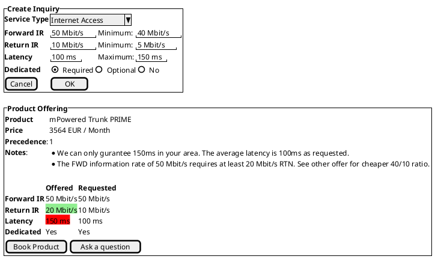
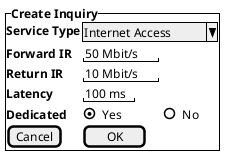
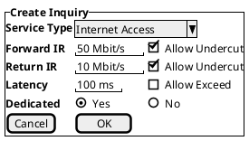
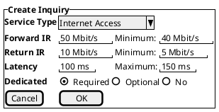
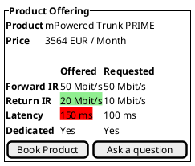
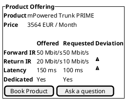
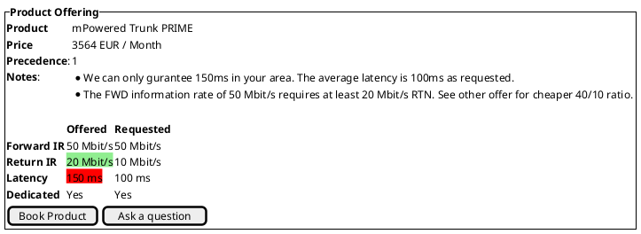

# Handling of Partial Matches

* ID: ADR022
* Status: :accepted:
* Deciders: @cgr @daf @cg @wr @ncz @hop @vmr @rgs @cjonsson @jgregory @rsperb
* Date: 2023-04-18
* Version: 1.0
* Category: Design

## Context and Problem Statement

Inquiries and their responses are not always precise:
A customer may want to have a specific characteristic value (e.g. 20 Mbit/s or 100ms latency), but it may not be feasible or available.
This could be due to technical reasons (e.g. the frequency band or equipment does not allow for it), lacking resources in the requested timeframe or economic reasons (e.g. a little change can reduce the price a lot).
The customer is often not aware of these limitations when issuing the inquiry.
We have to decide how to handle these cases in the API, considering automatic and manual processes on both sides.

## Decision Drivers

* Feasible for automatic and manual processes
* Overall flexibility
* Avoid unnecessary iterations
* Preserve information for future communication (e.g. support tickets)

## Considered Options

* For Inquiries:
  1. Target values only (approach until MS3)
  2. Boolean flag to allow divergence from characteristics in the request
  3. Min/Max/Target for each characteristic
* For Responses:
  1. Do nothing
  2. Boolean flag for diverging characteristics
  3. Free text per returned offering

## Decision Outcome

Option 3 was chosen for both aspects.
This gives maximum flexibility to the Inquiry API, while allowing simplifications on the UI level.
On the other side, the provider can justify deviations and add other notes.

{#fig:inquiry_with_response}

> Note that in the wireframes, the "dedicated" attribute is depicted as boolean.
> This serves as a simplified example and does not imply it to be boolean in the implementation.
> The example data used in testing in fact does model this as MIR and PIR integers.

## Compliance

Include new fields in documentation (ICD, TOD), mock-up implementation and tests.

## Pros and Cons of the Options

### For Inquiries

Sending only target values is easier for the customer and what they would usually do.
It requires implicit behaviour of the provider and therefore could lead to more iterations.
For example, they (person or algorithm) have to make assumptions how much deviation is acceptable and which characteristic has higher priority, e.g. "low latency is more important than high information rate".

Please take into account, that a PSS could provide HMIs that allows customers to define their requirements in a less technical manner, like "We need an internet connection that has to support up to 10 video streams and 5 VOIP connections in parallel".
It is assumed, that "video streams" and "VOIP connections" are not a unit for internet connections that providers usually support.
Instead, it is up to the PSS application to transfer these extended requirements into accepted technical units that can then be sent as a customer inquiry to external matchmakings.

{#fig:plain_inquiry}

Boolean flags solve the problem of possible inaccuracies in the provided results and possibly associated iterations, since they allow specifying beforehand whether deviations are accepted.
The question of default would arise, because the customer may not voluntarily forgo on a characteristic.

{#fig:inquiry_with_bool_flags}

The most verbose approach is to define minimum, maximum and target values for each characteristic.
It allows the matchmaking algorithm (or provider) to search in concrete boundaries without assumptions.
This puts a burden on the customer to define these, though they are expected to use a guiding HMI which could ease this.
If the UI foresees different levels of expertise, it may fall back to the visuals from above for beginners and provide reasonable limits for the API by itself.
With this option, the customer is still able to define unachievable service requests.

{#fig:inquiry_with_min_max}

### For Responses

The trivial option is to not include additional information in the interface.
This means the provider (or their system) can select a partially matching product and just return it.
The customer (or the HMI that displays the result, see {@fig:plain-offering}) then has to find the differences.
It could be argued that they would have to do this comparison anyway.

{#fig:plain-offering}

The provider could flag the characteristics that diverge from the inquiry to help with the comparison.
This would make it explicit, but requires significant changes in the API, because the catalog APIs can not be directly reused any more.
It seems unreasonable, because the algorithm to find the differences is not too much different from comparing the characteristics directly.
Also, the question of trust arises, because the provider could decide something is not a "real" deviation, and therefore skip the flag, while the customer sees it essential.
This would then lead to the conclusion that a full check has to be performed, making the flag useless.

{#fig:offering_with_bool_flags}

The API could be extended with a free-text field on the level of product offerings.
These would enable the provider to state an overall reason why the offer is included despite not exactly meeting the requested characteristics.
Adding it to every characteristic is rarely useful because of interdependencies.
For algorithm-based responses this field should be considered optional, because it can't be expected to always return a concise reason (though possible under circumstances).
Additionally, a new `precedence` field would allow the PSS to respect the ordering of the providers when sorting the list of results.
As stated above, the HMI may still do a side-by-side comparison and highlight the differences.

{#fig:offering_with_explanation}

## Implications for the Scope

The interface is not responsible for how a PSS handles inquiries and how the internal priority of resources matching the inquiries is set.

The interface is not responsible for a PSS-internal process like regional pool load balancing.
The form neither of an inquiry nor of the offers in response has any influence on this.

Selection of offers is done within the PSS.
However, the interfaces required for the communication to place an order are defined as part of the *product order management* API, see [PSI-TOD-03-02].

The interface has no influence on the capacity of a PSS to manage any amount of missions.

The phrase *eligible offers* leaves room for interpretation.
Therefore, the interface will enable the governance to allow different approaches to define what is *eligible*.
That is, some parameters might require a perfect match to be accepted, while others allow for ranges or are not restricted at all.

The interface to send an inquiry is not restricted to the user, but the governance can use it as well if the system implements the corresponding processes.

If a provider wants to send multiple offers as response to an inquiry, they can link the offers to each other.
However, the PSS is responsible for showing, sorting, and filtering the offers for the user in a meaningful way, including if the offer perfectly or only partially matches the inquiry.
An additional, optional field for the precedence of the offers from the provider's point of view is considered to improve this process.

The form of inquiry and response allow the PSS to compare them directly and highlight mismatching parameters.
Additionally, the optional *notes* field can be used to add explanations for mismatches.
Including this process in the interface by a boolean was considered but rejected due to the potential misuse.

The interface definition allows, via the form of inquiry and response, comparing parameters in different offers.
Thus, this candidate requirement is considered as implemented by definition.

The *order management* API only allows the booking of complete offers, see [PSI-TOD-03-02].

The additional *notes* field in an inquiry response can be used by providers to provide a reason for accepting or rejecting the user's inquiry.

Additionally, the comparison allows users to inspect advantages one offering might have compared to another one.
