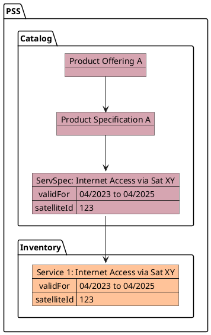
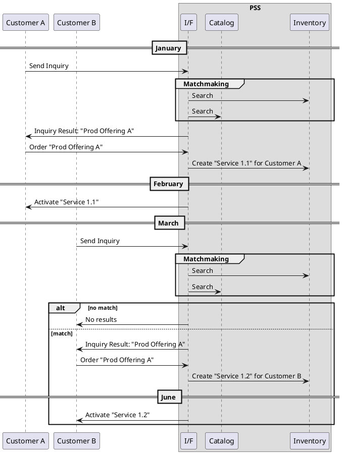
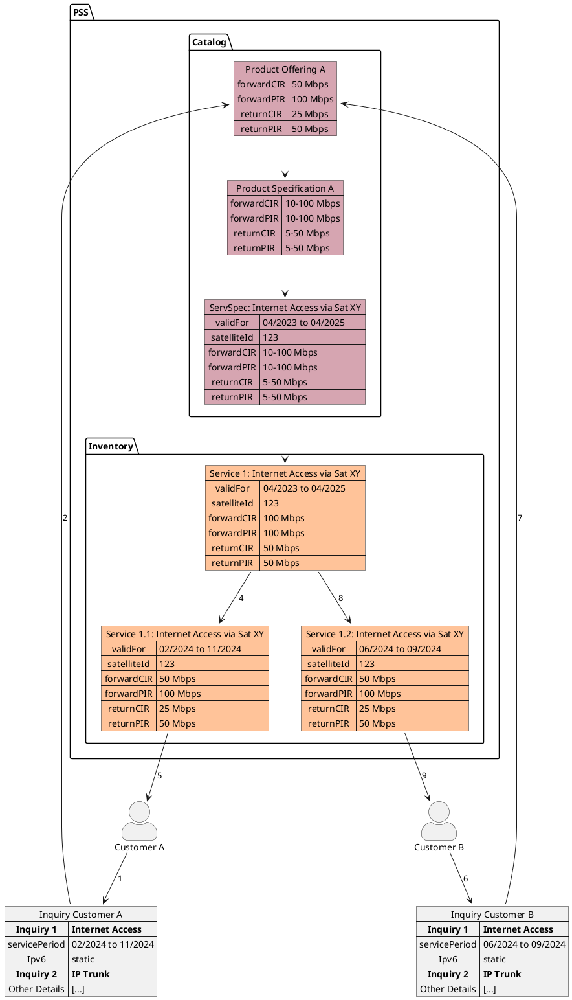

# Overbooking (V2.0)

+ ID: ADR024
* Status: :accepted:
* Deciders: @wr @hop @cg @cgr @ncz
* Consulted: @rsperb
* Date: 2023-10-26
* Version: 2.0
* Category: Design

## Context and Problem Statement

The terms *overbooking* and *contention* are used ambiguously depending on where the user is coming from, i.e., it has a different meaning in the candidate requirements than in the context of (Gov)SatCom service provision.
For the PSID project, we define overbooking in chapter [Decision Outcome](#decision-outcome-24).
This ambiguity leads to misunderstandings when discussing the topics and defining the scenarios in which it may occur.

For ESA, *overbooking* is a logical action that takes place at the moment a service is provisioned.
If a service has been overbooked, contention may happen during operation as soon as multiple services are competing for the same resource.
*Overbooking* is seen as a common practice for shared services.

For CSPs, shared services are subject to *oversubscription*.
If a CSP makes the deliberate choice to offer more capacity than there is available, they say the services are subject to *overselling*.
*Overbooking* is used by CSPs as a general term to describe situations that *might* lead to a contention situation.

The terms are used just slightly differently as they imply different contexts.
*Oversubscription* or *overselling* represent a business view of the situation.
These terms imply that potentially some elements of the service may not be fulfilled, if contention happens.
*Overbooking* in contrast relates to a resources view of the situation, referring to the missing amount of resources to fulfill all requests.

However, a precise definition is required to omit further misunderstandings in the description of the processes.

The situation under discussion is depicted below in {@fig:product-offering-tree}.
For the sake of simplicity in the chosen example, *Product Offering A* corresponds to a committed L1 service, i.e., it offers only internet access via an IP trunk and the customer is responsible for the remote site connection including hardware.
Since the service is committed, there is an instance *Service 1* in the inventory corresponding to the service specification *ServSpec*.
The service specification itself is mapped with the *Product Specification A*, which is offered via the *Product Offering A*.
However, the same scenario can be applied to any kind of service.
Note that not all parameters are depicted.



{#fig:product-offering-tree}

The process as depicted in {@fig:basic-process} and described in the following *can* lead to oversubscription, overbooking, and contention situations, depending on more details of *Service 1*, the priorities of *Customer A* and *Customer B*, as well as the implementation details of the PSS.

*Customer A* sends an inquiry in January for internet access between February and December to the PSS and gets *Product Offering A* as a result from the PSS.
*Customer A* then decides to order the product.
Thus, the PSS creates a sub-instance of *Service 1*, i.e., *Service 1.1*.
In February, the service is started, and *Customer A* is notified about the activation by the PSS.
In March, *Customer B* enters and sends a similar inquiry for internet access between June and September to the PSS that would give the same *Product Offering A* as a result.
Depending on the capacity of the resources behind this offering, the types of services and resources involved, and the implemented processes, different scenarios can arise.
The PSS can either reject the inquiry, i.e., if the service is not available, there is no way to offer it a second time, or offer it.
The details of the different scenarios are discussed below.



{#fig:basic-process}

The process is depicted from another point of view in {@fig:product-offering-tree-2} with more details on the inquiries, the product offering tree, i.e., the underlying product specification, service specification and service instance.
Note that this depicts a committed service, therefore, there is already an instance in the inventory from which the instances for *Customer A* and *Customer B* are derived.
For non-committed services, the instances are derived directly from the service specification in the catalog.



{#fig:product-offering-tree-2}

Additionally, this discussion is tightly coupled to the terms *Committed Information Rate* (CIR) and *Peak Information Rate* (PIR) which are distinguished for managed services (L1, L2, and L3).
The CIR defines the guaranteed capacity that is contracted to be available at any time for a given service.
In contrast, the PIR gives the maximal available capacity that might be available sometimes for that service.
For each service the PIR can be as high as the total available capacity on the resources implementing the service.
That is, the extreme case that all services have a PIR equal to the total available capacity at the same time is totally valid, although they cannot make use of it at the same time.
With CIR and PIR, two different types of services can be defined:

* A *shared service* has different values for CIR and PIR.
  The total capacity can be shared by multiple customers.
  Within the legal constraints of the SLA, only the PIR can be overbooked, which may cause the actual information rate to be downgraded until the CIR is reached.
* A *dedicated service* can either have no PIR assigned or have the PIR equal to the CIR.
  If a resource is used to implement multiple instances of a service or different services, each customer has a dedicated chunk of the underlying resource that is never shared with another customer.

The definition on shared and dedicated services can be extended to all kinds of items, i.e., shared and dedicated resources as well as shared and dedicated products.

This decision record shall collect the different scenarios where any party might use the terms *oversubscription*, *overbooking*, and *contention* and define a common wording for this project.

## Decision Drivers

* The definitions can be aligned with the different perspectives.
* The definitions make the implications (if there are any) for the APIs clear.

## Decision Outcome

The following definitions have **no influence** on the design of the API and can be used to define proper processes for the PSS implementing PSI:

* **Oversubscription**: Shared services are subject to oversubscription if the sum of the PIRs of all services sharing the capacity of the same underlying resources exceeds the total available capacity, but the sum of the CIRs does not.
Note that this does not create a breach of SLA, but is a common business model.
* **Overbooking**: If the sum of the CIRs of all services sharing the capacity of the same underlying resources will exceed the total available capacity at some point in the future, the services are subject to overbooking. Overbooking is intentional and requires a deliberate choice by either the CSP or the PSS to be implemented. Note that this might result in a contingency situation (see below) and, therefore, might create a breach of SLA if such a situation is not covered by the respective SLA.
* **Overselling**: Overselling occurs when a CSP or PSS sells more than they can *efficiently* provide. It is not necessarily based on the same decisions that allow for overbooking, but more about overcommitting resources or services.
* **Contention**: A contention situation arises, if the sum of the CIRs of all services sharing the capacity of the same underlying resources actually exceeds the total available capacity, i.e., when the overbooking actually manifests itself. A contention situation may also arise due to external factors that are not foreseeable.

Note that overbooking and overselling are similar concepts in that they both involve selling more than can be immediately accommodated or delivered, but the specific context and reasons for doing so can vary.

### Oversubscription

Oversubscription is the basis for all non-dedicated telecommunications services and can be used to maximize the usage of a shared common resource.
In general, it is defined by the ratio between the allocated capacity per customer and the available capacity per customer.
Therefore, the oversubscription model assumes that statistically only a fraction of the customers will attempt to utilize their allocated capacity (e.g. bandwidth) simultaneously.
A common example is the internet connection on the mobile phone:
There is a maximum guaranteed up- and download speed, however, if there is a peak in the demand for a specific location (e.g., a sport event) only a reduced capacity is available for each individual.

```vega
{
  "$schema": "https://vega.github.io/schema/vega/v5.json",
  "description": "A chart that represents capacity utilization over time.",
  "width": 800,
  "height": 500,
  "padding": 5,

  "data": [
    {
      "name": "table",
      "values": [
        {"date": "2023-01-01T00:00:00Z", "value": 0.00, "customer": "A"},
        {"date": "2023-02-01T00:00:00Z", "value": 0.20, "customer": "A"},
        {"date": "2023-02-05T00:00:00Z", "value": 0.50, "customer": "A"},
        {"date": "2023-02-12T00:00:00Z", "value": 0.42, "customer": "A"},
        {"date": "2023-02-19T00:00:00Z", "value": 0.45, "customer": "A"},
        {"date": "2023-02-26T00:00:00Z", "value": 0.34, "customer": "A"},
        {"date": "2023-03-05T00:00:00Z", "value": 0.45, "customer": "A"},
        {"date": "2023-03-12T00:00:00Z", "value": 0.47, "customer": "A"},
        {"date": "2023-03-19T00:00:00Z", "value": 0.45, "customer": "A"},
        {"date": "2023-03-26T00:00:00Z", "value": 0.40, "customer": "A"},
        {"date": "2023-04-02T00:00:00Z", "value": 0.38, "customer": "A"},
        {"date": "2023-04-09T00:00:00Z", "value": 0.43, "customer": "A"},
        {"date": "2023-04-16T00:00:00Z", "value": 0.41, "customer": "A"},
        {"date": "2023-04-23T00:00:00Z", "value": 0.40, "customer": "A"},
        {"date": "2023-04-30T00:00:00Z", "value": 0.35, "customer": "A"},
        {"date": "2023-05-07T00:00:00Z", "value": 0.38, "customer": "A"},
        {"date": "2023-05-14T00:00:00Z", "value": 0.35, "customer": "A"},
        {"date": "2023-05-21T00:00:00Z", "value": 0.38, "customer": "A"},
        {"date": "2023-05-28T00:00:00Z", "value": 0.41, "customer": "A"},
        {"date": "2023-06-01T00:00:00Z", "value": 0.41, "customer": "A"}, {"date": "2023-06-01T00:00:00Z", "value": 0.10, "customer": "B"},
        {"date": "2023-06-04T00:00:00Z", "value": 0.46, "customer": "A"}, {"date": "2023-06-04T00:00:00Z", "value": 0.18, "customer": "B"},
        {"date": "2023-06-11T00:00:00Z", "value": 0.44, "customer": "A"}, {"date": "2023-06-11T00:00:00Z", "value": 0.41, "customer": "B"},
        {"date": "2023-06-18T00:00:00Z", "value": 0.43, "customer": "A"}, {"date": "2023-06-18T00:00:00Z", "value": 0.50, "customer": "B"},
        {"date": "2023-06-25T00:00:00Z", "value": 0.31, "customer": "A"}, {"date": "2023-06-25T00:00:00Z", "value": 0.69, "customer": "B"},
        {"date": "2023-07-02T00:00:00Z", "value": 0.34, "customer": "A"}, {"date": "2023-07-02T00:00:00Z", "value": 0.66, "customer": "B"},
        {"date": "2023-07-09T00:00:00Z", "value": 0.25, "customer": "A"}, {"date": "2023-07-09T00:00:00Z", "value": 0.75, "customer": "B"},
        {"date": "2023-07-16T00:00:00Z", "value": 0.40, "customer": "A"}, {"date": "2023-07-16T00:00:00Z", "value": 0.60, "customer": "B"},
        {"date": "2023-07-23T00:00:00Z", "value": 0.43, "customer": "A"}, {"date": "2023-07-23T00:00:00Z", "value": 0.57, "customer": "B"},
        {"date": "2023-07-30T00:00:00Z", "value": 0.34, "customer": "A"}, {"date": "2023-07-30T00:00:00Z", "value": 0.66, "customer": "B"},
        {"date": "2023-08-06T00:00:00Z", "value": 0.40, "customer": "A"}, {"date": "2023-08-06T00:00:00Z", "value": 0.60, "customer": "B"},
        {"date": "2023-08-13T00:00:00Z", "value": 0.37, "customer": "A"}, {"date": "2023-08-13T00:00:00Z", "value": 0.37, "customer": "B"},
        {"date": "2023-08-20T00:00:00Z", "value": 0.44, "customer": "A"}, {"date": "2023-08-20T00:00:00Z", "value": 0.31, "customer": "B"},
        {"date": "2023-08-27T00:00:00Z", "value": 0.39, "customer": "A"}, {"date": "2023-08-27T00:00:00Z", "value": 0.12, "customer": "B"},
        {"date": "2023-09-01T00:00:00Z", "value": 0.38, "customer": "A"}, {"date": "2023-09-01T00:00:00Z", "value": 0.71, "customer": "B"},
        {"date": "2023-09-03T00:00:00Z", "value": 0.38, "customer": "A"},
        {"date": "2023-09-10T00:00:00Z", "value": 0.42, "customer": "A"},
        {"date": "2023-09-17T00:00:00Z", "value": 0.35, "customer": "A"},
        {"date": "2023-09-24T00:00:00Z", "value": 0.50, "customer": "A"},
        {"date": "2023-10-01T00:00:00Z", "value": 0.47, "customer": "A"},
        {"date": "2023-10-08T00:00:00Z", "value": 0.43, "customer": "A"},
        {"date": "2023-10-15T00:00:00Z", "value": 0.41, "customer": "A"},
        {"date": "2023-10-22T00:00:00Z", "value": 0.44, "customer": "A"},
        {"date": "2023-10-29T00:00:00Z", "value": 0.42, "customer": "A"},
        {"date": "2023-11-01T00:00:00Z", "value": 0.00, "customer": "A"},
        {"date": "2024-01-01T00:00:00Z", "value": 0.00, "customer": "A"}
      ],
      "transform": [
        { 
          "type": "formula", 
          "as": "date",
          "expr": "datetime(utcyear(datum.date), utcmonth(datum.date), utcdate(datum.date), utchours(datum.date), utcminutes(datum.date), utcseconds(datum.date))"
        },
        {
          "type": "stack",
          "groupby": ["date"],
          "sort": {"field": "customer"},
          "field": "value"
        }
      ]
    },
    {
      "name": "rule",
      "values": [{"start": "2023-01-01T00:00:00Z", "end": "2023-12-31T23:59:59Z", "value": 1.0}],
      "transform": [
        {"type": "formula", "as": "start", "expr": "datetime(utcyear(datum.start), utcmonth(datum.start), utcdate(datum.start), utchours(datum.start), utcminutes(datum.start), utcseconds(datum.start))"},
        {"type": "formula", "as": "end",   "expr": "datetime(utcyear(datum.end), utcmonth(datum.end), utcdate(datum.end), utchours(datum.end), utcminutes(datum.end), utcseconds(datum.end))"}
      ]
    },
    {
      "name": "annotations",
      "values": [
        {"start": "2023-06-01T00:00:00Z", "end": "2023-06-25T00:00:00Z", "min": -0.1, "max": 1.25, "text": "Oversubscription"},
        {"start": "2023-06-25T00:00:00Z", "end": "2023-08-13T00:00:00Z", "min": -0.1, "max": 1.25, "text": "Throttled Capacities"},
        {"start": "2023-08-13T00:00:00Z", "end": "2023-09-01T00:00:00Z", "min": -0.1, "max": 1.25, "text": "Oversubscription"}
      ],
      "transform": [
        {"type": "formula", "as": "start", "expr": "datetime(utcyear(datum.start), utcmonth(datum.start), utcdate(datum.start), utchours(datum.start), utcminutes(datum.start), utcseconds(datum.start))"},
        {"type": "formula", "as": "end",   "expr": "datetime(utcyear(datum.end), utcmonth(datum.end), utcdate(datum.end), utchours(datum.end), utcminutes(datum.end), utcseconds(datum.end))"}
      ]
    },
    {
      "name": "reservation",
      "values": [
        {"date": "2023-01-01T00:00:00Z", "value": 0.00, "customer": "A"},
        {"date": "2023-02-01T00:00:00Z", "value": 0.50, "customer": "A"},
        {"date": "2023-03-01T00:00:00Z", "value": 0.50, "customer": "A"}, {"date": "2023-03-01T00:00:00Z", "value": 0.00, "customer": "B"},
        {"date": "2023-06-01T00:00:00Z", "value": 0.50, "customer": "A"}, {"date": "2023-06-01T00:00:00Z", "value": 0.75, "customer": "B"},
        {"date": "2023-09-01T00:00:00Z", "value": 0.50, "customer": "A"}, {"date": "2023-09-01T00:00:00Z", "value": 0.00, "customer": "B"},
        {"date": "2023-11-01T00:00:00Z", "value": 0.00, "customer": "A"}
      ],
      "transform": [
        { 
          "type": "formula", 
          "as": "date",
          "expr": "datetime(utcyear(datum.date), utcmonth(datum.date), utcdate(datum.date), utchours(datum.date), utcminutes(datum.date), utcseconds(datum.date))"
        },
        {
          "type": "stack",
          "groupby": ["date"],
          "sort": {"field": "customer"},
          "field": "value"
        }
      ]
    },
    {
      "name": "reservation_marks",
      "values": [
        {"date": "2023-01-01T00:00:00Z", "value": 0.00, "customer": "A"},
        {"date": "2023-02-01T00:00:00Z", "value": 0.00, "customer": "A"},
        {"date": "2023-03-01T00:00:00Z", "value": 0.50, "customer": "B"},
        {"date": "2023-06-01T00:00:00Z", "value": 0.50, "customer": "B"},
        {"date": "2023-09-01T00:00:00Z", "value": 0.50, "customer": "B"},
        {"date": "2023-11-01T00:00:00Z", "value": 0.00, "customer": "A"}
      ],
      "transform": [
        { 
          "type": "formula", 
          "as": "date",
          "expr": "datetime(utcyear(datum.date), utcmonth(datum.date), utcdate(datum.date), utchours(datum.date), utcminutes(datum.date), utcseconds(datum.date))"
        },
        {
          "type": "stack",
          "groupby": ["date"],
          "sort": {"field": "customer"},
          "field": "value"
        }
      ]
    }
  ],
  "scales": [
    {
      "name": "xscale",
      "type": "time",
      "range": "width",
      "domain": {
        "data": "table",
        "field": "date"
      }
    },
    {
      "name": "yscale",
      "type": "linear",
      "range": "height",
      "nice": true, "zero": true,
      "domain": {"data": "reservation", "field": "y1"}
    },
    {
      "name": "color-a",
      "type": "ordinal",
      "domain": {"data": "annotations", "field": "text"},
      "range": ["#feef72", "#bd3f37"]
    },
    {
      "name": "color",
      "type": "ordinal",
      "domain": {"data": "reservation", "field": "customer"},
      "range": "category"
    },
    {
      "name": "colorb",
      "type": "ordinal",
      "domain": {"data": "reservation", "field": "customer"},
      "range": ["black", "grey"]
    }
  ],
  "axes": [
    {"orient": "bottom", "scale": "xscale", "format": "%b", "title": "Month"},
    {"orient": "left", "scale": "yscale", "format": ".0%", "title": "Booked Capacity"}
  ],
  "marks": [
    {
      "type":"group",
      "name": "Annotations",
      "marks": [
        {
          "type": "rect",
          "from": {"data": "annotations"},
          "encode": {
            "enter": {
              "x": {"scale": "xscale", "field": "start"}, "x2": {"scale": "xscale", "field": "end"},
              "y": {"scale": "yscale", "field": "min"}, "y2": {"scale": "yscale", "field": "max"},
              "fill": {"scale": "color-a", "field": "text"},
              "fillOpacity": {"value": 0.5}
            }
          }
        },
        {
            "type": "rule",
            "name": "Maximum Capacity",
            "from": {"data": "rule"},
            "encode": {
                "enter": {
                "x": {"scale": "xscale", "field": "start"}, "x2": {"scale": "xscale", "field": "end"},
                "y": {"scale": "yscale", "field": "value"}, "y2": {"scale": "yscale", "field": "value"},
                "stroke": {"value": "red"},
                "strokeWidth": {"value": 2}
                }
            }
        }
      ]  
    },
    {
      "type": "group",
      "from": {
        "facet": {
          "name": "Booked",
          "data": "reservation",
          "groupby": "customer"
        }
      },
      "marks": [
        {
          "type": "line",
          "from": {"data": "Booked"},
          "encode": {
            "enter": {
              "x": {"scale": "xscale", "field": "date"},
              "y": {"scale": "yscale", "field": "y1"},
              "interpolate": {"value": "step-after"},
              "stroke": {"scale": "color", "field": "customer"},
              "strokeWidth": {"value": 2}
            }
          }
        }
      ]
    },
    {
      "type": "group",
      "from": {
        "facet": {
          "name": "series",
          "data": "table",
          "groupby": "customer"
        }
      },
      "marks": [
        {
          "type": "area",
          "from": {"data": "series"},
          "encode": {
            "enter": {
              "interpolate": {"value": "step-after"},
              "x": {"scale": "xscale", "field": "date"},
              "y": {"scale": "yscale", "field": "y0"},
              "y2": {"scale": "yscale", "field": "y1"},
              "fill": {"scale": "color", "field": "customer"}
            }
          }
        }
      ]
    },
    {
      "type": "group",
      "from": {
        "facet": {
          "name": "Booked",
          "data": "reservation_marks",
          "groupby": "customer"
        }
      },
      "marks": [
        {
          "type": "symbol",
          "from": {"data": "Booked"},
          "encode": {
            "enter": {
              "x": {"scale": "xscale", "field": "date"},
              "y": {"scale": "yscale", "field": "y1"},
              "fill": {"scale": "colorb", "field": "customer"}
            }
          }
        }
      ]
    }
  ],
  "legends": [
    {
      "fill": "color-a",
      "title": "Period",
      "orient": "top-right",
      "offset": 8,
      "encode": {
        "symbols": {
          "update": {
            "strokeWidth": {"value": 0},
            "shape": {"value": "square"},
            "opacity": {"value": 0.5}
          }
        }
      }
    },
    {
      "fill": "color",
      "title": "Used by Customer",
      "orient": "top-left",
      "offset": 8,
      "encode": {
        "symbols": {
          "update": {
            "strokeWidth": {"value": 0},
            "shape": {"value": "square"}
          }
        }
      }
    },
    {
      "fill": "colorb",
      "title": "Booked by Customer",
      "orient": "top-left",
      "offset": 8
    }
  ]
}
```

{#fig:oversubscription}

In {@fig:oversubscription}, *Service 1* can be shared among multiple customers, e.g., it is a pre-configured iDirect service, where the underlying resource can manage up to 10Mbits download and 5Mbits upload.
*Customer A* books the service from February to November with a CIR of 25% of the total capacity and a PIR of 50% of the total capacity.
The PSS implements this as *Service 1.1*.
*Customer B* then books the service from June to September with a CIR of 50% of the total capacity and a PIR of 100% of the total capacity.
The sum of the PIRs is now 150%.
This results in a throttled capacity, i.e. the bandwidth that was foreseen to be needed cannot be distributed as initially requested.
However, there is never a violation of the SLAs.
For example, if *Customer A* does not use any of their guaranteed capacity, *Customer B* can use it completely.

### Overselling, Overbooking, and Contention

Overbooking and overselling are terms often used interchangeably, but they can have slightly different meanings depending on the context.
In general, both concepts involve selling more of a product, service or resource than can be accommodated or delivered, but the specific usage can vary by case.

There are services that do not have a CIR defined in their SLA, e.g., services offered by Starlink or OneWeb that offer only a PIR, i.e., a connection with a data rate up to a specific amount.
These services are better described by *overselling* than *overbooking*.
Another example is a company selling more licences of a software than they can effectively support with customer service and technical assistance.
If too many instances of such a product are sold, the underlying resources are stretched out across multiple customers and the services cannot be provisioned *efficiently*.

Overbooking refers to a provider offering more instances of a resource, service, or product (collectively, any *item* in a catalog or inventory) than there are available in stock.
This is not a problem until the items actually need to be provided, i.e., a system can allow overbooking as a process, but cannot work properly once it needs to provide them.
If this is the case, a contention situation arises.

For example, an airline can sell more tickets for a plane than there are seats available (overbooking).
This is not a problem until more passengers want to board the plane than there are actual seats (contention).
As long as not all passengers show up to the flight, overbooking as a process is allowed and leads to no problems.
However, as soon as more passengers want to board than there are seats on the plane, the system fails and mitigation for the overbooking needs to be initiated, e.g., some passengers need to get alternative flights offered.

Note that the contention situation on planes are sometimes called *overselling*.
We will use the word *contention* here instead to omit ambiguity.

In case of communication services, overbooking is usually referring to the CIR, and is not taking the PIR into account.
This is illustrated by the following example, which assumes a service with 100 Mbit/s CIR available.
Note that the example below does not necessarily need to refer to the CIR of a service.
E.g., for L0 services, the allocated fractions of bandwidth (identified by start and end frequency) would be used instead.

```vega
{
  "$schema": "https://vega.github.io/schema/vega/v5.json",
  "description": "A chart that represents capacity utilization over time.",
  "width": 800,
  "height": 500,
  "padding": 5,

  "data": [
    {
      "name": "table",
      "values": [
        {"date": "2023-01-01T00:00:00Z", "value": 0.00, "customer": "A"},
        {"date": "2023-02-01T00:00:00Z", "value": 0.20, "customer": "A"},
        {"date": "2023-02-05T00:00:00Z", "value": 0.50, "customer": "A"},
        {"date": "2023-02-12T00:00:00Z", "value": 0.42, "customer": "A"},
        {"date": "2023-02-19T00:00:00Z", "value": 0.45, "customer": "A"},
        {"date": "2023-02-26T00:00:00Z", "value": 0.34, "customer": "A"},
        {"date": "2023-03-05T00:00:00Z", "value": 0.45, "customer": "A"},
        {"date": "2023-03-12T00:00:00Z", "value": 0.47, "customer": "A"},
        {"date": "2023-03-19T00:00:00Z", "value": 0.45, "customer": "A"},
        {"date": "2023-03-26T00:00:00Z", "value": 0.40, "customer": "A"},
        {"date": "2023-04-02T00:00:00Z", "value": 0.38, "customer": "A"},
        {"date": "2023-04-09T00:00:00Z", "value": 0.43, "customer": "A"},
        {"date": "2023-04-16T00:00:00Z", "value": 0.41, "customer": "A"},
        {"date": "2023-04-23T00:00:00Z", "value": 0.40, "customer": "A"},
        {"date": "2023-04-30T00:00:00Z", "value": 0.35, "customer": "A"},
        {"date": "2023-05-07T00:00:00Z", "value": 0.38, "customer": "A"},
        {"date": "2023-05-14T00:00:00Z", "value": 0.35, "customer": "A"},
        {"date": "2023-05-21T00:00:00Z", "value": 0.38, "customer": "A"},
        {"date": "2023-05-28T00:00:00Z", "value": 0.41, "customer": "A"},
        {"date": "2023-06-01T00:00:00Z", "value": 0.41, "customer": "A"}, {"date": "2023-06-01T00:00:00Z", "value": 0.10, "customer": "B"},
        {"date": "2023-06-04T00:00:00Z", "value": 0.46, "customer": "A"}, {"date": "2023-06-04T00:00:00Z", "value": 0.18, "customer": "B"},
        {"date": "2023-06-11T00:00:00Z", "value": 0.44, "customer": "A"}, {"date": "2023-06-11T00:00:00Z", "value": 0.41, "customer": "B"},
        {"date": "2023-06-18T00:00:00Z", "value": 0.43, "customer": "A"}, {"date": "2023-06-18T00:00:00Z", "value": 0.50, "customer": "B"},
        {"date": "2023-06-25T00:00:00Z", "value": 0.42, "customer": "A"}, {"date": "2023-06-25T00:00:00Z", "value": 0.69, "customer": "B"},
        {"date": "2023-07-02T00:00:00Z", "value": 0.49, "customer": "A"}, {"date": "2023-07-02T00:00:00Z", "value": 0.66, "customer": "B"},
        {"date": "2023-07-09T00:00:00Z", "value": 0.46, "customer": "A"}, {"date": "2023-07-09T00:00:00Z", "value": 0.75, "customer": "B"},
        {"date": "2023-07-16T00:00:00Z", "value": 0.47, "customer": "A"}, {"date": "2023-07-16T00:00:00Z", "value": 0.60, "customer": "B"},
        {"date": "2023-07-23T00:00:00Z", "value": 0.49, "customer": "A"}, {"date": "2023-07-23T00:00:00Z", "value": 0.57, "customer": "B"},
        {"date": "2023-07-30T00:00:00Z", "value": 0.46, "customer": "A"}, {"date": "2023-07-30T00:00:00Z", "value": 0.66, "customer": "B"},
        {"date": "2023-08-06T00:00:00Z", "value": 0.49, "customer": "A"}, {"date": "2023-08-06T00:00:00Z", "value": 0.60, "customer": "B"},
        {"date": "2023-08-13T00:00:00Z", "value": 0.37, "customer": "A"}, {"date": "2023-08-13T00:00:00Z", "value": 0.37, "customer": "B"},
        {"date": "2023-08-20T00:00:00Z", "value": 0.44, "customer": "A"}, {"date": "2023-08-20T00:00:00Z", "value": 0.31, "customer": "B"},
        {"date": "2023-08-27T00:00:00Z", "value": 0.39, "customer": "A"}, {"date": "2023-08-27T00:00:00Z", "value": 0.12, "customer": "B"},
        {"date": "2023-09-01T00:00:00Z", "value": 0.38, "customer": "A"}, {"date": "2023-09-01T00:00:00Z", "value": 0.71, "customer": "B"},
        {"date": "2023-09-03T00:00:00Z", "value": 0.38, "customer": "A"},
        {"date": "2023-09-10T00:00:00Z", "value": 0.42, "customer": "A"},
        {"date": "2023-09-17T00:00:00Z", "value": 0.35, "customer": "A"},
        {"date": "2023-09-24T00:00:00Z", "value": 0.50, "customer": "A"},
        {"date": "2023-10-01T00:00:00Z", "value": 0.47, "customer": "A"},
        {"date": "2023-10-08T00:00:00Z", "value": 0.43, "customer": "A"},
        {"date": "2023-10-15T00:00:00Z", "value": 0.41, "customer": "A"},
        {"date": "2023-10-22T00:00:00Z", "value": 0.44, "customer": "A"},
        {"date": "2023-10-29T00:00:00Z", "value": 0.42, "customer": "A"},
        {"date": "2023-11-01T00:00:00Z", "value": 0.00, "customer": "A"},
        {"date": "2024-01-01T00:00:00Z", "value": 0.00, "customer": "A"}
      ],
      "transform": [
        { 
          "type": "formula", 
          "as": "date",
          "expr": "datetime(utcyear(datum.date), utcmonth(datum.date), utcdate(datum.date), utchours(datum.date), utcminutes(datum.date), utcseconds(datum.date))"
        },
        {
          "type": "stack",
          "groupby": ["date"],
          "sort": {"field": "customer"},
          "field": "value"
        }
      ]
    },
    {
      "name": "rule",
      "values": [{"start": "2023-01-01T00:00:00Z", "end": "2023-12-31T23:59:59Z", "value": 1.0}],
      "transform": [
        {"type": "formula", "as": "start", "expr": "datetime(utcyear(datum.start), utcmonth(datum.start), utcdate(datum.start), utchours(datum.start), utcminutes(datum.start), utcseconds(datum.start))"},
        {"type": "formula", "as": "end",   "expr": "datetime(utcyear(datum.end), utcmonth(datum.end), utcdate(datum.end), utchours(datum.end), utcminutes(datum.end), utcseconds(datum.end))"}
      ]
    },
    {
      "name": "annotations",
      "values": [
        {"start": "2023-03-01T00:00:00Z", "end": "2023-06-01T00:00:00Z", "min": -0.1, "max": 1.3, "text": "Overbooking known"},
        {"start": "2023-06-01T00:00:00Z", "end": "2023-06-25T00:00:00Z", "min": -0.1, "max": 1.3, "text": "Overbooked"},
        {"start": "2023-06-25T00:00:00Z", "end": "2023-08-13T00:00:00Z", "min": -0.1, "max": 1.3, "text": "Contention"},
        {"start": "2023-08-13T00:00:00Z", "end": "2023-09-01T00:00:00Z", "min": -0.1, "max": 1.3, "text": "Overbooked"}
      ],
      "transform": [
        {"type": "formula", "as": "start", "expr": "datetime(utcyear(datum.start), utcmonth(datum.start), utcdate(datum.start), utchours(datum.start), utcminutes(datum.start), utcseconds(datum.start))"},
        {"type": "formula", "as": "end",   "expr": "datetime(utcyear(datum.end), utcmonth(datum.end), utcdate(datum.end), utchours(datum.end), utcminutes(datum.end), utcseconds(datum.end))"}
      ]
    },
    {
      "name": "reservation",
      "values": [
        {"date": "2023-01-01T00:00:00Z", "value": 0.00, "customer": "A"},
        {"date": "2023-02-01T00:00:00Z", "value": 0.50, "customer": "A"},
        {"date": "2023-03-01T00:00:00Z", "value": 0.50, "customer": "A"}, {"date": "2023-03-01T00:00:00Z", "value": 0.00, "customer": "B"},
        {"date": "2023-06-01T00:00:00Z", "value": 0.50, "customer": "A"}, {"date": "2023-06-01T00:00:00Z", "value": 0.75, "customer": "B"},
        {"date": "2023-09-01T00:00:00Z", "value": 0.50, "customer": "A"}, {"date": "2023-09-01T00:00:00Z", "value": 0.00, "customer": "B"},
        {"date": "2023-11-01T00:00:00Z", "value": 0.00, "customer": "A"}
      ],
      "transform": [
        { 
          "type": "formula", 
          "as": "date",
          "expr": "datetime(utcyear(datum.date), utcmonth(datum.date), utcdate(datum.date), utchours(datum.date), utcminutes(datum.date), utcseconds(datum.date))"
        },
        {
          "type": "stack",
          "groupby": ["date"],
          "sort": {"field": "customer"},
          "field": "value"
        }
      ]
    },
    {
      "name": "reservation_marks",
      "values": [
        {"date": "2023-01-01T00:00:00Z", "value": 0.00, "customer": "A"},
        {"date": "2023-02-01T00:00:00Z", "value": 0.00, "customer": "A"},
        {"date": "2023-03-01T00:00:00Z", "value": 0.50, "customer": "B"},
        {"date": "2023-06-01T00:00:00Z", "value": 0.50, "customer": "B"},
        {"date": "2023-09-01T00:00:00Z", "value": 0.50, "customer": "B"},
        {"date": "2023-11-01T00:00:00Z", "value": 0.00, "customer": "A"}
      ],
      "transform": [
        { 
          "type": "formula", 
          "as": "date",
          "expr": "datetime(utcyear(datum.date), utcmonth(datum.date), utcdate(datum.date), utchours(datum.date), utcminutes(datum.date), utcseconds(datum.date))"
        },
        {
          "type": "stack",
          "groupby": ["date"],
          "sort": {"field": "customer"},
          "field": "value"
        }
      ]
    }
  ],
  "scales": [
    {
      "name": "xscale",
      "type": "time",
      "range": "width",
      "domain": {
        "data": "table",
        "field": "date"
      }
    },
    {
      "name": "yscale",
      "type": "linear",
      "range": "height",
      "nice": true, "zero": true,
      "domain": {"data": "reservation", "field": "y1"}
    },
    {
      "name": "color-a",
      "type": "ordinal",
      "domain": {"data": "annotations", "field": "text"},
      "range": ["lightgrey", "#feef72", "#bd3f37"]
    },
    {
      "name": "color",
      "type": "ordinal",
      "domain": {"data": "reservation", "field": "customer"},
      "range": "category"
    },
    {
      "name": "colorb",
      "type": "ordinal",
      "domain": {"data": "reservation", "field": "customer"},
      "range": ["black", "grey"]
    }
  ],
  "axes": [
    {"orient": "bottom", "scale": "xscale", "format": "%b", "title": "Month"},
    {"orient": "left", "scale": "yscale", "format": ".0%", "title": "Booked Capacity"}
  ],
  "marks": [
    {
      "type":"group",
      "name": "Annotations",
      "marks": [
        {
          "type": "rect",
          "from": {"data": "annotations"},
          "encode": {
            "enter": {
              "x": {"scale": "xscale", "field": "start"}, "x2": {"scale": "xscale", "field": "end"},
              "y": {"scale": "yscale", "field": "min"}, "y2": {"scale": "yscale", "field": "max"},
              "fill": {"scale": "color-a", "field": "text"},
              "fillOpacity": {"value": 0.5}
            }
          }
        },
        {
          "type": "rule",
          "name": "Maximum Capacity",
          "from": {"data": "rule"},
          "encode": {
            "enter": {
              "x": {"scale": "xscale", "field": "start"}, "x2": {"scale": "xscale", "field": "end"},
              "y": {"scale": "yscale", "field": "value"}, "y2": {"scale": "yscale", "field": "value"},
              "stroke": {"value": "red"},
              "strokeWidth": {"value": 2}
            }
          }
        }
      ]
    },
    {
      "type": "group",
      "from": {
        "facet": {
          "name": "Booked",
          "data": "reservation",
          "groupby": "customer"
        }
      },
      "marks": [
        {
          "type": "line",
          "from": {"data": "Booked"},
          "encode": {
            "enter": {
              "x": {"scale": "xscale", "field": "date"},
              "y": {"scale": "yscale", "field": "y1"},
              "interpolate": {"value": "step-after"},
              "stroke": {"scale": "color", "field": "customer"},
              "strokeWidth": {"value": 2}
            }
          }
        }
      ]
    },
    {
      "type": "group",
      "from": {
        "facet": {
          "name": "series",
          "data": "table",
          "groupby": "customer"
        }
      },
      "marks": [
        {
          "type": "area",
          "from": {"data": "series"},
          "encode": {
            "enter": {
              "interpolate": {"value": "step-after"},
              "x": {"scale": "xscale", "field": "date"},
              "y": {"scale": "yscale", "field": "y0"},
              "y2": {"scale": "yscale", "field": "y1"},
              "fill": {"scale": "color", "field": "customer"}
            }
          }
        }
      ]
    },
    {
      "type": "group",
      "from": {
        "facet": {
          "name": "Booked",
          "data": "reservation_marks",
          "groupby": "customer"
        }
      },
      "marks": [
        {
          "type": "symbol",
          "from": {"data": "Booked"},
          "encode": {
            "enter": {
              "x": {"scale": "xscale", "field": "date"},
              "y": {"scale": "yscale", "field": "y1"},
              "fill": {"scale": "colorb", "field": "customer"}
            }
          }
        }   
      ]
    }
  ],
  "legends": [
    {
      "fill": "color-a",
      "title": "Period",
      "orient": "top-right",
      "offset": 8,
      "encode": {
        "symbols": {
          "update": {
            "strokeWidth": {"value": 0},
            "shape": {"value": "square"},
            "opacity": {"value": 0.5}
          }
        }
      }
    },
    {
      "fill": "color",
      "title": "Used by Customer",
      "orient": "top-left",
      "offset": 8,
      "encode": {
        "symbols": {
          "update": {
            "strokeWidth": {"value": 0},
            "shape": {"value": "square"}
          }
        }
      }
    },
    {
      "fill": "colorb",
      "title": "Booked by Customer",
      "orient": "top-left",
      "offset": 8
    }
  ]
}
```

{#fig:overbooking-and-contention}

In {@fig:overbooking-and-contention}, *Service 1* cannot be shared among multiple customers, i.e., it is a dedicated service.
*Customer A* books the service from February to November with a CIR of 50% of the total capacity.
The PSS implements this as *Service 1.1*.
In March, *Customer B* then books the service from June to September with a CIR of 75% of the total capacity.

Between March and June, the service is overbooked, i.e., the PSS knows that there is an upcoming contention situation and has time to account for this, e.g., by ordering more capacity.
If the PSS fails to do so or decides not to handle the overbooking, a contention situation arises, as the guaranteed capacity is at 125% of the total capacity.
This contention situation lasts for the whole time *Service 1.2* is provided.

### Priority and Pre-emption

In general, overbooking as a process is a business decision to take a calculated risk, i.e., not being able to provide all items offered.
The main reason to allow overbooking is to maximize the return on investment by maximizing the usage of the available capacity of an item.
However, overbooking and resulting contention situations might be a result of *force majeur*, e.g., a natural catastrophe can destroy parts of the communication infrastructure and reduce the total capacity.
Independent of the reasons for overbooking and/or contention situations, i.e., if it is an expected or unexpected situation, the API needs to implement a way to handle mitigation strategies.

Depending on the case, there are different strategies that can be implemented when an overbooked system becomes contended.

For dedicated items that cannot be degraded, there are basically only two solutions:

1. The order for the item is cancelled.
2. A replacement is offered.

Note that it does not matter if the item was sold or reserved and how the state was achieved.
Cancellation of an order might result in penalties, bad reputation, and other negative consequences.
For example, it may also involve logistical problems when hardware is already shipped, which go beyond the scope of this decision.

For all other items, there is the additional option to offer a degraded service, e.g., with lower bandwidth to some or all customers.
Note that the degradation of service can be combined with the cancellation of services, e.g., when a transponder of a satellite fails.

Depending on the product that is involved, the PSS and/or provider can implement priority for the customer, i.e., customers with higher priority have a higher probability to keep their service active.
Priority can be implemented on different levels:

1. Based on the type of customer, e.g., higher priority for emergency forces etc.
2. Based on a hierarchy of users.
3. Based on the type of mission, e.g., rescue missions get higher priority than common daily usage.
4. Based on a balancing strategy, e.g. round-robin.
5. As part of the products themselves, i.e., allowing commercial customers to pay for a higher priority.

For example the first setup for priority is implemented in terrestrial networks in cases of emergency, in the US with the *Nationwide Wireless Priority Service* and in the UK with the *Mobile Telecommunication Privilege Access Scheme*.
Communication priority is also implemented on planes with the SATVOICE protocol, which grants the different categories of communication different priorities, i.e., in descending order emergency, operational (high), operational (low), and non-operational.
The last setup for priority can be implemented e.g. as Value-Added Services.

Based on the priority, some services may be subject to pre-emption.
That is, if a customer with higher priority needs to access a service that is already booked, they might have the right to take over some or the whole capacity.

In {@fig:pre-emption}, the contention situation discussed above is resolved by reducing the capacity of *Customer A* for the duration of *Service 1.2* of *Customer B* to only 25% of the total capacity.
This only requires a change request by the PSS to be sent to the provider to implement this and a notification towards *Customer A*, which is already part of the API.
This can only be implemented if the SLAs allow for such a degradation, e.g., based on priority.

Note that this requires the same data processes as for the defragmentation described in the MADR [Bandwidth (De-)Fragmentation](#bandwidth-de-fragmentation).

```vega
{
  "$schema": "https://vega.github.io/schema/vega/v5.json",
  "description": "A chart that represents capacity utilization over time.",
  "width": 800,
  "height": 500,
  "padding": 5,

  "data": [
    {
      "name": "table",
      "values": [
        {"date": "2023-01-01T00:00:00Z", "value": 0.00, "customer": "A"},
        {"date": "2023-02-01T00:00:00Z", "value": 0.20, "customer": "A"},
        {"date": "2023-02-05T00:00:00Z", "value": 0.50, "customer": "A"},
        {"date": "2023-02-12T00:00:00Z", "value": 0.42, "customer": "A"},
        {"date": "2023-02-19T00:00:00Z", "value": 0.45, "customer": "A"},
        {"date": "2023-02-26T00:00:00Z", "value": 0.34, "customer": "A"},
        {"date": "2023-03-05T00:00:00Z", "value": 0.45, "customer": "A"},
        {"date": "2023-03-12T00:00:00Z", "value": 0.47, "customer": "A"},
        {"date": "2023-03-19T00:00:00Z", "value": 0.45, "customer": "A"},
        {"date": "2023-03-26T00:00:00Z", "value": 0.40, "customer": "A"},
        {"date": "2023-04-02T00:00:00Z", "value": 0.38, "customer": "A"},
        {"date": "2023-04-09T00:00:00Z", "value": 0.43, "customer": "A"},
        {"date": "2023-04-16T00:00:00Z", "value": 0.41, "customer": "A"},
        {"date": "2023-04-23T00:00:00Z", "value": 0.40, "customer": "A"},
        {"date": "2023-04-30T00:00:00Z", "value": 0.35, "customer": "A"},
        {"date": "2023-05-07T00:00:00Z", "value": 0.38, "customer": "A"},
        {"date": "2023-05-14T00:00:00Z", "value": 0.35, "customer": "A"},
        {"date": "2023-05-21T00:00:00Z", "value": 0.38, "customer": "A"},
        {"date": "2023-05-28T00:00:00Z", "value": 0.41, "customer": "A"},
        {"date": "2023-06-01T00:00:00Z", "value": 0.25, "customer": "A"}, {"date": "2023-06-01T00:00:00Z", "value": 0.10, "customer": "B"},
        {"date": "2023-06-04T00:00:00Z", "value": 0.25, "customer": "A"}, {"date": "2023-06-04T00:00:00Z", "value": 0.18, "customer": "B"},
        {"date": "2023-06-11T00:00:00Z", "value": 0.25, "customer": "A"}, {"date": "2023-06-11T00:00:00Z", "value": 0.41, "customer": "B"},
        {"date": "2023-06-18T00:00:00Z", "value": 0.25, "customer": "A"}, {"date": "2023-06-18T00:00:00Z", "value": 0.50, "customer": "B"},
        {"date": "2023-06-25T00:00:00Z", "value": 0.25, "customer": "A"}, {"date": "2023-06-25T00:00:00Z", "value": 0.69, "customer": "B"},
        {"date": "2023-07-02T00:00:00Z", "value": 0.25, "customer": "A"}, {"date": "2023-07-02T00:00:00Z", "value": 0.66, "customer": "B"},
        {"date": "2023-07-09T00:00:00Z", "value": 0.25, "customer": "A"}, {"date": "2023-07-09T00:00:00Z", "value": 0.75, "customer": "B"},
        {"date": "2023-07-16T00:00:00Z", "value": 0.25, "customer": "A"}, {"date": "2023-07-16T00:00:00Z", "value": 0.60, "customer": "B"},
        {"date": "2023-07-23T00:00:00Z", "value": 0.25, "customer": "A"}, {"date": "2023-07-23T00:00:00Z", "value": 0.57, "customer": "B"},
        {"date": "2023-07-30T00:00:00Z", "value": 0.25, "customer": "A"}, {"date": "2023-07-30T00:00:00Z", "value": 0.66, "customer": "B"},
        {"date": "2023-08-06T00:00:00Z", "value": 0.25, "customer": "A"}, {"date": "2023-08-06T00:00:00Z", "value": 0.60, "customer": "B"},
        {"date": "2023-08-13T00:00:00Z", "value": 0.25, "customer": "A"}, {"date": "2023-08-13T00:00:00Z", "value": 0.37, "customer": "B"},
        {"date": "2023-08-20T00:00:00Z", "value": 0.25, "customer": "A"}, {"date": "2023-08-20T00:00:00Z", "value": 0.31, "customer": "B"},
        {"date": "2023-08-27T00:00:00Z", "value": 0.25, "customer": "A"}, {"date": "2023-08-27T00:00:00Z", "value": 0.12, "customer": "B"},
        {"date": "2023-09-01T00:00:00Z", "value": 0.25, "customer": "A"}, {"date": "2023-09-01T00:00:00Z", "value": 0.71, "customer": "B"},
        {"date": "2023-09-01T01:00:00Z", "value": 0.38, "customer": "A"},
        {"date": "2023-09-10T00:00:00Z", "value": 0.42, "customer": "A"},
        {"date": "2023-09-17T00:00:00Z", "value": 0.35, "customer": "A"},
        {"date": "2023-09-24T00:00:00Z", "value": 0.50, "customer": "A"},
        {"date": "2023-10-01T00:00:00Z", "value": 0.47, "customer": "A"},
        {"date": "2023-10-08T00:00:00Z", "value": 0.43, "customer": "A"},
        {"date": "2023-10-15T00:00:00Z", "value": 0.41, "customer": "A"},
        {"date": "2023-10-22T00:00:00Z", "value": 0.44, "customer": "A"},
        {"date": "2023-10-29T00:00:00Z", "value": 0.42, "customer": "A"},
        {"date": "2023-11-01T00:00:00Z", "value": 0.00, "customer": "A"},
        {"date": "2024-01-01T00:00:00Z", "value": 0.00, "customer": "A"}
      ],
      "transform": [
        { 
          "type": "formula", 
          "as": "date",
          "expr": "datetime(utcyear(datum.date), utcmonth(datum.date), utcdate(datum.date), utchours(datum.date), utcminutes(datum.date), utcseconds(datum.date))"
        },
        {
          "type": "stack",
          "groupby": ["date"],
          "sort": {"field": "customer"},
          "field": "value"
        }
      ]
    },
    {
      "name": "rule",
      "values": [{"start": "2023-06-01T00:00:00Z", "end": "2023-08-31T23:59:59Z", "value": 0.5}],
      "transform": [
        {"type": "formula", "as": "start", "expr": "datetime(utcyear(datum.start), utcmonth(datum.start), utcdate(datum.start), utchours(datum.start), utcminutes(datum.start), utcseconds(datum.start))"},
        {"type": "formula", "as": "end",   "expr": "datetime(utcyear(datum.end), utcmonth(datum.end), utcdate(datum.end), utchours(datum.end), utcminutes(datum.end), utcseconds(datum.end))"}
      ]
    },
    {
      "name": "annotations",
      "values": [
        {"start": "2023-03-01T00:00:00Z", "end": "2023-06-01T00:00:00Z", "min": -0.08, "max": 1.0, "text": "Overbooking known"},
        {"start": "2023-06-01T00:00:00Z", "end": "2023-09-01T00:00:00Z", "min": -0.08, "max": 1.0, "text": "Reduced Capacity for A"}
      ],
      "transform": [
        {"type": "formula", "as": "start", "expr": "datetime(utcyear(datum.start), utcmonth(datum.start), utcdate(datum.start), utchours(datum.start), utcminutes(datum.start), utcseconds(datum.start))"},
        {"type": "formula", "as": "end",   "expr": "datetime(utcyear(datum.end), utcmonth(datum.end), utcdate(datum.end), utchours(datum.end), utcminutes(datum.end), utcseconds(datum.end))"}
      ]
    },
    {
      "name": "reservation",
      "values": [
        {"date": "2023-01-01T00:00:00Z", "value": 0.00, "customer": "A"},
        {"date": "2023-02-01T00:00:00Z", "value": 0.50, "customer": "A"},
        {"date": "2023-03-01T00:00:00Z", "value": 0.50, "customer": "A"}, {"date": "2023-03-01T00:00:00Z", "value": 0.00, "customer": "B"},
        {"date": "2023-06-01T00:00:00Z", "value": 0.25, "customer": "A"}, {"date": "2023-06-01T00:00:00Z", "value": 0.75, "customer": "B"},
        {"date": "2023-09-01T00:00:00Z", "value": 0.50, "customer": "A"}, {"date": "2023-09-01T00:00:00Z", "value": 0.00, "customer": "B"},
        {"date": "2023-11-01T00:00:00Z", "value": 0.00, "customer": "A"}
      ],
      "transform": [
        { 
          "type": "formula", 
          "as": "date",
          "expr": "datetime(utcyear(datum.date), utcmonth(datum.date), utcdate(datum.date), utchours(datum.date), utcminutes(datum.date), utcseconds(datum.date))"
        },
        {
          "type": "stack",
          "groupby": ["date"],
          "sort": {"field": "customer"},
          "field": "value"
        }
      ]
    },
    {
      "name": "reservation_marks",
      "values": [
        {"date": "2023-01-01T00:00:00Z", "value": 0.00, "customer": "A"},
        {"date": "2023-02-01T00:00:00Z", "value": 0.00, "customer": "A"},
        {"date": "2023-03-01T00:00:00Z", "value": 0.50, "customer": "B"},
        {"date": "2023-06-01T00:00:00Z", "value": 0.50, "customer": "B"},
        {"date": "2023-09-01T00:00:00Z", "value": 0.50, "customer": "B"},
        {"date": "2023-11-01T00:00:00Z", "value": 0.00, "customer": "A"}
      ],
      "transform": [
        { 
          "type": "formula", 
          "as": "date",
          "expr": "datetime(utcyear(datum.date), utcmonth(datum.date), utcdate(datum.date), utchours(datum.date), utcminutes(datum.date), utcseconds(datum.date))"
        },
        {
          "type": "stack",
          "groupby": ["date"],
          "sort": {"field": "customer"},
          "field": "value"
        }
      ]
    }
  ],
  "scales": [
    {
      "name": "xscale",
      "type": "time",
      "range": "width",
      "domain": {
        "data": "table",
        "field": "date"
      }
    },
    {
      "name": "yscale",
      "type": "linear",
      "range": "height",
      "nice": true, "zero": true,
      "domain": {"data": "reservation", "field": "y1"}
    },
    {
      "name": "color-a",
      "type": "ordinal",
      "domain": {"data": "annotations", "field": "text"},
      "range": ["lightgray", "yellow", "red"]
    },
    {
      "name": "color",
      "type": "ordinal",
      "domain": {"data": "reservation", "field": "customer"},
      "range": "category"
    },
    {
      "name": "colorb",
      "type": "ordinal",
      "domain": {"data": "reservation", "field": "customer"},
      "range": ["black", "grey"]
    }
  ],
  "axes": [
    {"orient": "bottom", "scale": "xscale", "format": "%b", "title": "Month"},
    {"orient": "left", "scale": "yscale", "format": ".0%", "title": "Booked Capacity"}
  ],
  "marks": [
    {
      "type":"group",
      "name": "Annotations",
      "marks": [
        {
          "type": "rect",
          "from": {"data": "annotations"},
          "encode": {
            "enter": {
              "x": {"scale": "xscale", "field": "start"}, "x2": {"scale": "xscale", "field": "end"},
              "y": {"scale": "yscale", "field": "min"}, "y2": {"scale": "yscale", "field": "max"},
              "fill": {"scale": "color-a", "field": "text"},
              "fillOpacity": {"value": 0.5}
            }
          }
        }
      ]  
    },
    {
      "type": "group",
      "from": {
        "facet": {
          "name": "Booked",
          "data": "reservation",
          "groupby": "customer"
        }
      },
      "marks": [
        {
          "type": "line",
          "from": {"data": "Booked"},
          "encode": {
            "enter": {
              "x": {"scale": "xscale", "field": "date"},
              "y": {"scale": "yscale", "field": "y1"},
              "interpolate": {"value": "step-after"},
              "stroke": {"scale": "color", "field": "customer"},
              "strokeWidth": {"value": 2}
            }
          }
        }
      ]
    },
    {
      "type": "group",
      "from": {
        "facet": {
          "name": "series",
          "data": "table",
          "groupby": "customer"
        }
      },
      "marks": [
        {
          "type": "area",
          "from": {"data": "series"},
          "encode": {
            "enter": {
              "interpolate": {"value": "step-after"},
              "x": {"scale": "xscale", "field": "date"},
              "y": {"scale": "yscale", "field": "y0"},
              "y2": {"scale": "yscale", "field": "y1"},
              "fill": {"scale": "color", "field": "customer"}
            }
          }
        }
      ]
    },
    {
      "type": "group",
      "from": {
        "facet": {
          "name": "Booked",
          "data": "reservation_marks",
          "groupby": "customer"
        }
      },
      "marks": [
        {
          "type": "symbol",
          "from": {"data": "Booked"},
          "encode": {
            "enter": {
              "x": {"scale": "xscale", "field": "date"},
              "y": {"scale": "yscale", "field": "y1"},
              "fill": {"scale": "colorb", "field": "customer"}
            }
          }
        }   
      ]
    },
    {
      "type": "rule",
      "name": "Maximum Capacity",
      "from": {"data": "rule"},
      "encode": {
        "enter": {
          "x": {"scale": "xscale", "field": "start"}, "x2": {"scale": "xscale", "field": "end"},
          "y": {"scale": "yscale", "field": "value"}, "y2": {"scale": "yscale", "field": "value"},
          "stroke": {"value": "#4c78a8"},
          "strokeDash": {"value": [4,5]},
          "strokeWidth": {"value": 2}
        }
      }
    },
    {
      "type": "text",
      "encode": {
        "enter": {
          "text": {"value": "⟶"},
          "x": {"value": 430},
          "y": {"value": 310},
          "angle": {"value": 90},
          "fontSize": {"value": 90},
          "fill": {"value": "#4c78a8"},
          "align": {"value": "center"},
          "baseline": {"value": "middle"}
        }
      }
    }
  ],
  "legends": [
    {
      "fill": "color-a",
      "title": "Period",
      "orient": "top-right",
      "offset": 8,
      "encode": {
        "symbols": {
          "update": {
            "strokeWidth": {"value": 0},
            "shape": {"value": "square"},
            "opacity": {"value": 0.5}
          }
        }
      }
    },
    {
      "fill": "color",
      "title": "Used by Customer",
      "orient": "top-left",
      "offset": 8,
      "encode": {
        "symbols": {
          "update": {
            "strokeWidth": {"value": 0},
            "shape": {"value": "square"}
          }
        }
      }
    },
    {
      "fill": "colorb",
      "title": "Booked by Customer",
      "orient": "top-left",
      "offset": 8
    }
  ]
}
```

{#fig:pre-emption}

However, all these mitigation strategies can be implemented in a PSS and do not require any additional options in the API.

### Influence on Pools and Pooling

Assume there are two pools, *Pool A* and *Pool B*, that share a common product offering tree like the on depicted in {@fig:product-offering-tree}.
Furthermore, assume that *Customer A* has only access to *Pool A* and *Customer B* has only access to *Pool B*.
Again and as described above, both want to order the same service (which they can as the product offering is accessible to both).
Then, this is the same situation as it would be without pools and all the discussions above apply without any change.
This applies to both committed and non-committed items:
For a non-committed resource specification, a resource instance is created when the corresponding offer is booked.
For an offered resource, a sub instance of this resource instance is created. In both cases, that new instance is no longer part of the pool(s) but considered *private* to the customer.
The resource specification or offered resource instance can be checked against its children for availability, even in the case of pre-emption.
Therefore, the API does already support pools and pooling and needs no further change.

Note that this assumes that the PSS can assign the same product offering tree to multiple pools.
This does make a lot of sense, though.
For example, the PSS governance can decide to have a regional pool for the northern part and another regional pool for the southern part of Africa.
Services on a GEO satellite with a footprint that covers Africa as a whole could (and should) be assigned to both pools, although booking in one region might reduce the availability in the other.
This is subject to demand and supply management as well as forecasting and has no influence on the APIs.

### Conclusion

Overbooking can only be managed by the governance of a PSS if the items that are subject to overbooking are committed to the system.
Non-committed items are assumed to be handled almost exclusively with the PSS acting as a service broker.
However, to manage overbooking, the items need to have corresponding entries in their respective inventory.
If a committed resource is configured in such a way that the relevant parameters can be monitored in the inventory, the governance can implement processes to allow overbooking from within the PSS for those items as well as add corresponding mitigation strategies.

The possibility of overbooking an item needs to be confirmed during the accreditation process.
To do so, the governance shall create a list of KPIs that can be monitored within the PSS, e.g., machine-readable parameters of the SLS/SLA, the cancellation rate of reservations, etc.
The governance can enforce this by marking those parameters as, e.g., *mandatory for overbooking* in the respective templates, available via the APIs PSID633 and PSID634 or via the corresponding JSON schema.

Note that the governance has full control over the templates and thus the parameters they want to define to allow overbooking.
The flexibility of the APIs enables the governance to do so, but does not enforce any process here.
However, it is recommended to include this in the accreditation process of the items if overbooking is considered.

Similar to non-committed items, overbooking cannot be managed by the governance if the items are collected via a distributed matchmaking as explained in the [PSI-TAD], e.g., in the chapter on inquiries.
However, the governance can implement an accreditation process that allows parties that are able to do distributed matchmaking to offer overbooked items.
The processes and contracts necessary to do so are not subject of the interface, but require additional business processes.

When allowing to offer overbooked items via distributed matchmaking, the governance needs to monitor the impact of overbooking on their customers, e.g., failure or degradation of services due to a contention situation.
Therefore, this process has to be based on the ability to measure certain KPIs.
Again, this can be configured by the governance and enforced by an accreditation process.
Thus, the interface is not involved besides offering the option to implement such a set of parameters.

## Compliance

The description of oversubscription, overbooking, and contention will be updated in the [PSI-TAD].

Configuration changes will be included in the case study, hinting at the possibility that overbooking and the resolution of contention situations can be a reason to trigger them.

Additionally, the transmission of KPIs in the scope of distributed matchmaking needs to be taken into account as part of implementing the APIs for *Service Quality Management*.

## CIA Comparison for All Given Options

Not applicable.

## Implications for the Scope

The candidate requirement assumes that a product can only be offered in multiple regions by duplicating it in the corresponding regional pool.
However, the current design of pools does not necessitate this, as a product offer or specification and its underlying services and resources can be assigned to multiple pools.
Pools are assumed to function as follows:
A product specification can be included in one or more pools.
Every service specification and resource specification required to implement the product specification must be in the same pool(s) to ensure visibility.
This is also true for service specifications based on a resource specification.
Conversely, a resource specification can be in more pools than the service specification and the product specification that depend on it.

Product offers can only be in a pool where all product specifications they combine are available.
If a product offer is committed to the system and available in multiple pools, the instances of the resources and/or services can be restricted to fewer pools than their respective specifications.
For a committed product offer, this means that all specifications and instances have to be in that particular pool.
Therefore, overbooking caused by booking the same product from multiple pools at the same time cannot occur.

Overbooking on a global or multi-regional scale is complex and occurs at the service level and on the provider side.
Thus, it only applies to a PSS that acts as a Communication Service Provider (CSP) and only for specific services.
Examples where geographical overbooking can occur include global services like Inmarsat Global Xpress or SES Skala Global Platform, roaming services for ships where the position and thus the available footprint is unclear, footprints that cover multiple time zones, and provider-side capacity pooled services that can use multiple satellites and/or beams.

Overbooking, as discussed in this MADR, can only be managed by the provider, as it requires an overview of the congestion factor and satellite resource monitoring, both pieces of information that are most likely not willingly shared with a PSS.
Overbooking occurs on two levels: the commercial level, where monetary risks need to be evaluated and managed, and the technical level, where capacity and available resources need to be monitored and managed.
Both include expectation management for the customers and are commonly part of the Service Level Agreements (SLAs).

Some services can allow overbooking, but some exclude this option.
For example, customer-based services have a fixed, committed data rate that cannot be overbooked.
Pooled services, on the other hand, might allow for it if they make use of a congested capacity pool.
There is one option to allow a PSS to actually manage overbooking:
If it acts as a provider and books a capacity with an activation service.
Then, the provider can introduce limiting factors, such as the number of customers that can book this (this could be restricted by the hardware, e.g., iDirect Hubs with a maximum of ten users).
Additionally, the provider must allow the PSS governance to do overbooking on this service.

Internal matchmaking with respect to a priority system:
How resources are assigned cannot be specified on the interface level.

This candidate requirement defines two scenarios: First, "overbooking" of the peak information rate (PIR), which can be defined as oversubscription.
Oversubscription is a common model in both, terrestrial telecommunication (contended services) and in (Gov)SatCom (shared services).
Second, "overbooking" of the committed information rate (CIR), which means that the PSS promised more bandwidth than available.
This can be defined as overselling, which needs mitigation.
Oversubscription can lead to overselling, if the sum of the CIR exceeds the total available capacity.
In principle, both scenarios need to be handled in the PSS internally.
However, the interfaces are capable to support these processes, i.e., the interfaces can handle the transmission of the required data.

The interface allows including CIR and PIR in the respective service specifications, and thus defines the *contention ratio* for each of them.
This specification needs to flow down into the corresponding SLS and SLA.
However, this is out of scope of the interface definition, as it can only allow to include the required parameters.
Enforcing the contractually agreed contention ratio means that any given product in the contract defines, if overbooking (either as *overselling* for *dedicated services* or as *oversubscription* for *shared services*) is allowed or not.
The PSS can only enforce this in two ways: First, if the underlying items are committed or owned by the PSS, the governance has control over them and can manage overbooking itself.
Second, if the underlying items are non-committed, the governance can only manage this by the accreditation process of the corresponding products, i.e., allow a provider to overbook a given product line or not.
In summary, this candidate requirement is implicitly implemented via these options.
Nevertheless, enforcing some PSS internal process is out of scope for this project.

The *contention ratio* for *shared services* can be over one, as this is the usual business case utilizing the concept of *oversubscription*.
For any other product, the PSS is responsible for calculating this based on the number of committed resources and booked products.
The interface can only allow the communication and transfer of the data required to implement this kind of monitoring.
The contention ratio is a derived value that is not required for any process involving external communication.
This requirement is related to the governance interface only.
However, the [PSID688 Event Management] can implement a notification event that informs the governance when an instance of a resource, service, or product is booked multiple times.

From a PSS's perspective, a product offering or product specification can never be overbooked due to the fact that it is assigned to multiple pools.
Therefore, all other discussions on overbooking do apply.
The interface enables the PSS to implement a corresponding process.

The calculation of the overbooking ratio/contention ratio is a PSS internal process that does not require any interface.
The interface allows to transmit the data required to do this calculation, i.e., the *committed information rate* (CIR) and the *peak information rate* (PIR) of *shared services* in case of *oversubscription* and for every product in case of *overselling*.
However, to do this calculation, the PSS needs to store all the information on a product where oversubscription (and overselling) are possible, as the state of being overbooked accumulates over time and is not tracked by the stateless interface.
The interface does not store any information and therefore is not capable of such a calculation.
However, the information provided via the interface enables the PSS to implement this process.

This candidate requirement basically states that a PSS shall be able to offer *shared services* that utilize *oversubscription*.
This is enabled by the interface, but not enforced, since this is a PSS internal process.

The calculation of the overbooking ratio/contention ratio of an oversubscribed product is a PSS internal process that does not require any interface.
The interface does not store any information and therefore is not capable of such a calculation.
However, the information provided via the interface enables the PSS to implement this process.

Assuming that "subscribed contractual option" refers to *shared services*, this candidate requirement states that a capacity of such shared services shall be manageable by its respective community, i.e., the shared ratios, CIR, PIR, and how the capacity is chunked shall be in the responsibility of the community itself, e.g, with an administrative board.
In that case, *oversubscription* can indeed be managed by this administrative board, and even if *overselling* happens, this is a problem of the community, not of the PSS or the provider, as this is only managed internally.
This means, that a PSS shall be able to automatically forward configuration files to a hub that is providing shared service, e.g., to configure an iDirect Hub.
Such a file can be exchanged via the [PSID667 Document Management].

The calculation of the community overbooking ratio/contention ratio is a PSS internal process that does not require any interface.
The interface does not store any information and therefore is not capable of such a calculation.
However, the information provided via the interface enable the PSS to implement this process.

The PSS shall flag all cases of overbooking, i.e., both on a service level and on a community level.
Flagging has to happen based on the state of the system, i.e., internally, and without the need for any communication.
Therefore, the interface is not involved.

The interface [PSID688 Event Management] can implement a notification event that informs the governance and/or the community, e.g., via its administrative board.

In case of overbooking and/or degraded services, the governance or, in case of a community, a community administrative board should be able to give some users priority.
This can be handled in multiple ways, e.g., a community-internal pre-emption system, an ordered list of all members that automatically resolves those contention situations, groups with the same priority, etc.
There are already a lot of protocols to handle priority, but none of them is generally accepted or can be applied to every situation.
They are a PSS internal process, the generation of such priority systems and the corresponding assignment are subject to the PSS governance and might be implemented on demand from a user group.
However, the data to communicate priority not only internally but with multiple systems involved can be added to multiple interfaces, e.g., if pre-emption **and** distributed matchmaking are implemented to function together.
Therefore, at least the [PSID001 Customer Inquiry Management], the [PSID632 Party Management], and the [PSID639 Resource Inventory Management] can add corresponding features that allow for a reasonable process.
Note that this requires a standardized priority system across multiple systems to work properly, which this project cannot provide.
Again, the interface can only enable this process, but the details are up to the implementation.

Pre-emption is a PSS-internal process, as it handles the states of orders.
However, the interface manages the "incoming higher priority service request" just like any other request.
To implement the priority system, the interface needs to communicate the corresponding party profile for a request.
The parties need to define a default profile, which can be generated by the governance during the accreditation process.
Additionally, the resources that are booked, i.e., a subset of resources in the inventory, need to know who is allowed to request them in case of pre-emption.
Therefore, this candidate requirement is partially implemented, while pre-emption itself is out of scope for this project, but it is enabled by the interface.
Changes within an existing order are subject to the contract.Technically, such a change and creating a new order do not make a difference for the customer.

This candidate requirement concerns the governance and user interface
When the system monitors the corresponding event, it should be able to generate another event via the [PSID688 Event Management] that requires an approval to implement a specific solution for a contention situation.
