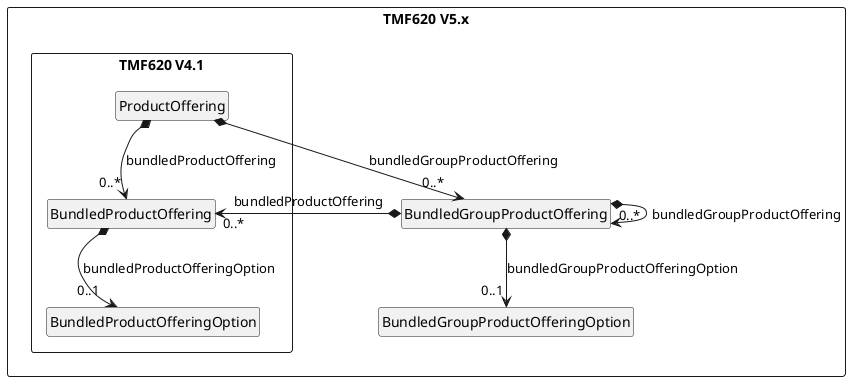

# Use Bundled Groups from TMF620 V5

* ID: ADR026
* Status: :accepted:
* Deciders: @hop @cgr @ncz
* Date: 2023-06-26
* Version: 1.0
* Category: Design

## Context and Problem Statement

PSID currently utilizes the TM Forum *Product Catalog Management API* as described in TMF620 V4.1.
Part of this is the *Product Offering* entity, which encompasses the option to define bundled offerings.
Up to version 4.1 of TMF620 these bundles are built from a list of offerings, where each list can have a min, max and default cardinality.

A disadvantage of this simple, list-oriented definition is the lack of an option to build selection groups with a cardinality - e.g. "the customer has to select exactly one of the offered terminals".
To address this kind of problems, TMF620 V5, which is currently in a pre-production phase, will introduce bundled groups with optional cardinalities on each of them.

## Decision Drivers

* Support of bundle groups including cardinality on group level
* Backwards compatibility
* Best possible compatibility with the upcoming version V5

## Considered Options

* Move to TMF620 V5 (pre-production state)
* Stay on TMF620 V4.1 and wait for the V5 release
* Utilize *ProductOffering.productOfferingRelationship* for a proprietary solution
* Patch *ProductOffering* of TMF620 V4.1 to support bundle groups on basis of TMF620 V5

## Decision Outcome

Chosen option: Patch TMF620 V4.1 *ProductOffering* based on TMF620 V5.

The review of the catalog data together with the providers revealed that selection groups / bundles are a common approach to structure the offerings.
However, the possibilities offered by TMF620 V4.1 are not sufficient to meet these requirements.

[TMF622 V5](https://tmf-open-api-table-documents.s3.eu-west-1.amazonaws.com/Beta/5.0.0/user_guides/TMF620-Product_Catalog_Management-v5.0.0.pdf) tackles the gaps of the list-oriented implementation.
Unfortunately, TMF620 V5 is currently in a pre-production phase with ongoing changes.
For this reason, it is not advisable to switch to V5 now.
But we could reduce updates to the important part only and pull up just the PSID *Product Offerings* from V4.1 to the latest state of V5.x.
This should keep the version used as compatible as possible with future updates.

The latest relevant changes in *Product Offering*, see [TM Forum Ticket AP-4271](https://projects.tmforum.org/jira/browse/AP-4271), introduced two new classes:

{#fig:tmf620_version_comparison}

The classes of V4.1 saw only very minor changes.
Only the optional associations from V4.1 classes to the new V5 classes were added.
This maximizes backwards compatibility.

Considering that PSID wants to stay close to the TM Forum standard and knowing that TM Forum will improve the schema in the upcoming version, PSID should follow this solution and avoid proprietary attempts.

## Compliance

The interface definition of *ProductOffering* as part of the *Product Catalog Management API* will be updated following TMF620 V5, complemented by the mock-up implementation.
The ICD documentation will reflect the improved schema.

## Implications for the Scope

The new TMF620 V5 approach of *BundledGroupProductOfferings* will improve the flexibility on how to group and structure offerings.
