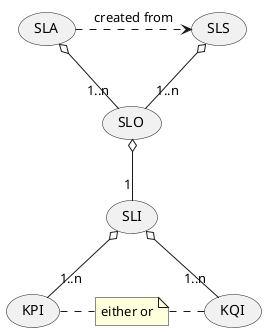

# Quality and Performance Management API

* ID: ADR027
* Status: :accepted:
* Deciders: @wr @cg @cgr @ncz @hop
* Date: 2023-07-10
* Version: 1.0
* Category: Design

## Context and Problem Statement

As part of the ongoing roadmap analysis for the second half of the project, *TMF657 Service Quality Management* was identified.
This API should implement the requirements for link status monitoring and for monitoring the service KPIs into the solution.
In the course of the analysis, however, it became apparent that these requirements break down into several problem domains, which only partially overlap.
In particular, it became apparent that the interface is not suitable to implement reporting and alerting.
Therefore, the requirements in this MADR were analysed again in order to find a more suitable solution.

### Definition of Quality Terms

In order to come to a decision, firstly, the terms have to be defined.

{#fig:quality_terms}

#### Key Performance Indicator - KPI

A KPI is a measurable and quantifiable metric.
KPIs can be a directly measured value, e.g., latency, packet loss, and throughput.
They can also be derived from multiple values, e.g., service availability over time.
They exist in the system and can be recorded by a data acquisition system into time series.
Their existence is not necessarily bound to a specific product or service.

#### Key Quality Indicator - KQI

A KQI is a measurable and quantifiable metric, similar to a KPI, but focused on the quality of service.
Usually, it is harder to quantify the quality than it is for the performance.
In contrast to the KPI, they are commonly bound to a specific product or service.

#### Service Level Indicator - SLI

An SLI is a metric definition of the performance of a service or a system.
It is a foundation for both SLOs and SLAs as they provide the quantitative measures used to evaluate service performance and reliability.
SLIs form the base of the hierarchy as they represent the raw data used to gauge service performance.
SLIs are usually bound to a KPI.

#### Service Level Objective - SLO

An SLO is an agreement **within** an SLS or SLA about a specific metric with a given value range, granularity, and/or domain.
Thus, SLOs set objectives for a service's performance.
In other words: SLOs build upon SLIs by setting specific, measurable targets for those performance indicators.

#### Service Level Specification - SLS

An SLS is a collection of SLOs that *can* be applied to a service.
They are part of the service specification and the basis for the SLA of a service instance.

#### Service Level Agreement - SLA

An SLA is a legal agreement between the business and the customer that includes a reliability target and the consequences of failing to meet it.
It is at the top of the hierarchy, incorporating multiple SLOs into a formal, legally binding contract that defines the expectations and consequences for both the service provider and the customer.

### SLI-SLO-SLA Interdependency

SLIs ensure that performance data is measurable and comparable through all providers, users, and other stakeholders of the system.
By setting specific standards and expectations for service performance and reliability, SLAs and SLOs help service providers prioritize and allocate resources.
They provide a clear understanding of what is expected of the service provider and what the consequences are if the agreed-upon standards are not met.
This allows service providers to allocate resources effectively to ensure that they meet the agreed-upon standards and avoid penalties or other consequences.
Additionally, SLOs help to prioritize and allocate resources to achieve effective capacity utilisation.

### SLO Compliance Monitoring

Some SLO parameters can be easily monitored for compliance, e.g., the connection status itself.
Many other SLO parameters are harder to monitor, e.g., if they are time-dependent.
Time-based SLO parameters are commonly used to measure the performance and reliability of a service, e.g.,

* **Latency**:  
  The time it takes for a service to respond to a request.
  This is often measured in milliseconds or seconds.
  An SLO for latency might specify that 95% of requests should be completed within a certain time frame, such as 100 milliseconds.
  
* **Uptime**:  
  The percentage of time that a service is available and operational.
  An SLO for uptime might specify that the service should be available 99.9% of the time within a given time frame, e.g., the contract's lifetime or mission time.
  
* **Time to recovery**:  
  The time it takes for a service to recover from an outage or incident.
  An SLO for time to recovery might specify that the service should be restored within a certain time frame, e.g., within 1 hour after firt notice, when an incident occurs.
  
* **Time to first byte (TTFB)**:  
  The time it takes for a client to receive the first byte of data from a server.
  An SLO for TTFB might specify that the first byte of data should be received within a certain time frame, such as 200 milliseconds.
  
It is obvious that not all time periods on which these parameters are based are deterministic.
Thus, a consideration of whether an SLO has been adhered to can only take place retrogradely after the specific time period is known.
For example, this can be the time frame around an incident or the mission duration.

For this reason, it makes sense for service providers to record the corresponding, required data "in stock".
The interface must allow access to this data, but not dictate the data recording itself.
The interface must allow reports on the SLIs of a contract over a specific period of time to be retrieved from the provider.

A clear and objective definition of SLI parameters is key.
Parameters that cannot be directly influenced by the provider should be avoided.

If, for example, a latency is defined as a "ping latency" on a certain server, it must be ensured that both provider and customer ping the same server.
This ensures that the same measurement value is described from the customer's perspective and the provider's perspective.
A latency to an external server, which may be measured by customers, can deviate considerably from the latency measured by the provider.
However, this is within the sphere of influence of the provider.

Of course, given the nature of a satellite link, not all of these parameters can be ruled out.

#### Monitoring and Reporting

Monitoring and reporting are two related, yet distinct concepts.
In summary, monitoring is the process of tracking and collecting data points to identify problems, while reporting is the process of organizing and presenting that data in a way that provides information over a greater time span.

##### Monitoring

* Involves collecting data points
* Lags behind the current value, especially on derived parameters such as link speed or latency
* Provides a data point for an aggregated time frame **relative to current time**, e.g., the last 15 minutes
* Monitoring **pushes** these values into a data sink, e.g., a database

##### Reporting

* Involves connecting data points (aggregation, mean, high/low etc.) over a **specific time frame**
* Reports usually in the shape of a table, graph, or chart
* Indicates / derives alerts or warnings **for a specific point in time** from the data points
* Usually, reports are **pulled** on demand from the data source

##### Alerting

* Capability of a monitoring system to detect and notify about meaningful events
* Detects deviation from baseline conditions
* Requires analysis of SLI actual values (KPI) and alerting threshold values (usually defined by the SLOs)
* **Pushes** an alert or warning to a user or connected system

### OSS/BSS and KPI Reflection

The existing Operations Support Systems (OSS) and Business Support Systems (BSS) of (Gov)SatCom providers already give a range of KPIs to help satellite communication companies track their performance and identify areas for improvement.
Such systems measure, e.g., raw signal characteristics, signal-to-noise ratio (SNR), and signal spectrum analysis of the carrier.
Thus, service quality indications can be **derived** from this monitoring.
This results in following types of KPIs:

* KPIs that are dictated by the existing OSS/BSS systems.
* KPIs that build on top of the KPIs given by the existing OSS/BSS systems.
* KPIs that are measured on demand only, because usually they are implicitly derived from the OSS/BSS system KPIs.

And example is "latency".
As long as the signal monitoring does not indicate a problem with the link, the provider will assume that the latency of the link is within limits.
But as soon as a customer complains about latency, the provider can measure the latency on the link.
This is done on-demand and not permanently, as measuring the latency creates unnecessary traffic on the link.
In this example, "latency" is a derived KPI in the general case, but can become a measured KPI.
The SLI will reflect that.
In the case that the customer complains about an SLO violation, the service provider will measure the true SLI actual value (the latency KPI) for this particular case.
But the latency KPI is not monitored all the time.
It's just assumed that it is within limits as long as other KPIs indicate a good link.

### Analysis and Break-Down

#### Subjects to Monitoring

The solution shall support service level agreements with key performance indicators associated for all ordered services between user organisation, the system and resource provider(s), i.e., which data has to be monitored.
This basically demands the common definition of SLIs by the governance authority.

#### Compensations

The solution shall have a method for compensating the user organisation for breaches of mutually agreed SLAs.
Applying the assumptions that

* The PSS implementing PSI is an ideal system and
* PSI is an enabler

this demands SLOs and SLIs to be in place.
This is enabled by an API to request reports on SLOs from the providers.

#### Coordination

The solution shall coordinate the monitoring of the key performance indicators between user organisations, the system and resource providers. That is, a method has to be implemented by the solutioin that allows monitoring the SLI actual value (KPI) vs the concrete thresholds defined by the SLOs.
To enable this, the system has to have a governance interface for defining SLIs and an API to request reports over SLOs from the providers.

It is important to understand that not all SLIs can actually be measured directly by a provider (see *OSS/BSS and KPI reflection*).
Also, not all of them are available in time series, because they depend on other factors.
For example, a provider can only monitor the signal/noise level, transmit and receive signal strength as well as the general connection to external networks and derive parameters such as logical bandwidth, latency and jitter from these - using static parameters (see *Key Performance Indicator - KPI* on derived KPI and *OSS/BSS and KPI reflection*).
PSI cannot enforce the existence of a KPI in an existing OSS/BSS systems but rather have to use what they expose.
At this point, we are therefore talking about coordination, not actual data acquisition.

The system should only guarantee that, if necessary, corresponding reports on the KPIs can be delivered by the providers.
Such reports must meet the aforementioned definition of SLI and SLO.

However, the system does not have to manage the collection, aggregation, and reporting of this data itself.

#### Logging of SLA Breaches

The solution shall log any breach of service level agreement and take appropriate actions.
That is, the system is not only responsible for the coordination of the monitoring, but also for an actual logging and reaction *within* the system if an SLO is violated.
Thus, at least some information needs to be made available to the PSS.
A mere orchestration of the responsibility is therefore not sufficient.

#### Link Recovery

The solution shall be able to offer a link recovery function to restore any interrupted communication link and shall ensure that broken links shall be restored within a maximum pre-agreed delay time per service grade.
This recovery can be conducted via the PSS; the information on corruption of communication links however needs to be made available to the PSS and relates to the SLOs between provider and customer.

#### Alerting

The solution shall request that resource providers inform the system on the status of the link for all active services, i.e., **alerting** of SLO compliance (and/or deviation).
Additionally, this imposes that the actual data shall be requested from the owner of the data (the provider).
That is, the system shall not request and aggregate all possible data by itself but rely on the provider's system to monitor and alert.

#### Link Status

A common SLI "link status" with the following value domain should be imposed:

* **nominal**:  
  Definition: with the current monitoring granularity, all SLI actual values (KPI) are within the boundaries of their SLOs.  
* **reduced (due to contention policy)**: 
  Definition: with the current monitoring granularity, some SLI actual values (KPI) reach the lower threshold of the boundaries of their SLOs.  
  They may even peak below their SLO boundary, but the SLA is not violated.
* **downgraded (due to external factors like interference or rain)**:  
  Definition: with the current monitoring granularity, some SLI actual values (KPI) are outside the boundaries of their SLOs, but the service is still running.  
  Continuous operation in this state will violate the SLA.
* **broken (service is disrupted)**:  
  The service is unavailable.  
  Continuous operation in this state will violate the SLA.

This "link status" is a derived value that depends on various parameters and can also only be formed by considering the SLOs and the period under consideration.
Link status is therefore a compound KPI that can be formed for a given service and a mandatory SLI for every service.
It expresses the quality of the link.
The link status has to be **pushed** to the system by the provider.
It's therefore an alerting rather than a monitoring.

#### Jamming

Jamming attacks could be conducted on single channels as well as multiple channels.
The attack might be automatically mitigated on the provider's side by failover.
Although anti-jamming measurements are to be implemented on the provider's side, a PSS should be enabled to handle information related to jamming attacks or anti-jamming mitigations, if provided by the providers.
Thus, the API should enable the forwarding of such information.
As outlined above, the link status monitoring enables to spot faulty links and thus the forwarding of such information is enabled.
The actual enforcement of anti-jamming measurements has to be done by the governance of a PSS.

## Decision Drivers

* Compatibility with TM Forum
* Acceptance by providers
* Extensibility to future scenarios like hubs

## Considered Options

Prerequisite for any solution is the definition of proper SLIs by the governance and sharing them with the providers.
Unlike a single provider quality management application, all parties involved in a system must be aligned to a set of SLIs.
Providers could match the SLIs to their internal KPIs or even evaluate the creation of new performance indicators based on the provided SLIs.
An API for this definition and sharing of SLIs needs to be created from scratch because it is not supported from TM Forum APIs.

* **Option A**:
  Specific implementation in PSI, based on *TMF657 Service Quality Management*.  
  This solution would pull any possibly SLI actual value (KPI) from the resource provider into the connected PSS.
  The PSS can use internal calculations to monitor deviations, raise alerts, and indicate statuses.
* **Option B**:
  Usage of *TMF628 Performance Management* for Reporting and *TMF649 Performance Threshold* for Alerting by utilizing *TMF642 Alarm Management API* and *TMF657 Service Quality Management*.  
  This solution would obligate the connected OSS/BSS of the provider to calculate deviations and link status and push them to the PSS.
  The original monitoring data would stay at providers side.
  In addition, the PSS can request reports and status data on demand.
* **Option C**:
  Usage of *TMF657 Service Quality Management* and *TMF642 Alarm Management API* only.
  This solution is possible due to adaptions from V5.0 of *TMF657 Service Quality Management*.
  It needs to be investigated if the functionality is reduced compared to Option B.

Additional comments:

* Independent of the chosen option, *TMF623 SLA Management* needs to be investigated and implemented to complement the SLI on the offering level.
* If the candidate requirement P&S_045 ("The solution shall be able to inject management traffic to check the connectivity status for all the user missions deployed when agreed by the user organisation (e.g. ping).") shall be considered, *TMF653 Service Test Management* needs to be implemented.
* *TMF657 Service Quality Management* is currently under major revision by the TM Forum API group.
  Some of these changes are already considered for the PSI version of the API.
  However, Version 5.0 is not yet in the preproduction stage, thus they might be subject to change, making a revision of the API in the future necessary.
  Nevertheless, they are considered so valuable, that this is accepted.

## Decision Outcome

Note that this decision was accepted during the MS5 review meeting.
However, the final decision was further postponed and work on this topic was put on hold as decided during the sprint review meeting for sprint 35 on 2023-09-20.
There was an ongoing TM Forum Catalyst project by SES [*Open (Gov)SatCom management*](https://www.tmforum.org/catalysts/projects/C23.0.579/open-satcom-management) that will most likely have impact on the design of the interfaces and the API.

**Choose Option B** because large parts of the requirements - given the definitions in this MADR - are covered from TM Forum APIs standard.

Based on the analysis, it would not be meaningful and in some cases not possible to monitor all SLI-relevant actual data.
The solution delegates monitoring and reporting to the OSS/BSS of the providers' system.

Still, it ensures compliance via the governance definition of minimal SLIs and the obligation to push the system status and provide reports on demand.
In summary, this option incorporates:

* Definition of SLIs by the governance (new API).
* Sharing the SLIs (see [Asynchronous Workflow Approach](ADR014-asynchronous-workflow-approach.md)) with all providers.
* Definition of alerts based on the predefined SLIs by utilizing *TMF649 Performance Threshold*.
  Due to the decentralized processing on the systems of the providers, this requires sharing of the definition with the addressed provider.
* Transfer of alerts with the help of *TMF642 Alarm Management* from provider's systems to PSS with a proper link to the referred entity.
* Definition of reports based on the predefined SLIs with the help of *TMF628 Performance Management*.
  Due to the decentralized processing on the systems of the providers, this requires again sharing of the definition with the addressed provider.
  Reporting jobs include a *retention duration* until when the result can be retrieved. As an alternative *ad-hoc collection* allows requesting spontaneously a set of data.
* Utilisation of *TMF657 Service Quality Management* to define and share SLOs and SLS through the provider to customers.

## Compliance

*TMF628 Performance Management*, *TMF649 Performance Threshold*, and *TMF642 Alarm Management* are (as they are) only *partially* compliant with the requirement set.
All these TM Forum APIs lack a proper tracking to resources and services.
Therefore, a patched version has to be created that allows a link to contracts, resources, and parties.

The data exchange shared entities with providers' systems is done with the help of the PSI events (see [Asynchronous Workflow Approach](ADR014-asynchronous-workflow-approach.md)).

The SLI definition API has to be created from scratch.
The definition of proper SLIs by the governance is key to requirement compliance, though this cannot be enforced by the solution.

Additionally, the inquiry API *PSI001 Customer Inquiry* shall be updated to allow the customers to inquire about SLOs that flow down into the final SLA.

## Implications for the Scope

Direct injection of data into the stream by the PSS is an additional security risk.
However, a process to request or enforce a measurement of KPIs/KQIs on demand can be investigated further.

KPIs/KQIs can be compared with SLOs, however, they need to be measured and provided by the CSPs.

The systems needs to access defined SLOs and SLIs and enable mitigations. The APIs enable an exchange of corresponding data, i.e., definitions of SLI/SLO parameters and the definition of the consequences of their deviation.

For the coordination, the system needs access to the KPIs/KQIs.
The discussed APIs enable an exchange of the corresponding data.

The link status, being monitored, is driving the PSS-internal process of recovering a broken communication link.
Thus, if the service includes continuous monitoring, the APIs enable a process to monitor it.

The link status is an aggregated KPI.
If the service includes a continuously monitoring, the discussed APIs enable a process to monitor it.

If the PSS is able to do a continuously monitoring of the link status, the mapping to the four states is also possible.

The interface allows setting the link status (nominal, reduced, downgraded, broken) via API to spot faulty links.
Thus, the interface is to be understood as an enabler for security aspects, not enforcing such for a PSS connected to it.
