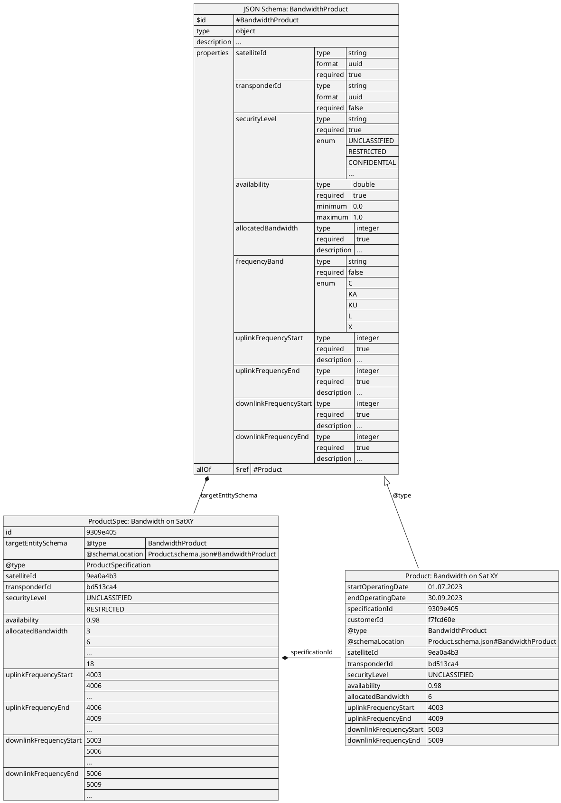

# Improve Definition of Product Types

* ID: ADR029
* Status: :accepted:
* Deciders: @cgr @hop @ncz
* Date: 2023-08-24
* Version: 1.0
* Category: Design

## Context and Problem Statement

While investigating the "Change Order" workflow, it became apparent that the current focus of the model on "features" may not be sustainable in the used form.
They are only available in the service and resource layers, but not for products and offerings, making it impossible to change them directly.
On the contrary, the owner of TMF620 "Product Catalog" explicitly [stated](https://engage.tmforum.org/communities/community-home/digestviewer/viewthread?GroupId=31&MessageKey=6922f501-6d03-4b3b-bf2a-ff09f6a50026&CommunityKey=d543b8ba-9d3a-4121-85ce-5b68e6c31ce5) that features are not meant to be used in products, because add-on offerings are better to model those cases.

> "1. Feature entity on Product CatalogTMF620 -  
> Hi All,    
> Is there a plan to add FeatureSpecification and related entities to Product Catalog?
> Thanks in advance.",  
> Serkan Kaya, 25th April 2022 [^1].  
>
> "2. RE: Feature entity on Product CatalogTMF620 -  
> There are currently no such plans.
> Do you think that there is a business jsutification for this at a product level?
> Seemingly a feature at product level would be modeled as an add-on product offering and spec, since it probably comes with pricing implications.",  
> Jonathan Goldberg, 26th April 2022.[^1]

This also implies that our current interpretation of features is wrong, which is seconded by another [community thread](https://engage.tmforum.org/discussion/characteristics-vs-features-sid-open-api-alignment) about their intended usage as "optional configuration of a service/resource", whereas we assumed it is some kind of capability.

> "2. RE: Characteristics vs Features - SID & Open API Alignment -  
> Hi Srinivas  
> Features were introduced into the Open API **Resource** models (catalog and inventory), I think originally by @Vance Shipley, to give a more intent-focused interface as against individual characteristics.  
> Later, they were added also the Open API **Service** models.
> It's an implementation choice whether to use Characteristics or Features for any particular functionality.  
> Hope it helps.",  
> Jonathan Goldberg, 31st July 2022.[^2]

Overall, it came apparent that the PSS needs to have at least basic knowledge about the product, service and resource types it deals with.
This will allow it to define a logic on how product characteristics are translated into services and resources.
We have to examine how to allow a stricter definition of those types without sacrificing the flexibility of the interface to adapt to different implementations.

[^1]: [TM Forum - Community Thread: Feature entity on Product CatalogTMF620](https://engage.tmforum.org/communities/community-home/digestviewer/viewthread?GroupId=31&MessageKey=6922f501-6d03-4b3b-bf2a-ff09f6a50026&CommunityKey=d543b8ba-9d3a-4121-85ce-5b68e6c31ce5) (last viewed on 7th March 2024)
[^2]: [TM Forum - Community Thread: Characteristics vs Features - SID & OpenAPI Alignment](https://engage.tmforum.org/discussion/characteristics-vs-features-sid-open-api-alignment) (last viewed on 7th March 2024)

## Decision Drivers

* Suitable to model the already included examples
* Suitable for automatic and manual matchmaking
* Changeable via product order

## Decision Outcome

First, we step back from using features as "capabilities" as done before.
They may still be used in the intended way of "optional configuration" if needed, but this is out of scope for this decision.

This of course requires a definition of an alternative concept.
TM Forum provides such a concept, which is usually complementary to our current characteristic-based approach: [JSON Schemas](https://json-schema.org/).
Refer to the documentation of the catalog APIs for more information on the intended use of it, as the following description deliberately deviates from this in some aspects to combine both.

With this new approach, the PSS manufacturer (a software team or company responsible for the implementation, not necessarily operations or governance) is the first instance to define which types of products, services and resources are supported by the PSS.
They do so by defining a JSON Schema for each supported entity type, which contains a fixed list of supported characteristics and their data types.
The produced file shall be provided to providers via HTTP as part of the PSI implementation, but can also be sent via e-mail.
The provider then uses this definition to build resource, service and product specifications.
This process is simplified by the machine-readable format.
Additionally, the governance may provide more concrete templates for services and resources via `TOD-04`.

An example of how the JSON schema can be applied to a bandwidth product is shown in {@fig:json-schema}.

{#fig:json-schema}

In the specification, we still use the characteristic array as we did before, but use the defined attribute names as `id`s.
This allows the provider to send additional information if desired, which may still be accepted by the PSS for later use (e.g., to display it in a simple "product detail" list).
The schema name and location are transmitted via the `targetEntitySchema` attribute, which can also be used to query specifications of a specific type.

The inventory instance will store the actual values in custom fields instead of characteristics, making access to them easier and compliant to the JSON Schema.
In this entity, the schema name is defined in `@type` (while `@baseType` is still `Product`, `Service` or `Resource`), the location in `@schemaLocation`.

## Compliance

Since this is a far-reaching change in concept, multiple things will be adjusted in separate backlog tasks:

* Update of the documentation (mainly TAD and ICD)
* Update of the Inquiry API
* Implementation in the mock-up
  * Creating the JSON schemas for the "common denominator" of entities
  * Adapting unit and integration tests
* Bundle the JSON schemas in a new annex of the ICD as an implementation reference
* Update of the converters

## Security Considerations

The schema definitions expose implementation details of the PSS and must be protected from unauthorized access.
However, this is already covered by the generic "data visibility" chapter of the ICD.

## Implications for the Scope

The schema contains all available types as well as all static and dynamic fields for a type.
It can be given to users and providers for them to fill it.
The PSS can compare the specification against the specified schema.
