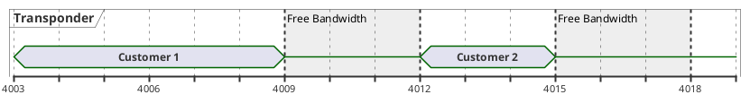
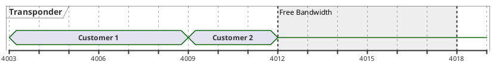
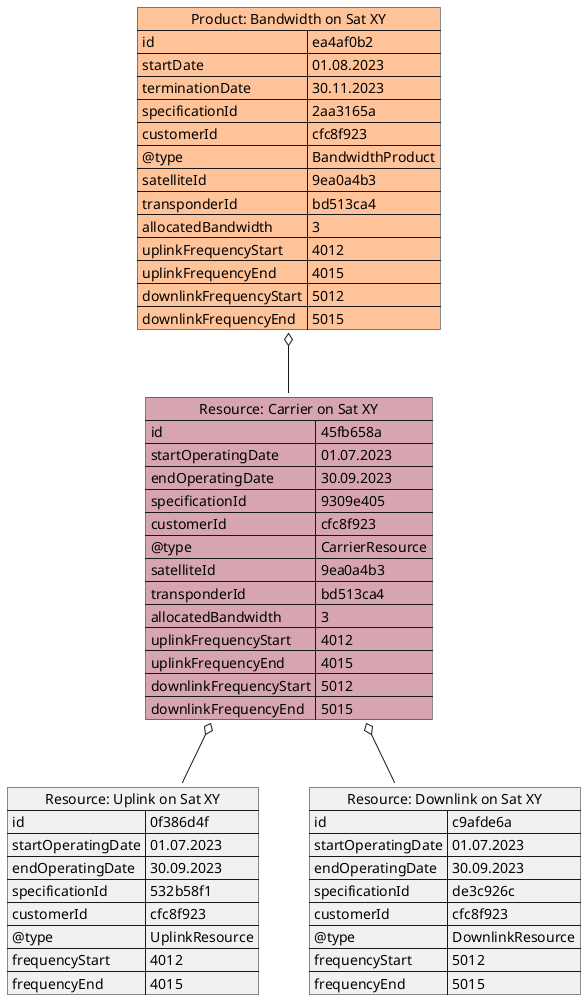
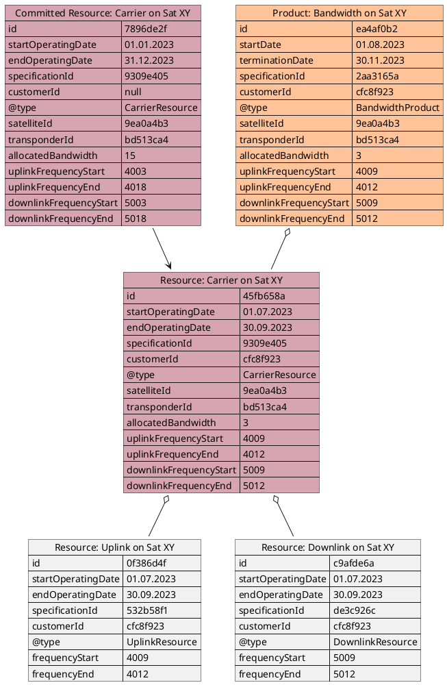
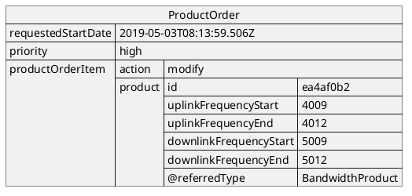

# Bandwidth (De-)Fragmentation

* ID: ADR030
* Status: :accepted:
* Deciders: @cgr
* Date: 2023-08-25
* Version: 1.0
* Category: Design

## Context and Problem Statement

When bandwidth is sold in chunks, over time it will probably end up fragmented.
An example of a fragmented frequency band is shown in {@fig:fragmented-bandwidth}.

{#fig:fragmented-bandwidth}

In theory, there are 6 MHz left for a third customer to use, but because of fragmentation it can not be fully utilized.
We have to analyse if a defragmentation as shown in {@fig:defragmented-bandwidth} is already supported by PSI or if further extensions have to be made.

{#fig:defragmented-bandwidth}

## Decision Outcome

The defragmentation of bandwidth lies in the responsibility of the resource owner, which can be either the PSS (for committed resources) or the provider.
It could be done automatically (for managed services), but may still require manual intervention to evaluate the impact on active connections and the resulting legal and financial risks.
While the latter is out-of-scope for this project, PSI does already support the necessary communication between the systems to synchronize the configuration changes.

The following subsections describe the information flow and subsequent model changes depending on the initiator.

### Initiation by the Provider

In case of uncommitted resources, the PSS inventory contains only the two booked chunks of bandwidth as shown in {@fig:pss-inventory-before-defrag-by-provider}.

{#fig:pss-inventory-before-defrag-by-provider}

After checking the technical and legal feasibility, the provider can decide to move the bandwidth "Customer B" to 4009-4012 MHz (downlink alike) as shown in {@fig:pss-inventory-after-defrag-by-provider}.
The BSS/OSS then invokes the operation TOD-05-01-02 (`PATCH /resourceInventory/v1/resource/{id}`) on the PSS, sending the new feature characteristics in the request body.

{#fig:pss-inventory-after-defrag-by-provider}

### Initiation by the PSS

If a resource is committed, it has a dedicated entry in the inventory resembling the full frequency range.
This allows the PSS to perform defragmentation on its own in the given boundaries.
An example for an initial state *before* defragmentation is shown in {@fig:inventory-before-defrag-pss}.

{#fig:inventory-before-defrag-pss}

The PSS governance may perform the same manual checks as the provider above, but may also employ automatic defragmentation algorithms.
Since it has no direct control over the service or resource, it requests the changes by sending product orders with action "modify" via operation TOD-03-02-01, see {@fig:product-order-with-modify}.
Note that by using the `requestedStartDate` property may be used to plan the migration path for multiple chunks in a defined order.

{#fig:product-order-with-modify}

The provider then handles it like any other change request (e.g., from the customers themselves) and either carries it out or rejects giving the reasoning.
On acceptance, the updates of the inventory are then performed exactly like shown in the previous example.

## Compliance

Configuration changes will be included in the case study, hinting at the possibility that defragmentation can be a reason to trigger them.

## Implications for the Scope

The described workflow can be used by the customers themselves (through the PSS) to request changes to any other characteristic.
