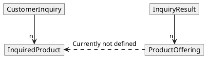
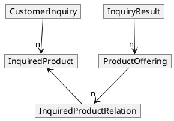
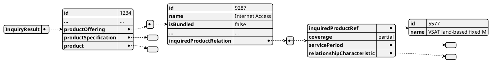
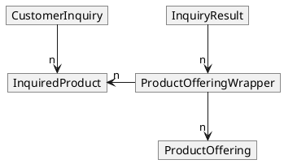
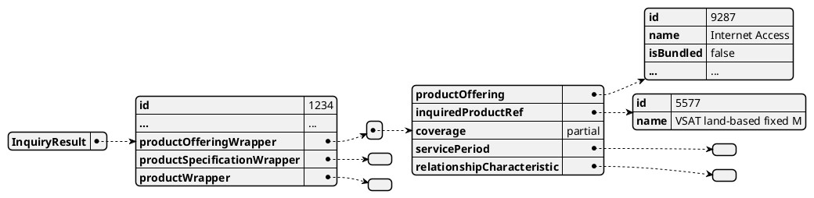
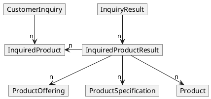
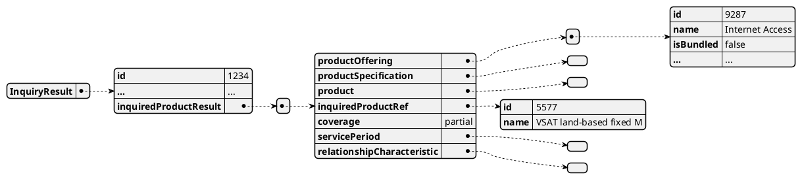
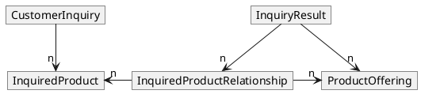
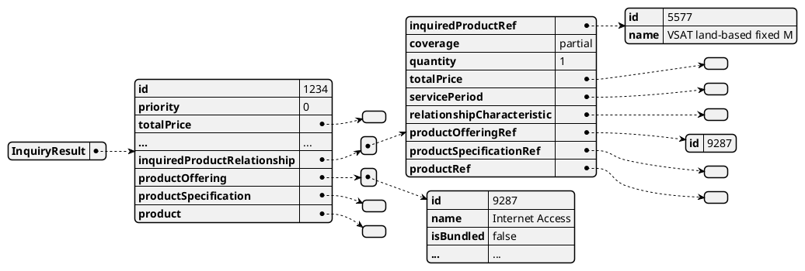

# InquiredProduct-InquiryResult Relation

* ID: ADR036
* Status: :accepted:
* Deciders: @ncz, @cgr, @ths
* Date: 2024-05-21
* Version: 1.0
* Category: Design

## Context and Problem Statement

The CustomerInquiry API allows requesting multiple products at once, e.g. Internet Access at different locations.
In these cases, it may return a result with multiple ProductOfferings, e.g. one for each location.
However, the customer cannot determine which offering belongs to which location.

Figure {@fig:current-situation} describes this situation based on the ProductOffering array.
Parallel to ProductOffering, the ProductSpecification and Product arrays are also available in InquiryResult.
For the sake of simplicity, these additional entities have been omitted from the diagrams.

{#fig:current-situation}

Furthermore, it is necessary to exchange additional information about the relationship, such as a rating of the match, the offered service period, etc.

### Scenarios

Depending on the number of InquiredProducts requested and the number of ProductOfferings received, different situations arise.
Some of them do not need any further explanation, but if the cardinality of one side differs from "1", explicitly defined relationships are required.

#### Scenarios with Implicitly Known Relations

Following scenarios have either a single InquiredProduct or a single ProductOffering, which directly defines the relationships.

{#fig:rel-1-to-n}

{#fig:rel-n-to-1}

#### Scenarios requiring Explicit Definition of Relations

The first scenario that requires a relationship is about *2..n* InquiredProducts that results in only one ProductOffering, but with a quantity > 1.
The difference to the example above is that this single offering is used not just once, but several times for independent order items - to take the differences of the InquiredProducts into account.

For example, a customer could request the same Internet access at different locations.
An appropriate outcome of this request could be a single offering with a service area that covers the requested locations.
However, multiple instances of the offered product are needed (e.g. due to the different location, date rate, etc.).
This results in the same offering being ordered twice or more.

{#fig:rel-n-to-1x}

And finally several InquiredProducts that need to be mapped to several offerings.

{#fig:rel-n-to-m}

### Relationship Enrichment

It can also be useful to use these new structures to facilitate the exchange of additional information about the relationship.
This could include:

* `coverage` - is the InquiredProduct a full or a partial match?
* `servicePeriod` - offered by the provider, which could differ from the inquiry
* `relationshipCharacteristic` - e.g. a restricted or improved characteristic
* `totalPrice` - on InquiredProduct level

It should also be noted that the calculation of the total price at the InquiryResult level could get complex.
For example, prices can refer to one or more time periods, possibly with different discount.
To avoid any problems, the total prices should be calculated and provided by the provider, too.

## Decision Drivers

* Reduction of data duplication.
* Best possible compatibility of ProductOffering for future updates based on TM Forum improvements.
* Backwards compatibility.

## Considered Options

* Extending PSID620_ProductCatalog
* Extending PSID001_CustomerInquiry by *Wrapper* Objects per `productOffering` (including `productSpecification` and `product`)
* Extending PSID001_CustomerInquiry by an additional entity (`InquiredProductRelationship`) with InquiredProduct and ProductOffering references

### Extending PSID620_ProductCatalog

The ProductOffering, which is part of PSID620 ProductCatalog, is already used as an array in the InquiryResult.
An array of entities could be added in ProductOffering that includes:

* an array of InquiredProduct reference in the existing ProductOffering
* further details as described above (`servicePeriod`, `totalPrice`, characteristics as restrictions, ...)

{#fig:productoffering}

An example of the enhanced ProductOffering with enrichment fields could look like this:

{#fig:productoffering-objects}

The same enhancement would be necessary for ProductSpecification (PSID620-ProductCatalog) and Product (PSID-637-ProductInventory).

### Extending PSID001_CustomerInquiry by *Wrapper* Objects

A single InquiryResult object consists in general of an ID, a ProductOffering array and/or a ProductSpecification array or a Product array.
A wrapper could be added for each of the ProductOffering, ProductSpecification and Product.
Each of the wrapper is then referencing the InquiredProduct.
Please note that ProductSpecification and Product entities have been omitted from the diagram for the sake of simplicity.

{#fig:productofferingwrapper}

An example of the ProductOffering wrapper with enrichment fields could look like this:

{#fig:wrapper-objects}

Or a new InquiredProductResult entity could collect the ProductOffering, ProductSpecification and Product together with the additional details:

{#fig:inquiredproductresult}

The structure of the InquiredProductResult could look like this:

{#fig:single-wrapper}

### Extending PSID001_CustomerInquiry by an `InquiredProductRelationship`

Another option would be to keep the existing structures and add a new entity `InquiredProductRelationship` in the InquiryResult.
This new entity refers to local ProductOfferings and the related InquiredProduct entries.

{#fig:inquired-product-relationship}

  With the above-mentioned fields, the Structure of the `InquiredProductRelationship` could look like this:

{#fig:inquired-product-relationship-json}

## Decision Outcome

It was decided to go for the *Extending PSID001 CustomerInquiry by an `InquiredProductRelationship`* proposal, as it reduces data duplicates and avoids changes to data structures originating from TM Forum.

## Compliance

The interface definition of the CustomerInquiry as part of the Product Catalog Management API will be improved.
The ICD documentation will reflect the improved schema.

## Pros and Cons of the Options

### Extending PSID620_ProductCatalog

To be more precise, this approach requires extensions for three different entities:

* ProductOffering in PSID620 ProductCatalog
* ProductSpecification in PSID620 ProductCatalog
* Product in PSID-637-ProductInventory

All three entities will be extended by a reference to the InquiredProduct plus all additional details like `servicePeriod`, `totalPrice` and more.

* Good, because the relation is directly available when accessing ProductOffering/Product/ProductSpecification of the InquiryResult.
* Bad, because it requires the same adjustment for three different entities: ProductOffering, Product and ProductSpecification
* Bad, because the three PSI entities to change are directly derived from TM Forum, which will complicate future updates.
* Bad, because in case that more than one of ProductOffering/Product/ProductSpecification is provided, all related data has to be repeated.
* Bad, because in case of n..m dependencies (InquiredProduct <-> InquiryResult), all related data has to be repeated.
* Bad, because data duplication always involves the problem of data inconsistencies and the effort to deal with it.

### Extending PSID001_CustomerInquiry by *Wrapper* Objects

A wrapper for each of ProductOffering, ProductSpecification and Product could be added.
Each of the wrappers is then referencing the InquiredProduct.

* Good, because the InquiryResult is directly bound to the related ProductOffering/Product/ProductSpecification.
* Good, because the enrichment data is relation type specific.
* Good, because it doesn't touch TM Forum based entities.
* Bad, because it requires the same adjustment for the three different entities: ProductOffering, Product and ProductSpecification
* Bad, because the schema changes are not backwards compatible.
* Bad, because of possible data repetition for either repeated references, either ProductOfferings, Product or ProductSpecification, or combinations of the three.

A variation of the wrapper approach is the InquiredProductResult solution, which joins the three different wrappers into one.
This raises additional issues:

* Good, because it reduces the amount of new wrapper entities and references
* Bad, because the references with the enrichment data have to fit for all entities (ProductOffering, Product and ProductSpecification).
  This situation might require additional methods of resolution and possibly more data duplications.

### Extending PSID001_CustomerInquiry by an `InquiredProductRelationship`

This solution keeps the existing structures by adding one additional entity in InquiryResult that manages the enrichment data based on references to InquiredProduct and to ProductOffering/Product/ProductSpecification.

* Good, because it provides maximum flexibility (allows all combinations of ProductOffering/Product/ProductSpecification; enrichment data is relation specific, etc.).
* Good, because it allows reducing data duplication: it adds the enrichment data based on the combined reference IDs (e.g. InquiryResult ID + ProductOffering ID -> enrichment data).
* Good, because it doesn't touch TM Forum based entities.
* Good, because this interface supports backward compatibility.
* Bad, because the approach is somewhat complex at first glance due to the parallel entity (for example, accessing the referenced ProductOffering is only possible via the parallel, but local array).
