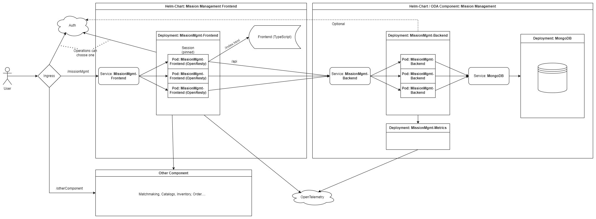

# Mission Component Scope

* ID: ADR038
* Status: :accepted:
* Deciders: @cgr @ncz
* Consulted: @hop
* Date: 2024-11-25
* Version: 1.0
* Category: Architecture

## Context and Problem Statement

We want to create an ODA component for the newly developed Mission API to enable faster acceptance.
Additionally, a prototypic Web-UI should demonstrate its capabilities and the possible integration into a PSS.
This decision record defines the functional scope to be achieved and outlines the envisioned technical architecture.

## Decision Drivers

* Compatibility with ODA
* Integration into an imaginary PSS
* Security by design (including multi-tenancy)

## Decision Outcome

The scope of the backend is mostly defined by the definition of an ODA component by TM Forum, which implies the use of Kubernetes and therefore allows for high availability setups.
The "core function" of it must be a microservice implementing the Mission API, i.e. providing the given REST endpoints to create, list, modify and delete missions.
Except for input validation, there will be no business logic implemented.
Additionally, the component will contain the necessary storage backend and outgoing telemetry.

As for the security functions, it was decided to implement JWT-based access control directly into the microservice.
The identity provider should be configurable, because it is out of scope from a specific component.
For multi-tenancy, the JWT-claim (attribute) to be used to identify the owner and other parties with access permissions of a mission should be configurable as well.
While it is possible to implement the corresponding checks in an additional microservice, it makes pagination much harder and the added complexity leads to an operational overhead that seemed unreasonable and is a potential risk to data confidentiality.
Optionally, it should be possible to deactivate internal JWT validation to have a similar behaviour as the reference implementations.
This could be useful, if the operator uses other means to protect access to the backend.

While the microservices above form "the ODA component", the work package also includes an exemplary/generic UI for it.
This could be integrated as an optional microservice as part of the component.
However, the reference implementations are API-first and do not contain UIs.
It is understood that this stems from the much higher customization of such a UI, which makes a production use of it unlikely.
That is why it will be delivered in a separate package that can be combined with the backend or used as an inspiration for a custom implementation.
Note that the UI will probably not be able to showcase the full potential as described in the GID.

Figure {@fig:mis-component-arch} shows the logical overview of the envisioned architecture.
As required by the ODA Canvas, it is based on Kubernetes with Helm as a package manager.
The K8s Ingress accepts the incoming traffic from Users and maps one sub-path to the Mission Management frontend, which is implemented by an OpenResty web server.
OpenResty is derived from NGINX and serves the statically compiled files for the UI itself, but also acts as a reverse-proxy for the backend API.
This allows it to store the JWT in a local session, which increases security by not sending it to the potentially unsafe browser.
When the frontend needs to call any backend, including the Mission Management backend or for example the Inquiry API, it will do so through the reverse-proxy to ensure authentication.
The operator can choose to expose the backend directly via a separate Ingress endpoint to allow machine-to-machine communication.

{#fig:mis-component-arch}

## Compliance

Tasks to create the described items will be added to the backlog and planned for the next sprints.
The TO will govern the implementation of the given architecture.
