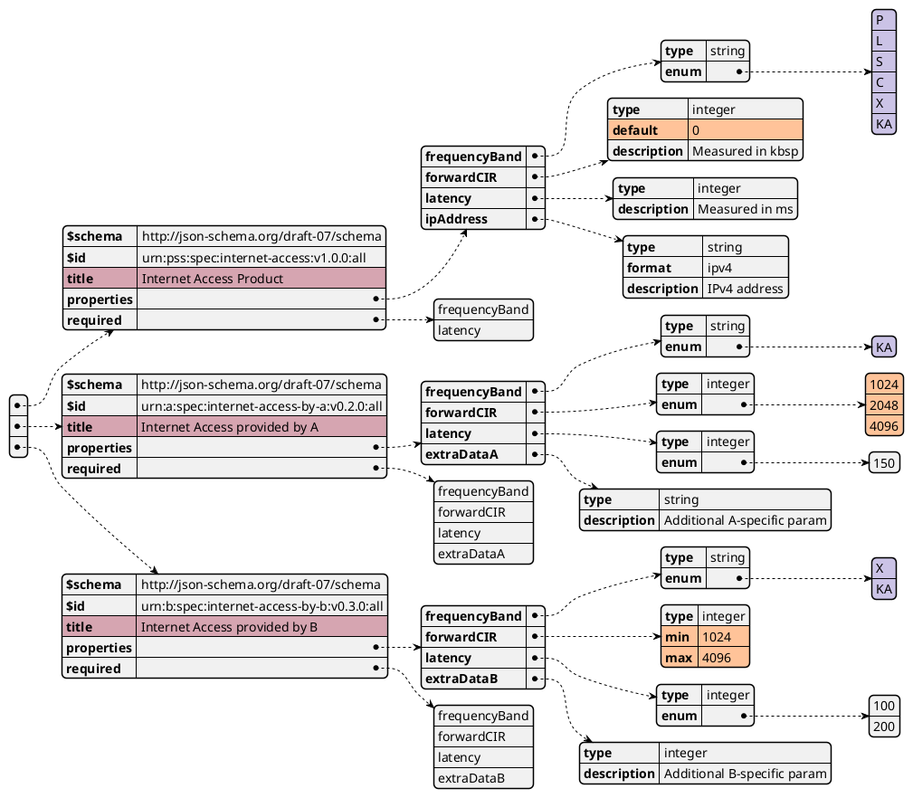

# MEF Convergence

* ID: ADR041
* Status: :accepted:
* Deciders: @cgr @hop
* Consulted: @mza
* Date: 2025-02-04
* Version: 1.0
* Category: Architecture

## Context and Problem Statement

MEF is a global industry association which started with the standardization of terrestrial Ethernet and expanded its scope to cover other forms of connectivity services, too.
Like PSID, their APIs (called Lifecycle Service Orchestration - LSO) are based on TM Forum and introduce several enhancements.
The goal of this decision record is to evaluate possible ways to leverage synergies and improve PSI.
In particular, it concerns two aspects:

* **LSO Payload definitions**\
  APIs in TMF, PSI and MEF only define an "envelope" for the data.
  MEF also defines schemas for products and services, called "payload", to be used with those APIs.
  The concept is similar to the schemas that are contained in the annex to the PSI-ICD.
* **Product Offering Availability And Pricing Discovery Management API**\
  This API allows a buyer (customer or PSS) to submit a Product Specification to a seller (PSS or provider) and to receive a list of zero or more Product Offerings.
  It therefore offers a similar functionality as the PSI Customer Inquiry API.

## Decision Drivers

* Improve PSI schemas and APIs
* Improve interoperability between
  * systems implementing MEF, PSI and TMF
  * terrestrial and SatCom providers
* No regression of existing functionality

## Considered Options

* For LSO Payload definitions:
  * Stick to the TM Forum approach with characteristics, enhanced by PSI guideline schemas
  * Make coherent use of TM Forum's schema-based modelling
  * Switch to the MEF approach
  * Make a new hybrid setup
* For Product Offering Availability And Pricing Discovery Management API:
  * Merge the two APIs
  * Align them so that they might be merged in the future
  * Keep them separated

## Decision Outcome

Chosen option: Gradually converge schemas and catalogs towards MEF over the next releases, but keep POA/PDM API and Inquiry API separated.
Please refer to the following sections for details.

### Source Schemas

Source schemas are provided by MEF for a wide range of products.
The concept is similar to the schemas that are contained in the annex to the PSI-ICD:
Each one defines possible (and sometimes required) attributes of a certain product type.
This allows the PSS to define what can be shared on the platform and leads to comparability between the providers.

From the currently available schemas, the "Internet Access" type is the only common one.
The result of the comparison between the MEF and PSI-ICD "Internet Access" schemas is:

* Most PSI fields are contained in the MEF schema as well:
  * Uplink/Downlink information rates are defined in `BasicIaBwpEnvelope` as "ingress" and "egress" bandwidth profile
  * Latency is defined in\
    `serviceLevelSpecification.oneWayMeanPacketDelay.meanPacketDelayObjective`
  * Availability is defined in `serviceLevelSpecification.serviceUptime`
* Some SatCom-specific fields are missing in MEF:
  * Frequency Band
  * Service Area (GeoJson)
* MEF defines additional fields:
  * Some may be used in SatCom as well and could therefore be adopted
  * Others are not applicable and could be removed

As a first step, we decide to derive a new "Internet Access" schema from the MEF definition.
We will remove non-applicable fields and add the SatCom-specific ones.
Doing so, we enable the customer to request terrestrial and satellite connection in a very similar way or even request such a service without specifying the technology.
Providers adopting PSI will be able to easily communicate with providers already using MEF and vice versa, e.g., for multi-modal services.
If necessary, TM Forum adapters can easily be implemented as well.

MEF does not support any product types similar to raw bandwidth services and terminal resources.
Therefore, we will re-create our existing schemas to resemble the same structure.
Additional input that we received since the initial definition may be used to improve them at the same time.

### Intermediate and Contextual Schemas

When it comes to application of a schema, the approaches of MEF and PSI differ more:

* PSI uses the schemas as reference to fill characteristics of a TMF product, service or resource specification.
  The providers create those specifications to tailor their specific products. Customers can create inquiries and orders based on them.
  All those entities refer to the same schema that is maintained by the PSS.
* In MEF, intermediate or contextual schemas are derived from the source schema.
  This schema can introduce constraints (e.g. on the minimum and maximum information rate), remove optional fields or add new fields.
  Product specifications, offerings and orders do not contain characteristics, but reference a derived schema.

Figure {@fig:derived-schemas} shows an exemplary product catalog with the source schema at the top and two products (of different providers) using intermediate schemas.
It is reduced to a minimal set of attributes, from which two are highlighted:

* The `frequencyBand` has many possible values in the source schema.
  In the intermediate schemas however, it is set to one specific value by provider A, and limited to two possible configurations by provider B.
* The `forwardCIR` (as a placeholder for other data rates) and `latency`, the source schema only defines a default value.
  Provider A and B specify the concrete capabilities of their product, one as a discrete list of values and one as a range.

Additionally, each provider is able to define additional attributes.
For fields that are not required by the source schema, they may skip them completely (`ipAddress`) or set them to required for their own product (`forwardCIR`), which enforces the customer or PSS to set a value.
Just like with the current characteristic approach in PSI, the PSS may decide if and how those are displayed to the customer.

{#fig:derived-schemas}

This approach has the advantage of being much more descriptive and easier to maintain in a pure digital ecosystem than the characteristic-based modelling we are currently using.
For providers that are not fully digitalized, the PSS could offer a very similar UI to register products and generate those schemas under the hood.
The same goes for users and inquiries: The UI would abstract away the definition of a schema, but the backend would generate it and use it for matchmaking.

Since this is a major change, the implementation of this is not feasible for the upcoming release.
Therefore, this release will still be a hybrid approach based on TMF characteristics, but with MEF compatible schemas.
A task will be put into the backlog to make full use of intermediate and context schemas in future releases.
It is still open for decision whether this will be a full adaptation of MEF APIs, or if we can use schema-based modelling that was introduced in newer releases by TM Forum as well.

### Product Offering Availability And Pricing Discovery Management API

The MEF "Product Offering Availability And Pricing Discovery Management API" is a combination of multiple steps:
The customer deliberately defines a product configuration (without checking the catalog) and the API checks if a product is available at the specified location and looks up a matching offering.
While this sounds similar to the PSI "Customer Inquiry API", the differences are significant:

* The use-case is targeted at a single provider (or "seller" in MEF), not multi-provider
* It does not allow for vague requests
* The results are not meant to be ranked as required by the matchmaking

While some points could be mitigated, adaption of this API does not promise any additional value for PSI.
If the schemas converge as decided above, a PSS or provider can use both APIs given the respective use-case.

## Compliance

Backlog items will be created to

* Adapt the "Internet Access" schema in one of the next sprints
* Re-create the others schemas right after
* Plan the move to derived schemas in the future
