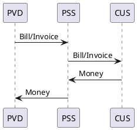

# Advanced Billing

* ID: ADR034
* Status: :rejected:
* Deciders: @cgr @hop @cg
* Date: 2023-12-19
* Version: 1.0
* Category: Design

## Context and Problem Statement

At the current project phase, payment is considered to be done directly between customer and provider.
Only the outstanding debt and an indication of successful settlement are communicated with the PSS via the Customer Bill API.
This is sufficient for a pure broker scenario, where the PSS is just an intermediary.

But a PSS may want to handle payments for products, that are acquired through the platform, for different reasons:

* Simplification for the customer (especially for joint missions of multiple customers)
* Commercial aspects (e.g., retaining a share)
* Deliberate disconnect of the customer from underlying costs (e.g., by using a virtual currency or usage-budgets)

While the first two are applicable to any scenario, the last one can be considered to be specific to the hub scenario.
In any case, the customer has a contract with the PSS and the PSS has contracts with the providers[^user-provider-contracts].
This leads to two different steps in the billing workflow as depicted in figure {@fig:two-step-billing}.
Note that PSI does **not** cover the actual money flow.

[^user-provider-contracts]: Additional contracts between customer and provider are possible, but excluded from the description to preserve readability.

{#fig:two-step-billing}

## Decision Drivers

* Enable hub and broker scenarios
* Enable joint missions
* Implementation effort

## Considered Options

* Adapt TMF666 Account Management API
* Keep current set of APIs

## Decision Outcome

The current set of APIs already enables the implementation of arbitrary billing workflows.
Therefore, the `TMF666 Account Management API` will not be adapted for PSI.
Additionally, there are no candidate requirements that imply a (Gov)SatCom specific adaptation.
At some point in the future, a decision might be made to implement it.
An anticipated reason might be to allow access to summed up balances instead of single bills, especially when they are using virtual currencies.

With the existing `PSI678 Customer Bill Management API`, the provider can send the due amount for booked services to the PSS.
Depending on the concrete implementation and use case, the bill is either linked to a single customer, multiple customers, or the PSS itself via the `relatedParty` property.
The PSS can then either pass the bill as-is to the named customers (pure broker scenario) or create derived bills which are then passed on to the individual customers.
It also allows references to billing accounts in case `TMF666` is implemented.

## Security Considerations

Both discussed APIs carry sensitive data and therefore have to be protected accordingly.
Otherwise, attackers could extract payment information or even initiate unwarranted payments.
As stated in [PSI-ICD], the security measures depend on the needs of the system and are therefore not discussed in detail here, as they have to be applied to a different communication layer.

## Implications for the Scope

While the interface enables joint missions, the concept of a mission is kept internal to the PSS.

The interface allows defining arbitrary debtors for a bill and multiple debtors for a bill.
