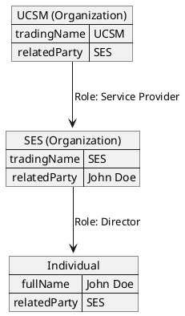

# Party Management API (V1.0)

* ID: ADR010
* Status: :superseded: by [Party Management API V1.1](../Accepted/ADR010-party-management-api_V1.1.md) in [PSI-ADR]
* Deciders: @daf @cgr @dvs
* Date: 2022-07-21
* Version: 1.0
* Category: Design

## Context and Problem Statement

Business interactions are executed between two or more parties, which are either natural persons ("individuals") or organizations.
A party can have different roles in different interactions, for example, a service provider can also be a customer or business partner of another provider.

Therefore, PSI should support the registration of parties and their roles in the different interactions.
Currently, TM Forum provides two Open APIs for managing these: Party Management API and Party Role Management API.

It should be decided whether implementing the Party Management API is sufficient for the use cases covered for the PSI, or if the Party Role Management API is additionally required.

## Decision Drivers

* Simplicity in registering parties and roles
* Minimal implementation to support registration of party roles
* Support for complex role hierarchies

## Considered Options

* TM Forum's Party Management API
* TM Forum's Party Role Management API

## Decision Outcome

It has been decided that the Party Management API defines roles of parties in a simpler way than the Party Role Management API.
At the current stage of the project, no benefits have been identified for implementing additionally the Party Role Management API, as it will introduce unnecessary complexity.

>**Note:** This decision is not final and if at a later stage of the project the need emerges to support the Party Role Management API, the decision could be changed.

## Compliance

Implement the Party Management API in the PSI Mock-up as part of the referenced technical story, and support the implementation with AITF tests.

## Pros and Cons of the Options

### Party Management API

The Party Management API identifies two parties: individuals and organizations.
Each of these parties have a separate API definition for the minimal CRUD operations.

In addition to the basic information that can be provided for the parties, the contact medium, credit rating, and the tax exception certificate can be given.
Both individual and organization can specify a list of related parties.
For each of the related parties, the role can be provided in String format which is flexible enough to take any value.
A related party can be a reference to another individual or organization, without any limitations.

{#fig:party_management}

* Good, because it is simple to create parties: individuals and organizations.
* Good, because it supports simple and minimalistic definition of roles through related parties.
* Good, because it supports defining complex hierarchies of roles.
* Bad, because it is not possible to define `AccountRef`, `AgreementRef` or `PaymentRef` as part of the role definition. If this is needed, it has to be provided as part of the Product Order.

### Party Role Management API

The Party Role Management API defines an entity named Party Role which assumes the use of the following APIs:

* **Party Management API** for accessing parties
* **Account Management API** for definition of accounts
* **Account Management API** for definition of accounts

The Party Role entity has a mandatory Role Type property.
In addition to the name of the role, the Role Type is a more complex entity containing information such as `partnershipName`, `partnershipHref` and `partnershipId`.

Similar to the Party Management API, the Party Role has a property for related parties where references to the Party Management API entries can be provided along with their role.

* Good, because the Party Role contains information about `AccountRef`, `AgreementRef`, `PaymentMethodRef`, which is the limitation of the Party Management API.
* Good, because it supports defining complex hierarchies of roles.
* Bad, because the Open API documentation does not contain a description for the Role Type reference entity.
* Bad, because it is more complicated to define roles than the simple role definition in the Party Management API.
