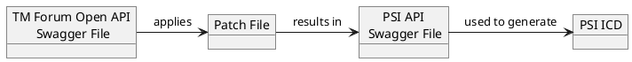

# Swagger (JSON) File Patching for ICD Generation

* ID: ADR012
* Status: :superseded: by [Advanced OAS Patching](../Accepted/ADR042-advanced-oas-patching.md) in [PSI-ADR]
* Deciders: @daf @cgr
* Date: 2022-09-01
* Version: 1.0
* Category: Architecture

## Context and Problem Statement

TM Forum provides the Swagger definitions of their Open APIs which are currently used in PSI to generate the data model.
Then, the model is tailored on the spot to apply to the (Gov)SatCom domain and PSI, and finally, the ICD is generated based on the modified model.
This however breaks the linkage between the PSI and the TM Forum Open APIs, because the modifications performed to derive the standardized interfaces are lost.

Since Swagger files are in JSON format, we need a tool that is able to apply a patch file (ideally in JSON format) containing required modifications that will transform the original Swagger file to an output Swagger file that describes a REST API for PSI.
The resulting Swagger document will then be used to generate the ICD.



{#fig:icd_generation}

The use of patch files will help us

1. Keep track of the differences between the TM Forum Open APIs and PSI APIs at any time
2. Easily migrate to a newer version of TM Forum Open APIs if needed

It is to be decided on the *tool* for patching TM Forum Open API Swagger files.

## Decision Drivers

* Simple syntax for patching JSON files
* Simple to integrate and apply in the PSI project
* Tool reports an error if fails to patch the JSON file
* Support of JSONPath queries
* Documentation
* Maintenance

## Considered Options

* [JSON Patch](https://jsonpatch.com/)
* [JSON Patch Query](https://www.npmjs.com/package/json-patch-query)
* PATTY (Internal CGI tool)

## Decision Outcome

Chosen option: "PATTY tool", because it supports JSONPath query expressions which provides flexibility in selecting JSON nodes for further transformations.
It does the job of patching a JSON file with help of a patch file expressed in JSON format, it is stable and is used in production.

The main no-go for JSON Patch Query, which is designed for the needs of TM Forum's Open APIs, was the detected bug which results in faulty JSON transformations.
JSON Patch and the available libraries around it were eliminated at the very beginning considering that they do not support [JSONPath](https://goessner.net/articles/JsonPath/).

The planned approach for the generation of the ICD is the following:

1. Patch files will be created for each TM Forum's Open API Swagger definition that is used by the PSI (currently placed under `tmforum` folder in project's root).
2. A Gradle task will be created that will look for these patch files and apply the JSON transformations with help of the PATTY tool.
3. The resulting files containing the definition of the PSI APIs will be placed under the doc/PSI/PSI-ICD/open-apis folder.
4. These files will be then handled by another task that will generate the ICD.

## Compliance

The PATTY tool code will be added as part of the PSI Mock-up repository and will be installed in the development environment.
The commands will be executed via a Gradle task that will transform the Swagger files of TM Forum's Open APIs into the modified Swagger files for the PSI project.

The PATTY tool is invoking code from the [JSON Document Transforms (JDT)](https://github.com/Microsoft/json-document-transforms/wiki) C# library developed by Microsoft under an MIT license.
The library can be imported to any C# project, meaning the transformations do not have to be performed exclusively via the PATTY tool.

## Pros and Cons of the Options

### JSON Patch

JSON Patch is a format for describing changes to a JSON document which contains an array of patch operations.
The supported operations are: "add", "remove", "replace", "move", "copy" and "test".
In addition to the operation, the full "path" of the target node should be provided.

For example, given the following JSON:

```json
{
  "users": [
    { "name": "John Doe" },
    { "name": "Jane Doe" }
  ]
}
```

and a patch operation:

```json
{ "op": "remove", "path": "/users/0" }
```

the first element of the array with the node name "users" will be removed, resulting in the following JSON structure:

```json
{
  "users": [
    { "name": "Jane Doe" }
  ]
}
```

* Good, because the syntax for the changes to be done is very simple.
* Good, because is implemented by many libraries in popular programming languages, including Java, meaning integration into the PSI is straightforward.
* Bad, because it does not support [JSONPath](https://goessner.net/articles/JsonPath/) expressions for selecting nodes in the JSON document.

### JSON Patch Query

JSON Patch Query is a [npm](https://www.npmjs.com/) library implemented based on TM Forum's recommendations detailed in the [REST API Design Guidelines](https://www.tmforum.org/resources/specification/tmf630-rest-api-design-guidelines-4-2-0/).
It implements the [JSON Patch RFC6902](https://datatracker.ietf.org/doc/html/rfc6902#section-2) standard and additionally supports JSONPath query expressions.

* Good, because the syntax for the changes to be done to the JSON is very simple.
* Good, because it is developed specifically to support TM Forum's API design guidelines.
* Good, because the library reports an error if fails to patch the JSON file.
* Good, because it supports JSONPath queries.
* Bad, because a [bug](https://github.com/carlosingles/json-patch-query/issues/3) has been detected while investigating the library.
* Bad, because it is not that straightforward to integrate it into PSI - it requires additional JavaScript code that invokes the library methods for the JSON transformation.
* Bad, because the library is very new (November 2021), it is maintained by a single person who has only occasional contributions to the repository.
* Bad, because of poor documentation.

### PATTY

PATTY is a command line tool that supports common provisioning operations like adjusting XML files, transforming JSON files, plain-text find and replace, access to global configuration, expression evaluation, etc. It is an in-house developed tool by CGI which is used in multiple projects.
For the JSON transformations in particular, it is using the [JSON Document Transforms (JDT)](https://github.com/Microsoft/json-document-transforms/wiki) library to describe and perform the modifications to the original JSON file.
In that regard, it is very similar to the JSON Patch, but it has its own syntax.
This is a sample patch operation expressed in JDT:

```json
{
  "@jdt.remove": {
    "@jdt.path": "$.tags[?(@.name!='catalog' && @.name!='productOffering' && @.name!='productSpecification')]"
  }
}
```

* Good, because the syntax for the changes to be done to the JSON file is very simple.
* Good, because the library reports an error if fails to patch the JSON file.
* Good, because it supports JSONPath queries.
* Good, because it has proper documentation.
* Bad, because it is not straight-forward to integrate it into PSI - it requires installation of the tool's rpm in the development environment and then adding code that invokes the tool on the command line to execute the JSON transformation.
* Neutral, because the tool is currently not actively maintained, but it is based on a maintained library, used in production and is stable.

## Implications for the Scope

Patching the existing Swagger files allows PSI to grow with the TM Forum Open API. Updates to the Open API can be traced and handled. In a maintenance phase of PSI, this will allow for an easy adjustment to be up-to-date with TM Forum's future developments.
