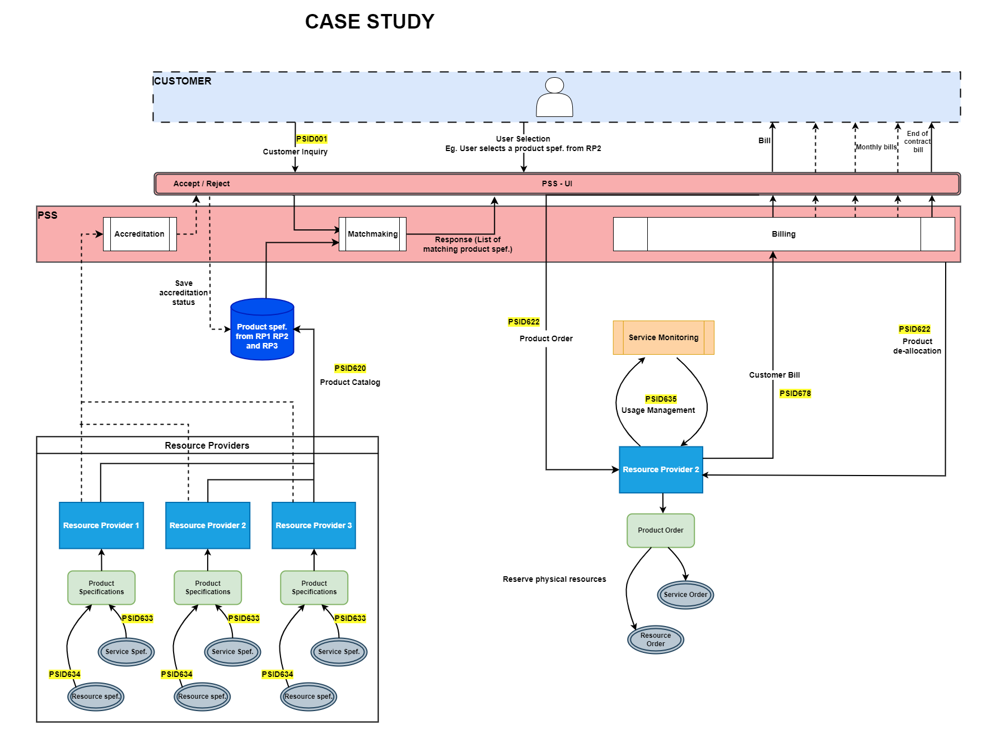
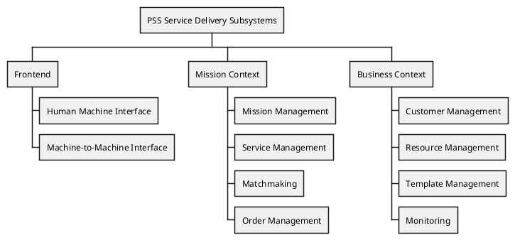

=begin

# PSS Case Study

[[_TOC_]]

> The heading has to be included in the document that includes this document.

=end

# Problem Identification

The governance has analyzed the situation and identified the root causes of these challenges:

Demand-side Fragmentation: A significant portion of the problem arises from the fragmentation on the demand side.
This fragmentation is driven by the proliferation of small contracts initiated by a multitude of isolated customers.
Interestingly, these customers essentially require the same GOVSATCOM product.
This situation results in inefficient resource allocation and product duplication.

Supply-side Fragmentation: The governance has also recognized fragmentation on the supply side.
This issue emerges when GOVSATCOM products with surplus capacity cannot be effectively shared among customers.
Consequently, the inability to share these products hampers access and leads to underutilization of available resources.

# Proposed Solution

The proposed solution entails the implementation of a Pooling and Sharing System (PSS).
Under this system, GOVSATCOM products will be consolidated into a shared pool, which will, in turn, enable the effective sharing of products among customers through product allocation and de-allocation procedures.

In order to facilitate a clear understanding of the proposed solution and its implementation, the governance has defined the following concepts needed for the Pooling and Sharing System (PSS):

* **Broker:** The complete solution combining physical locations, software, people, processes, and infrastructure so as to provide broker operators the means to monitor and operate broker business processes.
* **Broker Software (PSS):** The collection of software systems that share the overall goal of providing a cohesive and single solution to implementing broker business processes.
  Individually, each subsystem will implement one or more business processes.
  Collectively, the software subsystems work together to provide the overall functions of the broker solution.
* **Product:** Any process built around communication that is deemed to be useful for customers.
  These processes can be integrated into the core operations of the broker, enhancing the range of services and solutions offered to customers.
* **Resource Provider:** A "Resource Provider" is defined as any accredited entity responsible for offering Products within the framework of the broker solution.
  Accreditation procedures for these providers are established and managed by the governance, ensuring compliance with specified standards and quality.
* **Customer:** A "Customer" encompasses both individual users and groups of individuals who utilize Products offered through the broker.
  These Customers rely on the broker to access GOVSATCOM products.
* **Governance:** The organization responsible for defining and executing general governance processes of the broker, such as procuring Products, on-boarding Products to the Product portfolio or allocating products to customers.

The Governance has identified the following six key functions that it needs to perform as part of its solution:

1. **Provider and Product Accreditation:** The governance will perform Provider as well as Product Accreditation.
  This consists in ensuring that Resource Providers meet a set of requirements with respect to security, guarantee of access and product features.
  This will be a manual step(which can later can be automated).
2. **Product Procurement:** The governance will act as a central procurement department and it will procure suitable Products from various Resource Providers as part of supply aggregation.
  Once the governance has procured GOVSATCOM Products through a defined procedure, the Products become part of the broker pool, and can be allocated to Customers without the need to carry out an additional procurement procedure.
3. **Supply Aggregation:** The governance performs supply aggregation by procuring Products into a pool.
  The pool is the collection of procured Products that is kept ready to use.
  The strategic pooling of Products significantly enhances response times, especially in scenarios where Products provisioning and procurement costs are substantial.
4. **Demand Aggregation:** The governance will provide the means to Customers to order Products.
Once these Products are within the pool, Customers can initiate orders, similar to an online shopping experience tailored for GOVSATCOM Products.
5. **Product Allocation:** The Governance will allocate Products to Customers via sophisticated aggregation of demand, matching, prioritization, and optimization techniques.
6. **Product De-allocation:** The governance will oversee the de-allocation of Products from Customers in cases when the contract ends or is terminated before completion.

The governance will perform some of these functions with the help of the broker software.
The governance has decided that the main element of the broker software is a PSS, and that the PSS is the main enabler for automation and efficient execution of the functions.
The governance has also decided to use the PSID APIs as part of their PSS, and as a fundamental tool on which to build the integration upon of all elements of the overall solution.

The following figure provides a visualization of some of the above functions:

{#fig:case-study}

As can be seen in the figure above, the PSID APIs is the tool which enables machine-to-machine communication between Resource Provider Software and the PSS, which is the main element of the Broker Software.
 
The above figure illustrates the following steps:

* **STEP1 :** The governance performs the accreditation process for the Resource Providers in the PSS.
  After the accreditation is successful the Resource Providers are added in approved list.
* **STEP2 :** PSS performs supply aggregation from accredited Resource Providers - RP1, RP2 and RP3.
* **STEP3 :** All three Resource Providers publish their products via the PSID620 API to the PSS, and the Product information is stored in the PSS database.
* **STEP4 :** Customer sends the product requirements in form of an Inquiry using the PSID001 API.
* **STEP5 :** Matchmaking occurs at the PSS level, where the system identifies suitable products based on customer requirements.
* **STEP6 :** Customer is presented with a list of matching products through the PSS user interface.
* **STEP7 :** Customer selects a product and places an order.
* **STEP8 :** The PSS checks the selected product, associates it with the relevant Resource Provider (e.g., RP2), and creates a Product Order using the PSID622 API.
* **STEP9 :** RP2 receives the order, updates its inventory, and reserves the necessary physical resources for the product.
* **STEP10 :** Once the Order is placed and confirmation is sent, the contract is established.
  RP2 then performs the service monitoring and generates the bills monthly throughout the lifecycle of the contract.
* **STEP11 :** At the end of the contract, the PSS sends a Product Deallocation request to RP2 using the same PSID622 API initially used for allocation.

These streamlined steps provide a clear overview of the process, emphasizing the key actions and interactions between the PSS, Resource Providers, and Customers.

# PSS Architecture and Concept

A PSS aims to unify and centralise the GOVSATCOM market and all associated interfaces.
It consists of three main contexts:

* Frontend
* Mission Context
* Business Context

Each context comprises a set of related subsystems.
The *Frontend* contains the main interface to any actor of the PSS.
The subsystems in the *Mission Context* target the main Use Cases of the customers and their service-needs.
The *Business Context* refers to subsystems providing complimentary support to the main mission creation process, such as Customer Management.

{#fig:service-delivery-subsystems}

# Resource Provider Concept

The Resource Provider system should essentially have the following modules:

* Order Management System (OMS):  
  This refers to a "backend" system responsible for processing of customer order establishment, customer qualification, customer order validation, customer order tracking & management, physically reserving resources related to the order, service monitoring throughout the lifecycle of the contract and generating the invoices(billing).
* Asset Management System (AMS):  
  This refers to a "backend" system responsible for general management of assets, which are Products/Services/Resources.
  More specifically: Catalog/Inventory management, which describe assets (product-service-resources relations, SLAs, etc.) and the current state (i.e., location, allocation, etc.).

# The role of the PSID APIs

The desired outcome is that each provider who is compatible with this standard can connect to each PSS.

The PSS APIs can be organized in groups:

* Catalog and Inventory Management
  * PSS620: Product Catalog Management API
  * PSS637: Product Inventory Management API
  * PSS633: Service Catalog Management API
  * PSS638: Service Inventory Management API
  * PSS634: Resource Catalog Management API
  * PSS639: Resource Inventory Management API
* Monitoring
  * PSS635: Usage Management API
* Ticketing
  * PSS621: Trouble Ticket Management API
* Order Management
  * PSS622: Product Ordering Management API
  * PSS679: Product Offering Qualification Management API
  * PSS648: Quote Management API
* Document Management
  * PSS667: Document Management API

# Description of Key Business Processes

This section provides a description of the key business processes.

## Product Accreditation

In a scenario in which the broker platform has been completed (so all software (including the broker PSS and any others), infrastructure is ready, all people are trained, all processes defined etc.), the next steps would be to certify an initial set of Resource Providers.
For example, SES and Hellas Sat might have expressed interest in participating in the broker program and have enhanced their software landscape to implement all relevant PSID APIs.
In this case, once SES and Hellas Sat are ready, a certification campaign would be performed involving the governance and SES and Hellas Sat.
The campaign will aim to certify one or more SES / Hellas Sat products as GOVSATCOM-compliant products (which would be somehow formally defined).
As part of the campaign, the software components implementing PSID APIs of both Resource Providers would be certified via semi-automated testing campaigns.
One of the outputs of the PSID initiative is a test suite for all PSID APIs.
This test suite could be used and/or adapted for such certification purposes.
In any case, at the end of the certification campaign, the products, infrastructure, software, people, and processes of both Resource Providers would be certified and approved to participate in the broker platform.

## Product Procurement

Once certification is completed, the governance will decide, perhaps based on some forecasting of potential demand, what products to procure from what Resource Providers.
This will involve processes such as pricing negotiation, contracts, and others.

In the scope of this Case Study, the example will be for the Resource Provider system to push to the broker PSS system the details of the procured products via PSID APIs, in the form of the PSID data model (Physical Resource Specifications, Logical Resource Specifications, Service Specifications, Product Specifications, Product Offerings, etc.).
This will be a manual step.

## Supply Aggregation

While the previous two business processes did not rely on the broker PSS nor on PSID APIs and were performed out of the scope of the broker software, once the products are procured, the broker and Resource Provider software can now leverage the PSID APIs to introduce automation into the process.

For it to be available in the broker platform, the SES Product needs to be defined as per the PSID terms.
Please refer to section “5.5 Specifications, Catalogs and Offerings” of the PSID "TAD (Terms, Abbreviations and Definitions)" document for a description of what PSID terms are used to define a given product.

An example definition of the SES product is as follows - Name: Trunk mPOWERED product (only a general description is provided for practical purposes, as precise specifications would be too lengthy and not required for the purpose of this document):

* Physical Resource Specifications: Intellian Terminal, 2 x 1.3m 20W, model mP130, Gateway infrastructure, etc.
* Logical Resource Specifications: Bandwidth allowing for a minimum combination of FWD and RTN of 50 Mbps, where FWD and RTN have variable pre-defined ratios.
* Service Specifications: Connectivity transport service based on Layer 2 Ethernet P2P E-Line service (E-Access/E-Transit), Layer 3 IP transport
* Product Specifications: Trunk mPOWERED
* Product Offerings: Trunk mPOWERED, intellian mP130, FWD 25 Mbps RTN 25 Mbps; Trunk mPOWERED, intellian mP130, FWD 35 Mbps RTN 35 Mbps; etc.
  One for each potential variation of FWD and RTN.
  The product offering will also contain details about SLAs (i.e., network uptime > 99.5 %, Satellite Latency < 150 ms, committed information rate (CIR) definitions, etc.).

In practice, the exact characteristics of what Product Offerings would be procured by the governance would be detailed and defined in contractual documents as part of the business process described in the previous step.

In the same manner as the governance procured products from SES, it would procure other products from other Resource Providers.

One possibility is for the Resource Provider systems to leverage the PSID APIs to publish the procured products to the broker PSS via the APIs.

This process could be implemented in a manner such as that governance operators receive notifications of new published Product Offerings in the broker.
The operators might then need to access the broker portal so to validate and approve the publishing of the Offerings.

In this manner, the broker PSS catalog would be populated semi-automatically by having all relevant Resource Providers push all previously procured products to the catalog.

This would be a continuous process and would enable the PSS catalog to effectively create a pool of aggregated supply from all Resource Providers.

## Demand Aggregation

The most probable scenario in which demand aggregation is achieved would be to leverage the fact that customers would use a graphical user interface (such as a web application that is part of the broker platform) to either browse the product offerings available in the pool or to submit a product inquiry.

The PSID APIs such as the Product Ordering Management API (PSS622) would be leverage internally in the PSS so to perform the process.

Other scenarios in which the PSID APIs would be leveraged would be in the case that a quote is needed from one or more Resource Providers.
In this case the PSID API "Quote API" (PSS648) would be leveraged.

## Product Allocation

Either matchmaking is delegated to the resource provider or the broker PSS would have some matchmaking algorithms that would propose a solution to the customer request.
In the end, the customer would confirm the proposal and an order process would occur.
In this case, several PSID APIs would be leveraged, mostly between the PSS and the Resource Provider systems.
Most probably these would be APIs such as the Product Ordering Management API (PSS622) and the inventory-related APIs (Product Inventory Management API (TMF637), Service Inventory Management API (TMF638), Resource Inventory Management API (TMF639)).

The APIs would be used to ensure both the PSS pool and inventories are synchronized with Resource Provider systems and processes.

## Product De-allocation

Once the product allocation has ended, a de-allocation step occurs.
This could be in the case of service term expiry or premature service cancellation from customer's side.
In a similar manner as the previous step, most probably the PSID APIs that would be leveraged would be APIs such as the Product Ordering Management API (PSS622) and the inventory-related APIs (Product Inventory Management API (TMF637), Service Inventory Management API (TMF638), Resource Inventory Management API (TMF639)).
