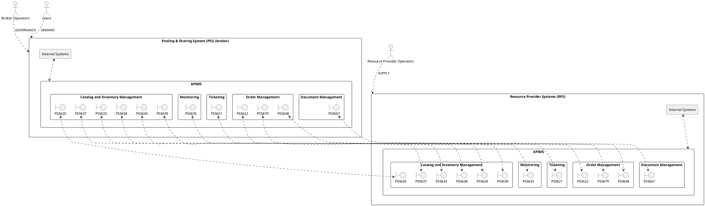

```plantuml
'left to right direction
'top to bottom direction
@startuml
'-------------------------------------------------------------------------------- Pooling & Sharing System (PSS) (broker):
rectangle pss_broker as "Pooling & Sharing System (PSS) (broker)" {
	rectangle pss_broker_internal_systems as "Internal Systems"
	rectangle pss_broker_apims as "APIMS" {
		rectangle pss_broker_apims_ams as "Catalog and Inventory Management" {
			'---- PSS620 - Product Catalog Management API
			boundary pss_broker_apims_pss620 as "PSS620"
			'---- PSS637 - Product Inventory Management API 
			boundary pss_broker_apims_pss637 as "PSS637"
			'---- PSS633 - Service Catalog Management API
			boundary pss_broker_apims_pss633 as "PSS633"
			'---- PSS638 - Service Inventory Management API
			boundary pss_broker_apims_pss638 as "PSS638"
			'---- PSS634 - Resource Catalog Management API
			boundary pss_broker_apims_pss634 as "PSS634"
			'---- PSS639 - Resource Inventory Management API
			boundary pss_broker_apims_pss639 as "PSS639"
		}
		rectangle pss_broker_apims_nms as "Monitoring" {
			'---- PSS635 - Usage Management API
			boundary pss_broker_apims_pss635 as "PSS635"
		}
		rectangle pss_broker_apims_tts as "Ticketing" {
			'---- PSS621 - Trouble Ticket Management API
			boundary pss_broker_tts_pss621 as "PSS621"
		}
		rectangle pss_broker_apims_oms as "Order Management" {
			'---- PSS622 - Product Ordering Management API
			boundary pss_broker_oms_pss622 as "PSS622"
			'---- PSS679 - Product Offering Qualification Management API
			boundary pss_broker_oms_pss679 as "PSS679"
			'---- PSS648 - Quote Management API
			boundary pss_broker_oms_pss648 as "PSS648"
		}
		rectangle pss_broker_apims_dms as "Document Management" {
			'---- PSS667 - Document Management API
			boundary pss_broker_dms_pss667 as "PSS667"
		}
	}
}

'-------------------------------------------------------------------------------- Resource Provider Systems (RPS):

rectangle rp_systems as "Resource Provider Systems (RPS)" {
	rectangle rp_internal_systems as "Internal Systems"
	rectangle rp_apims as "APIMS" {
		rectangle rp_apims_ams as "Catalog and Inventory Management" {
			'---- PSS620 - Product Catalog Management API
			boundary rp_apims_pss620 as "PSS620"
			'---- PSS637 - Product Inventory Management API 
			boundary rp_apims_pss637 as "PSS637"
			'---- PSS633 - Service Catalog Management API
			boundary rp_apims_pss633 as "PSS633"
			'---- PSS638 - Service Inventory Management API
			boundary rp_apims_pss638 as "PSS638"
			'---- PSS634 - Resource Catalog Management API
			boundary rp_apims_pss634 as "PSS634"
			'---- PSS639 - Resource Inventory Management API
			boundary rp_apims_pss639 as "PSS639"
		}
		rectangle rp_apims_nms as "Monitoring" {
			'---- PSS635 - Usage Management API
			boundary rp_apims_pss635 as "PSS635"
		}
		rectangle rp_apims_tts as "Ticketing" {
			'---- PSS621 - Trouble Ticket Management API
			boundary rp_tts_pss621 as "PSS621"
		}
		rectangle rp_apims_oms as "Order Management" {
			'---- PSS622 - Product Ordering Management API
			boundary rp_oms_pss622 as "PSS622"
			'---- PSS679 - Product Offering Qualification Management API
			boundary rp_oms_pss679 as "PSS679"
			'---- PSS648 - Quote Management API
			boundary rp_oms_pss648 as "PSS648"
		}
		rectangle rp_apims_dms as "Document Management" {
			'---- PSS667 - Document Management API
			boundary rp_dms_pss667 as "PSS667"
		}
	}
}

'-------------------------------------------------------------------------------- Pooling & Sharing System (PSS) (broker) to Resource Provider (RP) flows:

'------ DMS

pss_broker_dms_pss667 <-[dashed]-> rp_dms_pss667

'------ AMS

pss_broker_apims_pss620 <-[dashed]-> rp_apims_pss620
pss_broker_apims_pss637 <-[dashed]-> rp_apims_pss637
pss_broker_apims_pss633 <-[dashed]-> rp_apims_pss633
pss_broker_apims_pss638 <-[dashed]-> rp_apims_pss638
pss_broker_apims_pss634 <-[dashed]-> rp_apims_pss634
pss_broker_apims_pss639 <-[dashed]-> rp_apims_pss639

'------ NMS

pss_broker_apims_pss635 <-[dashed]-> rp_apims_pss635

'------ TTS

pss_broker_tts_pss621 <-[dashed]-> rp_tts_pss621

'------ OMS

pss_broker_oms_pss622 <-[dashed]-> rp_oms_pss622
pss_broker_oms_pss679 <-[dashed]-> rp_oms_pss679
pss_broker_oms_pss648 <-[dashed]-> rp_oms_pss648

'-------------------------------------------------------------------------------- Pooling & Sharing System (PSS) (broker) Internal flows:

pss_broker_internal_systems <-[dashed]-> pss_broker_apims

'-------------------------------------------------------------------------------- Resource Provider (RP) flows:

rp_internal_systems <-[dashed]-> rp_apims

'-------------------------------------------------------------------------------- Actors:

actor broker_operators as "Broker Operators"
actor resource_provider_operators as "Resource Provider Operators"
actor users as "Users"

broker_operators -[dashed]-> pss_broker : GOVERNANCE
resource_provider_operators -[dashed]-> rp_systems : SUPPLY
users -[dashed]-> pss_broker : DEMAND

@enduml
```

{#fig:communication}
