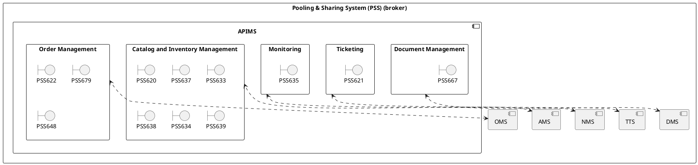

```plantuml
@startuml
'-------------------------------------------------------------------------------- Pooling & Sharing System (PSS) (broker):
rectangle pss_broker as "Pooling & Sharing System (PSS) (broker)" {
	' Asset Management System (AMS)
	component pss_broker_ams as "AMS"
	' Order Management System (OMS)
	component pss_broker_oms as "OMS"
	' Trouble Ticket System (TTS)
	component pss_broker_tts as "TTS"
	' Document Management System (DMS)
	component pss_broker_dms as "DMS"
	' Network Management System (NMS)
	component pss_broker_nms as "NMS"
	' API Management System (APIMS)
	component pss_broker_apims as "APIMS" {
		rectangle pss_broker_apims_ams as "Catalog and Inventory Management" {
			'---- PSS620 - Product Catalog Management API
			boundary pss_broker_apims_pss620 as "PSS620"
			'---- PSS637 - Product Inventory Management API 
			boundary pss_broker_apims_pss637 as "PSS637"
			'---- PSS633 - Service Catalog Management API
			boundary pss_broker_apims_pss633 as "PSS633"
			'---- PSS638 - Service Inventory Management API
			boundary pss_broker_apims_pss638 as "PSS638"
			'---- PSS634 - Resource Catalog Management API
			boundary pss_broker_apims_pss634 as "PSS634"
			'---- PSS639 - Resource Inventory Management API
			boundary pss_broker_apims_pss639 as "PSS639"
		}
		rectangle pss_broker_apims_nms as "Monitoring" {
			'---- PSS635 - Usage Management API
			boundary pss_broker_apims_pss635 as "PSS635"
		}
		rectangle pss_broker_apims_tts as "Ticketing" {
			'---- PSS621 - Trouble Ticket Management API
			boundary pss_broker_tts_pss621 as "PSS621"
		}
		rectangle pss_broker_apims_oms as "Order Management" {
			'---- PSS622 - Product Ordering Management API
			boundary pss_broker_oms_pss622 as "PSS622"
			'---- PSS679 - Product Offering Qualification Management API
			boundary pss_broker_oms_pss679 as "PSS679"
			'---- PSS648 - Quote Management API
			boundary pss_broker_oms_pss648 as "PSS648"
		}
		rectangle pss_broker_apims_dms as "Document Management" {
			'---- PSS667 - Document Management API
			boundary pss_broker_dms_pss667 as "PSS667"
		}
	}
}

'-------------------------------------------------------------------------------- Internal Pooling & Sharing System (PSS) (broker) Flows:

'------ DMS

pss_broker_apims_dms <-[dashed]-> pss_broker_dms

'------ AMS

pss_broker_apims_ams <-[dashed]-> pss_broker_ams

'------ NMS

pss_broker_apims_nms <-[dashed]-> pss_broker_nms

'------ TTS

pss_broker_apims_tts <-[dashed]-> pss_broker_tts

'------ OMS

pss_broker_apims_oms <-[dashed]-> pss_broker_oms

@enduml
```

{#fig:internal_broker_psid_apis}
