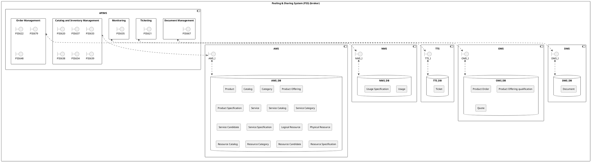

```plantuml
@startuml
'-------------------------------------------------------------------------------- Pooling & Sharing System (PSS) (broker):
rectangle pss_broker as "Pooling & Sharing System (PSS) (broker)" {
	' Asset Management System (AMS)
	component pss_broker_ams as "AMS" {
		database pss_broker_ams_ams_db as "AMS_DB" {
			'---- PSS637 - Product Inventory Management API 
			rectangle pss_broker_ams_product as "Product"
			'---- PSS620 - Product Catalog Management API
			rectangle pss_broker_ams_catalog as "Catalog"
			rectangle pss_broker_ams_category as "Category"
			rectangle pss_broker_ams_product_offering as "Product Offering"
			rectangle pss_broker_ams_product_specification as "Product Specification"
			'---- PSS638 - Service Inventory Management API
			rectangle pss_broker_ams_service as "Service"
			'---- PSS633 - Service Catalog Management API
			rectangle pss_broker_ams_service_catalog as "Service Catalog"
			rectangle pss_broker_ams_service_category as "Service Category"
			rectangle pss_broker_ams_service_candidate as "Service Candidate"
			rectangle pss_broker_ams_service_specification as "Service Specification"
			'---- PSS639 - Resource Inventory Management API
			rectangle pss_broker_ams_logical_resource as "Logical Resource"
			rectangle pss_broker_ams_physical_resource as "Physical Resource"
			'---- PSS634 - Resource Catalog Management API
			rectangle pss_broker_ams_resource_catalog as "Resource Catalog"
			rectangle pss_broker_ams_resource_category as "Resource Category"
			rectangle pss_broker_ams_resource_candidate as "Resource Candidate"
			rectangle pss_broker_ams_resource_specification as "Resource Specification"
		}
		boundary pss_broker_ams_ams_i as "AMS_I"
	}
	' Order Management System (OMS)
	component pss_broker_oms as "OMS" {
		database pss_broker_oms_oms_db as "OMS_DB" {
			'---- PSS622 - Product Ordering Management API
			rectangle pss_broker_oms_product_order as "Product Order"
			'---- PSS679 - Product Offering Qualification Management API
			rectangle pss_broker_oms_product_offering_qualification as "Product Offering qualification"
			'---- PSS648 - Quote Management API
			rectangle pss_broker_oms_quote as "Quote"
		}
		boundary pss_broker_oms_oms_i as "OMS_I"
	}
	' Trouble Ticket System (TTS)
	component pss_broker_tts as "TTS" {
		database pss_broker_tts_tts_db as "TTS_DB" {
			'---- PSS621 - Trouble Ticket Management API
			rectangle pss_broker_tts_ticket as "Ticket"
		}
		boundary pss_broker_tts_tts_i as "TTS_I"
	}
	' Document Management System (DMS)
	component pss_broker_dms as "DMS"  {
		database pss_broker_dms_dms_db as "DMS_DB" {
			'---- PSS667 - Document Management API
			rectangle pss_broker_dms_document as "Document"
		}
		boundary pss_broker_dms_dms_i as "DMS_I"
	}
	' Network Management System (NMS)
	component pss_broker_nms as "NMS" {
		database pss_broker_nms_nms_db as "NMS_DB" {
			'---- PSS635 - Usage Management API
			rectangle pss_broker_nms_usage as	"Usage"
			rectangle pss_broker_nms_usage_specification as	"Usage Specification"
		}
		boundary pss_broker_nms_nms_i as "NMS_I"
	}
	' API Management System (APIMS)
	component pss_broker_apims as "APIMS" {
		rectangle pss_broker_apims_ams as "Catalog and Inventory Management" {
			'---- PSS620 - Product Catalog Management API
			boundary pss_broker_apims_pss620 as "PSS620"
			'---- PSS637 - Product Inventory Management API 
			boundary pss_broker_apims_pss637 as "PSS637"
			'---- PSS633 - Service Catalog Management API
			boundary pss_broker_apims_pss633 as "PSS633"
			'---- PSS638 - Service Inventory Management API
			boundary pss_broker_apims_pss638 as "PSS638"
			'---- PSS634 - Resource Catalog Management API
			boundary pss_broker_apims_pss634 as "PSS634"
			'---- PSS639 - Resource Inventory Management API
			boundary pss_broker_apims_pss639 as "PSS639"
		}
		rectangle pss_broker_apims_nms as "Monitoring" {
			'---- PSS635 - Usage Management API
			boundary pss_broker_apims_pss635 as "PSS635"
		}
		rectangle pss_broker_apims_tts as "Ticketing" {
			'---- PSS621 - Trouble Ticket Management API
			boundary pss_broker_tts_pss621 as "PSS621"
		}
		rectangle pss_broker_apims_oms as "Order Management" {
			'---- PSS622 - Product Ordering Management API
			boundary pss_broker_oms_pss622 as "PSS622"
			'---- PSS679 - Product Offering Qualification Management API
			boundary pss_broker_oms_pss679 as "PSS679"
			'---- PSS648 - Quote Management API
			boundary pss_broker_oms_pss648 as "PSS648"
		}
		rectangle pss_broker_apims_dms as "Document Management" {
			'---- PSS667 - Document Management API
			boundary pss_broker_dms_pss667 as "PSS667"
		}
	}
}

'-------------------------------------------------------------------------------- Internal Pooling & Sharing System (PSS) (broker) Flows:

'------ DMS

pss_broker_dms_dms_i <-[dashed]-> pss_broker_dms_dms_db
pss_broker_apims_dms <-[dashed]-> pss_broker_dms_dms_i

'------ AMS

pss_broker_ams_ams_i <-[dashed]-> pss_broker_ams_ams_db
pss_broker_apims_ams <-[dashed]-> pss_broker_ams_ams_i

'------ NMS

pss_broker_nms_nms_i <-[dashed]-> pss_broker_nms_nms_db
pss_broker_apims_nms <-[dashed]-> pss_broker_nms_nms_i

'------ TTS

pss_broker_tts_tts_i <-[dashed]-> pss_broker_tts_tts_db
pss_broker_apims_tts <-[dashed]-> pss_broker_tts_tts_i

'------ OMS

pss_broker_oms_oms_i <-[dashed]-> pss_broker_oms_oms_db
pss_broker_apims_oms <-[dashed]-> pss_broker_oms_oms_i

@enduml
```

{#fig:internal_pss_api}
