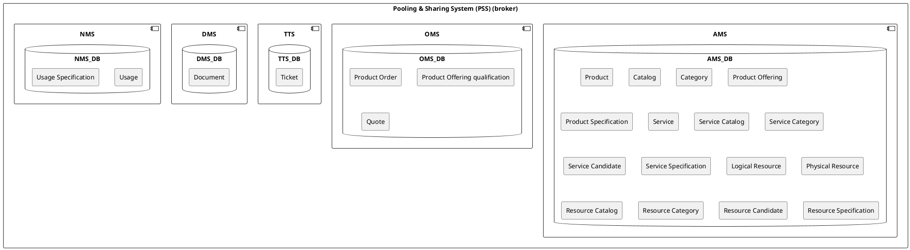

```plantuml
@startuml
'-------------------------------------------------------------------------------- Pooling & Sharing System (PSS) (broker):
rectangle pss_broker as "Pooling & Sharing System (PSS) (broker)" {
	' Asset Management System (AMS)
	component pss_broker_ams as "AMS" {
		database pss_broker_ams_ams_db as "AMS_DB" {
			'---- PSS637 - Product Inventory Management API 
			rectangle pss_broker_ams_product as "Product"
			'---- PSS620 - Product Catalog Management API
			rectangle pss_broker_ams_catalog as "Catalog"
			rectangle pss_broker_ams_category as "Category"
			rectangle pss_broker_ams_product_offering as "Product Offering"
			rectangle pss_broker_ams_product_specification as "Product Specification"
			'---- PSS638 - Service Inventory Management API
			rectangle pss_broker_ams_service as "Service"
			'---- PSS633 - Service Catalog Management API
			rectangle pss_broker_ams_service_catalog as "Service Catalog"
			rectangle pss_broker_ams_service_category as "Service Category"
			rectangle pss_broker_ams_service_candidate as "Service Candidate"
			rectangle pss_broker_ams_service_specification as "Service Specification"
			'---- PSS639 - Resource Inventory Management API
			rectangle pss_broker_ams_logical_resource as "Logical Resource"
			rectangle pss_broker_ams_physical_resource as "Physical Resource"
			'---- PSS634 - Resource Catalog Management API
			rectangle pss_broker_ams_resource_catalog as "Resource Catalog"
			rectangle pss_broker_ams_resource_category as "Resource Category"
			rectangle pss_broker_ams_resource_candidate as "Resource Candidate"
			rectangle pss_broker_ams_resource_specification as "Resource Specification"
		}
	}
	' Order Management System (OMS)
	component pss_broker_oms as "OMS" {
		database pss_broker_oms_oms_db as "OMS_DB" {
			'---- PSS622 - Product Ordering Management API
			rectangle pss_broker_oms_product_order as "Product Order"
			'---- PSS679 - Product Offering Qualification Management API
			rectangle pss_broker_oms_product_offering_qualification as "Product Offering qualification"
			'---- PSS648 - Quote Management API
			rectangle pss_broker_oms_quote as "Quote"
		}
	}
	' Trouble Ticket System (TTS)
	component pss_broker_tts as "TTS" {
		database pss_broker_tts_tts_db as "TTS_DB" {
			'---- PSS621 - Trouble Ticket Management API
			rectangle pss_broker_tts_ticket as "Ticket"
		}
	}
	' Document Management System (DMS)
	component pss_broker_dms as "DMS"  {
		database pss_broker_dms_dms_db as "DMS_DB" {
			'---- PSS667 - Document Management API
			rectangle pss_broker_dms_document as "Document"
		}
	}
	' Network Management System (NMS)
	component pss_broker_nms as "NMS" {
		database pss_broker_nms_nms_db as "NMS_DB" {
			'---- PSS635 - Usage Management API
			rectangle pss_broker_nms_usage as	"Usage"
			rectangle pss_broker_nms_usage_specification as	"Usage Specification"
		}
	}
}
@enduml
```

{#fig:pss_shared_state}
