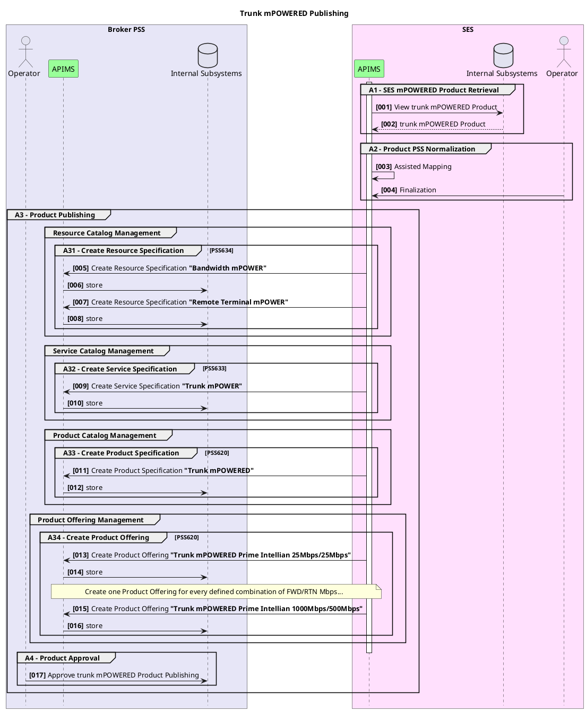

```plantuml
@startuml
autonumber "<b>[000]"
title Trunk mPOWERED Publishing
hide footbox
!pragma teoz true
box "Broker PSS" #e7e6f7
actor "Operator" as pss_operator
participant "APIMS" as pss_apis_implementation #99FF99
database "Internal Subsystems" as pss_data_store
end box
box "SES" #ffe0fd
participant "APIMS" as ses_apis_implementation #99FF99
database "Internal Subsystems" as ses_products
actor "Operator" as ses_operator
end box

activate ses_apis_implementation
group A1 - SES mPOWERED Product Retrieval
ses_apis_implementation -> ses_products : View trunk mPOWERED Product
ses_products --> ses_apis_implementation : trunk mPOWERED Product
end
group A2 - Product PSS Normalization
ses_apis_implementation -> ses_apis_implementation : Assisted Mapping
ses_operator -> ses_apis_implementation : Finalization
end
group A3 - Product Publishing
group Resource Catalog Management
group A31 - Create Resource Specification [PSS634]
ses_apis_implementation -> pss_apis_implementation : Create Resource Specification **"Bandwidth mPOWER"**
pss_apis_implementation -> pss_data_store : store
ses_apis_implementation -> pss_apis_implementation : Create Resource Specification **"Remote Terminal mPOWER"**
pss_apis_implementation -> pss_data_store : store
end
end
group Service Catalog Management
group A32 - Create Service Specification [PSS633]
ses_apis_implementation -> pss_apis_implementation : Create Service Specification **"Trunk mPOWER"**
pss_apis_implementation -> pss_data_store : store
end
end
group Product Catalog Management
group A33 - Create Product Specification [PSS620]
ses_apis_implementation -> pss_apis_implementation : Create Product Specification **"Trunk mPOWERED"**
pss_apis_implementation -> pss_data_store : store
end
end
group Product Offering Management
group A34 - Create Product Offering [PSS620]
ses_apis_implementation -> pss_apis_implementation : Create Product Offering **"Trunk mPOWERED Prime Intellian 25Mbps/25Mbps"**
pss_apis_implementation -> pss_data_store : store
note over pss_apis_implementation, ses_apis_implementation
Create one Product Offering for every defined combination of FWD/RTN Mbps...
end note
ses_apis_implementation -> pss_apis_implementation : Create Product Offering **"Trunk mPOWERED Prime Intellian 1000Mbps/500Mbps"**
pss_apis_implementation -> pss_data_store : store
end
end
deactivate ses_apis_implementation

group A4 - Product Approval
pss_operator -> pss_data_store : Approve trunk mPOWERED Product Publishing
end

@enduml
```

{#fig:supply_aggregation}
