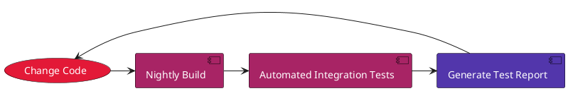
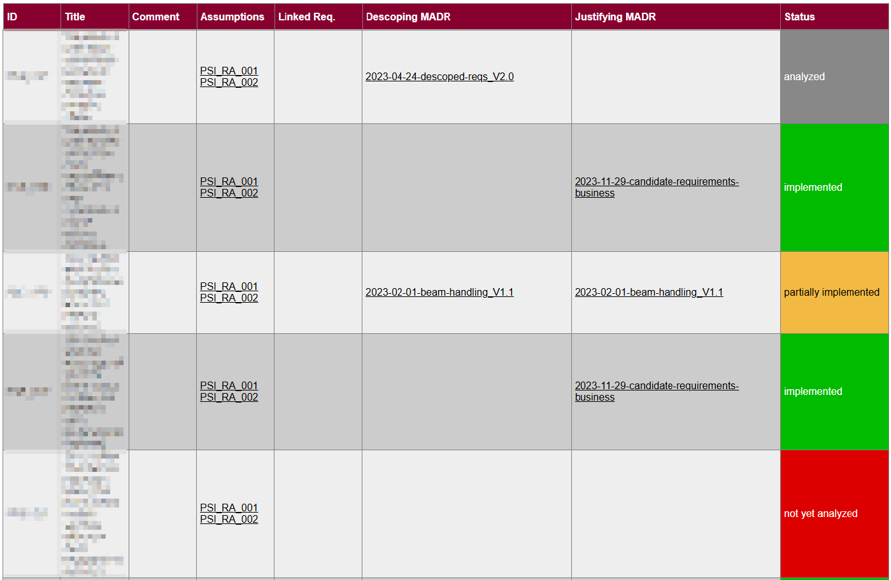
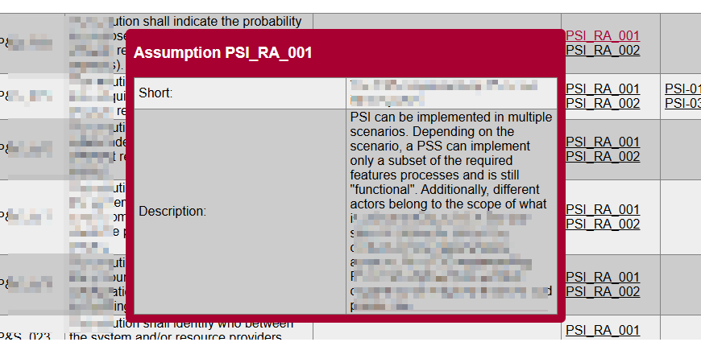

=begin

# Automation of requirements traceability

[[_TOC_]]

=end

Requirements serve as foundation to define functionalities an envisioned software shall have and also the constraints the software shall express.
They are guiding the overall design and development, serving as benchmarks to align user needs and expectations with the actual software implementation.
They are often refined during the requirements engineering process, i.e. translating the initial (candidate) requirements as given by the user perspective to requirements that are specific to the overall software.
As example, a requirement demanding secure connect can be derived by a project-specific requirement asking for implementing Keycloak to handle single-sign login.

Requirements fall into three major categories, namely:

* Functional requirements: specifying the features, functions or behaviours a software shall express
* Non-functional requirements: specifying quality attributes such as performance
* Domain requirements: outlining industry specific standards or regulations.

Thus, throughout the project runtime, a close monitoring of requirements and implementation of features within the software is advised.
A Requirements Traceability Matrix (RTM) often serves as such a monitoring tool.
The RTM tracks requirements via linking those to design, development, testing and deliverables.
The coverage of requirements and their interdependency can be inspected applying an RTM, allowing to adapt changes into the software while ensuring alignment with the overall objectives.
The RTM further supports demonstration of compliance with standards through demonstrating the coverage of respective requirements within the project.

## Design principles of an RTM

For implementing an RTM, the objective of the matrix is firstly defined.
For instance, ensuring all requirements have been tested and implemented might be the focus of tracing requirements.
Assessing the impact of changing requirements to the overall software solution might also be the primary goal.
For PSID, ensurance of requirements coverage, i.e. implementation, has been the driver to install an RTM.

Secondly, the structure of the matrix has to be decided on.
Usually, Excel sheets for initial collection are used, which can then be transferred to more sophisticated tools like DOORS [^1].
Within PSID, we use an HTML matrix highlighting each requirement's status and reference to the requirement's associated status (cp. below).

Thirdly, the requirements are usually listed in the chosen format with a unique identifier, description, test case ID, test results and comments.
For PSI candidate requirements, as given by the customer, we chose to present them accompanied by comments, assumptions for understanding their intention, their linked project-specific requirements, their justifying or descoping decision record and their status.
Project-specific requirements are, in turn, presented alongside their unique ID, their title, their linked candidate requirements, associated operations and their status.

Lastly, the RTM is regularly updated to reflect changes in requirements or test results.

Maintaining an accurate RTM demands a good process.
While this can be done manually on a regular basis, it is less error-prone to automate as much as possible.

This was done in PSID, as will be outlined in the following sections.

## RTM automation within PSID

As mentioned above, the PSID documentation is written in Markdown and hosted in the same repository as the code.
This handling allows to automate documentation generation, creating PDF files from Markdown applying a bespoke toolset called RHOD.
The requirements tracing is treated likewise.

### Automated Integration Test Framework

Within PSID, we make use of an in-house toolset called AITF (Automated Integration Test Framework), a Ruby-based framework for the creation, execution and analysis of automated tests.
It supports the execution of tests in multiple environments and shared tests in multiple missions.
The AITF is designed to test complex system and provides the vast capabilities and flexibility of a full-blown programming language, extended by dedicated constructs required for testing.
The AITF provides several means to analyse test results, including a web tool with graphical presentations of test results and access to all relevant test data.
Tests are defined in Ruby source code files in a format mandated by the AITF (The AITF Test DSL).
The format requires human readable descriptions which are directly linked to the source code, thus enforcing a clean and structured design of test procedures.
By definition, a test procedure consists of a header with metadata like a title, a description and other optional attributes like links to requirements.
The main part of the procedure is a sequence of test steps which are executed consecutively.
For each test step, a description of the activities and an expected observation needs to be provided on top of the test code.
AITF provides a command line interface for test execution.
It is possible to execute a set of tests provided in XML format or single test procedures in a configurable environment.
Our tests are thus triggered via CI/CD pipeline, running alongside our nightly builds to detect problems and regressions as early as possible (cp. {@fig:aitf}).

{#fig:aitf}

The results of those automated tests are, in PSID, processed as XML.

### Requirements Tracing via repository

As aforementioned, all of our documentation is written as Markdown files alongside the code in a Git repository.
The requirements baseline is not treated differently; all requirements that were given by the customer are documented in a dedicated Markdown document.
The initial requirements are referred to as *candidate requirements*, requirements that are being analyzed throughout the project lifecycle, adapted to the project's needs and scope.
These candidate requirements are transferred to project specific requirements, e.g. deriving from the requirement *The solution shall allow a user organisation to declare its own community of users with a maximum of three hierarchical layers.* the project specific requirement *The interface shall allow an organization to register its sub-organization(s) in hierarchical layers.*
This link is well documented in granular Markdown files.
Additionally, we describe in our decision records which implementations we chose and why.
These records justify the implementation of a candidate requirement or descope its implementation, documenting the requirement as well in Markdown.

On the software side, requirements are linked on several levels.
Firstly, tasks and operations that are implemented by the mock-up link to requirements.
Tests on those implementations thus include the verification of requirements.
Secondly, all tests that are being conducted include a meta data section, in which requirements tackled by the specific implementation are listed.
AITF is used to run those tests in a nightly build and reports on the status of each test.
As the requirements are linked to those tests, the result of the test run also shows the implementation status of affiliated requirements.

Both sources of requirements tracing, software and documentation, are used to build the RTM.
A parser is used to gather information on each requirement and subsequently interpret the coverage per requirement.

On the documentation side, requirements are interpreted to be fulfilled if it is marked as *justified* in a decision record, as *partially implemented* if an 
aspect of the requirements is accepted while another aspect is rejected or as *analyzed* if the requirement is deemed to be descoped.
On the software side, a requirement is interpreted to be *passed* if the corresponding test has passed or to be *failed* if the corresponding test fails.
If a requirement is neither listed in a decision record nor in a test, the requirement is interpreted to be in *not yet analyzed* state.
The results of the assessment as well as meta information on requirements - ID, title, comments, linked candidate requirement, operations, assumptions, decision record - are then compiled together with the final status in an HTML overview.
The applied color code - red for *not yet analyzed* or *failed*, green for *justified* or *verified*, yellow for *partially implemented* and grey for *analyzed* - helps to get an immediate understanding of the coverage.
As example, figure {@fig:reqMatrix} depicts the report for the candidate requirements, figure @fig:reqMatrix2 for project specific requirements linked to tasks and operations.

{#fig:reqMatrix}
{#fig:reqMatrix2}

This overview is rendered interactive, i.e. the user can hover on the assumptions, the operations and the decision records to read their content as shown in figure {@fig:hovering}, or click on it to scroll to the respective section of the RTM.

{#fig:hovering}

[^1]: See https://www.ibm.com/docs/en/engineering-lifecycle-management-suite/doors/9.7.0?topic=overview-doors
