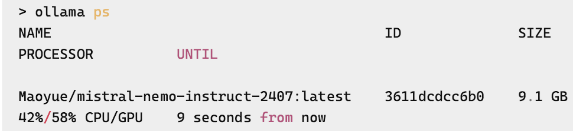

=begin

# Large Language Models and Document Generation

[[_TOC_]]

=end

## Introduction

=begin
this text has been in part AI-generated. Used Perplexity, Mistral and DeepL Write.
=end

Large Language Models (LLMs) represent a substantial advancement in the domain of artificial intelligence and natural language processing.
These models are engineered to comprehend, generate, and interact with human language in a manner that emulates human-like comprehension and response.
LLMs are trained on extensive corpora of textual data, thereby acquiring the capacity to discern intricate patterns and nuances in language.
This aptitude renders them highly versatile for a plethora of applications, ranging from chatbots and virtual assistants to content creation and document generation.

The development of LLMs has been driven by breakthroughs in deep learning and the availability of large-scale computational resources.
Models like BERT[^1] introduced 2019 and rapid subsequent evolvements with T5[^2] and the landmark research on Transformer architecture[^3] have laid the foundation for modern LLMs, pushing the boundaries of what is possible in natural language understanding and generation.

It is evident that OpenAI's GPT series has been instrumental in facilitating the dissemination of LLMs to a wide audience, thereby positioning itself at the vanguard of LLM development.
The advent of GPT-3 in 2020 signalled a paradigm shift in the field of LLMs, with ChatGPT establishing a new standard for language understanding and generation capabilities that had not been previously witnessed.
In 2023, GPT-4 was released estimated to have around 100 trillion parameters, marking a significant leap in both size and capability.
Following those developments, different LLMs have been developed and released for public usage.
For instance, the Mistral Large[^4] model was launched in February 2024 and positions itself as a competitor to GPT-4. It demonstrates excellent performance in reasoning and knowledge tasks, coding in multiple languages and multilingual understanding.
In April 2024, Meta released the publickly available model Llama3[^5], offering optimization for dialogue use cases and variants of 8B and 70B parameters.
While these LLMs are publicly available and cloud-hosted, their application for company needs demanded locally hosted LLMs to ensure data safety.
Thus, Ollama[^6] was developed and published in 2023.
Ollama is an open-source LLM that offers local deployment for the purpose of enhancing privacy and control.
It is compatible with the OpenAPI API, which serves to simplify its integration.
In addition, Ollama supports the integration of various LLMs, such as Mistral or Llama3.

The generation of documents represents one of the most promising applications of LLMs.
The capacity to automatically generate coherent, contextually relevant, and grammatically correct text has far-reaching implications across a range of industries.
Consequently, LLMs have the capacity to facilitate academic writing, assist with the drafting of research papers, generate literature reviews, and summarise complex scientific concepts.
The automation of legal contract creation, briefs, and associated documentation via LLM application has the potential to enhance efficiency and reduce errors.
Likewise, the generation of financial reports, market analyses and other business-related documentation has been demonstrated to enhance operational efficiency and optimise decision-making processes.
LLMs have been furthermore demonstrated to possess a range of strengths, including proficiency in language translation and creative content generation, question answering and chatbot implementation.
As code is also interpreted as a form of language, LLMs have been shown to excel in the domains of code generation and assistance.

Within PSID, we apply automation for both code and documentation whenever needed and sensible.
Thus, we analyze and investigate how applying LLMs for documentation generation can contribute to our pipelines and speed up our processes.
Throughout the following chapters, we will delve into the intricacies of the aforementioned models, their development, and their performance in generating TM Forum mandated documents like the Userguide and the Conformance document for our APIs.

## Ollama

Ollama is a large language model that represents a significant advancement in the field of natural language processing.
Its development was driven by the need for a versatile and robust tool capable of handling a wide range of text generation tasks.
The development of Ollama has been informed by advancements in deep learning, particularly the Transformer architecture, which has become the foundation for many contemporary language models.
Ollama is a sophisticated piece of software that facilitates the execution of large language models (LLMs) on a local machine.
This software, which is developed as an open-source project, has been designed with the objective of rendering AI models more accessible and practical for developers and researchers.
Ollama facilitates the execution of AI models on personal computers, thereby reducing reliance on cloud services.
The implementation of localised models is pivotal in ensuring the security and confidentiality of user data, thereby addressing the inherent privacy concerns that are often associated with cloud-based AI services.
This feature is of particular significance in applications involving sensitive data, where the protection of information is of the utmost importance.
Ollama facilitates the integration of numerous AI models, thereby democratising access to sophisticated AI technologies and rendering them accessible to a more extensive audience without the prerequisite of substantial computational infrastructure.
This aspect is reinforced by the open-source release under the MIT license, which encourages community contributions and transparency.
This openness fosters collaboration and continuous improvement, driving innovation in the field of AI.

For our purpose, we investigate how Ollama, installed locally, can be used to generate documents based on our API definition following the specified formatting of TM Forum Userguide and Conformance OAS accompanying documents.

### Ollama local installation

Installing Ollama locally is possible for Linux, Windows 10 and later as well as macOS.
The installation was tested on a Windows machine, following the steps described below.

#### Installing Chocolatey

Chocolatey is a package manager for Windows that has been designed to facilitate the process of installing and managing software on a system, thereby rendering it more efficient.
It allows the user to install applications using simple commands in the command prompt or PowerShell, in a manner similar to the use of apt for Linux or Homebrew for macOS.
Chocolatey supports both x86 and x64 architectures, thus rendering it a versatile tool for managing software dependencies on Windows machines.
Chocolatey can be installed by opening a Windows PowerShell as administrator:

```
Set-ExecutionPolicy Bypass -Scope Process -Force; [System.Net.ServicePointManager]::SecurityProtocol = [System.Net.ServicePointManager]::SecurityProtocol -bor 3072; iex ((New-Object System.Net.WebClient).DownloadString('https://community.chocolatey.org/install.ps1'))
```

#### Installing Ollama

Staying in the Windows PowerShell as administrator, Ollama can be installed using chocolatey:

```
choco install ollama
```

## LLMs: Llama 3 and Mistral

The landscape of large language models (LLMs) has witnessed significant advancements with the introduction of models such as Llama3 and Mistral.
These models represent cutting-edge developments in natural language processing, with each offering unique strengths and capabilities.
While they share some similarities, there are notable differences between them that are outlined in the following chapters.

### Architectural Distinctions and Efficiency

**Llama3** employs advanced self-attention mechanisms that are optimised to capture long-range dependencies in text.
This architectural feature enables the model to maintain coherence over extended passages, rendering it particularly effective for tasks that require contextual understanding.
Furthermore, Llama3 is designed to scale efficiently, allowing it to handle larger datasets and more complex tasks without a significant increase in computational requirements.
This scalability is achieved through optimised training algorithms and efficient resource utilisation.

In contrast, **Mistral** introduces innovative attention mechanisms that focus on capturing nuanced linguistic patterns.
It employs an optimized transformer architecture with innovations like sliding window attention and grouped-query attention.
These mechanisms enable the model to generate highly creative and coherent text, making it suitable for applications that require a high degree of linguistic sophistication, while processing long sequences of text more efficiently and quickly.
Mistral's architecture is characterised by a modular design that allows for greater flexibility and customisation.

### Training Methodologies and Performance Benchmarks

**Llama3** has been trained on a substantial and varied dataset, encompassing diverse domains such as literature, scientific papers, and news articles.
This extensive training data has enabled the model to generate coherent and contextually relevant text across various genres and styles.
Llama3 employs curriculum learning, a method that involves gradually increasing the complexity of the training data.
This approach facilitates the model's learning process, enhancing its robustness and generalization capabilities.
In addition, its proficiency across a broad spectrum of tasks is attributable to its extensive training on a substantial scale, encompassing over 15 trillion tokens of publicly available data.
This extensive training has yielded state-of-the-art performance across various industry benchmarks and real-world scenarios, including enhanced reasoning abilities and code generation.[^7].
Llama3 has been demonstrated to achieve high levels of accuracy in text generation tasks, producing coherent and contextually relevant outputs.

In contrast, **Mistral** has been demonstrated to excel in the generation of highly creative and sophisticated text, rendering it suitable for applications that require a high degree of linguistic nuance and innovation.
Its training data has been meticulously curated to encompass specialized datasets that target specific domains and tasks, thereby ensuring the model's capacity to attain optimal levels of accuracy and relevance in designated applications.
Mistral employs transfer learning to build upon the knowledge acquired by preceding models, thereby enhancing the model's performance and efficiency, and enabling it to attain state-of-the-art results in various benchmarks.
Mistral has been shown to excel in technical tasks, particularly in code generation and debugging.
Its proficiency is evidenced by its high performance in benchmarks such as HumanEval and MBPP, which assess the comprehension and execution of instructions, thereby underscoring its value for precise technical tasks[^8].

### Model Sizes and Scalability

**Llama3** is available in two sizes, 8 billion and 70 billion parameters, with each size having both pre-trained and instruction-tuned variants.
This range allows for greater scalability in large-scale applications.

**Mistral** is designed to be more resource-efficient and suitable for environments with limited computational resources.
However, it may not offer the same level of scalability for massive datasets or complex linguistic tasks.

### Demonstration: decision and installation

While each model offers unique strengths and capabilities that cater to different applications and requirements, Llama3's optimized architecture and diverse training data make it a robust and efficient tool for tasks that require contextual understanding and coherence.
On the other hand, Mistral's innovative attention mechanisms and specialized training data make it a versatile and adaptable tool for tasks that require linguistic sophistication and creativity.

As the field of natural language processing continues to evolve, the distinctions between Llama3 and Mistral highlight the importance of tailoring models to specific tasks and domains.
By leveraging the strengths of each model, developers and researchers can achieve state-of-the-art results in a wide range of applications, driving innovation and progress in the field of AI.

For our purpose in PSI, we have chosen to analyse the possibility to auto-generate TM Forum ODA compliant documents such as the Conformance Profile document and the User Guide document based on Mistral.
Based on the analysis presented above, Mistral offers better resource-efficiency for environments with limited computational resources as well as excellency in technical tasks in comparison to LLama3.

Although Mistral is suitable for resource-limited environments like e.g. a laptop, it is recommended to use GPU (Graphics Processing Unit) support.
GPUs are designed with many processing cores and high memory bandwidth, making them well-suited for parallel processing tasks such as matrix operations – which are  fundamental to AI computations.
Offloading these tasks to the GPU allows to:

* Speed up model inference: GPUs can perform calculations much faster than CPUs, allowing you to generate text or process data more quickly.
* Handle larger models: With a GPU's increased computational power and memory bandwidth, you can run bigger AI models locally without running out of resources.
* Reduce energy consumption: While GPUs consume more power than CPUs, they are more efficient at performing AI tasks. This means that using a GPU can actually reduce  the overall energy consumed per computation compared to relying solely on a CPU.

#### GPU support

In the PowerShell conducted as administrator, the command

```
nvidia-smi
```
allows to check for GPU support, assuming an NVIDIA GPU has been installed.
If so, environment variables in Windows have to be adapted to use GPU support:

1. Press Windows + R to open the Windows Run prompt.
2. Type in sysdm.cpl and click OK.
3. Open the Advanced tab and click on the Environment Variables button in the System Properties window.
4. The Environment Variables window is divided into two sections.
5. In the User Variables section, click New to create a new environment variable for the current user or, in the System Variables section, click New to create a new environment variable for all users.
6. Enter the name and value of the environment variable you want to set, i.e., CUDA_VISIBLE_DEVICES and set it to 0 .
7. Click OK to save the changes.

This will set Ollama to use GPU support while running LLMs.

#### Model installation

In a next step, the model Ollama should use is being installed.
This can be done in a PowerShell without elevated rights:

```
ollama pull mistral
```

Finally, the command

```
ollama ps
```

will show if Ollama is using GPU support.
The output should be similar as shown below.

{#fig:ollamaGpu}

#### Open WebUI

Open WebUI[^9] is a user-friendly, open-source web interface that facilitates interaction with AI models such as Ollama.
It enables the execution of text generation tasks, the fine-tuning of models, and the management of local AI configuration seamlessly through a web browser.
It requires Python3.11 to be installed.
Again, Python3.11 can be installed using Chocolatey and PowerShell with elevated permissions:

```
choco install python311
```

Additionally, the *uv* package should be installed.
*uv* is a Python package manager that simplifies dependency management, making it easy to install, upgrade, and manage packages in your projects. It aims to provide a more user-friendly experience compared to traditional tools like pip, with features such as automatic resolution of dependencies and support for multiple Python  versions:

```
choco install uv
```

To finally start Open WebUI, command in a PowerShell without elevated rights:

```
$env:DATA_DIR="C:\Users\<user.name>\Documents\open-webui\data"; uvx --python 3.11 open-webui@latest serve --port 8080
```

with ```<user.name>``` being the Windows user name for your account.
Open WebUI will now be available at *localhost:8080* in your browser.

## Applying Mistral to generate TM Forum OAS mandatory documents

As previously mentioned, TM Forum hosts within the ODA framework several API documentation files, representing full definitions of APIs.
Those are embedded within the Open API Project in TM Forum.
This project constitutes a collaborative initiative led by TM Forum with the objective of developing standardised APIs for the telecommunications industry.
The aim of the Project is to create Open APIs that enable seamless connectivity, interoperability, and portability across complex ecosystem services in the digital services value chain.
All TM Forum members, including the world's largest service providers and suppliers, work together to develop these APIs.
As of March 2025, TM Forum provides more than 60 Open APIs for IT transformation and end-to-end management of complex digital services.
These REST-based APIs are technology agnostic and can be used in various digital service scenarios, including IoT, smart cities, and network virtualisation.
The APIs are created using a crowdsourcing approach, with members encouraged to contribute extensions and enhancements.
In February 2025, TM Forum launched its Gen5 Open APIs with the objective of supporting event-driven architectures, providing a simpler developer experience, and enabling intent-based automation.

To publish an API within the Open API framework, several steps and requirements must be followed[^10].
Amongst those steps are the swagger file development and the creation of the API User Guide and the Conformance Profile Document.
Once the API has been accepted for publication, these files will be made available for download to the TM Forum community.

For our purpose, we want to apply the LLM Mistral 7B model to understand how the LLM supported generation of the User Guide and the Conformance Document could work, if provided with the OAS file as schema.

### Test setup

In order to enable Mistral understanding the features of the documents, we supplied the User Guide and Conformance documents from APIs TMF620 (Product Catalog Management)[^11], TMF621 (Trouble Ticket API)[^12] and TMF632 (Party Management)[^13], all v5.0, to be analyzed by Mistral.
As benchmark, we used TMF653 (Service Test Management)[^14] documentation to understand in which detail and how accurate Mistral would be able to create those documents based on the according OAS schema file.

The OAS schema file as presented online in YAML cannot be natively parsed by Mistral.
Thus, we reformatted the native YAML file to JSON.

Generally, the documentation from the three APIs have been given to Mistral as background information, the OAS file as content and the corresponding PDF documents for the benchmark API TMF653 as ground truth.

### Auto-generating Conformance documentation
@include [LLMConformance](./llm-conformance-docs.md)

### Auto-generating Userguide documentation
@include [LLMUserguide](./llm-userguide-docs.md)

### Conclusions

Mistral was able to write some chapters for the Conformance documents, while it struggled with content creation for the Userguide document.
These results might reflect the lack of meta information to be included in the json schema file.
In addition, Mistral summarised wrong information in some chapters.
This might be due to misleading information in the provided json file or the misinterpretation of the LLM.
Overall, it seems like the information provided in the schema file was not enough to create documents matching the detail level that was found in the benchmarking documents.

Based on these results, several options might be further analysed to apply LLMs in an automated setup:

**a) Hybrid approach**

An LLM - Mistral - could be applied in an automated way using the suggested prompt to write the introduction for each document, given that enough meta information is being presented in the json schema file.
Sections that are the same in wording could be used as fixed building blocks.
Sections that are content wise very schematical, e.g. the *API Operations* chapters, can be derived by using a parser functionality.

The pipeline could then include fixed building blocks of text (e.g., for the *Copyright Notice and Permissions* chapter of the Conformance document), LLM-generated text as for e.g. the *Introduction* and parser generated text as is already done in our ICD documentation.
This approach however might not be suitable for both the Conformance and the Userguide documents, thus including option b) might be necessary.

**b) Training an own LLM**

Mistral showed partially very good results, but missed some sections or chapters entirely.
This could be counteracted by training an own instance of Mistral, providing further documentation and thus adapt the LLM to own needs.
This model could then be applied to generate each section based on the provided json scheme.
Additionally, documentation that is specific for an API might be beneficial to the overall quality of generated documentation.
For example, use case documentation, whether derived by the customer or by the development team, may need to be included as background information for the LLM to produce good quality documentation.

Still, some chapters might lack information and the approach using a parser to generate specific sections as in option a) might be needed.

Potentially, a combination of both options might lead to the desired results.
The envisioned pipeline could then include for documentation generation building blocks for static text, a bespoke LLM triggered with specific prompts generating e.g. the introduction or use case scenarios, and a parser generating sections that build on the provided schema file(s).

[^1]: Devlin, Jacob; Chang, Ming-Wei; Lee, Kenton; Toutanova, Kristina (October 11, 2018). "BERT: Pre-training of Deep Bidirectional Transformers for Language Understanding". arXiv:1810.04805v2
[^2]: Raffel, Colin; Shazeer, Noam; Roberts, Adam; Lee, Katherine; Narang, Sharan; Matena, Michael; Zhou, Yanqi; Li, Wei; Liu, Peter J. (2020). "Exploring the Limits of Transfer Learning with a Unified Text-to-Text Transformer". Journal of Machine Learning Research. 21 (140): 1–67. arXiv:1910.10683
[^3]: Vaswani, Ashish; Shazeer, Noam; Parmar, Niki; Uszkoreit, Jakob; Jones, Llion; Gomez, Aidan N; Kaiser, Łukasz; Polosukhin, Illia (2017). "Attention is All you Need". Advances in Neural Information Processing Systems. 30. Curran Associates, Inc.
[^4]: https://mistral.ai/news/mistral-large
[^5]: https://ai.meta.com/blog/meta-llama-3/
[^6]: https://ollama.com/
[^7]: https://www.hyperstack.cloud/blog/thought-leadership/all-you-need-to-know-about-llama-3
[^8]: https://www.blockchain-council.org/ai/mistral-vs-llama-3/
[^9]: https://openwebui.com/
[^10]: https://www.tmforum.org/playbook/propose-a-new-api-or-api-suite/
[^11]: https://www.tmforum.org/oda/open-apis/directory/resource-inventory-management-api-TMF620
[^12]: https://www.tmforum.org/oda/open-apis/directory/resource-inventory-management-api-TMF621
[^13]: https://www.tmforum.org/oda/open-apis/directory/resource-inventory-management-api-TMF632
[^14]: https://www.tmforum.org/oda/open-apis/directory/resource-inventory-management-api-TMF632
