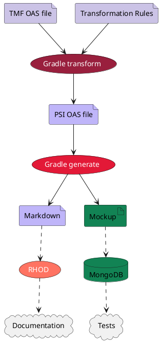

=begin

# Automated Generation of OpenAPI Specification files

[[_TOC_]]

=end

## OpenAPI Specification files

Within the ODA framework, TM Forum hosts several API documentation files defining structure, endpoints and data models of TM Forum Open APIs.
Those files - in TM Forum v4 called *swagger* files, in TM Forum v5 denoted as *OpenAPI Specification (OAS) files* - represent full definitions of APIs, rendered machine-readable.
As such, developers can use these files to automatically generate libraries or test their implemented endpoints.
Ensuring consistency across different implementations of TM Forum APIs, these OAS files are building the basis for TM Forum consistent API extensions or adaptions.

During the course of PSID, we migrated our APIs to match the OAS definition.
As TM Forum moved forward to API version 5, the changes introduced to the previously denoted *swagger* files to *OAS* files reflect the key updates in version 5.
Amongst those updates are:

* enhanced features and capabilities for API descriptions
* strongly-typed characteristics, including removal of value type ANY
* introduction of mandatory @type attribute, serving as additional layer of validation
* addition of various address fields, improving the address handling
* referencing between Party/Party Role Management APIs and Geographic Address API
* allowance for polymorphism, featuring extensibility and unification of APIs

OAS files are usually presented in JSON or YAML format and exist in different versions.
All OAS files are available in TM Forum's GitHub repositories as well as in official documentation.

## Creation of PSI OAS files

The aforementioned OAS files serve as template for PSI rendered OAS files.
For this purpose, we introduce a Gradle based transformation language that is part of the public PSI repository.
Gradle[^1] is a well-known open source build automation tool, designed for Java, Android and Kotlin software development.
As such, it supports building, testing and deploying software, compiling source code and packaging of software applications.
It allows defining build tasks and configurations and offers a rich ecosystem of plugins extending its functionality to various domains.
Furthermore, to improve build speed, incremental builds and parallel task execution are being supported.

The language allows the creation of transformation tasks inside the `build.gradle` configuration file.
Each task is reading one input file from the TMF API definitions, applies a set of transformations and writes the result to the PSI API definition folder.
The transformations vary from case to case, but are based on the following key principles:

* Removal of unwanted endpoints and associated schemas
* Addition of endpoints, especially for templates
* Unification of schemas that diverge between the different TMF definitions by defining one master file and importing the given schema to all others
* Removal of non-applicable attributes
* Addition of SatCom related attributes

Gradle also generates and builds a mock-up Java project including all defined end points.
As Documentation as Code is strongly emphasized in PSI, the resulting API definition is rendered as Markdown documentation as well and hosted within our repository.
Thus, the DaC pipeline is applied to generate the ICD based on those definitions and places the JSON schema files as annex to the ICD.

The aforementioned endpoints insert the data into a MongoDB instance, to be used in subsequent testing.
MongoDB[^2] is an open-source NoSQL database using a document-oriented data model.
It is designed for scalability, flexibility and high performance.
As opposed to relational databases storing data in tables and rows, MongoDB stores data in JSON-like documents with dynamic schemas.
Thus, it supports evolving data models and, being optimized for fast reads and writes, supports high performant tasks for real-time applications.

{#fig:oasCreation}

### Validation of OAS files

AITF (cp. chapter Automated Integration Test Framework) is used to validate the end points and our APIs.
It sends tests data to the Mockup, which in turn validates the request and inserts the data in our MongoDB instance.
Subsequently, AITF verifies the answer being positive and matches the input data with the data now being present in the database.
In a next step, AITF changes some specification and again verifies that these changes have been accepted.
Finally, the AITF deletes the entry and again checks that the operation is working correctly as well.

[^1]: See https://gradle.org/
[^2]: See https://www.mongodb.com/