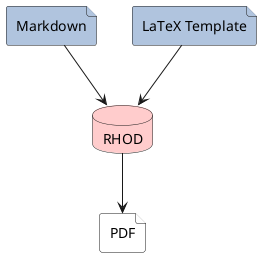
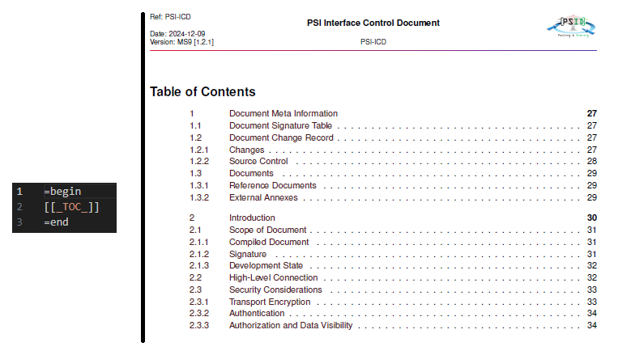
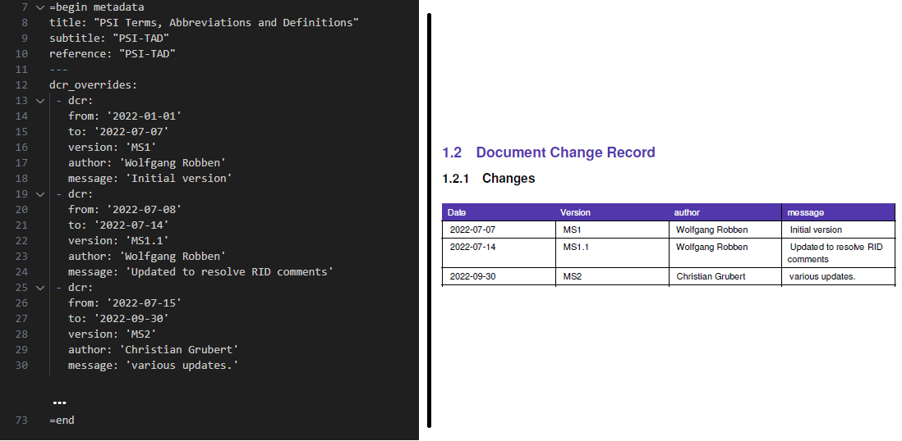
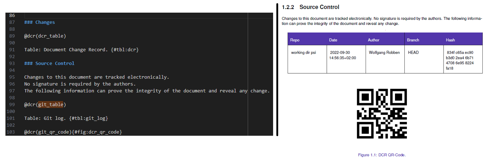
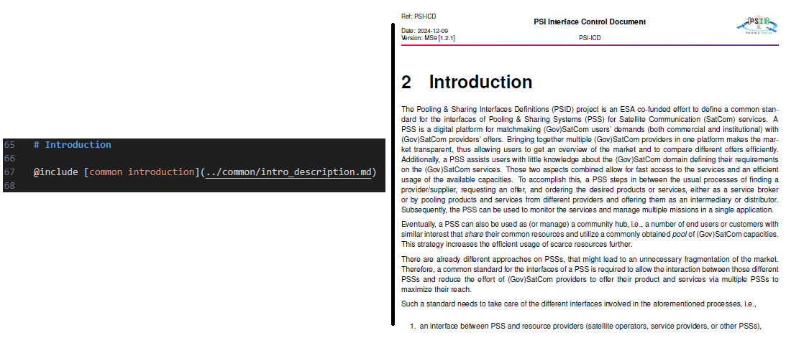
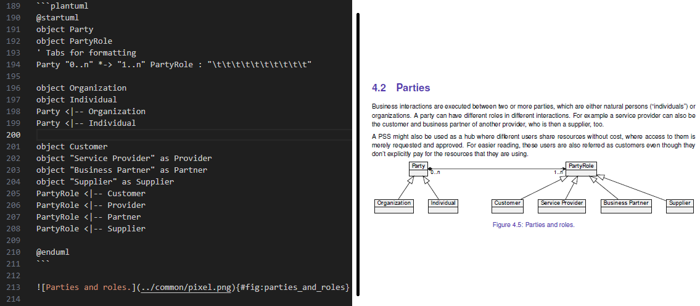

=begin

# DaC application in PSID

[[_TOC_]]

=end

In the context of the PSID project, we have adapted DaC to take advantage of the benefits described above.
All documentation is hosted alongside the codebase, in the same repository, and pushed regularly to GitLab as artifact (cp. document PSI-SDP).
The resulting documents are converted to PDFs and finally delivered to the customer.

## Technical implementation

In PSID, all documentation is written in Markdown, a lightweight markup language designed for creating formatted text with a plain-text editor.
The syntax is easy-to-read as well as easy-to-write, allowing to format plain text without using complex syntax mechanisms.
Elements like headings, lists, bold or italic text can be created using simple text formatting like punctuation or familiar characters like asterisks or hashtags:

```
**bold**
```

will be presented as **bold**, while

```
*italic*
```

will be presented *italic*. Hashtags are used to identify chapters and, related to the number of hashtags, as subchapters

```
## Subsection Level 1
```

Primarily used for README files, Markdown was quickly established as standard for collaborative software development, e.g. as standard documentation form in GitHub repositories.

Within PSID, the repository contains the codebase next to the documentation baseline.
Each aspect of documentation is written in granular Markdown files, which are organized in dedicated folders.
As example, each decision record is written in a granular file, but located in a folder hosting all content for the PSI-MADR deliverable.
Some sections of our documentation however are part of a common introduction or preamble.
Those sections are written on granular level as well, and hosted in a *common* folder to be used by all deliverables.

While Markdown has proven very powerful for short, simple documents, Markdown is not best choice for advanced documents.
As example, footnotes cannot be supported easily.
Additionally, more sophisticated stylings like table captions, table of content, references to other sections or documents as well as inclusion of other documents are not natively supported by Markdown.
Change records, desirable for understanding the document's evolution, is also not natively supported in Markdown.

### RHOD

To overcome these shortcomings, a bespoke toolset called RHOD (Ruby Handles Our Documents) was adapted to the specific needs of PSID.
RHOD is a Ruby-based tooling, rendering Markdown files using specific markers to LaTeX files and finally to PDF documents.

LaTeX is widely used in academic and technical fields for typesetting documents.
Thus, it supports focussing on the content rather than the formatting of a document.
The formatting is usually done applying a LaTeX template file, which includes styling commands like introducing hyperlinks, clickable references to other document sections, figures or tables, and commonly styled headers and footers in the resulting document.
While LaTeX supports output formats like HTML, EPUB or PostScript, LaTeX files are most commonly transferred to rendered PDF files.
Those files are then styled according to the settings in the template, i.e. including hyperlinks and automated references within the document.
RHOD makes use of those features and, applying a defined template, renders the initial written MarkDown files via LaTeX to PDF documents.



{#fig:rhod_pipe}

#### RHOD Markdown syntax

RHOD interprets specific Markdown syntax, using those as configuration items for adapting the resulting PDF according to the LaTeX templae.
For a better understanding, the following images depict the Markdown code on the left, the rendered PDF output on the right.
In addition, syntax examples are given for each chapter.

**Document Header and Meta Information**

The Markdown file includes a marker for the table of content as well as a command for rendering the document change record.
The resulting PDF then includes the complete table of content and a table denoting the change record.

{#fig:toc}

Metadata is entered into the Markdown file with syntax

```=begin metadata <text> =end```

**Document Change Record**

In the same command as in the metadata command, the Document Change Record can be defined via 

``` drc_overrides: - <...> ``` as shown in figure {@fig:dcr}.

{#fig:dcr}

To be compiled, the table needs to be included after definition via

``` @dcr(my_dcr_table) ```

in the Markdown file.

Additionally, the GIT history can be compiled using

``` @dcr(my_git_table) ```

and a QR code linking to the document history in GitLab can be included via

``` @dcr(git_qr_code){#fig:my_git_qr_code} ```

The Document Change Record is then listed as table, showing the date of change, the version, the author and the intended changes.
The GIT history is compiled within Markdown to be rendered as table in the resulting PDF, including the latest change record and the corresponding hash of the commit.
The QR code is shown on the compiled PDF, as can be seen in figure {@fig:dcr2}.

{#fig:dcr2}

**Referencing**

Different figures and tables might need to be referenced in the document.
As can be seen in figure {@fig:dcr2}, the QR code figure is marked after inclusion by

``` {#fig:myFigure} ```

Referencing in text is done using the @-sign, e.g.

``` as can be seen in figure {@fig:myFigure} ```

The same holds true for tables, substituting *fig* with *tbl*.

**Including other Markdown files**

As already outlined, Markdown has proven to be very powerful for short documentation, but not for large, excessive documentation.
In PSI, each document consists of granular sections that are stored in dedicated Markdown files, e.g. the common introduction.
This allows to re-use granular documentation sections for all documents, as for instance the common project introduction.
These sections are referenced within Markdown files as

``` @ include[defined doc name](path-to-md-file) ```

as can be seen in figure {@fig:include}.
{#fig:include}

**UML diagrams**

Within our documentation, we use UML diagrams to represent workflows, dependencies or different aspects of a concept.
These diagrams are annotated in PlantUML, an open-source tool using simple, text-based language.
As such, the annotation of each UML diagram is seamlessly included in the overall document.
Therefore, the diagrams are versioned alongside the documentation, enabling to spot differences between newly committed and previous versions of the diagram in the review.
An example of a UML diagram, written in PlantUML, and the corresponding rendering is shown in figure {@fig:plantuml}.

{#fig:plantuml}

The resulting image is rendered as vector image, allowing seamless zooming at any screen size.
Additionally to PlantUML, Mermaid and Vega graphs are supported by RHOD.

## Automated documentation compilation

As outlined above, DaC facilitates documentation and coding in same environment and allows handling documentation as artifact within GitLab.
Thus, CI/CD pipelines can be set up to automatically generate documentation alongside code sanity checks, e.g. via Linters or SonarQube.
In PSID, we include RHOD in our CI/CD pipeline to be running after each commit.
The documentation is then automatically rendered and delivered as downloadable artifact.
Also, some documentation like our ICD document is being generated using the same pipeline; this is being described in more detail in subsequent chapters.
In addition, a watermark is included on each finalized document, allowing to distinguish between pre-delivery documents or documents that can be delivered towards the customer.
