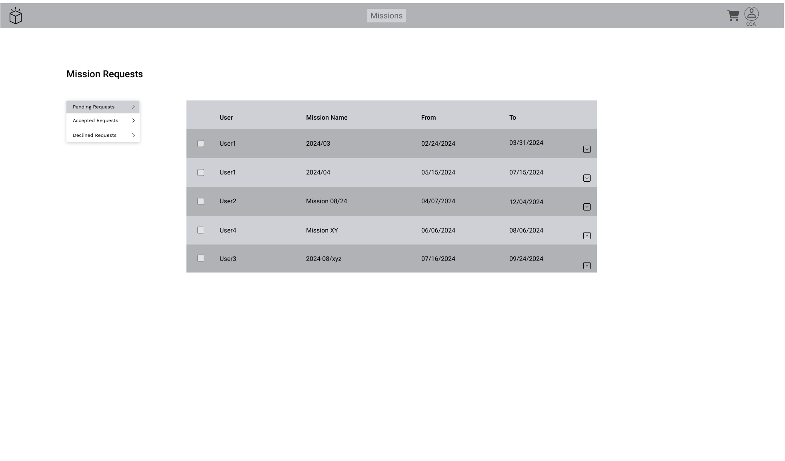
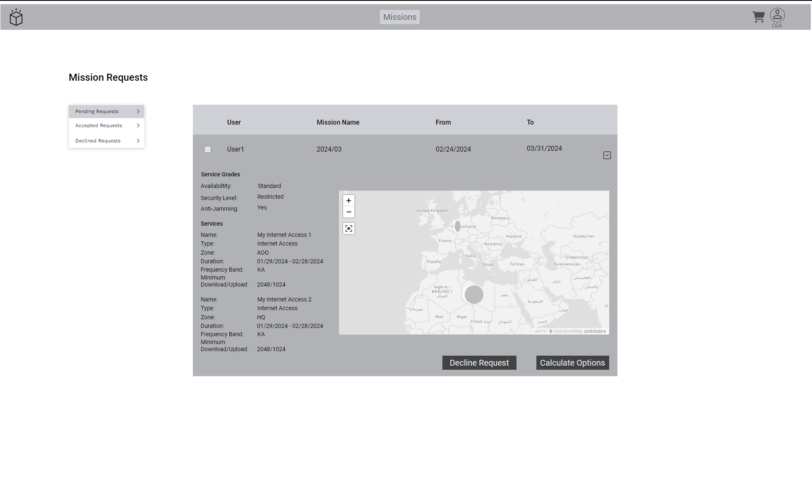
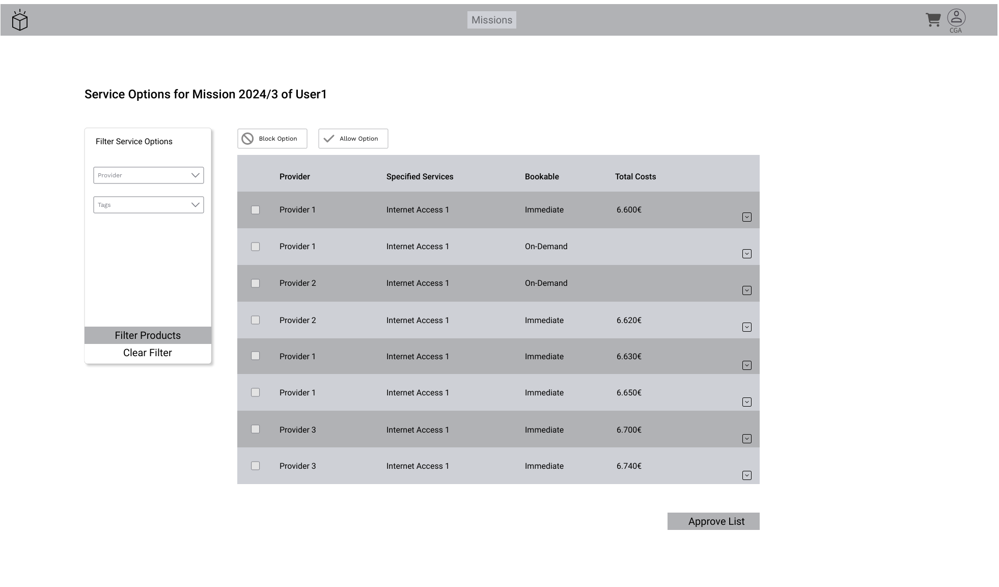
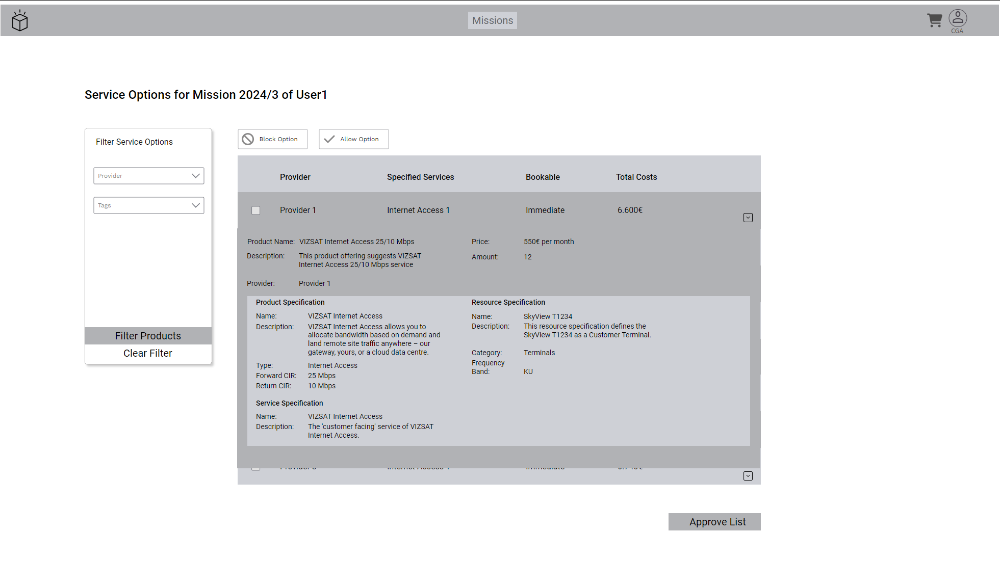
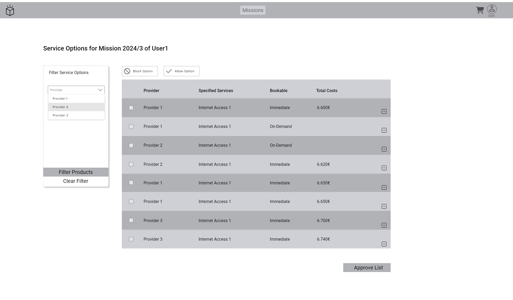

### Distributed Matchmaking

#### Mission Requests

| Actor | Consumed API(s) |
|-------|-------------|
| CGA | PSID001 Customer Inquiry |

Table: Parameters of all Distributed Matchmaking Views - CGA. {#tbl:parameters-distributed-matchmaking-views-cga}

{#fig:mission-request}

The CGA receives mission requests from the users, which are listed in the view above.
These missions must be reviewed and the CGA can accept or decline them.

{#fig:mission-request-details}

By clicking on a row, the details' panel will open underneath.
The CGA can review all data to which it has access and can decide to decline the request or trigger the matchmaking process by clicking on the 'Calculate Options' button.
Some information might be restricted and not shown to the CGA.
This will be pre-filtered in the backend.

#### Offered Products

| Actor | Consumed API(s) |
|-------|-------------|
| CGA | PSID620 Product Catalog |
| CGA | PSID001 Customer Inquiry |

Table: Parameters of all Offered Products Views. {#tbl:parameters-offered-products-views}

{#fig:offered-products}

After triggering the matchmaking, the results are shown in a list.
The checkbox on the left side in the row can be checked, which will enable the 'Block Option' and 'Allow Option' buttons above.

{#fig:offered-products-details}

Clicking a row will open the details panel below.

{#fig:offered-products-filter1}

{#fig:offered-products-filter2}

The list can be filtered using the component on the left.
In this example, it can be filtered by provider and by tags, as can be seen in the two images above.
The CGA can then use the checkmarks in the rows to enable the buttons to block or allow product offers.
When the CGA has marked at least one option as allowed, the list can be approved with the button underneath the list: 'Approve List'.
All allowed options will then be visible to the user.
