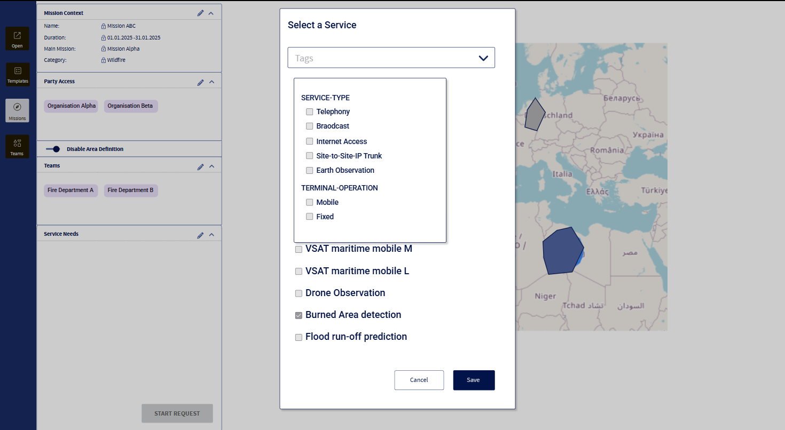

=begin

# Mission Management ODA Component GUI

[[*TOC*]]

=end

The development of a mission management ODA component, which we are aiming to publish on GitHub, is an important target for PSI.
One part of it is the frontend design to give a better understanding of how this component is used by different actors.
As already described in the user journey mission creation, we draw a crisis scenario, where the different actors have specific roles and use the system in different ways.
For now, we describe the top level mission planning, where the actor has a governmental role, and a more specific sub-mission planning, where the actor will plan around a specific area and with certain teams.
Until the end of the project, the UI-layout can still be extended and improved.

A proof-of-concept implementation will also follow.

## Top Level Mission Planning

| Actor | Consumed API(s) |
|-------|------------- |
| User | PSID002 Mission API |
| User | PSID632 Party API |

Table: Parameters of Top Level Mission Planning Views. {#tbl:main-mission-creation-views}

The top level mission planner defines the frame for all sub-missions.
This can be done by:

* Creating templates and
* Creating main missions.

{#fig:open}

The starting point in the GUI is shown in the image above.
The main navigation, including

* Open
* Templates,
* Missions and
* Parties

as navigation items, is placed on the left.
In this case, the user presses the "Open" button.
Then, a sub-navigation opens to the right of the main navigation, showing various possible items to open, sorted by category.
The operator wants to open a blank file and presses "Open Blank".

{#fig:open-blank}

After that, a blank form is displayed and the sub-navigation closed.
It can be reopened when the user clicks on the "Open" button of the main navigation, again.

After the user filled in the form, at least the required fields, it can be saved either as template or as mission.
A mission needs a start date and an end date, in addition to a name and a Party Access selection.
This can be communicated to the user by only enabling the "Save as Mission" button, when all required fields are populated.
The lock icons indicate whether or not the parameters are editable within a sub-mission.
The "Access Parties" defines, which parties have access rights to the mission or template and who can create sub-missions.
Existing missions can be added as sub-missions, but the values must follow the main mission frame.
The detailed information of a sub-mission, like individual members of the teams attached, are not accessible from the main mission.
The need-to-know principle is applied.

{#fig:open-template}

The image above shows the sub-navigation for the template management.
All existing templates are listed, and a search bar is provided to search for a specific template.
Here, only a few templates exist, but this number will grow with time.
The operator chooses the template for wildfire.

{#fig:open-template-wildfire}

The template for wildfire was created earlier.
The operator can change any value or enter dates before saving the template as a mission.

{#fig:open-mission}

The image above shows the sub-navigation for the mission management.
All existing missions are listed, and a search bar is provided to search for a specific template.
Here, only a few missions exist, but this number will grow with time.
The list can show all missions, only the current missions or the missions in the archive.
The operator chooses to open "Mission Alpha".

{#fig:open-mission-wildfire}

The operator can further fill the mission form.
The category can be set, party access can be managed and sub-missions can be added.
The operator can enable the area definition.
This can be seen in the next image.

{#fig:open-mission-wildfire-area}

The mission data display shifts to the left in order to give the map component the required space.
The sub-menu indicates the view on the mission, which will be further described in the chapter [Sub-Mission Planning](#sub-mission-planning).

{#fig:open-party}

The image above shows the sub-navigation for the party management.
All existing parties are listed, and a search bar is provided to search for a specific party.
Here, only a few parties exist, but this number will grow with time.

Selecting a party from the list opens a card, which displays all detailed information.
This view is read only, since the party management is out of scope of the mission management component.

## Sub-Mission Planning

| Actor | Consumed API(s) |
|-------|-------------|
| User | PSID002 Mission API|
| User | PSID001 Customer Inquiry |

Table: Parameters of Sub-Missions Planning Views. {#tbl:sub-mission-creation-views}

Sub-missions are part of a main mission, which builds the frame of all sub-missions.
Some values may be locked by the main mission and cannot be changed within the sub-mission, such as "category".
The start and end of a sub-mission must be between the start and end of the main mission.
A sub-mission can include other sub-missions.

The creation of a sub-mission follows the same procedure already described in the previous section [Top Level Mission Planning](#top-level-mission-planning).

{#fig:open-mission-wildfire}

The image above shows a view on the sub-mission "Mission ABC".
Mission data are displayed on the left and can also be adjusted from here.
To specify services, the operator goes to "Service needs" and presses the pencil icon.

{#fig:add-service}

A dialogue pops up, which offers a list of services.
The operator can select the required services and save the selection.

{#fig:service-filter}

The list can be filtered by tags.
When clicking on the "Tags" field, a list of filter tags appears in the drop-down.
The filtered results will be shown and after selecting services and saving the selection, the dialogue will be closed.

{#fig:services}

After adding the services, they are displayed underneath "Service Needs" on the left.
Below each service, input fields enable the operator to assign the service to teams and areas.
While the areas are required, teams are optional.
The button "Start Request" will send the request to the inquiry API.

{#fig:assign-service-to-team}

When clicking on the drop-down "Select Teams" the operator can select teams from a list.

{#fig:service-assign-area}

When clicking on the drop-down "Select Area" the operator can select the area from a list.

{#fig:advanced-service-settings}

The operator can enable the configuration of advanced service attributes.
After the operator toggled the switch "Show Advanced Settings" underneath the input for area selection, more fields are displayed to the user.
That allows the operator to manipulate the template-based value of e.g. data rates.
The advanced settings shown here are just an example and can be different for other service types.

{#fig:location-view}

A mission can be looked at from different viewpoints:

* location view,
* calendar view and
* logical view.

The operator can switch views by using the sub-navigation above the map.
See the image above.

{#fig:calendar-view}

The image above shows the calendar view, which will be realised by a Gantt chart.
Here, the operator can get an overview of the start and end dates of sub-missions or team assignments.

The image above shows the logical view.
It shows the relations between missions, services, teams etc. in a node diagram.

{#fig:teams}

The image above shows the sub-navigation for the team management.
All existing teams are listed, and a search bar is provided to search for a specific team.

{#fig:open-team}

Selecting a team from the list opens a card, which displays detailed information.
Teams are seen and treated as resources.
This view is read only, since the team management is out of scope of the mission management component.
