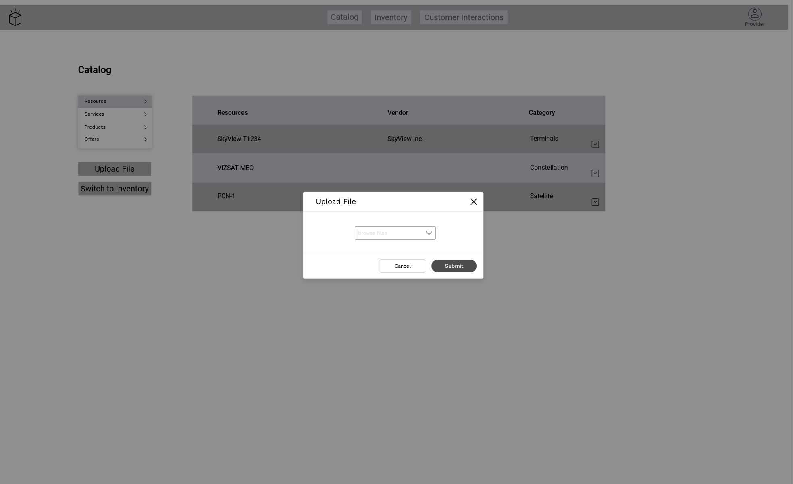
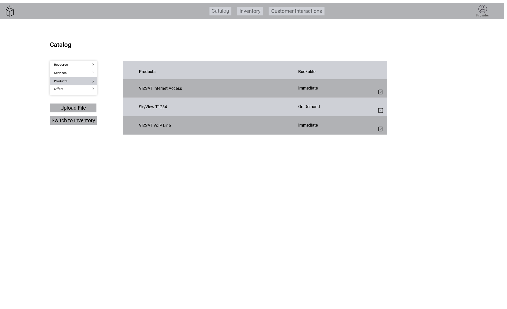
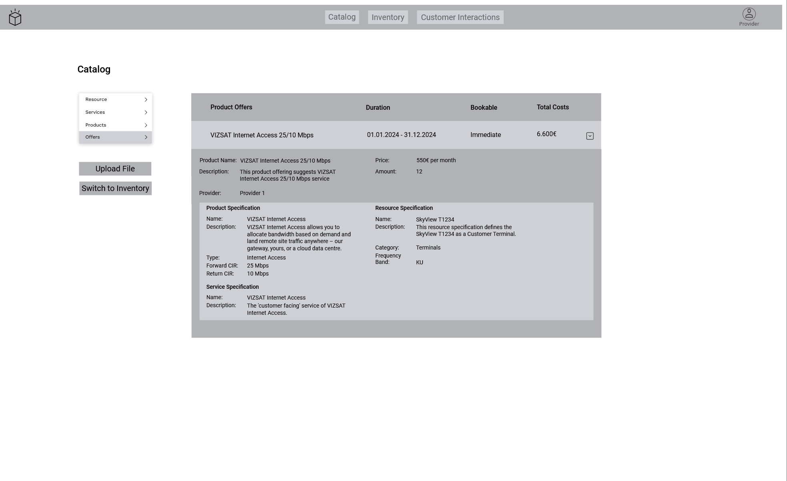
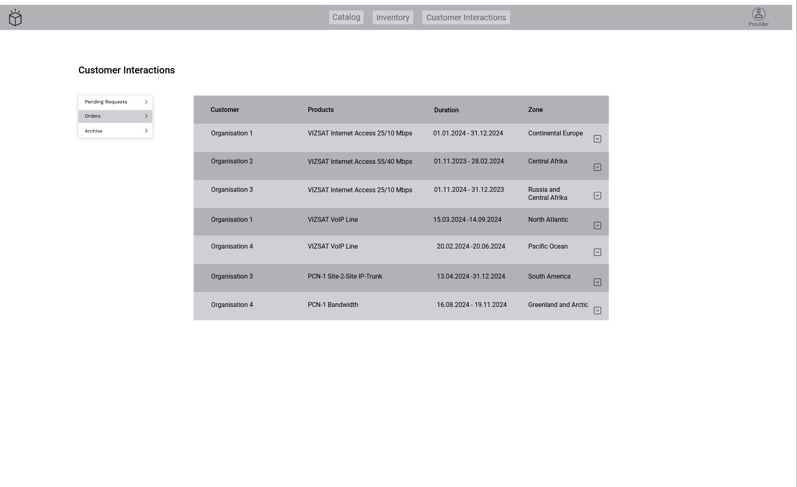

=begin

# Provider Journey

[[*TOC*]]

=end

To interact with the system, the provider needs a graphical interface.
The GUI provides a dashboard to get an initial overview and to get a quick-start for some action.
Further views are catalog, inventory and customer interactions.
The character of these views are described below.

{#fig:provider-dashboard}

The dashboard is the entry-point for all possible views and actions.
It can scale alongside the application and might potentially also show metrics and statistics about certain topics.
For now, it foresees quick actions, for example to see incoming RFQs directly.

{#page:break}

## Catalogs

### Resource Catalog

| Actor | Consumed API(s) |
|-------|-------------|
| Provider | PSID634 Resource Catalog |

Table: Parameters of all Catalog Resources Views. {#tbl:parameters-catalog-resources-views}

{#fig:catalog-resources}

The catalog view provides the catalogs for resources, services, products and offerings.
The different catalogs can be accessed by the side-navigation on the left.
The buttons below provide a file upload for files in a specific format (e.g., JSON or another structured file format that can be mapped to the M2M interface) and a direct switch to the inventory view.
The figure above shows the catalog example for resources.

{#fig:catalog-resource-details}

When clicking on the row, the panel for details opens below the row and displays the resource specifications, as shown in the figure above.
The details can be closed by clicking on the row a second time.

{#fig:catalog-file-upload}

Though the catalog and the inventory data is provided by a database, which is maintained by the provider, it is foreseen to provide an option to upload files via the GUI as an alternative to the direct M2M interface.
The image above shows the confirmation dialogue.
This process is the same for all categories within catalog and inventory and their consumed APIs.

{#page:break}

### Service Catalog

| Actor | Consumed API(s) |
|-------|-------------|
| Provider | PSID633 Service Catalog |

Table: Parameters of all Catalog Services Views. {#tbl:parameters-catalog-services-views}

{#fig:catalog-services}

This view shows the list of all services that are part of the catalog.

{#fig:catalog-service-details}

Similar to the resource details, the details of a specific service can be opened or closed by clicking on the row, as shown in the image above.

{#page:break}

### Product Catalog

| Actor | Consumed API(s) |
|-------|-------------|
| Provider | PSID620 Product Catalog |

Table: Parameters of all Catalog Products and Offerings Views. {#tbl:parameters-catalog-products-views}

{#fig:catalog-products}

This view shows the list of all products that are part of the catalog.

{#fig:catalog-product-details}

Similar to the resource and services details, the details of a specific product can be opened or closed by clicking on the row, as shown in the image above.

{#fig:catalog-offerings}

This view shows the list of all offerings that are part of the catalog.

{#fig:catalog-offering-details}

Additionally, the details of a specific offering can be opened or closed by clicking on the row, as shown in the image above.

{#page:break}

## Inventories

### Resource Inventory

| Actor | Consumed API(s) |
|-------|-------------|
| Provider | PSID639 Resource Inventory |

Table: Parameters of all Inventory Products and Offerings Views. {#tbl:parameters-inventory-resources-views}

{#fig:inventory-resources}

The inventory view provides the inventory for resources, services, products, and offerings.
The different categories can be accessed by the side-navigation on the left.
The buttons below provide a file upload similar to the catalogs and a direct switch to the catalog view.
The figure above shows the inventory example for resources.

{#fig:inventory-resource-details}

When clicking on the row, the panel for details will open below the row and shows the list of resources, that are owned by the provider, as shown in the figure above.
The details can be closed by clicking on the row a second time.

{#page:break}

### Service Inventory

| Actor | Consumed API(s) |
|-------|-------------|
| Provider | PSID638 Service Inventory |

Table: Parameters of all Inventory Services Views. {#tbl:parameters-inventory-services-views}

{#fig:inventory-services}

This view shows the list of all services that are part of the inventory.
Note that only services being part of booked products can be part of the inventory.

{#fig:inventory-service-details}

Similar to the resource details, the details of a specific service can be opened or closed by clicking on the row, as shown in the image above.
It shows a list of organisations that are using the specific service on their mission(s).

{#page:break}

### Product Inventory

| Actor | Consumed API(s) |
|-------|-------------|
| Provider | PSID637 Product Inventory |

Table: Parameters of all Inventory Products and Offerings Views. {#tbl:parameters-inventory-product-views}

{#fig:inventory-products}

This view shows the list of all products that are part of the inventory.
As with services, products can only be part of the inventory if they have been booked.

{#fig:inventory-product-details}

The opened detail panel shows the amount of booked products, the duration, and the booking organisation.

{#page:break}

## Customer Interactions

### Incoming Customer Inquiries

| Actor | Consumed API(s) |
|-------|-------------|
| Provider | PSID001 Customer Inquiry |

Table: Parameters of all RFQ Views. {#tbl:parameters-provider-rfq-views}

{#fig:interactions-pending}

The customer interactions view provides the pending requests, the orders, and the archive.
If required, an archive function can be added here.
This might change in the future.
The different categories can be accessed by the side-navigation on the left.
The figure above shows the example for pending requests.
This is indicated by the 'Status' column, where all entries are marked as 'Request'.

{#fig:interactions-pending-details}

When clicking on the row, the panel for details will open below the row and show the details of the request, shown in the figure above.
The two options to proceed with the request are represented by the buttons at the bottom right.
In case no offering can be made, for example because one or more resources are not available, the 'Decline Request' button can be clicked.
The customer should get a notification about the denial.
In case the provider wants to make an offering, they click the 'Offering Price' button.
This leads to a dialogue that is described in the next figure.
The details can be closed by clicking on the row a second time.

{#fig:interactions-pending-create}

To create an offering, a price has to be entered and a period - like monthly - can be selected.
After submitting, the offering is sent to the customer.

{#page:break}

### Incoming Product Orders

| Actor | Consumed API(s) |
|-------|-------------|
| Provider | PSID622 Product Ordering |

Table: Parameters of all Customer Interaction Views. {#tbl:parameters-customer-interaction-views}

{#fig:interactions-orders}

This view shows the list of all placed orders.

{#fig:interactions-order-details}

The details are displayed below the corresponding row and contain the necessary information to give a comprehensive overview of the order.
