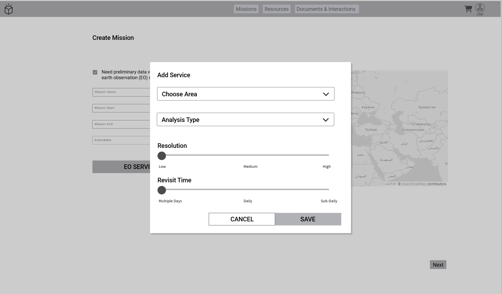
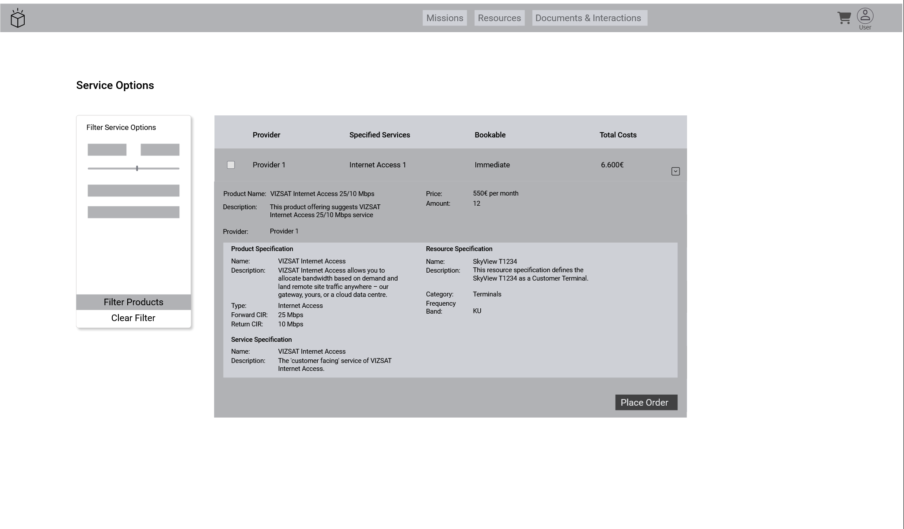
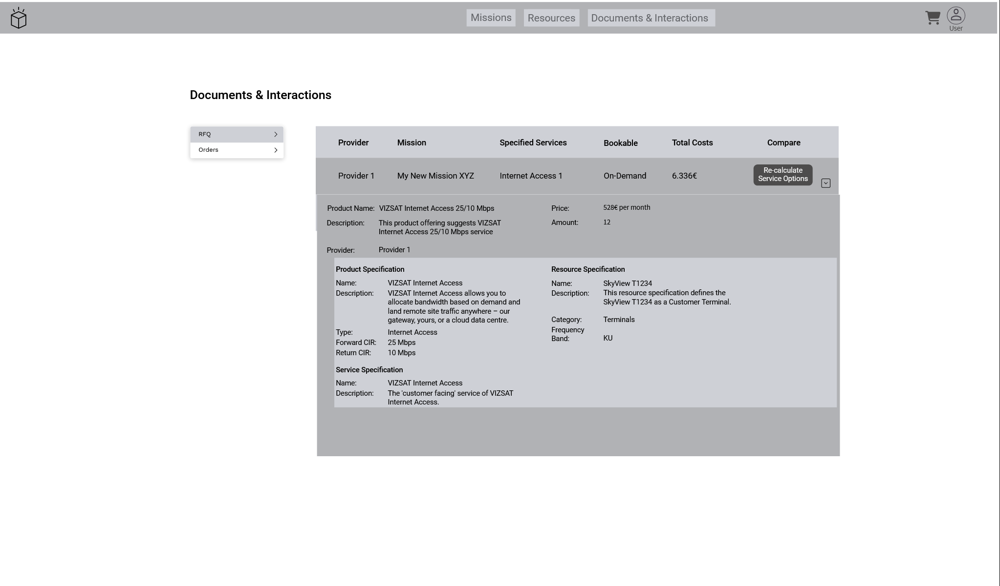

=begin

# User Journey

[[*TOC*]]

=end

## Mission Creation

| Actor | Consumed API(s) |
|-------|-------------|
| User | PSID002 Mission API|

Table: Parameters of all Mission Creation Views - User. {#tbl:mission-creation-views-user}

{#fig:mission-creation}

The user starts the creation of a mission by entering rudimental data such as

* defined mission zones (by drawing on the map),
* start and end date of the mission,
* extendability of the mission.

In the following chapters, we draw a scenario for crisis response situations in which the crisis responder

* needs to gather more information about the situation before sending teams into the field
* has gathered enough information and is able to get a fuller picture of the situation and expand the deployment to include teams and products

### Mission Creation - Gather Intelligence

{#fig:mission-creation-gather-intelligence}

To gather intelligence in threatening situations while facing a crisis event, it is crucial to have access to e.g. earth observation products as a tool to get a better understanding of the crisis.
Therefore, this example provides a shortcut to fast-booking earth observation products.
By checking the checkbox "Need preliminary data via earth observation (EO) services", the button "EO Services" appears below the input field.

{#fig:mission-creation-gather-intelligence-add-eo}

The button "EO Services" opens the service dialog with a preselected filter "Earth Observation".
A list of services is shown, and the user can select e.g. "Burned Area Detection".

{#fig:mission-creation-gather-intelligence-specify-eo}

After applying the selection, the user can further specify the service according to their needs and save the configuration.

{#fig:mission-creation-gather-intelligence-service-added}

The chosen service is shown in a list below the mission input fields.

### Mission Creation - Extend Mission

With the last step from previous section, the [Mission Creation](#mission-creation), everything is in place to proceed by hitting the "next" button and performing the service definition.

{#fig:mission-creation-define-services}

The user can either choose a template, which offers pre-defined services, or add services to mission, team or both directly.
For the next step, we choose a wildfire template to automatically put some services to the list.

{#fig:mission-creation-template-wildfire}

Three services related to wildfire are put to the mission services list.
This means, they are directly attached to the mission and not to a team.
Any service could be moved to any team, that is part of the mission.

{#fig:mission-creation-teams}

By toggling the tab list, it is easy to change between mission services and team services.
Also, the teams in the list are pre-selected through the template.
The graph shows the teams and their services and how these services connect them.
By clicking the "plus" icon-button beneath "team Services", teams can be added to the mission.

{#fig:mission-creation-add-team}

A dialog provides the option to select a team.
Teams in general are created by the governance or other stakeholders and could e.g. be uploaded as json file or it could be possible to integrate a "teams editor" to the system.
This is currently not part of the PSID project but may be in the future.

{#fig:mission-creation-team-config}

The image above shows the "Select a Team" component in detail.
The user chooses the category, the team and the area.

{#fig:mission-creation-team-add-service}

Also, services can be attached to the team directly.
When clicking the "SERVICES" button, a list of services is shown.
This list can be filtered according to previously assigned tags.

{#fig:mission-creation-team-configure-service}

The service can then be configured according to the user's needs.

{#fig:mission-creation-team-with-service}

Then, the team is created and the teams' services are shown underneath the team.
By clicking on "SAVE" the team is created.
The assigned services are shown underneath the team.
Once everything is ready, the user can continue with the summary of the mission by clicking on the “Next” button.

{#fig:mission-summary}

The mission summary view gives a good overview over all defined items.
Below 'Services', all user-specified services are listed.
By clicking on a row, a details' panel shows further details about the service.
The user can still go back to make any changes or trigger the matchmaking process from here, by clicking on "Request Service Options for Mission".

## Distributed Matchmaking

| Actor | Consumed API(s) |
|-------|-------------|
| User | PSID001 Customer Inquiry |

Table: Parameters of all Distributed Matchmaking Views - User. {#tbl:parameters-distributed-matchmaking-views-user}

The basis for the wireframes is the UCSM study (a CGI IP developed together with ESA).

{#fig:mission-summary}

For the user journey, the wireframes for PSID start just after the process of defining a mission.
This image shows an example of how a user could have defined a mission to specify the communication needs.
This includes at least

* defined mission zones (displayed on the map),
* start and end date of the mission,
* and service grades.

Below 'Services', all user-specified services are listed.
By clicking on a row, a details' panel shows further details about the service.

{#fig:mission-summary-service-details}

In this case, the matchmaking process is performed by a third party (CGA), which could also act in a governmental role.
When the user clicks the button 'Request Service Option for Mission', the request is sent to a third party which checks the request and, if the check passes, triggers the matchmaking.

{#fig:mission-summary-modal}

The dialogue informs the user that the request successfully has been sent. Subsequently, the user is notified upon completion of the third-party process.

{#page:break}

## Offered Products

| Actor | Consumed API(s) |
|-------|-------------|
| User | PSID001 Customer Inquiry |

Table: Parameters of all Offered Products Views. {#tbl:parameters-offered-products-views}

{#fig:service-options}

Once the third party described above has validated the mission specified by the user and triggered the matchmaking, the results are sent to the user.
Shown above is the list of found service options.

{#fig:service-option-details-immediate}

By clicking on the row, the detail panel opens below the row.
The offering is immediately bookable.
If the user decides to book it, they can click on the button in the lower right corner *Place Order*.

{#fig:service-options-details-on-demand}

The image above shows the details of an on-demand service option.
The user can trigger a *Request for Quote* (RFQ) to get an offering from the provider.

{#fig:service-options-rfq}

The RFQ must be confirmed by clicking the submit button to send the request to the provider.

{#fig:offered-products}

The product offers are not limited to SatCom products, only.
By using the appropriate API, if available, any product can be integrated.
The view above shows a list of offers for earth observation products.
The system can also bundle products of different categories into a single offer.

{#fig:offered-products-success}

When the user decides to book an offer by clicking the "book" button, a dialog informs about the success of the booking - as shown above.

{#page:break}

## Shopping Cart

| Actor | Consumed API(s) |
|-------|-------------|
| User | PSID663 Shopping Cart |

Table: Parameters of the Shopping Cart View. {#tbl:shopping-cart-view}

{#fig:shopping-cart}

The shopping cart stores all order items, ready to be ordered.
For example, when the user selects a service option, which is immediately bookable, the order item will be stored in the shopping cart.
They can store several order items there and checkout all at once.

{#page:break}

## Documents & Interactions

### Outgoing Customer Inquiries

| Actor | Consumed API(s) |
|-------|-------------|
| User | PSID001 Customer Inquiry |

Table: Parameters of all RFQ Views. {#tbl:rfq-views}

{#fig:user-interactions-rfq}

The 'Documents & Interactions' area provides all views concerning RFQs and orders.
This can be navigated by the side navigation on the left.
The image above shows the requested quotes.
In the 'Total Costs' column, the initial value should be 'status: pending' because the provider did not answer the request yet.
As soon as the provider makes an offering, it shall show the offered price and the button 'Re-calculate Service Options' is enabled.
This gives the opportunity to trigger the matchmaking process again with the same parameters entered for the first calculation.

{#fig:user-interactions-rfq-details}

By clicking on the row, the 'details' panel of the service option is shown below the overview row.

{#page:break}

{#fig:user-interactions-recalculation}

The image above shows the list of service options including the requested service option.

{#page:break}

### Outgoing Product Orders

| Actor | Consumed API(s) |
|-------|-------------|
| User | PSID622 Product Ordering |

Table: Parameters of all Ordered Products Views. {#tbl:parameters-ordered-products-views}

{#fig:user-interactions-active-orders}

The view for orders shows a component, where the user can easily switch between active and past orders.
The image above shows the active orders.

{#fig:user-interactions-past-orders}

The image above shows the past orders.
