=begin

# Types and Characteristics

[[_TOC_]]

=end

The PSS defines a set of supported types for resources, services and products in consultation with the providers.
It provides them in a JSON Schema file that is made available through the API itself or can be exchanged offline.
Each type then defines *characteristics* that describe the exact nature of it.

Product types are also the fundament of the matchmaking:
The customer specifies a set of inquired characteristics and the PSS will find products that satisfy them.
The result can be a single service or resource, that satisfies all requirements, or a more or less complex combination of such, depending on the capabilities of the algorithm.
If partial matches are allowed, services that only partially match the inquired features are included into the results.

Both sides, PSS and Provider, may introduce additional characteristics, e.g. as part of the development of new or enhanced products.
In any case, no assumptions shall be made on the support of those by the other side:
If the PSS adds support for a new characteristic, it has to define a sensible, neutral default value that is applied to all specifications that do not contain the new characteristic.
No provider shall be penalized in the matchmaking for not defining it, unless the user explicitly requests the new characteristic.
If a provider sends a new characteristic, the PSS may decide to ignore it, or to accept and visualize it as-is for the customer without further handling.

The following subsections describe the set of resource, service and product types that were analysed in the course of the project.
While these are not part of the standard per se, it is sensible for most systems to support them.

## Examples

The following examples show different scenarios of how features and characteristics can be used in three phases of the service lifecycle:

1. The customer inquiry,
2. the response with matching specifications from the catalog and
3. the actual service implementation which is stored in the inventory.

They are structured according to the "Commission Implementing Decision (EU) 2023/1054", which defines the service portfolio of the Union Space Programme, and covers the service layers L0 - L2.

### Raw Bandwidth (L0)

Inquiry:

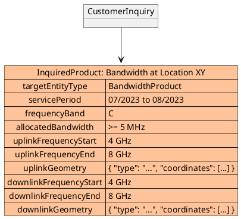

{#fig:example-inquiry-raw-bandwidth}

Results:

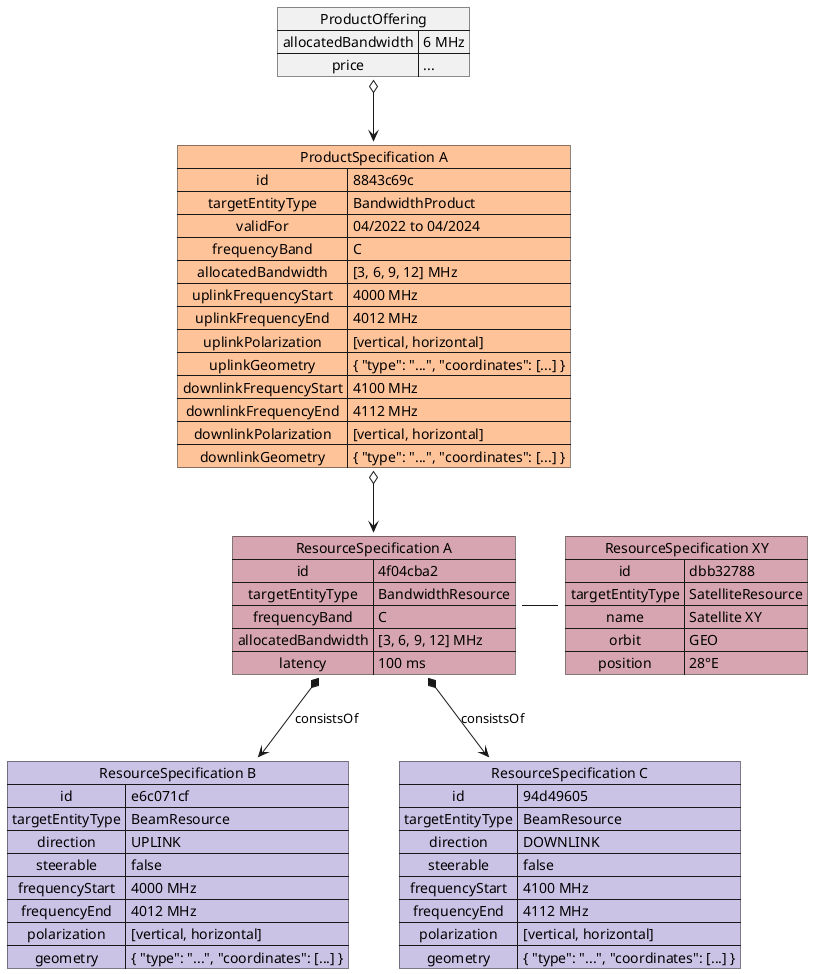

{#fig:example-results-raw-bandwidth}

=begin
We may also show the order
=end

Implementation:

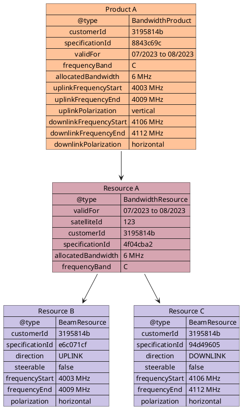

{#fig:example-inventory-raw-bandwidth}

Note that the geometry is deliberately not copied to the resource instances in this example.
Since the beams are not steerable, copying this information would most probably not add any value.
The implementation may choose to do so if justified, e.g. to track the actual configuration of steerable beams.

### Anchoring Capacity (L1)

Inquiry:

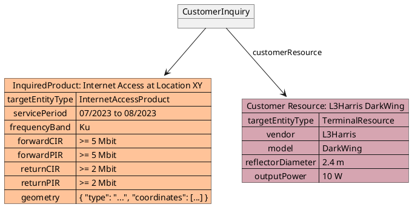

{#fig:example-inquiry-anchoring-capacity}

Results:

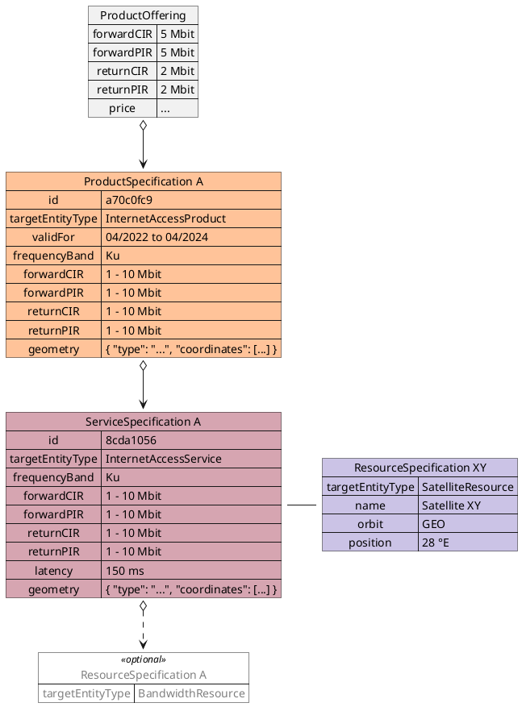

{#fig:example-results-anchoring-capacity}

Implementation:

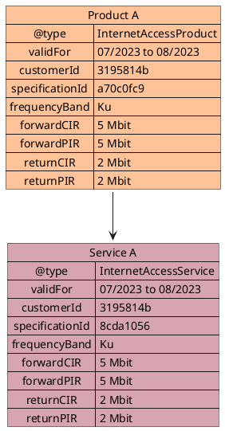

{#fig:example-inventory-anchoring-capacity}

### End-to-End Service (L2)

Inquiry:

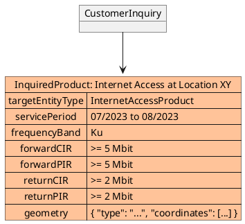

{#fig:example-inquiry-e2e-service}

Results:

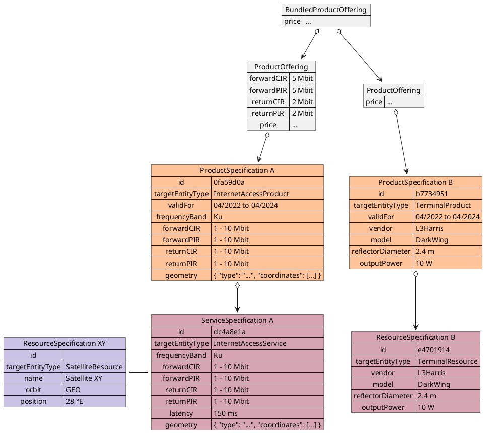

{#fig:example-results-e2e-service}

Implementation:

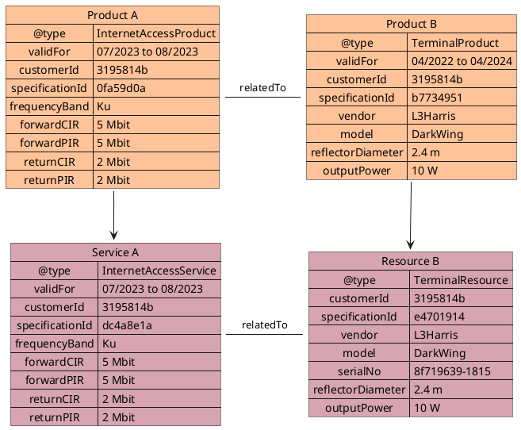

{#fig:example-inventory-e2e-service}

### Multi-Product Request

An inquiry can contain multiple product requests at the same time.
This can be used to either request different services that may be cheaper when bought as a package, or to describe varying communication needs in the course of a mission.
The following example combines both cases: the mission starts with only one end-to-end service with low information rate, then increases it and adds additional raw bandwidth.

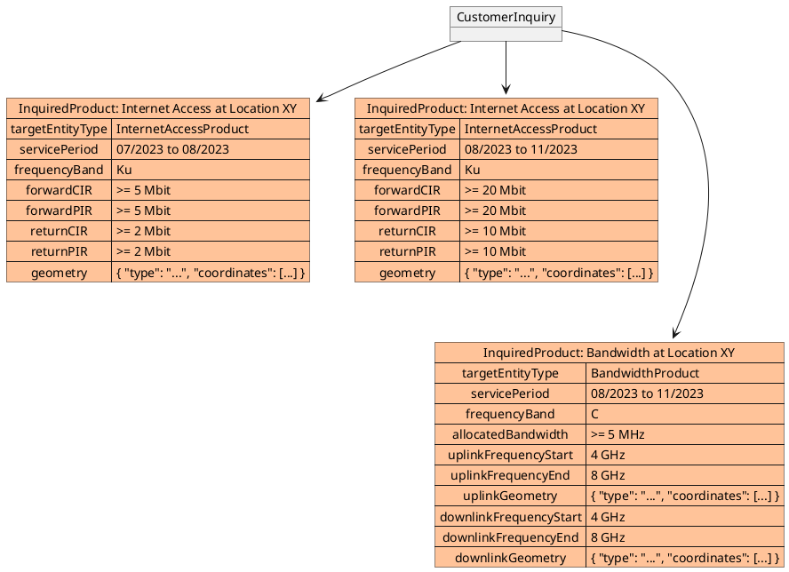

{#fig:example-inquiry-ia-bw}

The result of this inquiry is a combination of the results above and therefore not shown.
Depending on the capabilities of the matchmaking, the internet access can be fulfilled by just one provider that is able to upgrade the active service, or it could offer two services possibly by different providers.
The `BandwidthProduct` result is likely to be independent, but could also be bundled with the other two.

## JSON Schemas

The following example demonstrates the structure of a JSON Schema.
Apart from the identifier and description, the main content is the list of properties.
Each one is defined by its name and type, and can be further qualified with value constraints and whether they are required.

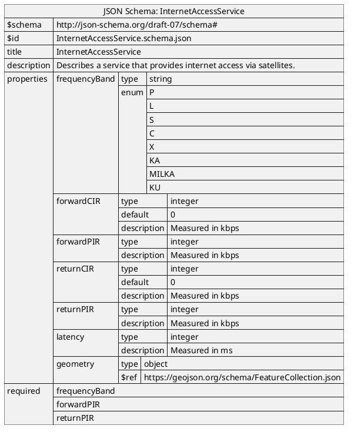

{#fig:json-schema}

Since version 2, PSI is using MEF LSO product schemas as the baseline to provide SatCom related definitions.
In this way, it is assured to align them with terrestrial communication products as much as possible.
It also enables providers that already adopted MEF using proprietary product definitions to seamlessly use PSI as well.

Additionally, MEF promotes a nested data model with reusable types, which improves the readability when using more attributes than shown above.
When used together with TMF characteristics, this results in denominators like `ipUni.egressBandwidthProfileEnvelope.maxIr`.

[PSI-ICD-Annex-II] contains five product schemas:

* `ip/internetAccess/basicInternetAccess.yaml` is derived from the MEF "Basic Internet Access" schema, adding SatCom specific descriptions for the physical link.
* `ip/ipVpn/basicIpVpn.yaml` is a variant of the "Internet Access" schema with additional parameters for pure VPN connections.
* `ip/ipUni/satelliteUniAccessLinkTrunk.yaml` is part of the schemas above, but can be used standalone as well allowing the ordering of a plain IP Trunk without access to the internet.
* `satelliteCapacity/satelliteCapacity.yaml` can be used to order raw satellite capacity without any IP layer. This kind of service is not standardized by MEF yet.
* `hardware/satelliteTerminal.yaml` describes a satellite terminal, which could be bundled with another product or used to check for compatibility. Standardizing hardware is currently out-of-scope for MEF, but required for PSI as a major driver for matchmaking.

## Integration of Service Monitoring Specification into Performance Monitoring API

The performance Monitoring API delivered by the PSS API is a generic envelope that allows for the lifecycle management of relevant performance monitoring objects.
The API itself does not provide explicit definitions for configuring performance monitoring or prescribing the structure of output data.
However, it offers flexible extensibility to accommodate the configuration of service-specific performance objectives and results.
This allows for customization and adaptation to various monitoring requirements and desired data formats.
These monitoring configuration and result schemas can be defined using the JsonSchema (draft 7) format and can be integrated into the PerformanceJob and PerformanceReport using the TMF extension pattern.
The extension hosting types in the API data model are:

* ServicePayloadSpecificAttributes - this type is extended with the Service monitoring configuration schema which typically contains information about the subject of the monitoring (i.e., service) and key indicators that need to be measured
* ResultPayload - this type is extended with a Service monitoring result schema which defines the structure of performance monitoring data returned by the provider

Selection of the appropriate schema for the extension points is done by providing the @type attribute which must be set to a value that uniquely identifies the service monitoring configuration.
This identifier is provided as root schema $id and must be agreed upon between the PSS and service provider.

PSS implementation might opt to integrate the selected performance monitoring specifications into the data model during development.
In such a case an integrated data model is built and monitoring specifications are in an inheritance relationship according to either ServicePayloadSpecificAttributes or ResultPayload as described in the OAS specification.
This pattern is called Static Binding. The snippets below present an example of a static binding of the envelope API based on an exemplary MEF monitoring specifications, for both extension points.

```yaml
ServicePayloadSpecificAttributes:
  type: object
  description: ServicePayloadSpecificAttributes is used as an extension point
    for MEF specific service performance monitoring configuration. It includes
    definition of service/entity and applicable performance monitoring objectives.
    The `@type` attribute is used as a discriminator
  discriminator:
    mapping:
      urn:mef:lso:spec:legato:ip-performance-monitoring-configuration:v0.0.1:all: '#/components/schemas/IpPerformanceMonitoringConfiguration'
    propertyName: '@type'
  properties:
    '@type':
      type: string
      description:
        The name that uniquely identifies type of performance monitoring configuration
        that specifies PM objectives. In case of MEF services this is the URN
        provided in performance monitoring configuration specification.
        The named type must be a subclass of ServicePayloadSpecificAttributes.
```

```yaml
IpPerformanceMonitoringConfiguration:
  allOf:
    - $ref: '#/components/schemas/ServicePayloadSpecificAttributes'
    - type: object
      description: IP Performance Monitoring Configuration Schema.
```

```yaml
ResultPayload:
  type: object
  description:
    ResultPayload is used as an extension point for MEF specific service
    performance monitoring results. The `@type` attribute is used as a discriminator
  discriminator:
    mapping:
      urn:mef:lso:spec:legato:ip-performance-monitoring-results:v0.0.1:all: '#/components/schemas/IpPerformanceMonitoringResults'
    propertyName: '@type'
  properties:
    '@type':
      type: string
      description:
        The name that uniquely identifies type of performance monitoring
        results that are returned by the Performance Report. In case of MEF services this
        is the URN provided in performance monitoring results specification.
        The named type must be a subclass of ResultPayload.
```

```yaml
IpPerformanceMonitoringResults:
  allOf:
    - $ref: '#/components/schemas/ResultPayload'
    - type: object
      description: IP Performance Monitoring Results Schema.
```

The following figure presents two MEF performance monitoring schemas that represent configuration and result classes for IP services.
When these schemas are used, the @type of ServicePayloadSpecificAttributes takes the "urn:mef:lso:spec:legato:ip-performancemonitoring-configuration:v0.0.1:all" value to indicate which performance specification should be used to interpret a set of service-specific attributes included in the payload.
Similarly, for ResultPayload, the @type attribute takes "urn:mef:lso:spec:legato:ip-performancemonitoring-results:v0.0.1:all" value which indicates how the resulting performance collection should be interpreted.

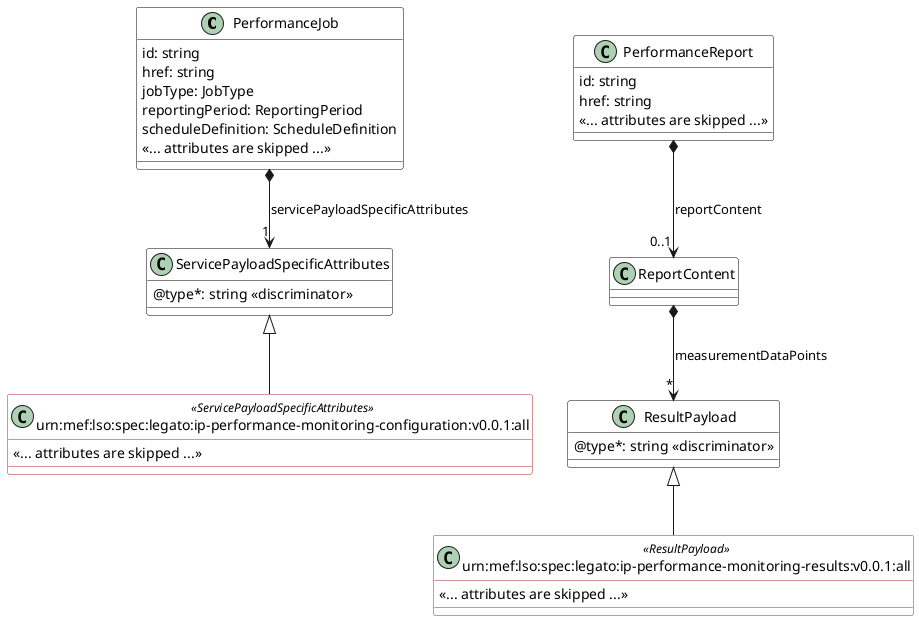

{#fig:performance-monitoring}
