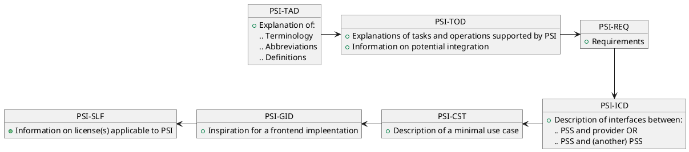

=begin
[[_TOC_]]
=end

@include [common meta information like version docdate etc..](../common/common_metadata.md)

=begin metadata
title: "PSI READ-ME-FIRST"
subtitle: "PSI-READMEFIRST"
reference: "PSI-READFIRST"
---
dcr_overrides:
- dcr:
   from: '2022-04-01'
   to: '2024-04-09'
   version: '1.0.0'
   author: 'Hendrik Oppenberg'
   message: 'Release of Version 1.0.0'
=end

# Document Meta Information

## Document Change Record

Changes to this document are tracked electronically.
No signature is required by the authors.
The following information can prove the integrity of the document and reveal any change.

@dcr(git_qr_code){#fig:dcr_qr_code}

## Documents

### Reference Documents

| Acronym | Reference | Title                                | Version |
|---------|-----------|--------------------------------------|---------|
| PSI-DL  | PSI-DL    | PSI Document List                    | 1.0.0   |
| PSI-CST | PSI-CST   | PSI Case Study                       | 1.0.0   |
| PSI-GID | PSI-GID   | Graphical Interface Description      | 1.0.0   |
| PSI-ICD | PSI-ICD   | Interface Control Document           | 1.0.0   |
| PSI-REQ | PSI-REQ   | Interface Requirements Document      | 1.0.0   |
| PSI-SLF | PSI-SLF   | Software License File                | 1.0.0   |
| PSI-TAD | PSI-TAD   | Terms, Abbreviations and Definitions | 1.0.0   |
| PSI-TOD | PSI-TOD   | Tasks and Operations Dictionary      | 1.0.0   |

Table: Reference Documents. {#tbl:reference-documents}

# Introduction

@include [common introduction](../common/intro_description.md)

## Document Scope

This **READ ME FIRST** document provides the list of all documents already released as part of this project and the suggested order in which to read them.

@include [generated document warning](../common/generated_document.md)

# Suggested Reading Order

Our documents contain references to other released documents and build upon knowledge gained by reading the referenced document(s).

Thus, for better understanding of our concepts, we suggest three different approaches for reading our documents.

## Reading All Documents

To read all our documents, we suggest the following order:

{#fig:doc_reading_order1}

# Description of Documents

The **PSI-TAD** document explains terminology, abbreviations and definitions used throughout all documents.
It determines the *language* which will be applied to the documents, thus reading this document will grant a common understanding to the other documents.

**PSI-TOD** explains tasks and operations supported by PSI, which are based on given requirements.
PSI-TOD already mentions the PSI-ICD document, but we recommend reading the ICD after the general structures have been understood or use it only as a reference for now.

The requirements, defined in **PSI-REQ**, build the basis of the endpoints needed for the operations described here.
As such, they provide understanding on how decisions and strategies were made and implemented.

Document **PSI-ICD** describes the planned and already prototyped interfaces.
Accordingly, (software) licenses applicable to PSI can be reviewed in document **PSI-SLF**.

The **PSI-CST** describes a minimal use case implementing the interfaces and making use of the processes by coupling a PSS and a provider system via the PSI interfaces.

Eventually, the **PSI-GID** is thought to be an inspiration for the development of the frontend with wireframes and hints where to implement which endpoints.
