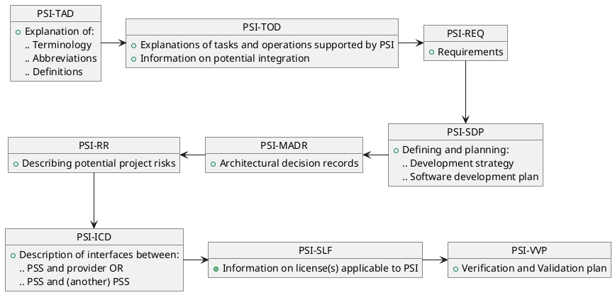
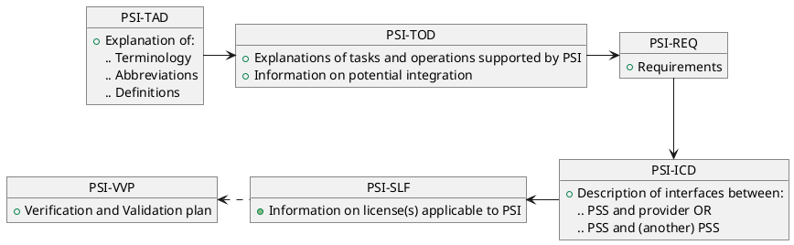
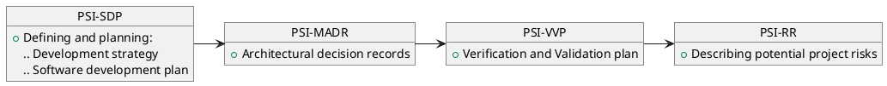

=begin
[[_TOC_]]
=end

@include [common meta information like version docdate etc..](../common/common_metadata.md)

=begin metadata
title: "PSI READ-ME-FIRST"
subtitle: "PSI-READMEFIRST"
reference: "PSI-READFIRST"
---
dcr_overrides:
 - dcr:
   from: '2022-01-01'
   to: '2023-01-01'
   version: 'MS3'
   author: 'Christine Glaesser'
   message: 'Initial version'
 - dcr:
   from: '2023-01-02'
   to: '2023-04-19'
   version: 'MS4'
   author: 'Dafinka Srezoska'
   message: 'Minor reformattings'
 - dcr:
   from: '2023-04-20'
   to: '2023-07-27'
   version: 'MS5'
   author: 'Christian Grubert'
   message: 'Format updates'
 - dcr:
   from: '2023-07-28'
   to: '2023-10-06'
   version: 'MS6'
   author: 'Christian Grubert'
   message: 'Fixed milestone entries'
 - dcr:
   from: '2023-10-07'
   to: '2024-01-25'
   version: 'MS7'
   author: 'Wolfgang Robben'
   message: 'Updated milestone entries'
 - dcr:
   from: '2024-01-26'
   to: '2024-09-11'
   version: 'MS8 [1.2.0]'
   author: 'Thomas Schulz'
   message: 'Public release adjustments.'
 - dcr:
   from: '2024-09-12'
   to: '2024-12-09'
   version: 'MS9 [1.2.1]'
   author: 'Wolfgang Robben'
   message: 'No updates.'
 - dcr:
   from: '2024-12-10'
   to: '2025-02-03'
   version: 'MS10 [1.2.2]'
   author: 'Wolfgang Robben'
   message: 'No update, just version bump.'
 - dcr:
   from: '2025-02-04'
   to: '2025-04-30'
   version: 'MS11 [1.3.0]'
   author: 'Hendrik Oppenberg'
   message: 'No update, just version bump.'
=end

# Document Meta Information

## Document Signature Table

|           | Name               | Function                       | Company         |
| --------- | ------------------ | ------------------------------ | --------------- |
| Author    | Hendrik Oppenberg  | Technical Officer              | CGI             |
| Author    | Christine Glaesser | Operations Engineer            | CGI             |
| Approval  | Wolfgang Robben    | Project Manager                | CGI             |
| Approval  | Victoria McCarthy  | Project Manager                | SES             |
| Checked   | Pepijn Witte       | Quality Assurance Manager      | CGI             |

Table: Signature Table. {#tbl:signature_table}

@include [Document Change Record](../common/document-change-record.md)

## Documents

### Reference Documents

| Acronym  | Reference | Title                                        | Version                  |
|----------|-----------|----------------------------------------------|--------------------------|
| PSI-DL   | PSI-DL    | PSI CGI Document List                        | current MS (doc version) |
| PSI-ICD  | PSI-ICD   | PSI Interface Control Document               | see before               |
| PSI-MADR | PSI-MADR  | PSI Markdown Administrative Decision Records | see before               |
| PSI-REQ  | PSI-REQ   | PSI Requirements                             | see before               |
| PSI-RR   | PSI-RR    | PSI Risk Register                            | see before               |
| PSI-SDP  | PSI-SDP   | PSI Strategy And Development Plan            | see before               |
| PSI-SLF  | PSI-SLF   | PSI Software License File                    | see before               |
| PSI-TAD  | PSI-TAD   | PSI Terms, Abbreviations and Definitions     | see before               |
| PSI-TOD  | PSI-TOD   | PSI Tasks and Operations Dictionary          | see before               |
| PSI-VVP  | PSI-VVP   | PSI Verification And Validation Plan         | see before               |

Table: Reference Documents. {#tbl:reference-documents}

# Introduction

@include [common introduction](../common/intro_description.md)

## Document Scope

This **READ ME FIRST** document provides the list of all documents already released as part of this project and the suggested order in which to read them.

@include [generated document warning](../common/generated_document.md)

@include [development_state](../common/development_state.md)

@include [Release Notes](../common/release_notes.md)

# Suggested Reading Order

Our documents contain references to other released documents and build upon knowledge gained by reading the referenced document(s).

Thus, for better understanding of our concepts, we suggest three different approaches for reading our documents.

## Reading All Documents

To read all our documents, we suggest the following order:

{#fig:doc_reading_order1}

## Reading Documents from Perspective of Interface Implementation

To read our documents with focus on the interface implementation, we suggest the following order:

{#fig:doc_reading_order2}

## Reading Documents from Perspective of Project Management

To read our documents with focus on the project management, we suggest the following order:

{#fig:doc_reading_order2}

# Description of Documents

The **PSI-TAD** document explains terminology, abbreviations and definitions used throughout all documents.
It determines the *language* which will be applied to the documents, thus reading this document will grant a common understanding to the other documents.

**PSI-TOD** explains tasks and operations supported by PSI, which are based on given requirements.
PSI-TOD already mentions the PSI-ICD document, but we recommend reading the ICD after the general structures have been understood or use it only as a reference for now.

The requirements, defined in **PSI-REQ**, build the basis of the endpoints needed for the operations described here.
As such, they provide understanding on how decisions and strategies were made and implemented.

The software development strategy and planning is described in **PSI-SDP**.
This document also elaborates the general project plan.

**PSI-MADR** describes decisions that were taken on the project.
Those decisions have an immediate influence on other documents as, e.g., the TAD.
The architecture described in this document is designed to meet needs for interface implementation and project management, e.g. how the repository should be structured, how the mock-up shall be implemented etc.

Subsequently, risks that may arise due to decisions being made or strategies being defined within the documents already read are defined in document **PSI-RR**.

Document **PSI-ICD** describes the planned and already prototyped interfaces.
Accordingly, (software) licenses applicable to PSI can be reviewed in document **PSI-SLF**.

Eventually, the **PSI-VVP** document contains information on the planned verification and validation.
Those depend on the ICD definitions as well as the requirements and may change due to the implementation and description of interfaces.

