=begin

# :book: wiki-Internal section, not compiled to documents

[[_TOC_]]

# Terminology

=end

This chapter describes some core concepts and terminology necessary for the correct understanding of PSID project's approach for a standardisation and, consequently, for its development project and any follow-up activities.

# Understanding and different Scenarios of a Pooling & Sharing Systems (PSS)

A pooling & sharing system (PSS) for (Gov)SatCom services is a centralised platform that connects users' needs and providers' offers.
A provider can offer their services and add their resources to a common pool managed by the PSS from which users can select the best fitting option for their needs.
A PSS gives its users a dedicated interface to specify their needs in such a way that their input can be processed automatically to find suitable options or at least to identify providers that are capable of making a serious offer.
In the commercial domain, this enables open competition between providers in the (Gov)SatCom market by striving to make better and more attractive offers for the users, that can promote innovation and growth.
In the governmental domain, this allows to optimise the usage of governmental (Gov)SatCom resources, e.g., as part of a common space communication plan for EU member states.
Users can share the ordered resources among each other, but this is internally handled by a PSS.
For example, a PSS can support defining the hierarchical structure of an organization with its sub-organizations and community of users.
Therefore, an organization as a user of a PSS might order an internet access service that will be used by its sub-organizations/users.

## Types of Pooling & Sharing Systems

There are different types of pooling & sharing systems and various scenarios how the stakeholders can interact with each other.

### Stand-Alone PSS for One Provider

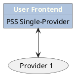

{#fig:pss_scenario1}

A single provider can implement a PSS and use it basically as their sales frontend.
In that case, it offers products and combines space assets/resources of a single operator.
This is a scenario mainly applicable to commercial (Gov)SatCom providers but can be envisioned as a platform for non-commercial usage as well, e.g., as a tool to request secure (Gov)SatCom capacities as part of a governmental framework contract.
With this setup of digitalised services, a commercial CSP can couple the PSS to their other systems seamlessly, e.g., to their Content Management or Enterprise Resource Planning systems.

It is even possible to have a direct connection with their teleport, i.e., the PSS offers a contingent of preconfigured services that are automatically configured on the teleport's hub systems.
Then, a user can book or request services right away and minimal, if any, human interaction is required to set up a service through the digital (Gov)SatCom value chain created.

### Stand-Alone PSS for Multiple Providers

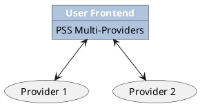

{#fig:pss_scenario2}

This type of Pooling and Sharing System is similar to the one above but offers products from multiple providers.
A PSS that hosts offers from different providers can work in two modes:
A broker-mode and a provider-mode.
As service broker, the PSS connects users and providers with each other.
Therefore, the PSS supports the user to make a standardised request or browse and filter a catalogue of available products.
This request is processed and a list of fitting products is presented to the user.
If no option is found, the request can be forwarded to a list of providers as request for quote (RFQ) or published as an invitation to tender (ITT).
The list can be filtered by the PSS to show only providers that the PSS is aware of offering similar services.
In addition, a PSS can act as a provider on its own.
For this, the PSS's governance can buy capacity from different providers and resell them to its users, which can be lucrative to providers.
From the governance's perspective, the availability of remaining capacity that they can offer to users can be easily calculated, meaning they are less dependent on the individual providers for forecasting of demand and supply.
Additionally, the governance can combine products from different providers to create high-redundancy packages for users with high-availability requirements.
Such a PSS can be an open market platform for commercial services, or a hub PSS.

### PSS to PSS

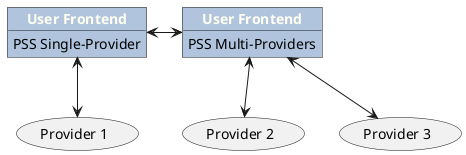

{#fig:pss_scenario3}

Potentially, different PSSs can interact with each other to reach out to providers they do not have in their own portfolio.
To establish new associations, it is irrelevant how many providers are onboarded on the PSS systems and how many external PSS systems are already connected.
It only demands unified APIs to enable communication between the PSS instances.

### Hub PSS

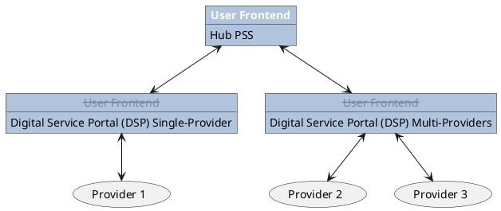

{#fig:pss_scenario4}

The user frontend for those PSSs connected to the overall hub PSS is not needed and replaced with a uniform hub frontend.
It is a "reference PSS" federating different PSSs including their respective provider combinations.
All examples given above can potentially be combined to form a hub PSS.
As depicted in the diagram, the hub PSS offers a centralised user frontend, hence the user frontends of the individual PSSs that are connected to the hub PSS are obsolete.
There are plans for a European (Gov)SatCom hub to centralise the (Gov)SatCom demand & supply by European public authorities.

> The hub PSS setup is not addressed within PSI, but it is only elaborated for the completeness of the different PSS types.

### Control over a PSS or hub PSS

The control over a PSS or a hub federating multiple PSSs can be *community* or *commercially* driven.
For example, community stakeholders controlling a PSS or hub PSS could be a consortium of humanitarian aid organisations, aiming at centralising and pooling resources to reduce costs while optimising the usage of booked (Gov)SatCom capacities.

A commercially driven PSS or hub PSS would be controlled by commercial parties.

## Interactions

Regardless of the type of the PSS, it might be able to interact with other PSSs.
For example, the governance of a governmental hub PSS wants to buy capacities for its pool from a commercial PSS, thus addressing the providers listed within a commercial PSS.
Changing the point of view, a provider might want to offer resources to multiple PSSs as well.
Despite various target systems, the provider would be greatly helped if they only had to prepare and provide their portfolio once.
This can be done by exporting the data of one PSS and importing it in another, or via direct transfer.
It has to be ensured however that declared resources are made available if they are listed and offered within several PSSs.
In the former case, a standardised PSS-provider interface is required, in the latter one a standardised PSS-PSS interface.
This way, a standardised interface enables several automated interactions that currently require a lot of human intervention.
Additionally, it facilitates connections that were not thought of initially.

# Parties

Business interactions are executed between two or more parties, which are either natural persons ("individuals") or organizations.
A party can have different roles in different interactions.
For example a service provider can also be the customer and business partner of another provider, who is then a supplier, too.

A PSS might also be used as a hub where different users share resources without cost, where access to them is merely requested and approved.
For easier reading, these users are also referred as customers even though they don't explicitly pay for the resources that they are using.

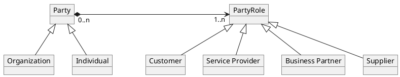

{#fig:parties_and_roles}

## Party Relations

There are two aspects to describe the relations of parties:

1. All parties can be related to one another.
   This allows to model long-term partnerships between organizations, but is also used to describe the role of individuals inside of organizations (e.g. buyers and users).
2. Organizations can have an explicit hierarchy of parent-child relations.

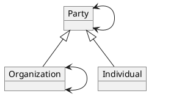

{#fig:party_relations}

## Party Roles

The following roles are used by the PSID in compliance with the SID[^tmf_roles].
As mentioned before, each party can have different roles in different contexts:

[^tmf_roles]: https://www.tmforum.org/Browsable_HTML_SID_R20.0/content/_3E3F0EC000E93E389BB6023C-content.html

* General role inside a PSS (maybe used for role based access control):
  * **(Service) Provider**: An organization or individual which offers products to others in exchange for payment in some form.
  * **Customer**: A person or organization that buys products from the enterprise or receives free offers or products.
  Customers can also be other service providers who resell the enterprises products, other service providers that lease the enterprise's resources for utilization by the other service provider's products and services, and so forth.

* Order context:
  * **Supplier**: A role played by a Party, who commits to provide a product to a Buyer by a formal agreement. Usually a provider.
  * **Buyer**: A role played by a Party, who imposed a Supplier to provide a product by a formal agreement. Usually a customer.
  * **(Product) User**: A Product User is corresponding to the role of using a product. Usually an individual or subunit of a customer organization.
  * **Broker**: A role played by a party, who brokers products between buyer and supplier. Usually the [PSS](#pss).

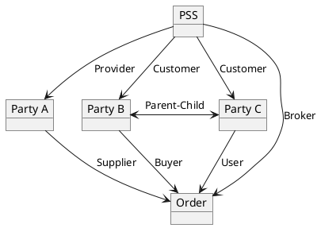

{#fig:party_role_example}

=begin

> These roles from TMF may be used in the future

* User Community Context
  * **Community**: A Community is a PartyRole, played by an Organization. CommunityMembers can commit to a Community, contribute Contributions to the Community and consume Assets from a Community.
  * **Community Member**: A CommunityMember is a PartyRole, played by an Individual, who is committing to a Community, contributes to it and consumed Assets from the Community.
  * **Community Administrator**: A CommunityAdministrator is a PartyRole, played by a Party, who administers a Community.

* Party Relationship Context
  * **Partner**: A PartyRole, played by a Party being an equitable partner in a business interaction with other parties, playing the Partner role. Usually all Partners have the same (or even compatible) business objectives.
  * **Complementary Provider**: A type of ServiceProvider that complements another provider.
  * **Third Party Provider**: A ServiceProvider besides the two primarily involved in a situation.
  * **Service Provider Employee**: A ServiceProviderEmployee is an Individual who is employed by the Service Provider for wages or salary.
  * **Customer Service Representative**: Customer Service Representative (CSR) is an Employee from the Operator or Dealer. A CSR is in charge of customer relationship, may act on behalf of the customer for sales and in support of the customer.

=end

# User Missions

Users conduct missions, which require certain assets to achieve a given goal; e.g. humanitarian aid or disaster recovery.
Such a user mission entity is generally composed of some header information (name and description, time frame and other characteristics) and lists of places.
Following TMF, the places are expressed as addresses (which may be incomplete, e.g. only a country) and/or a location object, which contains the actual coordinates (point, line or polygon).
The `MissionAsset` assigns an [InquiredProduct](#inquiry), ordered [Product](#products) or [User Resources](#resources) to the mission.
They can be in relationship with each other, e.g. a fire truck may require an internet connection to stream data.

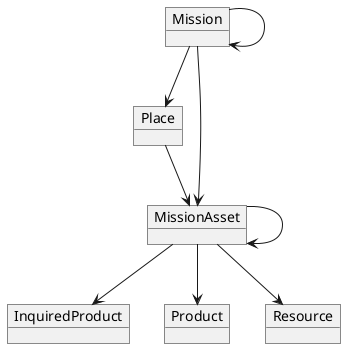

{#fig:user-mission}

# Resources, Services and Products

TM Forum introduces the concepts of resources, services, and products to allow for maximal flexibility in modelling a provider's portfolio.
Resources are the different parts that are required for a service.
They can either be customer-facing or hidden under a service.
Then, a service is the *action*, usually performed on some set of resources.
Finally, a product combines any number of customer-facing resources and/or services.
A product is something a customer can actually order, e.g., if a customer wants a specific resource, this resource needs to be wrapped into a product.

Another aspect of this model is the difference between a specification and an instance of the specification.
This will be discussed in [Specifications, Catalogs and Offerings](#specifications-catalogs-and-offerings).

## Resources

Resources are physical or logical components which are used to implement communication [services](#services).
The physical ones are those you can see, touch, and hold.
They are generally divided into the following groups:

* Physical resources (antennas, BUCs and other hardware, but also satellites)
* Logical resources (IP addresses, software, RF bandwidth)
* Compound resources of the above (e.g. a router consists of different cards/ports and runs software)

{#fig:resources}

Resources can be utilised either in the on-site user segment or the space segment and teleport (see figure {@fig:resources}).
The ones used in the on-site user segment are a visible part of the [product](#products) offered by the provider.
For example, a terminal antenna could be bundled into a product and offered as part of it, or it could be offered separately to the user.
If the user already owns a compatible antenna, they may want to use it to realise the offered product.
On the other end, the space segment and the teleport equipment are not directly visible to the user but are required by the provider to implement the service.

The diagram below demonstrates the relationship between a resource, a service and a product.
A product, or a service may require resources to be realised.
Resources can be related to other resources, e.g. when a chunk of bandwidth of a provider (resource A) is leased (as resource B) to a customer (child of A).
They are also related to parties which own, manage and/or use the resources.

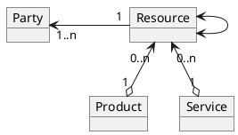

{#fig:resource_relations}

## Services

Services are a predefined utilization of different [resources](#resources) in the teleport and the space segment, which providers offer to users, e.g. Internet Access, Telephony or Site-to-Site IP-Trunk.
They may also provide value-added services, e.g. network management or field services, which do not employ resources.
Services (and on-site resources) are then bundled to [products](#products), which are sold to a user.

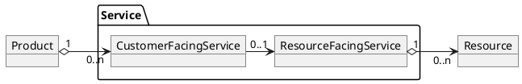

{#fig:service_relations}

## Products

A product is a wrapper entity for a [services](#services) or on-site [resources](#resources) which is sold to a [user](#parties) within an [order](#order).
Though it is possible to combine multiple services and resources in a single product, the nominal layer to combine them is a (bundled) [offering](#specifications-catalogs-and-offerings).

The diagram below demonstrates the relationship between a product and its bundled resources and services.
A product may require zero or many resources and/or services to be realised.

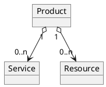

{#fig:product_relations}

# Specifications, Catalogs and Offerings

The above-mentioned terms (resource, service and product) describe the operational business entities.
They are managed in the "inventory" of the provider, customer or PSS.
Before this, the user has to be made aware (e.g. by a PSS) of what a provider *could* sell them.
To describe this, there are three terms defined by the SID:

* Specifications describe general characteristics a resource, service or a product can have.
  For example, a product specification is composed of service and resource specifications.
  If a product is offered and bought, those specifications need to be realised, e.g., the specification of a particular modem is realised by providing a physical instance of this modem.
  The total of all realizations of services and resources are then the actual product.
  Specifications often contain characteristics with variants.
  For example:
  * "iDirect X3 DC on/off" is the specification of a physical resource. The resource itself is a specific modem with a serial-number and DC **either** on **or** off (the specification allows both variants).
  * "[1; 2; ...; 100] MHz Ku-Band bandwidth" is the specification of a logical resource. The resource itself is a specific chunk of bandwidth with up to 100 MHz.
  * "VSAT Internet Access Service" is the specification of a service. It allows defining the possible information rates with granularity e.g. 128, 256, 512, 1024 kbps, etc. The service itself is bound to a user and a site, or multiple users and sites (e.g. multicast/broadcast service).
  * A product specification contains resource and/or service specifications as described above.
* Catalogs are used by a provider to make a list of offerable specifications visible to other parties.
  There is a catalog for each category of specification defined per provider, i.e., a product catalog for product specifications, a service catalog for service specifications, and a resource catalog for resource specifications.
  * The term "portfolio" is used to also include outdated or future products, services and resources.
* A product offering is a concrete offer of a product specification to a user.
  This can be through a catalog or directly to a user (as the result of ITT or RFQ).
  It also contains other business-related information such as SLSs and pricing information.
* Bundled offerings combine multiple offerings (and therefore multiple products) into one bookable entity.

```plantuml
object "Main Offering" as PO1 {
    price = 500€
}
object "Included Offering A" as PO2 {
    (price = 300€)
}
object "Included Offering B" as PO3 {
    (price = 300€)
}
object "Bundled Offering Option Group 1" as BOO1 {
    min = 1
    max = 1
}
object "Choice Offering C" as PO4 {
    price = 1000€
}
object "Choice Offering D" as PO5 {
    price = 2000€
}
object "Bundled Offering Option Group 2" as BOO2 {
    min = 0
    max = 2
}
object "Optional Offering E" as PO6 {
    price = 100€
}
object "Optional Offering F" as PO7 {
    price = 200€
}

PO1 --> PO2 : bundledOffering
PO1 --> PO3
PO1 --> BOO1
PO1 --> BOO2
BOO1 --> PO4
BOO1 --> PO5
BOO2 --> PO6
BOO2 --> PO7
```

{#fig:bundled-offerings}

The example {@fig:bundled-offerings} shows an offering that bundles the two other offerings **A** and **B**, providing a discount that results in a lower package price.
The included offerings may also be unpriced, which makes them sellable in said package only.
Additionally, the customer must choose exactly one offering, either **C** or **D**, from option group 1.
Depending on their selection, the price of the selected offering is added to the overall price.
The second option group contains two optional offerings **E** and **F**, which are also added to the price when selected.
The customer can select to have none of these added, add only one or two instances of **E**, add only one or two instances of **F**, or add one instance of both, **E** and **F**.
Other permutations of these cases are possible, e.g., an offering for a single product with some additional options.

## Types and Characteristics

The PSS defines a set of supported types for resources, services and products in consultation with the providers.
It provides them in a JSON Schema file that is made available through the API itself or can be exchanged offline (cf. [PSI-ICD]).
Each type then defines characteristics that describe its exact nature.
For example, a resource of type "Bandwidth" contains the start and end frequencies as characteristics, while an "Internet Access" service is defined by the information rates.
These definitions are then used by the providers to create specifications with concrete values in the catalogs, which can be accessed by the matchmaking to find an implementation for the needs of the customer.
After a successful order, the instances that are created in the inventory are also based on the same schema.

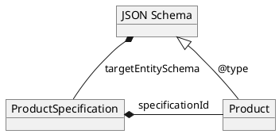

{#fig:json-schema}

A special characteristic is the definition of beam footprints and service areas.
There are three cases considered:

* **Fixed Beams:** For most commercial providers, the beams are fixed above a well known area.
  They are able to define the footprints with any desired detail of EIRP values.
  This allows for an automated matchmaking by the PSS and preconfigured offerings that can be directly ordered by the customer.
* **Dynamic Beams:** Sometimes the provider can not define the beams in detail, because they change over time.
  It may also be that the exact footprint shall not be disclosed.
  In this case, it is possible to define only a single "potential beam area", which still allows the matchmaking to find the resource/service but will by definition lead to an RFQ.
* **Services:** If a service is only available in a specific area, this can also be expressed via geometries.
  Each area can be augmented with additional properties that can be referenced in offerings, e.g. a minimum required dish size.

# Service Quality

## Service Level Specification

A service level specification represents a predefined or negotiated set of service level objectives (SLO).
The SLO, in turn, defines for a key performance/quality indicator a threshold which is to be adhered to.
In case the targets are not met, the consequences define the expected outcome which in most cases would be generating an alarm.

A service specification may refer to a list of service level specifications (SLS) that must be capable of being met by corresponding service instances.

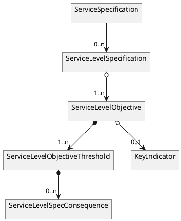

{#fig:service_level_specifications}

The service level specifications could then be used to establish a service level agreement between the customer and the provider.

## Performance Monitoring

In case of services with attached service level specification, a service provider will enable performance monitoring for a provisioned service to measure the applicable KPIs/KQIs of the service as defined by the service level objectives.
Examples of performance objectives encompass various metrics such as frame/packet delay, frame/packet loss ratio, inter-frame/packet delay variation, and more.
These objectives serve as measurable criteria for assessing the performance characteristics of a service.
In this scenario, a service provider is responsible for provisioning the appropriate measurement points and performance objectives, together with measurement intervals and schedules, as well as gathering data.
Measured values are available for retrieval by the PSS by generating a performance monitoring report for the requested key indicators.

For an ad-hoc performance measurement (not related to an SLS but e.g. for supporting troubleshooting during service assurance) that is initiated for a limited time (typically a single run or non-continuous run) the on-demand performance monitoring job is provisioned to carry out the measurement of key indicators.
The on-demand performance job is indicated by a performance monitoring job type.
The execution of the performance monitoring job results in the generation of performance measurement reports, which deliver comprehensive performance collections.

The PSS API does not define performance indicators' specifications but can be used in combination with any specifications. This is delivered by the ServiceSpecificPayload attribute of the performance monitoring job entity which serves as an extension point for configuring service-specific performance indicators. Reports delivered by the performance job contain ResultPayload attribute which similarly acts as an extension point for capturing and representing the outcome of performance monitoring.

## Alarm

An Alarm is a specific type of notification related to detected faults or abnormal conditions. Alarms are generated by a service provider in case thresholds specified in a service level specification are violated. Alarm generation results in the creation of an event that is received by an interested party.

Alarms support both resources and services and are not restricted to any particular technology or vendor.
Important entities and relationships are depicted in the following diagram.

* alarmedObject is a reference to an object (typically a resource) which is affected by the Alarm. An example of *alarmedObject* is a malfunctioning terminal.
* affectedService is a reference to services that are affected by the Alarm. Services that are known to be degraded because of the *alarmedObject* will be listed here.
* crossedThresholdInformation identifies details of the crossed threshold.

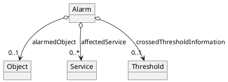

{#fig:alarm}

# Service Demarcation Points

ESA and the associated so-called PACIS groups introduced the following classification scheme for services based on their demarcation points:

| **Class**  | **Layer**                                         | **Covered OSI-Layer** | **Example**                                                |
| ---------- | ------------------------------------------------- | --------------------- | ---------------------------------------------------------- |
| **L0**     | Physical Communication Medium                     | 1 & 2                 | Leasing 10 MHz bandwidth in Ka-Band                        |
| **L1**     | Network Access / Data Transport incl. teleport    | 2 & 3                 | IP trunk between two sites, internet access or PSTN access |
| **L2**     | Network Access / Data Transport incl. remote site | 2 & 3                 | IP trunk between two sites, internet access or PSTN access |
| **L3**     | Application / Value-added Services                | >3                    | VoIP via L1/L2 link or L1/L2 link + (leased) terminal(s)   |

Table: PACIS/SSPS Service classification based on demarcation points, ISO/OSI, examples. {#tbl:pacis_classes}

The demarcation points of a service define relevant parameters for the SLS of an offering, e.g., the measured latency of their connection.
A basic L0 service grants a user access to a space segment (a GEO satellite, a MEO constellation, etc.) via a defined frequency bandwidth or channel.
The corresponding service demarcation points are marked as **B** and **C** (Teleport as the sender) or **B'** and **C'** (Remote Terminal as the sender) in {@fig:demarcationpointsL0}, i.e., the user is responsible for connecting to the satellite.
Both sides can act either as a sender or as the receiver.
The service starts when the satellite's transponder receives the signal, and ends when the signal can be received at the defined remote site.
Note that neither the teleport or site sending the signal nor the remote site antenna receiving the signal are included in the service.
Therefore, only the availability of the space segment and the round-trip latency from point **B** to point **C** or **B'** to **C'** can be part of an SLS.

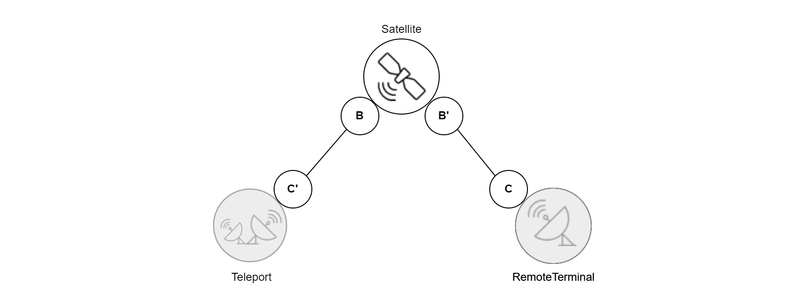{#fig:demarcationpointsL0}

As soon as a provider's teleport is included, the demarcation point shifts from point **B** (or **C'**) to point **A** in {@fig:demarcationpointsL1}, which corresponds to an L1 service.
This allows a provider to actively manage the connection and provide a data bandwidth with access to the internet and/or a user's private network.
Thus, the provider has access to half of the connection's endpoints and is able to make statements on the network availability on their side.

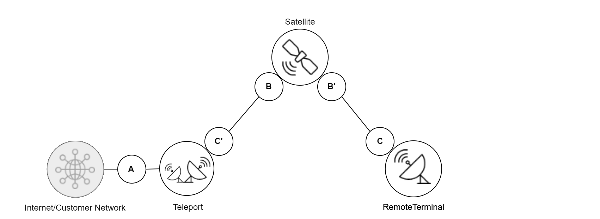{#fig:demarcationpointsL1}

The next step is to include the user's remote site, which corresponds to an L2 service.
If a provider has to manage this one as well, the demarcation point shifts from **C** to **D**, as seen in {@fig:demarcationpointsL2}.
In this scenario, the provider has full control over the link and is able to make sophisticated statements on the network uptime and availability, as well as the network latency.

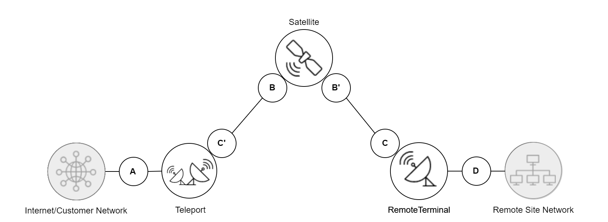{#fig:demarcationpointsL2}

Finally, adding value-added services to the package, e.g., 24/7 remote site support or remote site network management might shift the demarcation point even further from **D** to **E**, see {@fig:demarcationpointsL3}.
Other value-added services, such as provision of colocation space, VoIP, etc., can be located next to the Teleport.
There is a cornucopia of value-added services, some depending on the details of the implemented connection.
Therefore, they are collectively listed as L3 services and might involve other parts of the service not considered here.

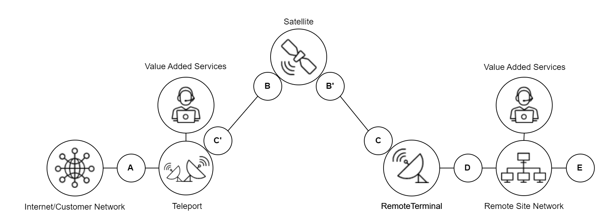{#fig:demarcationpointsL3}

Not categorized but inherently included in the corresponding services of each layer are the resources in the space segment (satellites, constellations, transponders), which are owned or leased by providers.
Note that this model needs to be adjusted slightly if a service does not need a teleport, e.g., with point-to-point (P2P) connections.
It does not include any details on the systems behind the demarcation points, e.g., if the service is deployed on a maritime vessel or if it is a connection between governmental sites.

The Information Framework (SID) of TM Forum (and by extension PSID) defines services not in relation to the underlying resources and the service demarcation points, see chapter [Resources, Services and Products](#resources-services-and-products), although this model can be applied within this model as well.
Therefore, the service demarcation points are used to define the key performance indicators (KPIs) that are part of an offering.
This way, the resources and services are still kept separated, while their interdependency is still valid.
Then, L3 includes all sorts of value-added services (VAS), e.g., remote site survey, sparse part management, etc., but also turn-key solutions.
A VAS can be mapped to a separated product that can be bundled in an offer without interfering with the L0-L2 services.

# Resource Pool

Pools can be used by the PSS governance to make resources available to different groups of customers.
For example, they can create a separate pool for high priority users that is not accessible by others.
The number and kind of pools can vary, so the following figure assume two pools to explain the concept.
Entities that are not assigned to any visible pool can be interpreted to be in a "private pool" of the provider or customer, although the governance may decide to make private pools explicit.

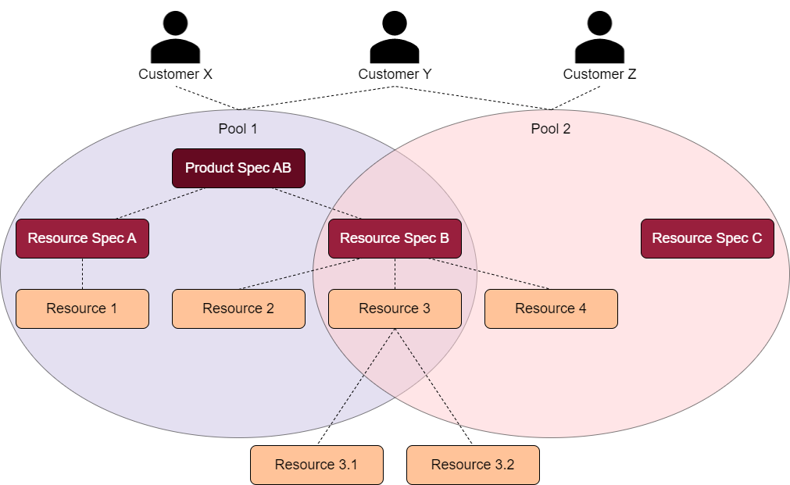{#fig:pools}

The assignment starts with the resource specification.
It must be assigned to at least one pool, but can also be assigned to multiple ones.
This makes the specification visible to all users that can access at least one of the pools.
All other entities based on it (service/product specifications, offerings and committed resource instances) can be assigned to the same pools or a subset.
They shall never be assigned to a pool that does not contain the underlying specification.
If a product specification or offering combines multiple resource or service specification, they can only be assigned to the intersection of the pools of the latter.

Applied to the example in figure {@fig:pools}, this means that "Customer X" will find the product specification AB in a matchmaking and can access the resources 1-3 to implement it.
In case resources 2 and 3 are already booked (and can not be pre-empted), the customer is **not** able to access resource 4.
Customer Y in contrast could do so, as they can access both pools.
Customer Z on the other hand can see the specifications B and C and even the available resources 3-4, but will have to request a quote since there is no visible product (and therefore no offering) for them.
Resource 3 is booked two times and therefore has sub-resources in private pools of unlisted customers for the respective timespan of their bookings.

# Inquiry

A user issues an inquiry to obtain product offerings from the providers.
There are four types to distinguish for better comprehension:

* Matchmaking: The user utilises the HMI of the PSS to get an automatically generated list of matching products.
  This is expected to be the default, since it is the main purpose of a PSS.
  The matchmaking process can be done by a single PSS, but may also be distributed between multiple PSS and/or provider systems (see Figure {@fig:distributed-matchmaking}), which makes this a use case for the PSID.
  It may also be combined: the PSS could perform a coarse matchmaking first and then contact a subset of potential providers to do a fine matchmaking.
* Request-for-Quote (RFQ): The matchmaking can indicate that a provider can offer the requested services and/or resources, but not have an offering. In this case, the user may send a RFQ to said provider, so they can respond with a tailored offering.
* Invitation-to-Tender (ITT):
  The user can either skip the matchmaking completely or have the PSS do a coarse matchmaking to identify potential providers for their request and then send an ITT to selected providers.
  This will result in a subset of providers responding with one or more offerings.
  Note that this is also an option for users if the PSS finds no matching offerings after an initial matchmaking.
* Change Request: When the customer wants to change an active product, they might need to check the feasibility and potentially new price with the provider. In this case, the PSS might already show concrete boundaries such as which characteristics of the product offer can be changed e.g. the maximum information rate.

The general data format required to exchange inquiries is expected to be the same for all cases, but the PSS will have to implement different processes for each use case.

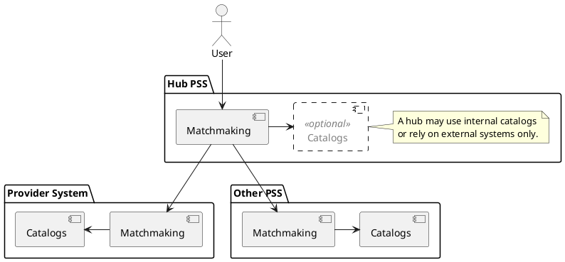

{#fig:distributed-matchmaking}

As part of the inquiry request, the customer can define inquired product types and characteristics (e.g. internet access with 50 Mbps download rate).
But the more restrictive the characteristics, the higher the probability that no suitable options will be found.
To alleviate this situation, the customer (or the PSS) can define their absolute minimum or maximum values (e.g. 40 Mbps download rate instead of 50 Mbps).
Product offerings that do not fully meet the inquired characteristics are referred to as *partial matches* and shall contain human-readable *notes* describing the rationale for deviations.
This is possible for any type of customer inquiry (matchmaking, ITT, RFQ or change request).

To prevent long delays, the response time of the providers to an RFQ or ITT should be limited.
When forwarding the inquiry to the providers, the PSS is responsible to pass the information for the maximum response time until the PSS is expecting the product offerings.
In case the provider exceeds the given deadline, its product offerings may not be considered for the issued inquiry.

# Order

An order lists the [product](#product) [offerings](#specifications-catalogs-and-offerings) that the [customer](#parties) finally wants to book from the [providers](#parties).
The order also references all the parties that are related to that order.
For example, it contains the customer who ordered it, the broker PSS and the service provider.
The parties involved get access to the details of the order items, including e.g. quantities, selected variants, agreed prices, contractual data and further negotiation results.
When necessary, this list can be extended to additional related parties such as technical contact persons.
The order starts as a product order by the user and is decomposed to service and resource orders on the provider side.

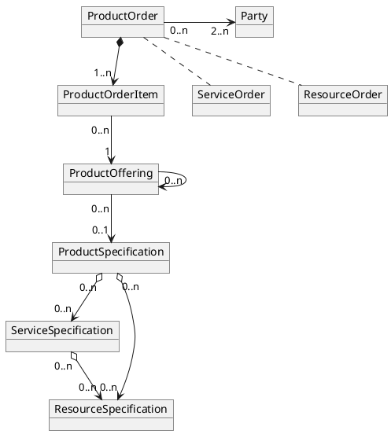

{#fig:order_relations}

Orders can also be used to change characteristics of an active service.
The PSS can show the possible options of the previously ordered product and let the user select the new values.
As with the initial order, an offering for that value combination must exist or be requested via an inquiry.
Then the old order is marked as `completed` and a new order is created, which defines that the old service is replaced with a new one.
This way, the provider can ensure a smooth transition of operations.

# Overbooking, Contention, and Pre-emption

*Overbooking* describes the scenario of instances of items (i.e. resources, services, and products) being offered by a provider exceeding their availability.
It can be perceived as a boolean characteristic of such an item, e.g., a parameter stating that a resource is overbooked within a PSS.
While overbooking is not an issue *per se*, it becomes a major one when the instances in question are finally about to be used.
Then a contention situation arises.
In consequence, this leads to reduced service quality of low priority customers, which may or may not be within the boundaries of their SLAs.

Overbooking and contention can be mitigated by either cancelling the order of the item or by offering a replacement.
Ideally, this is done by the PSS in the overbooking-phase, before the actual contention occurs.
Cancellation might result in penalties being imposed as well as bad reputation for a provider.

Additionally, priority schemes for customers can be implemented that allow for pre-emption of already booked items.
Such a priority schemes might include different levels, e.g., first based on the type of customer (emergency response before private customers) followed by the product type (private customers paying for higher priority).
These strategies are enabled in the API as the corresponding parameter, e.g., in the party profile.

The PSS is in charge of handling the overbooking process for committed resources and, vice versa, the providers for on-demand resources.
The PSS might already be able to implement optimization of costs and accommodate a high-priority request, i.e., downgrading another request within given SLA limits.
Therefore, the PSS can implement a priority scheme, that allows, e.g., for pre-emption.
The PSS can submit the priority with the request/inquiry to the provider (e.g. in form of a priority list of customers or via the party profile with an agreed mechanism for handling priorities) for some resource or service request, allowing the provider to mitigate potential overbooking issues of non-committed items.
However, if the PSS has (potentially) no control over the resource, therefore, this might be just a mere suggestion.
Such an algorithm needs to be part of the PSS, fed by information provided by the provider and sent via the PSI API.

Every order will create a sub-entity in the PSS (optionally also in the provider system) that is assigned to the customer for the given timespan.
Each child contains the actual configuration of the item for that specific customer and allows a discrete state tracking (e.g. planned, shipped, installed, returned).
Depending on the implementation, the resource can be further subdivided, e.g., if it is shared with another user or is resold by a service provider.
The API allows transferring the information on a resource state.

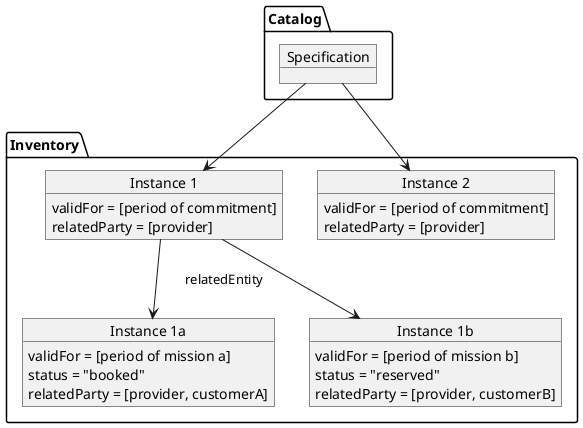

{#fig:resource_tree}

For committed resources, the PSS can calculate the booking capability as part of the matchmaking:
Physical resources (e.g. terminals) are bookable when there is no sub-entity in the inquired timespan.
For logical resources (e.g. bandwidth) the implementation has to sum up the assigned amount (MHz or Mbit), subtract it from the available amount and compare it with the inquired value.
If the resource is booked as part of *Product A*, it is not available for *Product B* any more (excluding pre-emption etc.).
As for on-demand resources, the PSS may still send a check-stock-request to the provider to ask for additional resources.

Another aspect to overbooking is *reserving* a specific resource, e.g., reserving a raw bandwidth for a dedicated period of time without actually booking it.
For example, a customer may anticipate a mission starting in two months but doesn't actually know if it will really take place.
Some providers offer an option to reserve the bandwidth for a certain time.
This allows the customer to set up the mission, knowing, that the required resources will be available.
A reservation might be cheaper (although not cost-neutral) than actually booking a resource ahead of time.
Again, the decision on such a possibility is to be implemented within a PSS or even on provider side, if they allow reservations on their resources.
Thus, the API itself allows to transfer a state to the resource without actively deciding if reservation is possible.

Lastly, a PSS can distribute resources into multiple regional pools in order to perform demand/supply forecast.
It could be assumed then that the actual resources are not required at same time and in same pool.
However, if this does not hold true, workflows shall be in place to mitigate resource conflicts.
The actual overbooking subsequently has an impact on the supply to demand ratio of multiple regional pools.
Overbooking is handled according to the type of product.
For physical and logical resources (e.g. raw bandwidth) no overbooking is envisioned.
However, leasing raw bandwidth for very short time frames is already supported by the API.
In contrast, managed services already distinguish between *committed* and *peak* information rates.
As result, the CIR is booked and cannot be overbooked; the PIR however can be shared.

Since the processes elaborated here are internal to the PSS, they are not covered in more detail here.
Rather, overbooking in all aspects as described within this chapter is a process that will be handled by the PSS.
PSI shall allow overbooking, i.e., send the information to the PSS that is then enabled to handle overbooking situations accordingly, but not impose any mechanisms based on overbooking situations.
