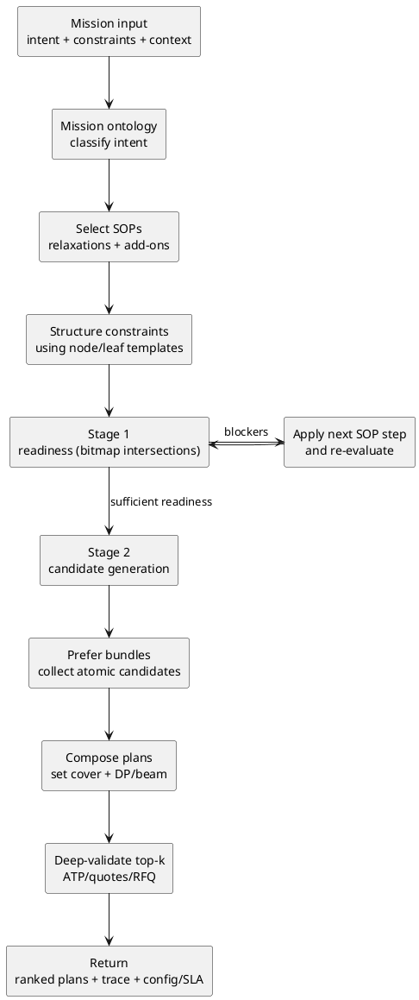
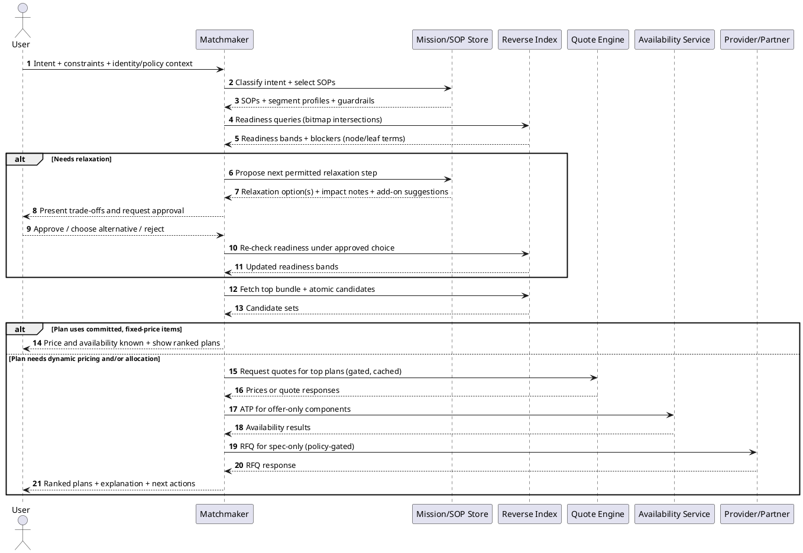
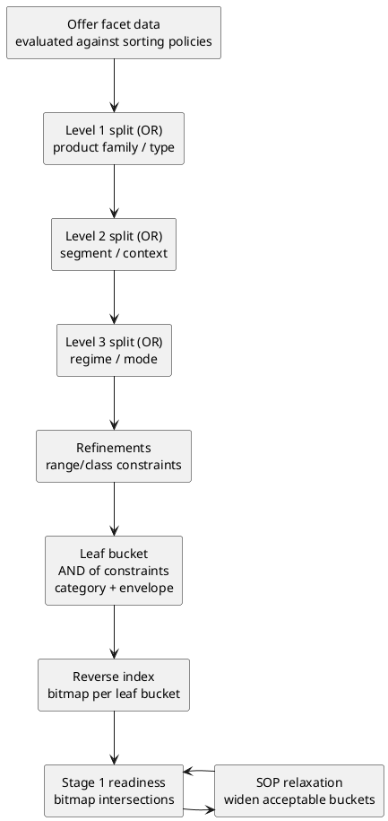
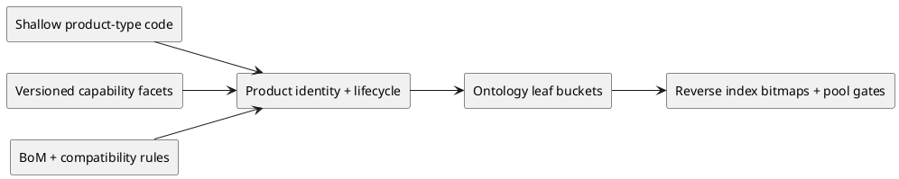
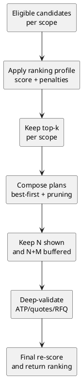

=begin

# TOD-A01-Mission_Centric_Matchmaking

> The heading has to be included in the document including this document.

=end

**Scope against the TOD body.**
This appendix is referenced by task TOD-03-01-Customer_Inquiry_Management of the [PSI-TOD] and describes one way a PSS can realise the matchmaking that turns a customer inquiry into a ranked result.
Its masking, filtering and ranking mechanics are normative for the PSI matching engine (mission-masked matchmaking over the product catalog): an implementation of that engine follows the sections marked normative in Table {@tbl:tod-a01-scope}.
They are not requirements on a PSS in general; the [PSI-REQ] and the tasks and operations of this document remain the only normative entry point for a PSS implementation.
Everything else in this appendix is informative.
In particular, reverse matchmaking, AI-augmented explanation and negotiation, and catalog and ontology governance are not part of the matching engine.

| Section                                                    | Status      | Reason                                                                  |
|------------------------------------------------------------|-------------|-------------------------------------------------------------------------|
| Introduction, Why Composed Services are Hard to Match, What the Approach Delivers | informative | motivation and overview                                    |
| Pipeline Overview                                          | normative   | the two-stage structure of the matching engine                          |
| The Modelling Foundation: Missions, Products, and Layers   | informative | offer forms and maturity are vocabulary, not a required model           |
| Mission Ontology, Product Ontology                         | informative | the trees are illustrations; the engine needs a classification, not these |
| Buckets: Leaf Classes as Executable Filters                | normative   | the filter unit of the engine                                           |
| Templates and Schema-Driven Onboarding                     | informative | catalog governance, not part of the matching engine                     |
| Bitmap Indexing and Pool Gates                             | normative   | the masking mechanics                                                   |
| Stage 1: Readiness as a Non-Probing Control Loop           | normative   | the filtering mechanics                                                 |
| Stage 2: Plan Construction                                 | normative   | candidate generation and composition                                    |
| Ranking and Selection                                      | normative   | the ranking mechanics                                                   |
| Cross-Layer Dependencies and Receiver/Transmitter Compatibility | normative | compatibility filtering during composition                          |
| Reverse Matchmaking: Tenders as Mission-Shaped Requests    | informative | not part of the matching engine                                         |
| AI Augmentation                                            | informative | not part of the matching engine                                         |
| Governance: Keeping the Catalog Evolvable and Trustworthy  | informative | catalog and ontology governance, not part of the matching engine        |
| Illustrative Example, Conclusion                           | informative | worked example and summary                                              |

Table: Scope of TOD-A01 against the TOD body. {#tbl:tod-a01-scope}

**Origin and licence.**
The text is the whitepaper "Mission-Centric Matchmaking for Composed Services", written at CGI and shared within the consortium before it was taken up as the reference for the PSI matching engine.
CGI contributes it to this document under the Apache License 2.0 of the PSI repository; it contains no third-party material, so the [PSI-SLF] is unchanged.
For this appendix the diagrams were converted to PlantUML, the ranking-profile radar chart was replaced by Table {@tbl:tod-a01-ranking-profiles}, headings were shifted below the appendix heading, and the paper's closing comparison with its source model was replaced by the terminology paragraph below.
The wording is otherwise unchanged.
Its placement follows [PSI-MADR] ADR043.

**Terminology.**
The text uses the terms of the [PSI-TAD].
Where it introduces its own vocabulary, the term is defined at first use and listed in Table {@tbl:tod-a01-local-terms} together with the TAD term it is closest to or collides with; Table {@tbl:tod-a01-local-abbreviations} lists the abbreviations that the [PSI-TAD] does not carry.
A local term becomes a TAD term only by its own decision record.

| Local term                              | Meaning in this appendix                                                                                              | Relation to the [PSI-TAD]                                                                                                                                       |
|-----------------------------------------|-----------------------------------------------------------------------------------------------------------------------|-----------------------------------------------------------------------------------------------------------------------------------------------------------------|
| mission (in "mission ontology", "mission node") | a *class* of user intents, such as `LOG.SHP.SNS.CLD.FRZ`, to which strategies attach                          | collides: the TAD's *User Mission* is an *instance*, the customer's demand context; a concrete request here ("mission instance") is that instance |
| ontology                                | a classification tree plus the definitions and governance around its terms                                            | not the *SatCom Ontology* of the TAD, and not a formal (OWL) ontology                                                                        |
| layer, segment, scope                   | a solution is decomposed into layers (asset, telemetry, connectivity, assurance) across segments (land, port, sea); a scope is one segment-layer pair | the TAD decomposes demand by *inquired product* (chapter *Inquiry*); a scope is a second axis that the TAD does not have                                    |
| plan                                    | a composition of offers that covers all scopes of a mission instance; the unit that is ranked and returned            | a TAD *inquiry result* answers per inquired product; a plan composes across them                                                                     |
| relaxation, SOP                         | an ordered, approved sequence of steps that widens which offers are acceptable, each step possibly paired with an add-on service | the TAD's minimum and maximum values in an inquiry (*partial matches*, chapter *Inquiry*) are a static tolerance; the ladder adds ordering and compensation      |
| bucket                                  | the set of offers classified into one leaf of the product ontology, used as an executable filter                      | no counterpart                                                                                                                                                  |
| pool, pool gate                         | the set of offers a requester may see, and the policy filter that computes it before matching                         | not the *Resource Pool* of the TAD, which is a set of pooled resources                                                                          |
| readiness band                          | a coarse feasibility signal (green/yellow/red) per scope, emitted before any plan exists                              | no counterpart                                                                                                                                                  |
| ranking profile                         | a governed set of scoring weights, uncertainty penalties and tie-break rules                                           | no counterpart; ranking of inquiry results is PSS-internal in the TOD                                                                                           |
| facet                                   | a versioned block of capability detail held outside the classification tree                                           | closest to the TAD's *characteristics*                                                                                                        |
| committed, offer-only, spec-only        | offer maturity: orderable now; published but needing an availability check; specification only, needing an RFQ       | committed corresponds to an orderable *product offering*; spec-only to a product specification answered by RFQ or ITT |

Table: Local terms of TOD-A01 and their relation to the TAD. {#tbl:tod-a01-local-terms}

| Abbreviation | Expansion                                                              |
|--------------|------------------------------------------------------------------------|
| ATP          | Availability-to-promise                                                |
| BoM          | Bill of materials                                                      |
| CMDB         | Configuration management database                                      |
| DP           | Dynamic programming                                                    |
| HPA          | High-power amplifier                                                   |
| IoT          | Internet of Things                                                     |
| ISL          | Inter-satellite link                                                   |
| LNA          | Low-noise amplifier                                                    |
| MEC          | Multi-access edge computing                                            |
| NTN          | Non-terrestrial network                                                |
| SKU          | Stock keeping unit                                                     |
| SME          | Subject-matter expert                                                  |
| SOP          | Standard operating procedure                                           |
| TN           | Terrestrial network                                                    |
| UX           | User experience                                                        |

Table: Abbreviations used in TOD-A01 that the TAD does not list. {#tbl:tod-a01-local-abbreviations}

### Introduction

This appendix describes a matchmaking algorithm for marketplaces that deliver *composed* solutions rather than single products.
The running example is **smart logistics**: combining classical container logistics with IoT sensors and hybrid terrestrial/non-terrestrial (TN/NTN) connectivity, plus value-added services such as assurance, evidence handling, analytics, or incident support.
Smart logistics is used because it forces real-world bundling across multiple layers and partners, but the approach generalises to any domain where end-to-end solutions must be assembled from heterogeneous products and services across multiple operational segments (for example land, port, sea, or remote environments).

The core idea is best understood as a *controlled pipeline* rather than a single mechanism.
It combines intent classification, schema-driven onboarding, deterministic relaxation strategies, privacy-preserving feasibility checks, and a second stage that constructs only a small number of validated plans.
The result is not "simple" to implement, but it is structured so that each concern remains explicit, auditable, and governable.

Two ontologies provide the scaffolding.
The **mission ontology** places a mission instance into an intent class and selects SOPs (standard operating procedures) that define safe relaxation strategies and suggestions for add-on services.
The **product ontology** provides stable capability regimes and product-type anchors so the matcher can find the right schemas and catalog regions without turning the catalog into an unmaintainable taxonomy.

### Why Composed Services are Hard to Match

In traditional catalogs, a query can be answered by filtering a list of products.
In composed services, the query becomes a composition problem.
A single solution might include a tracked container, a cold-chain monitoring package, a hybrid TN/NTN connectivity plan, and an assurance package with incident handling and evidence retention.
The search space grows combinatorially because each layer has multiple viable candidates and because some candidates only work together.

Commercial reality amplifies the problem.
Some prices are fixed, others depend on configuration, and others require quoting workflows.
Availability can be immediate, require availability-to-promise (ATP) checks, or require RFQs before a sellable offer exists.
Sovereignty and non-probing constraints add another requirement: the system must not leak partner inventory or portfolio details through repeated queries or precise counts.

The approach described here separates "cheap" operations (fast feasibility, pruning, ranking) from "expensive" operations (ATP, quoting, RFQ workflows).
It relies on deterministic, intent-driven procedures rather than adaptive probing.

### What the Approach Delivers

Even though the underlying solution space can be enormous once bundles, atomics, variants, and compatibility constraints are considered, the system returns a small set of plans that are actionable.
It does this by ranking and pruning early, and by deep-validating only the best candidates later.
Each returned plan is explainable in terms of intent, constraints, selected product regimes, and any relaxations applied.
Each plan also includes operational outputs: configuration and an SLA/evidence package suitable for downstream fulfilment and assurance.

The same architecture supports private pools (customer-owned assets that can be included in a solution) and shared pools (assets shared among multiple users) without exposing sensitive details.
Access can be restricted to specific pools through policy gates such as whitelists, blacklists, contractual entitlements, legal restrictions, or security-clearance rules.

### Pipeline Overview

The pipeline has two online stages.
Stage 1 produces a readiness view that is intentionally coarse and non-probing.
It is implemented using a reverse index that supports fast bitmap intersections under pool gates.
Stage 2 uses the resulting candidate sets together with ranking to keep combinatorics under control, explores only a top-k of promising plans, and deep-validates just that top-k (by calling ATP, quote engines, or RFQ workflows) to minimise calls to external systems before returning the final ranked results.
Figure {@fig:tod-a01-pipeline} shows the pipeline.



{#fig:tod-a01-pipeline}

A sequence view (Figure {@fig:tod-a01-sequence}) clarifies where external calls are avoided and when they are unavoidable.



{#fig:tod-a01-sequence}

### The Modelling Foundation: Missions, Products, and Layers

The algorithm assumes that an end-to-end solution can be described as a set of layers.
Layers are not a strict architectural statement; they are a pragmatic decomposition that helps normalise requirements and keep composition tractable.
In logistics and connectivity ecosystems, it is usually enough to distinguish movement context, the physical asset, telemetry, connectivity, and assurance.
Some domains add finance or insurance as an optional layer.

Within this layered view, the market exposes offers in three forms.

1. An offer may be atomic and cover a single layer.
2. It may be a pre-defined bundle that covers multiple layers under one SKU (a **stock keeping unit**, an orderable catalog identifier used in commerce and fulfilment).
3. Or it may be a virtual bundle that is only priced after a provider quote engine receives a specific configuration.

Offers also differ in existence maturity.

1. A **committed** offer is the classical marketplace catalog item: it is orderable under a published offer, its price is known (often fixed, sometimes configuration-priced), and its posture is sufficient to book immediately.
2. An **offer-only** item has a published offer but still requires ATP (**availability-to-promise**, an allocation check against capacity/inventory under the relevant constraints).
3. A **spec-only** item exists as a technical specification and needs an RFQ or similar process to become orderable.

This variation is normal in real ecosystems.
Availability checks and quoting are therefore treated as late-stage operations rather than prerequisites for discovery.

### Mission Ontology: Intent First, SOPs Next

The mission ontology is a controlled vocabulary of user intents.
A mission node does not encode operations as a rigid procedure.
Instead, it anchors three concerns: it identifies relevant layers and segment profiles; it selects SOPs that define safe relaxation strategies and suggestions for additional services; and it provides the vocabulary for explanation traces.

In practice, an SOP functions as a policy-compatible strategy library.
It distinguishes hard and soft constraints, defines a deterministic relaxation order for soft constraints, and links relaxations to add-on services so that relaxing constraints does not silently reduce operational safety.

A small mission ontology is enough to start; it exists to provide stable intent anchors that SOPs can attach to.
Here, "taxonomy" refers to the tree-shaped naming scheme (classification hierarchy), while "ontology" refers to the meaning and governance around those terms, including definitions, relationships, and how SOPs attach to them.

```text
LOG - Logistics missions (root)
`-- SHP - Shipment / transport missions
   |-- STD - Standard shipment
   |-- TRK - Tracking-focused shipment
   |  |-- CHK - Checkpoint tracking
   |  `-- CTN - Continuous tracking
   `-- SNS - Sensor / compliance-focused shipment
      |-- CLD - Cold-chain
      |  |-- CHL - Chilled
      |  `-- FRZ - Frozen
      `-- HVA - High-value goods
```

A mission node like `LOG.SHP.SNS.CLD.FRZ` can select SOPs that define preferred regimes per segment, safe relaxation ladders, and recommended assurance/evidence add-ons.

### Product Ontology: Capability Regimes without Taxonomy Blow-Up

The product ontology describes what the market can provide.
The key design choice is to keep the ontology tree shallow and stable while moving combinatorial variability into governed facets.
This is essential for real communication products, where receiver/transmitter technology, bands, waveforms, steering modes, orbit support, and regulatory approvals combine into an explosion of possible variants.

A workable product ontology therefore classifies "what it is as sold and managed" rather than "every detailed capability it might have".
For communication hardware and related components, it is typically enough to keep top-level types such as terminals, gateways, modems, antennas, RF units, and payload equipment.
Fine-grained capability detail then lives in repeatable, versioned facet blocks (for example bands, waveforms, steering mode, orbit profile support, approvals).

For precise matching and compatibility reasoning, pre-defined bundles must expose a bill of materials (BoM), or an equivalent structured breakdown of components and their governed facet data.
Without that structure, component-level interface and capability constraints cannot be enforced, and an auditable explanation trace cannot be produced.
Opaque bundles (no BoM or equivalent structured breakdown) are therefore out of scope.

A minimal product ontology sketch is usually enough to start.
For composed services, a layer-specific regime ontology helps constrain search to relevant regions.
Connectivity naturally differs by segment, as illustrated below.

```text
PRD - Product catalog (root)
`-- CON - Connectivity service regimes
   |-- LND - Land segment
   |  `-- RMG - Terrestrial roaming
   |     |-- STD - Standard service
   |     `-- PRM - Premium service
   |-- PRT - Port segment
   |  `-- P5G - Private 5G
   |     |-- STD - Standard service
   |     `-- EDG - Edge/MEC-enabled
   `-- MAR - Maritime segment
      |-- TNB - TN-buffered maritime
      |  `-- BSC - Basic service
      |-- NTF - NTN-fallback maritime
      |  |-- STD - Standard service
      |  `-- NRT - Near-real-time
      `-- MOR - Multi-orbit maritime
         `-- STD - Standard service
```

For communication products, the same principle applies: keep the type tree shallow, and place RX/TX variability into governed facets and BoM-backed bundles/certified configurations.

```text
PRD - Product catalog (root)
`-- COM - Communication products
   |-- TRM - Terminal (user/edge)
   |-- GWY - Gateway / hub
   |-- MOD - Modem / baseband
   |-- ANT - Antenna
   |-- RFU - RF unit (BUC/LNB/HPA/LNA/converter)
   |-- PAY - Payload / relay equipment (incl. ISL)
   `-- BND - Bundle / certified configuration
```

### Buckets: Leaf Classes as Executable Filters

Buckets are the operational unit that makes the ontology usable for matching.
A bucket is not an additional construct beside the ontology; it is the result of classification.
Each ontology **leaf** defines one bucket through its sorting policy: the leaf names a product class and constrains the admissible envelope for all relevant attributes.

Bucket membership is deterministic and auditable.
An offer can be re-classified at any time from its governed data, and it will land in the same bucket as long as the ontology definition has not changed.
This makes buckets suitable as stable "addresses" for readiness filtering and compatibility reasoning.

The product ontology is a classification scheme built entirely from these leaf buckets.
Branching order is a sorting order: it dictates the sequence in which attributes are applied during classification.
Upper levels capture broad categories; lower levels capture refinements that matter for interoperability and compliance.

Governance is especially important in the lower levels because they anchor relaxation discipline.
Refinements that appear late in the sorting order are typically relaxed last, and relaxation schemes can be attached to both nodes and leaves.

Bundles with BoMs follow the same principle.
Each BoM element is classified individually, producing its leaf bucket.
The bundle's representation in the reverse index is the combination of buckets reached by its BoM elements, together with bundle-level facts that affect matching (for example coverage claims, exposed interfaces, or evidence/certification).

Mission SOPs may refer to specific leaves when a tightly defined solution class is needed, and they may refer to internal nodes when search should span multiple buckets at once (for example "any maritime NTN-fallback regime" rather than "the near-real-time leaf only").
Relaxation does not change the ontology; it changes which buckets are acceptable for the current mission instance.
Figure {@fig:tod-a01-buckets} shows how classification feeds the index and the readiness loop, Figure {@fig:tod-a01-product-model} how product data reaches the index.



{#fig:tod-a01-buckets}



{#fig:tod-a01-product-model}

### Templates and Schema-Driven Onboarding

Normalisation is handled through schemas and templates rather than free-form parameters.
Each relevant ontology node, and especially each leaf, owns a **schema** and a **template**.

The schema defines what it means for an offer to be a valid member of the class.
It constrains which attributes must exist, which vocabularies may be used, and which ranges or classes are admissible.
The template is a pre-filled instance that already satisfies the schema and provides a controlled starting point for creating a new product or service offer in that class.

Onboarding becomes deterministic and governed.
An offer is classified through the ontology's sorting policy; the target leaf determines which schema applies; and the offer is validated against that leaf schema before it is admitted to the catalog and indexed.

The same mechanism structures mission requirements.
A mission instance is mapped to relevant parts of the product ontology, and the corresponding node/leaf templates provide the shape of what must be specified.
Structured templates keep user input consistent and make downstream matching auditable.

### Bitmap Indexing and Pool Gates

Once offers are classified into leaf buckets and requirements are expressed as bucket constraints, the system builds a reverse index from buckets to offer sets.
The implementation uses bitmaps because intersections are fast and the representation is compact.

Bitmaps are treated like internal database indexes.
They are never exposed to clients, and external signals are deliberately coarse.
Readiness is communicated as bands (for example green/yellow/red) rather than exact counts.

Pool gates apply policy, contract, geography, role, and visibility constraints before matching begins.
Private pools and shared pools are handled here.
A private pool may contain customer-owned assets or privately curated offers.
A shared pool may represent common inventory with either shared visibility or capability escrow, where only a coarse capability envelope is visible until allocation or shortlisting.

Bitmap indexing and pool gates introduce an inference risk: a determined actor can sometimes learn something about private or restricted pools by issuing carefully varied queries and observing fine-grained response differences.
The design therefore treats bitmaps as internal implementation detail and keeps externally visible signals deliberately coarse.
Readiness bands avoid exact counts, near-empty edge cases are handled carefully to avoid differencing attacks, and rate limiting plus auditing prevents systematic probing.
Logs avoid raw bitmap material and internal identifiers.

### Stage 1: Readiness as a Non-Probing Control Loop

Stage 1 answers a single question: is it feasible to satisfy this intent under current constraints and policies?
It does not build plans.
It evaluates feasibility per required scope, where a scope is typically a segment-layer pair such as sea-connectivity or land-telemetry.

Readiness computes an eligible set from pool gates and intersects it with bucket constraints derived from templates and SOPs.
SOP guidance can point to leaves (precise regimes) or to internal nodes (spanning multiple leaves).
This supports a pattern of starting precise and widening in controlled steps when relaxations are applied.
Results are mapped to readiness bands.

When a scope is red, blockers are explained in ontology and bucket terms.
Partner-specific details are not disclosed unless policy explicitly allows it.

Readiness is also the entry point to the relaxation loop.
If blockers exist and the SOP allows relaxations, the next relaxation step is proposed, approved (user-in-the-loop where required), and re-evaluated.
The loop remains auditable because relaxations are SOP-driven rather than adaptive probing.

### Stage 2: Plan Construction with Bundle-First Search and Top-k Validation

Stage 2 begins only after readiness indicates that the intent is feasible enough to proceed.
It generates plans but does not enumerate the whole solution space.
It works in two passes.

The first pass generates candidates cheaply.
It prefers bundles because bundles collapse combinatorics.
In parallel, it collects atomic candidates per layer and segment profile from relevant product regimes.
Candidate sets are kept intentionally small by ranking and pruning early using signals such as availability maturity, pricing class (fixed / configuration / quote), quality indicators, contract fit, and uncertainty penalties for anything that would require late validation.

The second pass composes plans from these candidates.
Conceptually, this is a set-cover problem: each bundle or atomic item covers a subset of required scopes.
When scope count is small, dynamic programming can produce good top-k plans.
When it is larger, best-first search or beam search with forward checking is more practical, especially when cross-layer dependencies can eliminate partial plans early.

Expensive calls are postponed.
Quotes are requested only for top candidates and only when policy and provider declarations allow it.
ATP checks are performed only for the short list of plans likely to win.
RFQs for spec-only items are policy-gated and treated as workflow outcomes rather than interactive exploration.

### Ranking and Selection: Profiles, Staged Scoring, and Top-k Deep Validation

Ranking turns "a solution exists" into a short, usable set of options.
Even after hard constraints and regime pruning, the candidate space can remain large, and incompatibilities may only become apparent during composition.
Ranking controls combinatorics and determines where external calls are worth paying.

Ranking preferences are captured as **ranking profiles**.
A profile is a governed configuration that defines scoring weights, uncertainty penalties, and tie-break rules.
The selected profile is part of the decision trace so results remain reproducible and explainable.

Simple examples include a resilience-first profile, a price-first profile emphasising cost efficiency and predictability, and a sustainability-first profile prioritising emissions and responsible operations.
Table {@tbl:tod-a01-ranking-profiles} shows the three examples on six normalised dimensions from 0 to 1 (higher is "more preferred" under the profile).

| Dimension      | Resilience-first | Price-first | Sustainability-first |
|----------------|-----------------:|------------:|---------------------:|
| Price          |             0.35 |        0.95 |                 0.45 |
| Certainty      |             0.65 |        0.80 |                 0.60 |
| Resilience     |             0.95 |        0.35 |                 0.55 |
| Coverage       |             0.85 |        0.45 |                 0.70 |
| Operations     |             0.80 |        0.55 |                 0.65 |
| Sustainability |             0.55 |        0.35 |                 0.95 |

Table: Ranking profile examples. {#tbl:tod-a01-ranking-profiles}

The scoring model uses a compact set of normalised attributes that are consistent across providers.
Price is rarely a single number; committed offers may have fixed prices, configuration-priced offers may have deterministic pricing functions, and quote-priced offers may only expose ranges before quoting.
Availability maturity expresses operational certainty (committed vs offer-only vs spec-only).
Resilience can be expressed through comparable signals such as fallback-bearer support, store-and-forward posture/duration, coverage class, and operational degradation hooks.
Operational fit captures SLA class alignment, evidence/audit features, incident response posture, and deployment constraints.

Ranking is applied in stages (Figure {@fig:tod-a01-ranking}).
Before composition, eligible sets per scope are ranked under the selected profile and reduced to **top-k per scope**.
This step prevents combinatoric explosion.
During composition, plans are expanded in descending score order with immediate compatibility pruning.
After composition, the best **N** plans are retained for presentation and an additional **M** plans are buffered (N+M total) so validation failures can be replaced without restarting the search.

Deep validation is applied only to a small **top-k** of plans drawn from that buffer.
ATP, quoting, and RFQ outcomes resolve uncertainty into facts and may change ordering; final scoring is computed after validation.



{#fig:tod-a01-ranking}

### Cross-Layer Dependencies and Receiver/Transmitter Compatibility

Solutions fail most often not because a layer is missing, but because selected items are not compatible.
Cross-layer dependencies are therefore modelled explicitly.

Offers declare what interfaces they provide and what interfaces they require from other layers.
For communication products, interfaces are expressed through governed interface specifications aligned with product facet data.
A connectivity offer may require a terminal class; a terminal may require an antenna class; an RF unit may require a feeder-link band and duplex class.

Ecosystems often need two additional mechanisms beyond pure interface constraints.
The first is an **off-the-shelf whitelist** maintained by a provider or marketplace governance function.
Instead of (or in addition to) interface matching, a provider may declare that only approved hardware models may be paired with a given service regime.
This whitelist can be handled as another compatibility constraint during dependency checks.

The second is a **fallback approval workflow** for cases where neither interface constraints nor the whitelist yield a viable option.
In that case, a controlled alternative is surfaced: initiate a provider approval process for a proposed hardware candidate, typically by creating an RFQ-like request that includes mission context, selected regime, relevant interface characteristics, and available evidence.

During readiness evaluation, dependency edges can be evaluated as edge-readiness bands to identify incompatibilities early.
During plan construction, dependencies are enforced by forward checking: selecting an item filters dependent candidate sets using interface constraints and, where relevant, the provider whitelist.
If the dependent candidate set becomes empty, the partial plan is pruned or the SOP can pivot to a governed fallback step (such as adding an adapter or initiating the approval workflow).

Adapters and gateways can be treated as a dedicated accessory sub-layer.
This allows the SOP to prefer adding an adapter before relaxing a mission constraint, which typically preserves operational intent better than lowering requirements.

### Reverse Matchmaking: Tenders as Mission-Shaped Requests

Some settings invert the interaction pattern.
Instead of selecting a solution from the marketplace, procurement requires publishing a tender and soliciting offers.
The same modelling applies, but matchmaking runs in the opposite direction.

A tender can be formulated using the same mission framing and the same node/leaf templates used for interactive missions.
This makes the tender unambiguous, comparable, and checkable against policy and pool gates.
Once expressed in the same bucket constraints, providers likely to respond can be identified without broadcasting indiscriminately.

The marketplace can then route the tender to a limited provider set by checking whether provider-eligible catalog offers intersect the tender's required buckets under legal, contractual, and clearance gates.
Tenders can also be surfaced in provider dashboards.

A preliminary offer draft can be generated per provider by selecting compatible catalog elements (including BoM-backed bundles) that cover tender scopes under provider constraints.
The draft is not binding; it is a structured starting point for provider pricing and validation.

Tender routing must respect procurement fairness and confidentiality rules, especially when competing providers share the same marketplace infrastructure.
In addition, tender disclosure must respect entitlement constraints.
In practice, tenders often use a public routing envelope plus restricted annexes revealed only after eligibility checks, NDAs, or explicit shortlisting.

### AI Augmentation: Better UX without Giving up Control

Agentic AI can make this matcher substantially more usable, particularly when mission inputs are incomplete, trade-offs are hard to interpret, or RFQs require narrative packaging.
The key is to apply AI where it adds interpretation while keeping policy and eligibility enforcement deterministic.

1. **Intent capture and clarification.** An assistant can ask targeted questions, summarise intent, and map narrative input to the closest mission ontology node. Classification remains auditable by exposing selected intent codes and assumptions.
2. **SOP-guided relaxation and alternative generation.** An assistant can explain deterministic relaxations in plain language and present meaningful alternatives. Relaxations remain constrained to the SOP library, and rationale is recorded in the trace.
3. **Explainability and packaging.** The decision trace can be translated into executive summaries, operator summaries, and technical annexes without altering facts. The same mechanism can explain ranking outcomes under the selected profile and package RFQ-ready narratives.
4. **RFQ enrichment.** RFQ packages can be drafted from mission context, structured constraints, relaxation history, and requested options. Inputs remain restricted to approved catalog fields, mission data, and SOP traces while respecting pool visibility rules.
5. **Catalog stewardship.** During onboarding, AI can propose facet values, detect inconsistencies, and suggest ontology placement while approval remains with steward/SME workflows.

Additional AI-supported capabilities can improve operational outcomes:

1. **Plan stress-testing and what-if simulation.** Scenarios can be generated against the deterministic model by varying segment assumptions or constraint envelopes, then summarising readiness and risk impacts.
2. **Policy and compliance assistance.** AI can explain why something is blocked (for example export controls, regional approvals, or clearance restrictions) and propose compliant alternatives within allowed pools.
3. **Negotiation support for RFQ/quote cycles.** Provider responses can be normalised back into the same controlled structures, compared for deltas (pricing, availability, SLA clauses), and used to draft follow-ups.
4. **Operational handover and runbook generation.** Selected configurations and SLA/evidence packs can be translated into onboarding guidance, escalation paths, monitoring expectations, and incident response narratives derived from the trace.
5. **Learning and continuous improvement.** Failed matches and accepted relaxations can be clustered and used to propose SOP refinements or new ontology nodes for governance review.

A practical implementation pattern is separation of concerns: the matchmaker produces a signed, machine-readable decision trace; the assistant reads that trace and can request only actions permitted by policy.
This preserves sovereignty constraints while still enabling a modern conversational experience.

### Governance: Keeping the Catalog Evolvable and Trustworthy

Matchmaking correctness depends on catalog discipline.
Governance is therefore part of the design.

A practical governance model starts with stable identities and versioned specifications.
Product identities should be immutable.
Specifications should be versioned with explicit lifecycle states so that approved claims are not overwritten and deprecated items remain traceable.
Vocabularies must be controlled.
Bands, waveform families, duplex modes, steering modes, orbit profiles, ruggedisation classes, and certification types should be governed with reviewed additions and deprecations/aliases rather than renames.

Roles should be explicit but lightweight.
A data owner is accountable for schema/vocabulary changes.
A steward runs day-to-day catalog operations.
SMEs review sensitive RF/NTN/antenna claims when evidence is required.
Procurement and commercial stakeholders ensure SKUs and offer packaging match selling reality.
Operations and architecture stakeholders validate deployability and field-replaceability constraints.

Workflow discipline matters more than ceremony.
Onboarding flows from intake to classification (single product versus BoM-backed bundle), to drafting a spec with facets and evidence, to automated validation, to review where needed, and finally to publication with an effective date.
Changes should be categorised so that trivial corrections do not require governance board cycles, while reclassifications and compatibility rule changes do.

Tooling can remain pragmatic.
Ontologies and vocabularies fit well in version control for auditable diffs.
Specs, bundles, and offer metadata are usually best managed in a catalog service with steward workflows and automated validation.
Downstream synchronisation to procurement systems, CMDBs, and engineering repositories should be automated so the catalog becomes the source of truth.

### Illustrative Example

Consider a cold-chain shipment that moves by land to port and then by sea.
Near-real-time tracking and frozen-goods compliance are required.
The mission ontology classifies intent and selects SOPs appropriate for cold-chain operations across mixed segments.
Constraints are structured using templates per scope.

Readiness shows land connectivity and telemetry as green, port connectivity as yellow, and sea connectivity as red because the requested outage-gap class is too strict for the available store-and-forward posture.
The SOP permits relaxing the gap class from five minutes to thirty minutes, paired with added assurance and evidence retention.
After re-evaluation, sea connectivity becomes acceptable and Stage 2 proceeds.

Stage 2 prefers BoM-backed bundles that already combine telemetry, connectivity, and assurance for maritime contexts, then fills remaining gaps with atomic offers.
It composes and ranks a short list of plans and deep-validates only the best candidates through ATP and limited quoting.
The final output is a small set of options with clear regime and relaxation traces.

### Conclusion

A useful prototype does not need to model everything at once.
It is often best to start with three layers that demonstrate core mechanics (asset, telemetry, connectivity) and stub the rest.
Once readiness and plan construction work end-to-end, adding bundles, interface dependencies, and gated quoting is straightforward.

The most important early decision is to treat ontologies, schemas, and vocabularies as governed assets from day one.
A matchmaker can be built quickly; a trustworthy catalog usually cannot.

Mission-centric matchmaking becomes tractable when intent is handled explicitly, relaxations remain deterministic and policy-compatible, feasibility is evaluated through non-probing bitmap intersections, and plan generation deep-validates only a small top-k.
The result is fast enough for interactive use, cautious enough for multi-partner sovereignty constraints, and operational enough to feed fulfilment and assurance workflows.
