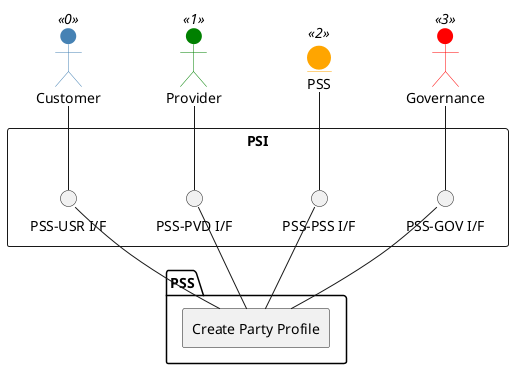

=begin

# TOD-01-01-01-Create_Party_Profile

> The heading has to be included in the document including this document.

=end

{#fig:TOD-01-01-01-Create_Party_Profile}

**Prerequisites**

The party has no profile.

**Main operation**

Creates a profile for a party with basic party data, identification data, contact data and additional attributes, via a standard interface specification.

The party can be an individual or an organization.

**REST Endpoints**

@include [TOD-01-01-01 Create Party Profile Endpoints](endpoints/TOD-01-01-01-Create_Party_Profile-endpoints.md)

**Post Conditions**

The profile for the party is successfully created in the PSS datastore.

**Applicable Requirements**

@include [TOD-01-01-01 Create Party Profile Requirements](requirements/TOD-01-01-01-Create_Party_Profile-requirements.md)

**eTOM Reference**

The operation is based on 1.3.6.1 and 1.6.21.2 process identifiers from the eTOM.

