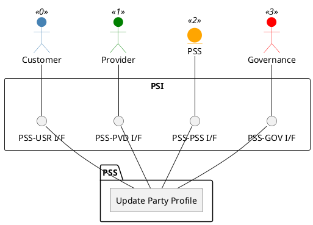

=begin

# TOD-01-01-02-Update_Party_Profile

> The heading has to be included in the document including this document.

=end

{#fig:TOD-01-01-02-Update_Party_Profile}

**Prerequisites**

The party has a profile.

**Main operation**

Updates an existing party's profile via a standard interface specification.

In addition to the standard party profile properties, the governance needs to be able to update additional characteristics as part of the accreditation process:

* *responseTime*: Specifies the time the provider is given to respond to orders or inquiries to avoid long delays on the customer side.
* *maxPriority*: Specifies the maximum priority of a customer when requesting access to resources.

**REST Endpoints**

@include [TOD-01-01-02 Update Party Profile Endpoints](endpoints/TOD-01-01-02-Update_Party_Profile-endpoints.md)

**Post Conditions**

The profile for the party is successfully updated in the PSS datastore.

**Applicable Requirements**

@include [TOD-01-01-02 Update Party Profile Requirements](requirements/TOD-01-01-02-Update_Party_Profile-requirements.md)

**eTOM Reference**

The operation is based on 1.3.6.2 and 1.6.21.2 process identifiers from the eTOM.
