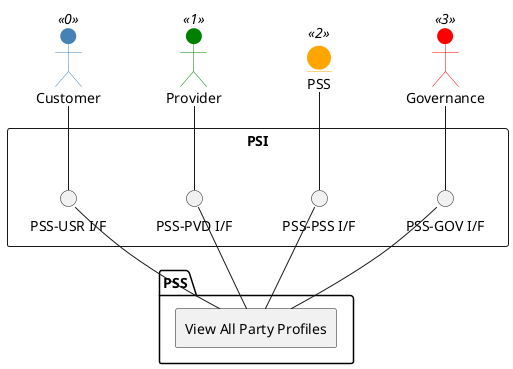

=begin

# TOD-01-01-05-View_All_Party_Profiles

> The heading has to be included in the document including this document.

=end

{#fig:TOD-01-01-05-View_All_Party_Profiles}

**Prerequisites**

Party profiles exist in the PSS datastore.

**Main operation**

Retrieves associated party profiles.
Access and visibility restrictions are the responsibility of the implementing PSS.

The Governance, Customer, Provider, and PSS can retrieve all party profiles via this interface.

**REST Endpoints**

@include [TOD-01-01-05 View All Party Profiles Endpoints](endpoints/TOD-01-01-05-View_All_Party_Profiles-endpoints.md)

**Post Conditions**

All visible party profiles are successfully returned to be viewed.

**Applicable Requirements**

@include [TOD-01-01-05 View All Party Profiles Requirements](requirements/TOD-01-01-05-View_All_Party_Profiles-requirements.md)

**eTOM Reference**

The operation is based on 1.3.6.5 and 1.6.21.2 process identifiers from the eTOM.

