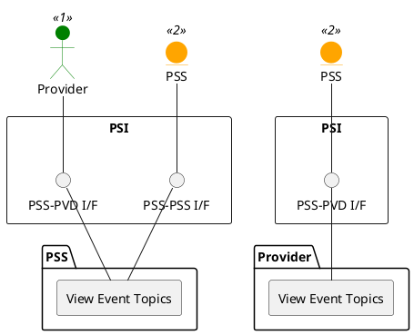

=begin

# TOD-01-02-01-View_Event_Topics

> The heading has to be included in the document including this document.

=end

{#fig:TOD-01-02-01-View_Event_Topics}

**Prerequisites**

The event topics are created on the other system.

**Main operation**

This operation allows one system to query the available event topics of another system.
Since the relevant names for PSID are predefined, doing so is considered optional, though it may reveal additional topics.
The topics can then be subscribed to using [TOD-01-02-02](#tod-01-02-02-registereventcallback).

**REST Endpoints**

@include [TOD-01-02-01 View Event Topics Endpoints](endpoints/TOD-01-02-01-View_Event_Topics-endpoints.md)

**Post Conditions**

All available event topics of the queried system (PSS or provider) are successfully returned to be viewed.

**Applicable Requirements**

@include [TOD-01-02-01 View Event Topics Requirements](requirements/TOD-01-02-01-View_Event_Topics-requirements.md)

**eTOM Reference**

None
