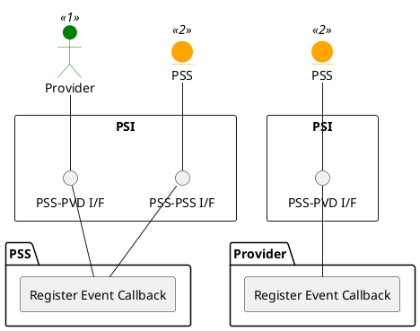

=begin

# TOD-01-02-02-Register_Event_Callback

> The heading has to be included in the document including this document.

|                |                         |
|----------------|-------------------------|
| Name           | Register Event Callback |
| Operation ID   | TOD-01-02-02            |
| Implementor/s  | PSS, Provider           |
| Consumer/s     | PSS, Provider           |

Table: Overview Operation **TOD-01-02-02-Register_Event_Callback**. {#tbl:table-TOD-01-02-02-Register_Event_Callback}

=end

{#fig:TOD-01-02-02-Register_Event_Callback}

**Prerequisites**

At least one event topic must exist.

**Main operation**

Each system has to register callbacks for the events they want to receive from one another.
Usually, both systems will register for the following topics named after the corresponding entities:

* inquiry
* order
* invoice

The registration must contain the URL of the callback endpoint, which is expected to be the one described in [TOD-01-02-03](#tod-01-02-03-dispatch_event).
Note that the implementation may reject callbacks if the host is not whitelisted beforehand (see PSI-ICD).

Events are always filtered by the sending system on a need-to-know basis, e.g. the PSS will send order events only to the parties participating in the interaction.
Additionally, the registration may contain a filter query to tailor the scope of the received events.
Those can be defined as a conjunction of attributes and expected values.
The available attributes depend on the event type and can be nested using dot-notation.
When a list of items is queried, only one of them has to match the given value.
Implementations may offer additional capabilities as described in the TMF630 REST API Design Guidelines 4.2.0[^tmf_api_guidelines].
For example, an order event could be filtered using:

* `event.priority=1` (receive only orders with high priority)
* `event.productOrderItem.productOffering.id=abcd` (receive only orders of a specific product offering)
* `event.category=InternetAccess&state=pending` (receive only orders with category 'InternetAccess' **and** state 'pending')

**REST Endpoints**

@include [TOD-01-02-02 Register Event Callback Endpoints](endpoints/TOD-01-02-02-Register_Event_Callback-endpoints.md)

**Post Conditions**

The callback is registered in the other system.

**Applicable Requirements**

@include [TOD-01-02-02 Register Event Callback Requirements](requirements/TOD-01-02-02-Register_Event_Callback-requirements.md)

**eTOM Reference**

None

[^tmf_api_guidelines]: https://www.tmforum.org/resources/specification/tmf630-rest-api-design-guidelines-4-2-0/
