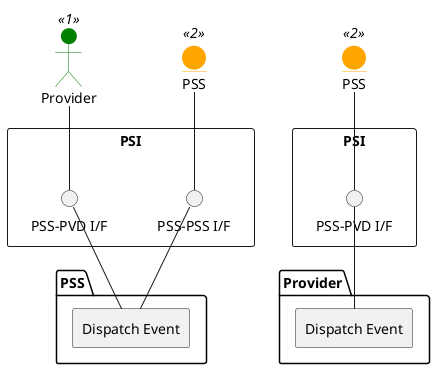

=begin

# TOD-01-02-03-Dispatch_Event

> The heading has to be included in the document including this document.

=end

{#fig:TOD-01-02-03-Dispatch_Event}

**Prerequisites**

At least one callback is registered in the system.

**Main operation**

Whenever an event occurs in a system (e.g. an entity is created, updated or deleted), it notifies all qualified callbacks previously registered by [TOD-01-02-02](#tod-01-02-02-registereventcallback).
They are selected by:

* Event topic
* Need-to-know (e.g. the PSS will send order events only to the parties participating in the interaction)
* Matching filter query

The message body contains the event type and the whole affected entity, meaning there is no need to query it additionally.
The `correlationId` helps to identify the event across the systems, as it will get a different `ID` in each.

The sender has to ensure that every qualified callback is called successfully exactly once.
This includes failover mechanisms in particular.
When the receiver is not reachable or responding positively, the message must be re-dispatched with exponential backoff.
Hereby, the sending attempt is repeated with an exponentially increasing waiting time until a maximum number of retries is reached.
In the latter case, where the delivery was completely stopped, only a manual intervention could restart the sending.

**REST Endpoints**

@include [TOD-01-02-03 Dispatch Event Endpoints](endpoints/TOD-01-02-03-Dispatch_Event-endpoints.md)

**Post Conditions**

The event is dispatched to all qualified callbacks.

**Applicable Requirements**

@include [TOD-01-02-03 Dispatch Event Requirements](requirements/TOD-01-02-03-Dispatch_Event-requirements.md)

**eTOM Reference**

None
