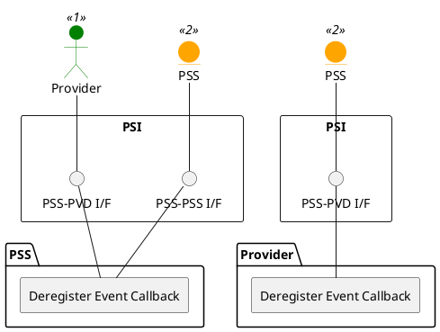

=begin

# TOD-01-02-04-Deregister_Event_Callback

> The heading has to be included in the document including this document.

=end

{#fig:TOD-01-02-04-Deregister_Event_Callback}

**Prerequisites**

The callback is registered in another system.

**Main operation**

When a system does not need to listen for an event topic any more, it can deregister its callback from other systems.
The other system will consequently not dispatch events to the callback afterwards.

**REST Endpoints**

@include [TOD-01-02-04 Deregister Event Callback Endpoints](endpoints/TOD-01-02-04-Deregister_Event_Callback-endpoints.md)

**Post Conditions**

The callback is deregistered in the other system.

**Applicable Requirements**

@include [TOD-01-02-04 Deregister Event Callback Requirements](requirements/TOD-01-02-04-Deregister_Event_Callback-requirements.md)

**eTOM Reference**

None
