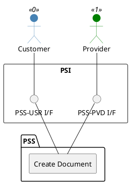

=begin

# TOD-01-03-01-Create_Document

> The heading has to be included in the document including this document.

=end

{#fig:TOD-01-03-01-Create_Document}

**Prerequisites**

The document does not exist in the PSS datastore.

**Main operation**

Creates a new document with its characteristics via a standard interface specification.

Some properties of a Document are:

* *name* - Short name of the document (i.e. the title)
* *description* - Description or summary of the document
* *characteristic* - List of characteristics such as order number
* *relatedParty* - References to the parties involved in the document (e.g. provider and customer)
* *relatedEntity* - References to entities in other subsystems (e.g. product or services) which are related to the document

**REST Endpoints**

@include [TOD-01-03-01 Create Document Endpoints](endpoints/TOD-01-03-01-Create_Document-endpoints.md)

**Post Conditions**

The document is successfully created in the PSS datastore.

**Applicable Requirements**

@include [TOD-01-03-01 Create Document Requirements](requirements/TOD-01-03-01-Create_Document-requirements.md)

**eTOM Reference**

None
