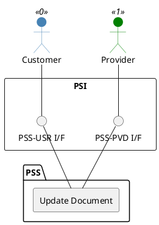

=begin

# TOD-01-03-02-Update_Document

> The heading has to be included in the document including this document.

=end

{#fig:TOD-01-03-02-Update_Document}

**Prerequisites**

The document exists in the PSS datastore.

**Main operation**

Updates an existing document via a standard interface specification.

**REST Endpoints**

@include [TOD-01-03-02 Update Document Endpoints](endpoints/TOD-01-03-02-Update_Document-endpoints.md)

**Post Conditions**

The document is successfully updated in the PSS datastore.

**Applicable Requirements**

@include [TOD-01-03-02 Update Document Requirements](requirements/TOD-01-03-02-Update_Document-requirements.md)

**eTOM Reference**

None
