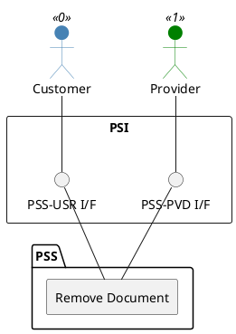

=begin

# TOD-01-03-03-Remove_Document

> The heading has to be included in the document including this document.

=end

{#fig:TOD-01-03-03-Remove_Document}

**Prerequisites**

The document exists in the PSS datastore.

**Main operation**

Removes a document either by deleting it or indicating it is no longer valid, via a standard interface specification.

Additionally, all associated attachments of the document are deleted or marked as not valid.
The system implementing the interface should ensure that the attachments are removed from the physical location or file storage system.

**REST Endpoints**

@include [TOD-01-03-03 Remove Document Endpoints](endpoints/TOD-01-03-03-Remove_Document-endpoints.md)

**Post Conditions**

The document is successfully deleted or indicated it is no longer valid in the PSS datastore.

**Applicable Requirements**

@include [TOD-01-03-03 Remove Document Requirements](requirements/TOD-01-03-03-Remove_Document-requirements.md)

**eTOM Reference**

None
