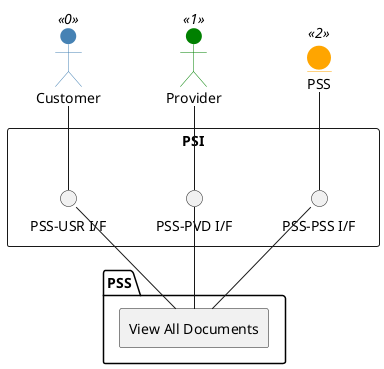

=begin

# TOD-01-03-05-View_All_Documents

> The heading has to be included in the document including this document.

=end

{#fig:TOD-01-03-05-View_All_Documents}

**Prerequisites**

Documents exist in the PSS datastore.

**Main operation**

Gets all documents that are applicable to the user requesting them.

**REST Endpoints**

@include [TOD-01-03-05 View All Documents Endpoints](endpoints/TOD-01-03-05-View_All_Documents-endpoints.md)

**Post Conditions**

All documents of the provider are successfully returned to be viewed.

**Applicable Requirements**

@include [TOD-01-03-05 View All Documents Requirements](requirements/TOD-01-03-05-View_All_Documents-requirements.md)

**eTOM Reference**

None
