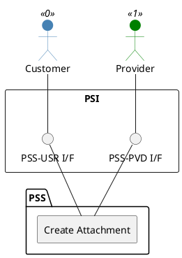

=begin

# TOD-01-03-06-Create_Attachment

> The heading has to be included in the document including this document.

=end

{#fig:TOD-01-03-06-Create_Attachment}

**Prerequisites**

A document has to exist in the PSS datastore.

**Main operation**

This operation allows a party to create an attachment and transfer it to a PSS, which has to take care of storing it in some file storage system.
Additionally, the PSS should take care of performing a malware scan of the created attachment.

>The attachment must be created as part of an existing document which describes its metadata.

Some properties of the attachment are:

* *name* - The name of the attachment.
* *content* - The actual contents of the attachment object.
* *attachmentType* - The attachment type such as video, picture, document.
* *mimeType* - The attachment mime type such as "application/pdf", "application/msword" or "image/jpeg".
* *size* - The size of the attachment.
* *url* - The remote reference to the content if web-addressable.
* *validFor* - The period of time for which the attachment is valid.

**REST Endpoints**

@include [TOD-01-03-06 Create Attachment Endpoints](endpoints/TOD-01-03-06-Create_Attachment-endpoints.md)

**Post Conditions**

The attachment is successfully created to the PSS.

**Applicable Requirements**

@include [TOD-01-03-06 Create Attachment Requirements](requirements/TOD-01-03-06-Create_Attachment-requirements.md)

**eTOM Reference**

None
