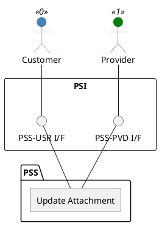

=begin

# TOD-01-03-07-Update_Attachment

> The heading has to be included in the document including this document.

=end

{#fig:TOD-01-03-07-Update_Attachment}

**Prerequisites**

The attachment to be updated exists in the PSS.

**Main operation**

This operation updates the properties of an existing attachment in a PSS via a standard interface specification.

When updating the *content*, the system implementing the interface should ensure that the file is also updated in the physical location or file storage system.

**REST Endpoints**

@include [TOD-01-03-07 Update Attachment Endpoints](endpoints/TOD-01-03-07-Update_Attachment-endpoints.md)

**Post Conditions**

The attachment has been successfully updated in the PSS.

**Applicable Requirements**

@include [TOD-01-03-07 Update Attachment Requirements](requirements/TOD-01-03-07-Update_Attachment-requirements.md)

**eTOM Reference**

None
