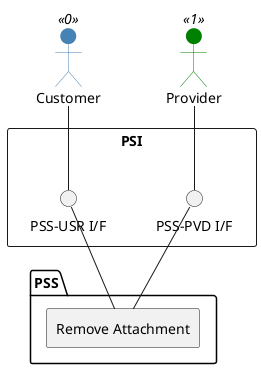

=begin

# TOD-01-03-08-Remove_Attachment

> The heading has to be included in the document including this document.

=end

{#fig:TOD-01-03-08-Remove_Attachment}

**Prerequisites**

The attachment to be removed exists in the PSS.

**Main operation**

Removes an attachment either by deleting it or indicating it is no longer valid, via a standard interface specification.

The system implementing the interface should ensure that the attachment is removed also from the physical location or the file storage system.

**REST Endpoints**

@include [TOD-01-03-08 Remove Attachment Endpoints](endpoints/TOD-01-03-08-Remove_Attachment-endpoints.md)

**Post Conditions**

The attachment has been deleted or indicated it is no longer valid in the PSS.

**Applicable Requirements**

@include [TOD-01-03-08 Remove Attachment Requirements](requirements/TOD-01-03-08-Remove_Attachment-requirements.md)

**eTOM Reference**

None
