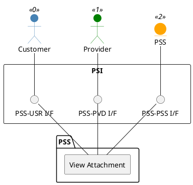

=begin

# TOD-01-03-09-View_Attachment

> The heading has to be included in the document including this document.

=end

{#fig:TOD-01-03-09-View_Attachment}

**Prerequisites**

The attachment object to be viewed exists in the PSS.

**Main operation**

The operation retrieves an attachment from the PSS in JSON representation.

**REST Endpoints**

@include [TOD-01-03-09 View Attachment Endpoints](endpoints/TOD-01-03-09-View_Attachment-endpoints.md)

**Post Conditions**

The attachment is successfully retrieved to be viewed from the PSS.

**Applicable Requirements**

@include [TOD-01-03-09 View Attachment Requirements](requirements/TOD-01-03-09-View_Attachment-requirements.md)

**eTOM Reference**

None
